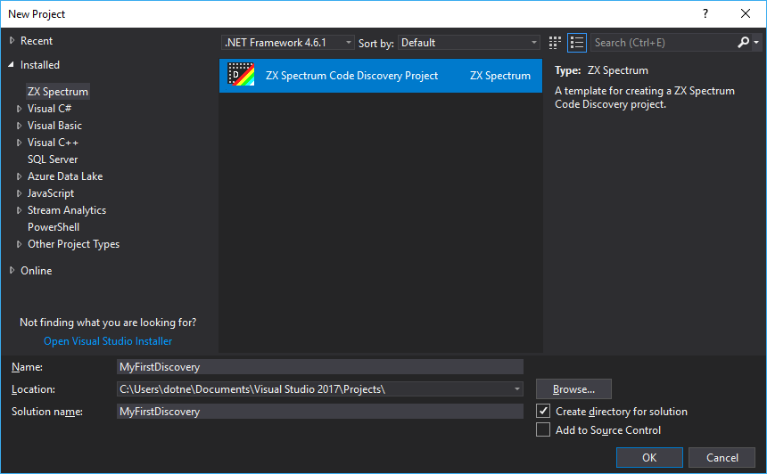
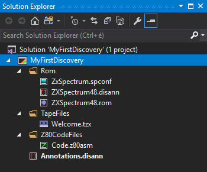
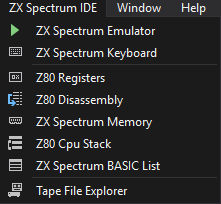
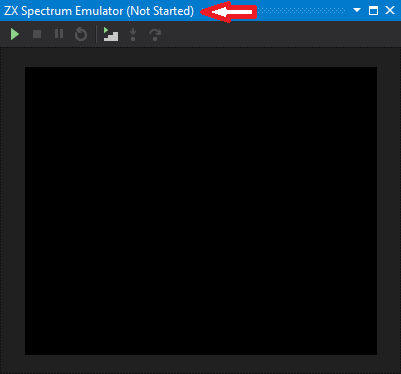
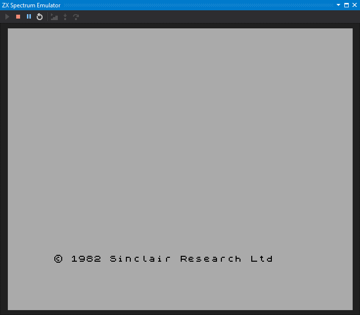
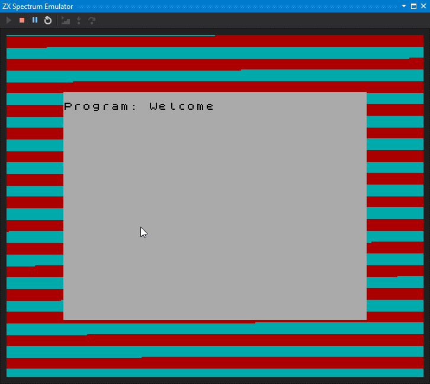
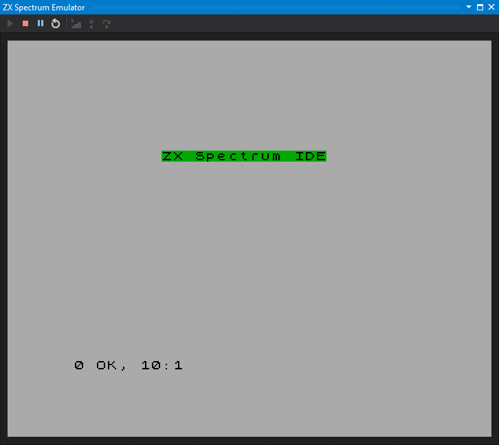

# Create Your First ZX Spectrum Project

[&larr; Contents](../Index.md) | [&larr; Get the ZX Spectrum IDE](./GetSpectNetIde.md)

1. Run the __File|New|Project__ command (Ctrl+Shift+N), select the __ZX Spectrum__ tab and choose
the __ZX Spectrum Code Discovery__ project type. Specify a project name (use __MyFirstDiscovery__).

2. The IDE creates a new project with a few files and folders:

File/Folder | Description
----------- | -----------
__`Rom`__ | The folder that holds Spectrum ROMs
__`Rom/ZxSpectrum48.rom`__ | The binary ROM file for the Spectrum 48K model
__`Rom/ZxSpectrum48.disann`__ | Disassembly annotations for the Spectrum 48K ROM
__`TapeFiles`__ | Stores *.tzx*, *.tap* (and, in the future, other) tape files
__`Z80CodeFiles`__ | The folder to put your Z80 Assembly code files in
__`Z80CodeFiles/Code.z80asm`__ | A simple Z80 Assembly code file
__`Annotations.disann`__ | Your custom disassembly annotations are saved into this file

3. As soon as the IDE created the project, you can discover a new top level menu, 
__ZX Spectrum IDE__:

## Run the ZX Spectrum Virtual Machine

1
. Run the __ZX Spectrum IDE|ZX Spectrum Emulator__ command. The shows up the emulator tool window.
As the title of the tool window indicates, the virtual machine is momentarily stopped. 

2. Click the little *Play* icon in the toolbar of the emulator to start the virtual machine.
The ZX Spectrum comes to life. As you resize the tool window, the emulator changes its screen size, 
accordingly.

3. Type the __`LOAD ""`__ command into the emulator. Take care that the emulator window is the active one, receiving the
keyboard focus, and press the __J__, and then twice the __Shift+P__ keys again. With pressing __Enter__, you can execute __`LOAD ""`__.
Th virtual machine starts loading the `Welcome.tzx` file.

4. When the game has been loaded, type the __`RUN`__ command into the emulator (while the emulator window is the active one, press the __R__ key),
and then, press __Enter__. The program starts, and displays its message:

You have just scratched the surface! There are many other features you can use in the
IDE to discover the structure and internals of ZX Spectrum applications.

[&larr; Contents](../Index.md) | [&rarr; Create and run a simple BASIC program](./CreateSimpleBasicProgram.md)

