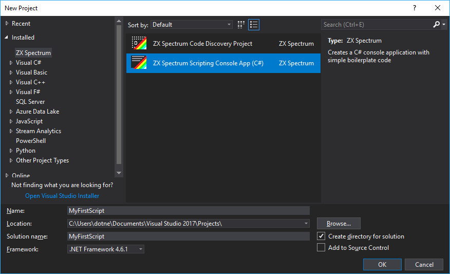
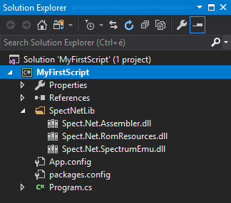
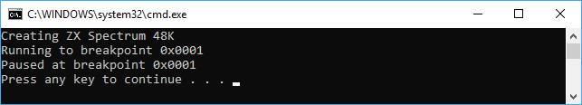

# Create your first ZX Spectrum scripting project

[&larr; Contents](../Index.md) | [&larr; Create your first Z80 unit test](./CreateUnitTest)

__SpectNetIde__ allows you to create scripting projects to automate common tasks with a
ZX Spectrum virtual machine. In this article, you will learn how can you implement your
scripting solutions.

## Use the scripting project template

1. Run the __File|New|Project__ command (Ctrl+Shift+N), select the __ZX Spectrum__ tab and choose
the __ZX Spectrum Scripting Console App (C#)__ project type. Specify a project name (use __MyFirstScript__).



2. The IDE creates a new project with a few files and folders:



The application is a standard .NET console application, nonetheless, it includes references to
the __SpectNetIde__ assemblies that contain the necessary runtime components. These assemblies are
stored in the __`SpectNetLib`__ folder:

Assembly | Description
---------| -----------
`Spect.Net.Assembler` | The Z80 Assembler of __SpectNetIde__. With the help of this component, you can use Z80 source code in scripts.
`Spect.Net.RomResources` | This assembly stores the ROMs of the Spectrum models supported by __SpectNetIde__
`SpectNet.SpectrumEmu` |  This assembly implements the ZX Spectrum emulator and the scripting object model

4. Take a look at the automatically created source code:

```CSharp
using System;
using System.Threading.Tasks;
using Spect.Net.SpectrumEmu.Scripting;

namespace MyFirstScript
{
    class Program
    {
        static async Task Main(string[] args)
        {
            Console.WriteLine("Creating ZX Spectrum 48K");
            var sm = SpectrumVmFactory.CreateSpectrum48Pal();

            Console.WriteLine("Running to breakpoint 0x0001");
            sm.Breakpoints.AddBreakpoint(0x0001);
            sm.StartDebug();
            await sm.CompletionTask;

            Console.WriteLine($"Paused at breakpoint 0x{sm.Cpu.PC:X4}");
        }
    }
}
```

This code creates a ZX Spectrum 48K virtual machine and sets it up to run to the breakpoint
at the `#0001` address, and then pauses the machine.

5. Run the code with the __Debug|Start without debugging__ (Ctrl+F5) command. It will display
this result:



## Change the source code

6. Change the source code to this:

```CSharp
using System;
using System.Threading.Tasks;
using Spect.Net.SpectrumEmu.Scripting;

namespace MyFirstScript
{
    class Program
    {
        static async Task Main(string[] args)
        {
            var sm = SpectrumVmFactory.CreateSpectrum48Pal();
            Console.WriteLine("Setting the border to red");

            await sm.StartAndRunToMain();
            var entryAddr = sm.InjectCode(@"
                .org #8000
                ld a,2       ; RED
                out (#FE),a  ; Set the border colour to red
                halt         ; Wait for 2 frames (rendering)
                halt
                ret          ; Finished
                ");
            sm.CallCode(entryAddr);
            await sm.CompletionTask;

            var screen = sm.ScreenConfiguration;
            var redCount = 0;
            for (var i = 0; i < screen.ScreenLines; i++)
                for (var j = 0; j < screen.ScreenWidth; j++)
                    redCount += sm.ScreenBitmap[i,j] == 0x02 ? 1 : 0;
            Console.WriteLine($"#of red pixels: {redCount}");
            var borderPixels = screen.ScreenLines * screen.ScreenWidth
                - screen.DisplayLines * screen.DisplayWidth;
            Console.WriteLine($"#of border pixels: {borderPixels}");
        }
    }
}
```

This code is more complex. It sets the border to red, and checks if the pixels of the 
screen are rendered properly. As you can see in the middle of the code, it allows you 
to inject Z80 Assembler code without extra steps to compile it.

When you run this code, it displays the number of pixels belonging to the border area,
and the number of red pixels, too:

```
Setting the border to red
#of red pixels: 52224
#of border pixels: 52224
```

## Go further

You can obtain more details about scripting from these articles:

* [Scripting in SpectNetIde](../Scripting/Scripting.md)
* [Scripting Object Model Reference](../Scripting/ScriptingObjectModelReference.md)

[&larr; Contents](../Index.md)
