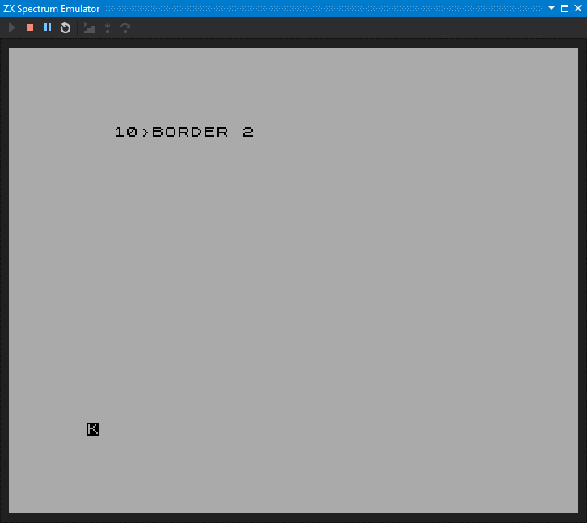
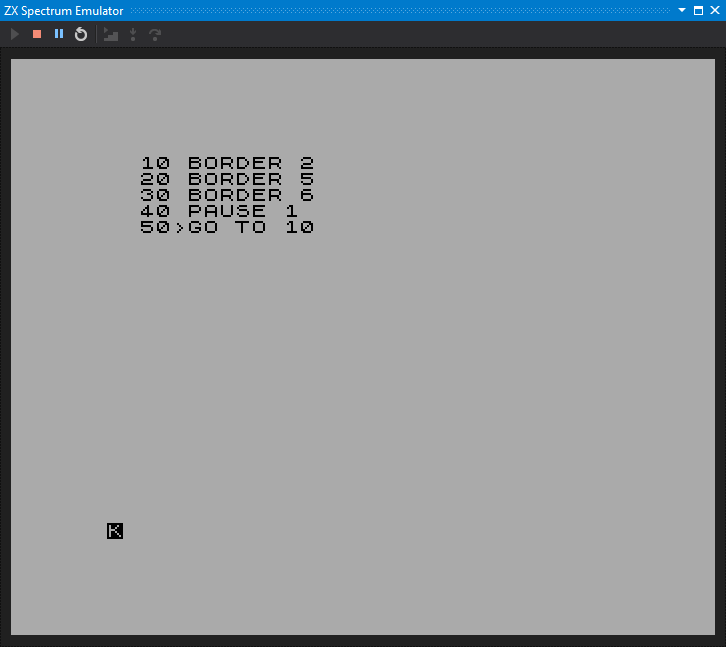
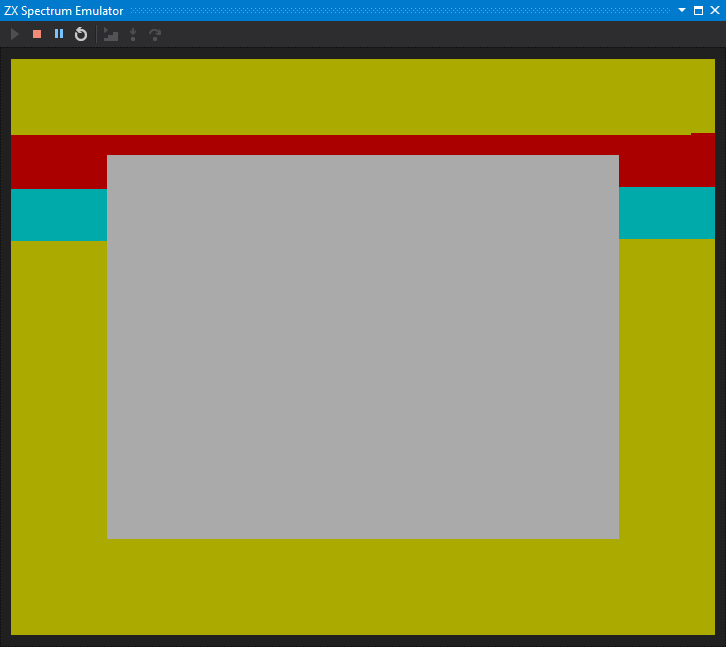
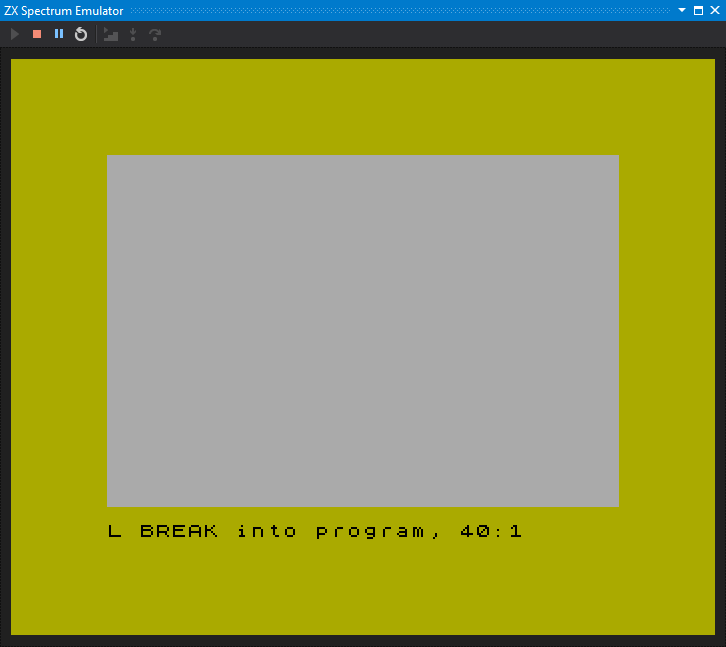

# Create and Run a Simple Basic Program

[&larr; Contents](../Index) | [&larr; Create your first ZX Spectrum project](../GettingStarted/CreateFirstZxSpectrumProject)

In the previous article, you could see how easy is to create a new ZX Spectrum 
program from scratch.

Here, you will create and run a simple BASIC program. Although you can use 
the keyboard of the PC to enter a program &mdash; provided, the ZX Spectrum Emulator
window has the focus &mdash; if you're not familiar with the Spectrum keys and 
BASIC editor, it may frustrate you while entering the code. To avoid such chaffing, 
use the [ZX Spectrum Keyboard tool window](../IdeTools/KeyboardToolWindow) to enter 
the program.

First, add this line:

```
10 BORDER 2
```

To enter this BASIC line, press these keys, in this order: "`1`", "`0`", "`B`", 
"`2`", "`Enter`" (of course, you do not need to click comma between the keys 
wrapped in double quotes)

As soon as you've added this BASIC line, it appears in the screen listing:



Now, add these lines to the code:

```
20 BORDER 5
30 BORDER 6
40 PAUSE 1
50 GOTO 10
```



Your first BASIC program is ready to run. Invoke the `RUN` command (press
`R`, and then `Enter`) to start this code. As you can see from the listing, 
it implements an infinite loop while changing the background color:



To stop the program, press the `SPACE` and `SYM SHIFT` keys simultaneously
or click the `BREAK` button in the ZX Spectrum Keyboard window with the right
mouse button:



Congratulations! It is time to move on and create a Z80 assembly program!

[&larr; Contents](../Index) | [&rarr; Create and run a simple Z80 program](./CreateSimpleZ80Program)

