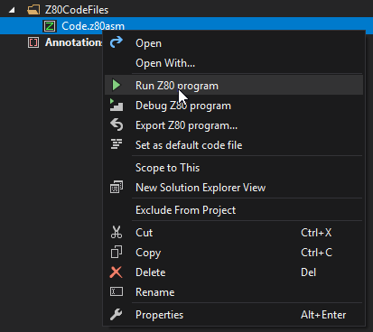
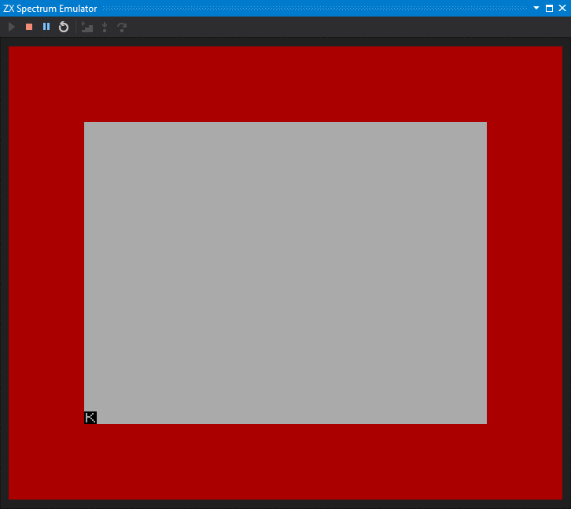
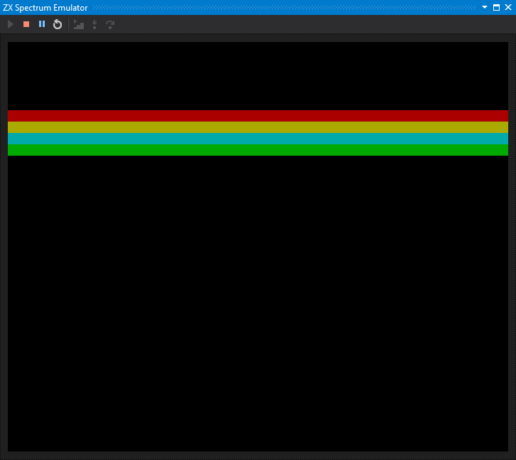

# Create and Run a Simple Z80 Program

[&larr; Contents](../Index) | [&larr; Create and run a simple BASIC program](./CreateSimpleBasicProgram)

In this article, you will learn that SpectNetIde provides you a straightforward way to
create and run Z80 assembly programs.

To create your first Z80 assembly program, follow these steps:

1. Create a new ZX Spectrum 48 project. (See details [here](../GettingStarted/CreateFirstZxSpectrumProject))
The __`CodeFiles `__ project of the folder contains a __`Code.z80asm`__ file:

```
; Code file
start: .org #8000
```

2. Extend to the code with a few lines:

```
; Code file
start: .org #8000
    ld a,2
    out (#fe),a
    jp #12a2
```

3. In Solution Explorer, right-click the __`Code.z80asm`__ file, and invoke the __Run Z80 program__ command:




This command compiles the Z80 assembly code to binary machine code, starts (or restarts) the Spectrum virtual machine,
injects the binary code, and runs it:



You have just created your first Z80 assembly program in SpectNetIde!

## A Bit Longer Z80 Program

If you're excited, you can try a bit longer Z80 code with border manipulations and delays. When you
run it, the code sets the screen colors and uses the __`HALT`__ statement to synchronized border
drawing. When you start it, it runs until you press `SPACE`:



Here is the entire source code:

```
; Define symbols
LAST_K:		.equ #5c08
MAIN_EX:	.equ #12a2

Start:
	.org #8000

; Set Banner lines
SetScreen:
    call ClearScreen
    ld a,0b00_010_010
    ld b,0
    call ClearLine
    ld a,0b00_110_110
    ld b,1
    call ClearLine
    ld a,0b00_101_101
    ld b,2
    call ClearLine
    ld a,0b00_100_100
    ld b,3
    call ClearLine

; Set banner border area
Top:
    ld bc,#200
    call LongDelay
    ld a,2
    call SetBorder
    ld a,6
    call SetBorder
    ld a,5
    call SetBorder
    ld a,4
    call SetBorder
    ld a,0
    call SetBorder
    halt        ; Wait for the next interrupt
    ld hl,LAST_K
    ld a, (hl)	; put last keyboard press into A
    cp #20		; was "space" pressed?
    jr nz,Top	; If not, back to the cycle
    ld a,7
    call SetBorder
    jp MAIN_EX

; Sets the entire screen to black
ClearScreen:
    ld bc,24*32-1 ; #of screen attribute bytes
    ld hl,#5800 ; First attr address
    ld de,#5801 ; Next attr address
    ld (hl),0   ; Black on Black
    ldir        ; Set all attribute bytes
    ret

; A = Attr byte to set
; B = Line index
ClearLine:
    push af     ; Save A
    ld a,b      ; Multiply the line count with 32
    sla a
    sla a
    sla a
    sla a
    sla a
    ld hl,#5800 ; Calculate the attribute address
    ld d,0
    ld e,a
    add hl,de
    pop af      ; Restore A
    ld b,#20    ; Set all the 32 attribute bytes
SetAttr:
    ld (hl),a
    inc hl
    djnz SetAttr
    ret

; Sets the border color
SetBorder:
    out (#fe),a
    ld b,#87
Delay:
    djnz Delay
    ret

; Delays code execution
LongDelay:
    dec bc
    ld a,b
    or c
    jr nz,LongDelay
    ret
```

SpectNetIde makes it extremely simple to reuse the Z80 assembly code, as you
will learn in the next article.

[&larr; Contents](../Index) | [&rarr; Export a Z80 program](./ExportZ80Program)
