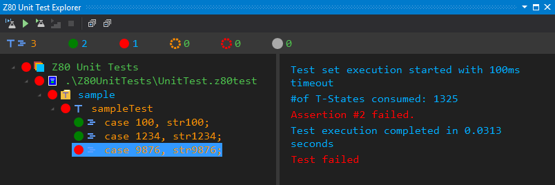
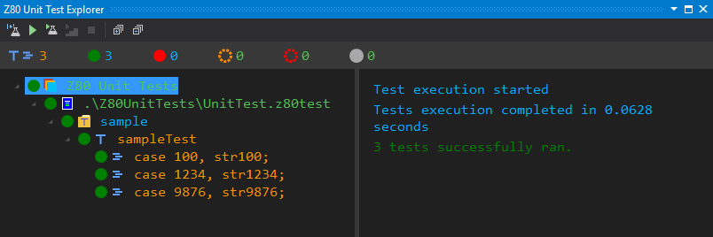

[&larr; Contents](../Index.md) | [&larr; Export a Z80 Program](./ExportZ80Program.md)

# Create a Unit Test

__SpectNetIde__ is &mdash; as far as I know &mdash; the only IDE that support writing integrated
unit tests to check Z80 Assembler code within a Spectrum virtual machine. If you develop Z80 code,
you can use the SpectNetIde test language to create and run unit tests.

In this article, you are going to create a simple Z80 program with unit tests.

1. Create a new ZX Spectrum 48 project and name it __FirstUnitTest__. (See details 
[here](../GettingStarted/CreateFirstZxSpectrumProject.md)).
2. The __`CodeFiles `__ project of the folder contains a __`Code.z80asm`__ file. Change the code file
to this:

```
.org #8000
; Converts the contents of DE to a decimal number
ConvertDEToText:
    push af
    push bc
    push de
    ld bc,-10000
    call CreateDigit
    ld bc,-1000
    call CreateDigit
    ld bc,-100
    call CreateDigit
    ld bc,-10
    call CreateDigit
    ld a,e
    call StoreDigit
    pop de
    pop bc
    pop af
    ret
; Creates the value in A to a digit
CreateDigit:
    push hl
    ex de,hl
    ld a,0
CreateDigitLoop:
    inc a
    add hl,bc
    jr c,CreateDigitLoop
    sbc hl,bc
    ex de,hl
    dec a
    pop hl
; Stores a digit to a buffer
StoreDigit:
    add a,#30
    ld (hl),a
    inc hl
    ret

ConversionBuffer:
    .defs 10

```

This Z80 program declares the `ConverDEToText` subroutine that takes the contents of the DE
register and converts it to a five-digit decimal number.

You can test if this code works according to the expectations.

3. The __`Z80UnitTests`__ folder contains a __UnitTest.z80test__ file, which is a template for
a unit test. Change the contents of the file to this:

```
testset sample
{
    source "../Z80CodeFiles/Code.z80asm";

    data 
    {
        str100: "00100";
        str1234: "01234";
        str9876: "9876";
    }
    
    test sampleTest
    {
        params value, result;
        case 100, str100;
        case 1234, str1234;
        case 9876, str9876;

        arrange
        {
            hl: ConversionBuffer;
            de: value;
        }

        act call ConvertDEToText;

        assert
        {
            hl == ConversionBuffer + 5;
            [ConversionBuffer .. ConversionBuffer + 4] == result;
        }
    }
}
```

This definition defines a single test with three parameterized test cases to check if the
subroutine works properly. In the `arrange` section assigns the address of `ConversionBuffer` to
__HL__, and the value to convert to __DE__. Then, in the `act` section, the test engine calls 
the `ConvertDEToText` routine. Finally, in the `assert` section, it checks if __HL__ points to
the sixth byte of `ConversionBuffer` and the contents of the buffer is the expected ASCII string.

4. With the __ZX Spectrum IDE | Z80 Unit Test Explorer__ command you can display the tool window
that runs the tests. The second button in the tool bar is the __Run All Tests__ command.

5. Click __Run All Tests__. The unit test engine compiles the unit test file and the Z80 code file, 
and then runs the tests. The first two runs successfully, but the third one fails.



Well, the reason of failure is easy to detect. The 9876 value's 5-digit ASCII representation is
"09876" and not "9876".

6. Change the third line of the `data` section in the __`UnitTest.z80test`__ file from 
__`str9876: "9876"`__ to __`str9876: "09876"`__.
7. Run the tests again. This time all of them run successfully:



There are many things you can do with unit tests! Read more about the __SpectNetIDE__ test language
[here](../UnitTests/UnitTestLanguageReference.md).


[&larr; Contents](../Index.md) | [&rarr; Create your first scripting project](./CreateScriptingProject)