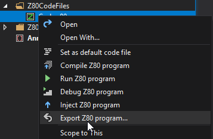
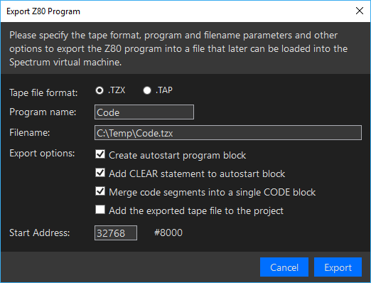

# Export a Z80 Program

[&larr; Contents](../Index.md) | [&larr; Create and run a simple Z80 program](./CreateSimpleZ80Program.md)

After you created your Z80 Assembler program, you can easily export it into a .TAP or .TZX file so that you
could load it into a ZX Spectrum emulator, or into a real hardware, such as a ZX Spectrum Next, or ZX Spectrum
(with the help of TZXDuino or CASDuino hardware).

To try how easy it is, create a simple Z80 program:

1. Create a new ZX Spectrum 48 project. (See details [here](../GettingStarted/CreateFirstZxSpectrumProject.md))
The __`CodeFiles `__ project of the folder contains a __`Code.z80asm`__ file:

```
; Code file
start: .org #8000
```

2. Extend to the code with a few lines:

```
; Code file
start: .org #8000
    ld a,2
    out (#fe),a
    jp #12a2
```

3. In Solution Explorer, right-click the __`Code.z80asm`__ file, and invoke the __Run Z80 program__ command:


This command compiles the Z80 assembly code to binary machine code, starts (or restarts) the Spectrum virtual machine,
injects the binary code, and runs it:


Now, you can export it:

1. In Solution Explorer, right-click the __`Code.z80asm`__ file, and invoke the __Export Z80 program__ command:



2. The IDE pops up the __Export Z80 Program__ dialog:



You can change the attributes of the exported program. The default settings of the dialog
will create a loader program that automatically loads and runs the code.

3. Click Export.

Now, you can find the exported code file, add it to your project, and load it.

Alternatively, you can set the __Add the exported tape file to the project__ option. 
When you click  Export, it not only exports the code, but automatically adds it to
the __TapeFiles__ folder of your project. When you right click the exported tape file,
you can mark it with the __Set default tape file__ command. The next time you execute the 
__LOAD ""__ command, it will load and start the newly exported code.

[&larr; Contents](../Index.md) | [&rarr; Create a Unit Test](./CreateUnitTest.md)
