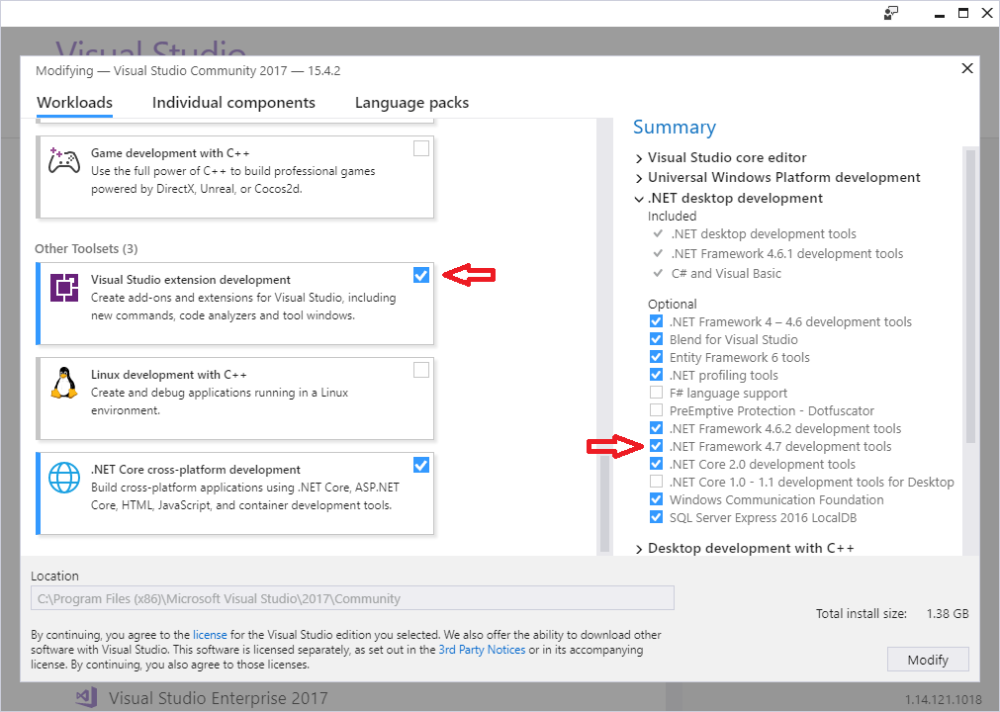
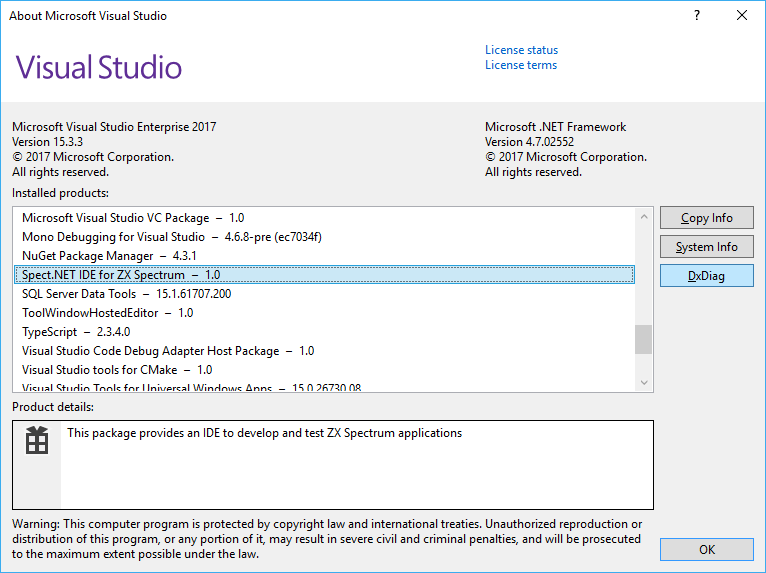

# Get the ZX Spectrum IDE

[&larr; Contents](../Index.md)

This project contains several Visual Studio 2017 packages. To be able to
compile and run the project, you need to install the *Visual Studio extension development*
workload:

1. Start the Visual Studio 2017 IDE
2. With the __Tools|Get Tools and Features__ command, launch the Visual Studio Installer.
3. Make sure to select the *Visual Studio extension development* workload, and the *.NET
Framework 4.7 development tools* component.



4. Click the Modify button. (*__Note__: You need to close the VS 2017 IDE while the installer runs.*)

## Obtain and Run the Source Code

1. Get the source code from this Github repository:
```
git clone https://github.com/Dotneteer/spectnetide.git
```
2. Open the `Spect.Net.sln` solution file in Visual Studio 2017.
3. Create the artifacts with the __Build|Rebuild Solution__ command. (*__Note__: 
The first time it might take time while VS loads the required NuGet packages.*)
4. In Solution Explorer, use the context menu to set the __Spect.Net.VsPackage__ project
in the __VsIntegration__ folder as the startup project.
5. Go to the Properties page of the __Spect.Net.VsPackage__ project, and in the Debug tab
set the VS 2017 `devenv.exe` file to run with the `/rootsuffix Exp` command line.
This setting takes care starting the *Visual Studio Experimental Instance* with 
the ZX Spectrum IDE loaded.
6. Use the __Debug|Start Without Debugging__ command (Ctrl+F5) to run the project.
(*__Note__: Do not use the __Start Debugging__ command unless you need it. Without debugging
VS 2017 will start much faster.*)

## Create Your First ZX Spectrum Project

After the VS IDE (Experimental Instance) starts, you cannot see any new menu telling you that
the ZX Spectrum IDE is loaded. However, in the __Help|About__ dialog, you can see that the package
is now active:



To display the ZX Spectrum related menus, first create a ZX Spectrum project.

[&larr; Contents](../Index.md) | [&rarr; Create Your First ZX Spectrum Project](./CreateFirstZxSpectrumProject.md)