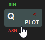
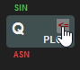
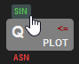
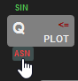
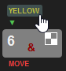

# The ZX Spectrum Keyboard Tool Window

The ZX Spectrum 48 has a keyboard with 40 keys. Each key has multiple tokens printed on it:

Keys with letters have four other tokens:

A primary keyword (such as __`PLOT`__ printed on key __`Q`__). When you enter a BASIC command or line, the flashing "K"
cursor indicates that this keyword will be displayed for the particular keystroke.

A *SYM SHIFT* symbol (such as __`<=`__ in key __`Q`__). When you enter a BASIC command or line while in "K" mode,
pressing SYM SHIFT simultaneously with a particular key will result in that keyword.

Two extended mode symbols (such as __`SIN`__ above and __`ASN`__ below the __`Q`__ key). These symbols
appear in extended mode ("E" cursor); the first when you press the key without any shift keys; the second
when you press the key either with __`SYM SHIFT`__ or __`CAPS SHIFT`__. You can reach the extended mode by 
pressing down __`SYM SHIFT`__ or __`CAPS SHIFT`__ together.

 

When you click the keys (and the tokens on them) with the left mouse button, the keyboard emulates the click
of the corresponding key. When you click one of the extended mode keys, the keyboard mimics that first you enter
the extended mode, and then press the particular key. Thus, for example, if you click the `SIN` token just above the 
`Q` key, it is like first pressing `CAPS SHIFT` and `SYM SHIFT` simultaneously, and then the `Q` key again.

If you press a key with the right mouse button, it is just like pressing the key while holding down `CAPS SHIFT`.

Most of the numeric keys have two commands above them. The first line represents colors. Clicking the color with the
left mouse button sets the paper color, the right mouse button the ink color:

You can enter graphical characters (as you see them on keys from `0` to `8`) when you set the keyboard to graphics mode:

In this mode (the cursor changes to a flashing `G`), when you click the keys with the graphic symbols, those symbols
appear. Right mouse button click displays the inverse of those symbols.

