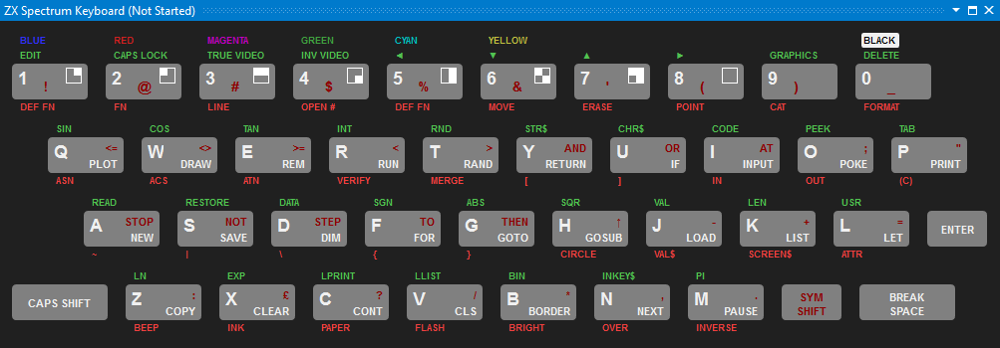

# The ZX Spectrum Keyboard Tool Window

The ZX Spectrum 48 has a keyboard with 40 keys. Each key has multiple tokens printed on it:

Keys with letters have four other tokens:
* A primary keyword (such as __`NEW`__ printed on key __`A`__). When you enter a BASIC command or line, the flashing "K"
cursor indicates that this keyword will be displayed for the particular keystroke.
* A *SYM SHIFT* symbol (such as __`NOT`__ in key __`S`__). When you enter a BASIC command or line while in "K" mode,
pressing SYM SHIFT simultaneously with a particular key will result in that keyword.
* Two extended mode symbols (such as __`ABS`__ above and __`}`__ below the __`G`__ key). These symbols
appear in extended mode ("E" cursor); the first when you press the key without any shift keys; the second
when you press the key either with __`SYM SHIFT`__ or __`CAPS SHIFT`__. You can reach the extended modey by 
pressing down __`SYM SHIFT`__ or __`CAPS SHIFT`__ together.

