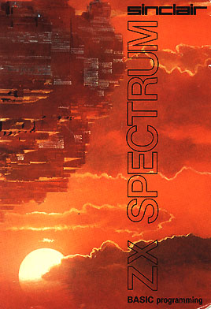
# SINCLAIR ZX SPECTRUM #

## BASIC Programming ##

 

 

By **Steven Vickers**

Edited by **Robin Bradbeer**
 

*Original edition published in 1982-83*

*by Sinclair Research Limited*

 

*This version published in 1995*

*by Chris Owen on behalf of Amstrad plc*

 

*Cover illustration by*

*John Harris of Young Artists*

 

\_______________________________________________\_

  

**© Amstrad plc 1995 - all rights reserved**


*This manual is freely distributable but may*

*not be distributed without this notice.*

Converted to e-text in various forms:
* Chris Owen (ASCII)
* Pete (HTML)
* Albert Stuurman (MarkDown) 

\_____________________________________|__ 


 

 
## <a name ="Contents"><a/> CONTENTS ##


### [Chapter 1](#Chapter1) ###

### Introduction ###


A guide to the ZX Spectrum keyboard and a description of the display.

 

### [Chapter 2](#Chapter2) ### 

**Basic programming concepts**.

Programs, line numbers, editing programs using &uarr; ,&darr; and **EDIT**, **RUN**, **LIST**,

**GO TO**, **CONTINUE**, **INPUT**, **NEW**, **REM**, **PRINT**, **STOP** in **INPUT** data,

**BREAK**.

 

###  [Chapter 3](#Chapter3)  ### 

**Decisions**.

**IF**, **STOP**, **=**, **<**, **>**, **<=**, **>=**, **<>**.

 

### [Chapter 4](#Chapter4)  ### 
**Looping**

**FOR**, **NEXT**, **TO**, **STEP**. Introducing **FOR-NEXT** loops

 

###  [Chapter 5](#Chapter5) ### 
**Subroutines**.

**GO SUB**, **RETURN**.

 

###  [Chapter 6](#Chapter6) ### 
**READ**, **DATA**, **RESTORE**.

 

### [Chapter 7](#Chapter7) ###  
**Expressions**

Mathematical expressions using **+**, **-**, __*__, **/**, scientific notation and variable names.

 

### [Chapter 8](#Chapter8): ### 
 **Strings**.

Handling strings and slicing.

 

### [Chapter 9](#Chapter9): ### 
**Functions**.

User-definable functions and others readily available on the ZX Spectrum using.

**DEF**, **LEN**, **STR$**, **VAL**, **SGN**, **ABS**, **INT**, **SQR**, **FN**.

 

### [Chapter 10](#Chapter10) ### 
**Mathematical functions**.

Including simple trigonometry: **­&uarr;**, **PI**, **EXP**, **LN**, **SIN***, **COS**, **TAN**, **ASN**, **ACS**,
**ATN**.

 

### [Chapter 11](#Chapter11) ### 
**Random numbers**.

Using **RANDOMIZE** and **RND**.

 

### [Chapter 12](#Chapter12) ### 
**Arrays**.

Strings and numeric arrays - **DIM**.

 

### [Chapter 13](#Chapter13) ### 
**Conditions**.

Logical expressions  **AND**, **OR**, **NOT**.

 

### [Chapter 14](#Chapter14) ### 
**The character set**

A look at the ZX character set including graphics and how to construct your own.

graphic characters: **CODE**, **CHR$**, **POKE**, **PEEK**, **USR**, **BIN**.

 

### [Chapter 15](#Chapter15) ### 
**More about **PRINT** and INPUT**

Some more complicated uses of these commands using separators: **: , ; '** , **TAB**,

**AT**, **LINE** and **CLS**.

 

### [Chapter 16](#Chapter16): ### 
**Colours**.

**INK**, **PAPER**, **FLASH**, **BRIGHT**, **INVERSE**, **OVER**, **BORDER**.

 

### [Chapter 17](#Chapter17) ### 
**Graphics**.

**PLOT**, **DRAW**, **CIRCLE**, **POINT**.

 

### [Chapter 18](#Chapter18) ### 
**Motion**.

Animated graphics using **PAUSE**, **INKEY$** and **PEEK**.

 

### [Chapter 19](#Chapter19) ### 
**BEEP**.

The sound capabilities of the ZX Spectrum using **BEEP**.

 

### [Chapter 20](#Chapter20) ### 
**Tape Storage**.

How to store your programs on cassette tape: **SAVE**, **LOAD**, **VERIFY**, **MERGE**.

 

### [Chapter 21](#Chapter21) ###
**The ZX Printer**.

**LLIST**, **LPRINT**, **COPY**.

 

### [Chapter 22](#Chapter22) ### 
**Other equipment**.

Connecting the ZX Spectrum to other machines and devices.

 

### [Chapter 23](#Chapter23) ### 
**IN and OUT**.

Input/Output ports and their uses: **IN**, **OUT**.

 

### [Chapter 24](#Chapter24): ###  
**The memory**.

A look at the internal workings of the ZX Spectrum: **CLEAR**.

 

### [Chapter 25](#Chapter25) ### 
**The system variables.**

 

### [Chapter 26](#Chapter26) ### 
**Using machine code.**

Introducing **USR** with a numeric argument.

 

### [APPENDIX A](#AppendixA) ### 
**The character set**.

 


### [APPENDIX B](#AppendixB) ### 
**Reports**.


 


### [APPENDIX C (Part 1)](#AppendixC1) ### 
**A description of the ZX Spectrum for reference**.


 

### [APPENDIX C (Part 2)](#AppendixC2) ### 
**The BASIC**.


 


### [APPENDIX D](#AppendixD) ### 
**Example programs**.


 


### [APPENDIX E](#AppendixE) ### 
**Binary and hexadecimal**.

\_____________________________________________________________\__

 


 


 
[&uarr; Contents](#Contents) | [&rarr; CHAPTER 2 (Basic programming concepts) ](#Chapter2)

## <a name ="Chapter1"><a/>  Chapter 1 ##

### Introduction ###


 


Whether you read the Introductory book first, or came straight here, you should
be aware that commands are obeyed straight away, and instructions begin with a
line number and are stored away for later. You should also be aware of the
commands: **PRINT**, **LET**, and **INPUT** (which can be used on all machines that use
BASIC), and **BORDER**, **PAPER** and **BEEP** (which are used on the Spectrum).

This BASIC manual starts by repeating some things given in the introductory
booklet, but in much more detail, telling you exactly what you can and cannot
do. You will also find some exercises at the end of each chapter. Don't ignore
these; many of them illustrate points that are hinted at in the text. Look
through them, and do any that interest you, or that seem to cover ground that
you don't understand properly.

Whatever else you do, keep using the computer. If you have the question "what
does it do if I tell it such and such?" then the answer is easy: type it in and
see. Whenever the manual tells you to type something in, always ask yourself,
"what could I type instead?", and try out your replies. The more of your own
programs you write, the better you will understand the computer.

At the end of this programming manual are some appendices. These include
sections on the way the memory is organised, how the computer manipulates
numbers, and a series of example programs illustrating the power of the ZX
Spectrum.

 

#### The keyboard ####

ZX Spectrum characters comprise not only the single *symbols* (letters, digits,
etc), but also the compound *tokens* (keywords, function names, etc) and all
these are entered from the keyboard rather than being spelled out. To obtain all
these functions and commands, some keys have five or more

distinct meanings, given partly by shifting the keys (i.e. pressing either the
**CAPS SHIFT** key or the **SYMBOL SHIFT** key at the same time as the required one) and
partly by having the machine in different *modes*.

The mode is indicated by the *cursor*, a flashing letter that shows where the
next character from the keyboard will be inserted.

**K** (for keywords) mode automatically replaces **L** mode when the machine
is expecting a command or program line (rather than **INPUT** data), and from its
position on the line it knows it should expect a line number or a keyword. This
is at the beginning of the line, or just after **THEN**, or just after: (except in a
string). If unshifted, the next key will be interpreted as either a keyword
(written on the keys), or a digit.


**L** (for letters) mode normally occurs at all other times. If unshifted, the
next key will be interpreted as the main symbol on that key, in lower case for
letters.

In both **K** and **L** modes, **SYMBOL SHIFT** and a key will be interpreted as
the subsidiary red character on the key and **CAPS SHIFT** with a digit key will be
interpreted as the control function written in white above the key **CAPS SHIFT**
with other keys does not affect the keywords in **K** mode, and in **L** mode it
converts lower case to capitals.

**C** (for capitals) mode is a variant of **L** mode in which all letters
appear as capitals. **CAPS LOCK** causes a change from **L** mode to **C** mode or
back again.

**E** (for extended) mode is used for obtaining further characters, mostly
tokens. It occurs after both shift keys are pressed together, and lasts for one
key depression only. In this mode, a letter gives one character or token (shown
in green above it) if unshifted, and another (shown in red below it) if pressed
with either shift. A digit key gives a token if pressed with **SYMBOL SHIFT**;
otherwise it gives a colour control sequence.

**G** (for graphics) mode occurs after **GRAPHICS** (**CAPS SHIFT** and **9**) is pressed,
and lasts until it is pressed again or **9** is pressed on its own. A digit key will
give a mosaic graphic, quit **GRAPHICS** or **DELETE**, and each of the letter keys
apart from V, W, X, Y and Z, will give a user-defined graphic.

 If any key is held down for more than about 2 or 3 seconds, it will start
auto-repeating.

 Keyboard input appears in the bottom half of the screen as it is typed, each
character (single symbol or compound token) being inserted just before the
cursor. The cursor can be moved left with **CAPS SHIFT** and **5**, or right with **CAPS
SHIFT** and **8**. The character before the cursor can be deleted with **DELETE** (**CAPS
SHIFT** and **9**). (Note: the whole line can be deleted by typing **EDIT** (**CAPS SHIFT**
and **1**) followed by **ENTER**.)

When **ENTER** is pressed, the line is executed, entered into the program, or used
as **INPUT** data as appropriate, unless it contains a syntax error. In this case a
flashing **?** appears next to the error.

As program lines are entered, a listing is displayed in the top half of the
screen. The last line entered is called the current line and is indicated by the
symbol **>**; this can be moved by using the keys &darr; (**CAPS SHIFT** and **6**) and **&uarr;**
(**CAPS SHIFT** and **7**). If **EDIT** (**CAPS SHIFT** and **1**) is pressed, the current line is
brought down to the bottom part of the screen and can be edited.

When a command is executed or a program run, output is displayed in the top half
of the screen and remains until a program line is entered, or **ENTER** is pressed
with an empty line, or &uarr; or &darr; is pressed. In the bottom part appears a report
giving a code (digit or letter) referred to in *Appendix B***.** The report
remains on the screen until a key is pressed (and indicates **K** mode).

In certain circumstances, **CAPS SHIFT** with the **SPACE** key acts as a **BREAK**,
stopping the computer with report **D** or **L**. This is recognised

* (i) at the end of a statement while a program is running, or
* (ii) while the computer is using the cassette recorder or printer.

 

### The television screen ###

This has 24 lines, each 32 characters long, and is divided into two parts. The
top part is at most 22 lines and displays either a listing or program output.
When printing in the top part has reached the bottom, it all scrolls up one
line; if this would involve losing a line that you have not had a chance to see
yet, then the computer stops with the message **scroll?**. Pressing the keys **N**,
**SPACE** or **STOP** will make the program stop with report **D BREAK - CONT repeats**;
any other key will let the scrolling continue. The bottom part is used for
inputting commands, program lines, and **INPUT** data, and also for displaying
reports. The bottom part starts off as two lines (the upper one blank), but it
expands to accommodate whatever is typed in. When it reaches the current print
position in the top half, further expansions will make the top half scroll up.

 


 
[&uarr;  Contents](#Contents) | [&larr; CHAPTER 1 (Introduction) ](#Chapter1) |  [&rarr; Chapter 3 (Decisions) ](#Chapter3)
 
## <a name ="Chapter2"><a/>  CHAPTER 2 ### 


### Basic Programming Concepts ###

#### Summary ####

Programs <BR>Line numbers <BR> 
Editing programs using **&uarr;** , **&darr;** , and **EDIT** <BR>
**RUN**, **LIST** <BR>
**GO TO**, **CONTINUE**, **INPUT**, **NEW**, **REM**, **PRINT** <BR>
**STOP** in **INPUT** data <BR>
**BREAK**

 

Type in these two lines of a computer program to print out the sum of two
numbers:

``` 
20 PRINT a
10 LET a=10 
```


so that the screen looks like this:

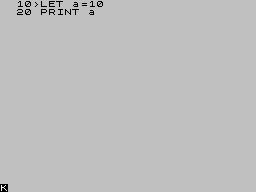

As you already know, because these lines began with numbers, they were not
obeyed immediately but stored away, as program lines. You will also have noticed
here that the line numbers govern the order of the lines within the program:
this is most important when the program is run, but it is also reflected in the
order of the lines in the listing that you can see on the screen now.

So far you have only entered one number, so type

```
15 LET b=15
```

and in it goes. It would have been impossible to insert this line between the
first two if they had been numbered 1 and 2 instead of 10 and 20 (line numbers
must be whole numbers between 1 and 9999), so that is why, when first typing in
a program, it is good practice to leave gaps between the line numbers.

Now you need to change line 20 to

```
20 PRINT a+b
```

You could type out the replacement in full, but it is easier to use the **EDIT**
facility described in the introductory booklet. The  
by line 15 is called the program cursor, and the line it points to is the current line. This is
usually the last line that you entered, but you can use the  
or  keys to move
the program cursor down or up. (Try it, leaving the program cursor eventually at
line 20.)

When you press the **EDIT** key, then a copy of the current line will be displayed
at the bottom of the screen - in your case, a copy of line 20. Hold down 
the 
key until the **L** cursor moves to the end of the line, and then type

**+b** (without **ENTER**)

The line at the bottom should now read
 
```
20 PRINT a+b
```

Type **ENTER** and it will replace the old line 20, so that the screen looks like
this:

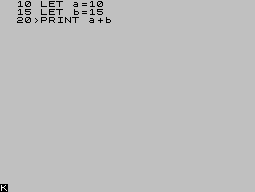

Run this program using **RUN** and **ENTER** and the sum will be displayed.

Run the program again and then type

```
PRINT a, b
```

The variables are still there, even though the program has finished.

There is a useful method using **EDIT** to get rid of the bottom part of the screen.
Type in a load of rubbish (without **ENTER**) and then decide that you don't want it
after all. One way to delete it is to hold the **DELETE** key down until the line is
gone; but another way is as follows. If you press **EDIT**, the rubbish at the
bottom of the screen will be replaced by a copy of the current line. If you now
press ENTER, the current line will be put back in the program unaltered, leaving
the bottom part of the screen clear.

If you enter a line by mistake, say

```
12 LET b=8
```

it will go up into the program and you will realise your mistake. To delete this
unnecessary line, type


```12``` (with **ENTER** of course)

You will notice with surprise that the program cursor has gone. You should
imagine it as being hidden in between lines 10 and 15, so if you press  it will
move up to line 10, while if you press  it will move down to line 15.

Type

```12``` (and ```ENTER```)

Again, the program cursor will be hidden between lines 10 and 15. Now press **EDIT**
and line 15 will come down: when the program cursor is hidden between two lines,
**EDIT** brings down the next line following the new line number. Type **ENTER** to
clear the bottom part of the screen.

Now type

```30``` (and ```ENTER```)


This time, the program cursor is hidden after the end of the program: and if you
press **EDIT**, then line 20 will be brought down.

Lastly, type

```LIST 15```

You will now see on the screen

```
15 LET b=15
20 PRINT a+b
```


Line 10 has vanished from the screen. but it is still in your program - which
you can prove by pressing **ENTER**. The only effects of **LIST 15** are to produce a
listing that starts at line 15. and to put the program cursor at line 15. If you
have a very long program, then **LIST** will probably be a more useful way of moving
the program cursor than  
and .

This illustrates another use of line numbers: they act as names for the program
lines so that you can refer to them, rather like the way in which variables have
names.

**LIST** on its own makes the listing start at the beginning of a program.

Another command seen in the introductory booklet is:

**NEW**
 
This erases any old programs and variables in the computer. Now carefully type
in this program, which changes Fahrenheit temperatures to Centigrade.
 
```
10 REM temperature conversion
20 PRINT "deg F", "deg C"
30 PRINT
40 INPUT "Enter deg F", F
50 PRINT F,(F-32)\*5/9
60 GO TO 40
```

You will need to type the words in line 10. Also, although **GO TO** has a space in
it, it is really all one keyword (on **G**).

Now run it. You will see the headings printed on the screen by line **20**, but what
happened to line **10**? Apparently the computer has completely ignored it. Well, it
has. **REM** in line **10** stands for remark, or reminder, and is there solely to
remind you of what the program does. A **REM** command consists of **REM** followed by
anything you like, and the computer will ignore it right up to the end of the
line.

By now, the computer has got to the **INPUT** command on line **40** and is waiting for
you to type in a value for the variable F - you can tell this because where you
might have expected a **K** cursor there is instead an **L** cursor. Enter a
number; remember **ENTER**. Now the computer has displayed the result and is waiting
for another number. This is because of line 60, **GO TO 40**, which means exactly
what it says. Instead of running out of program and stopping, the computer jumps
back to line 40 and starts again. So, enter another temperature. After a few
more of these you might be wondering if the machine will ever get bored with
this, it won't. Next time it asks for another number, type STOP. The computer
comes back with a report **H STOP in INPUT in line 40:1**, which tells you why
it stopped, and where (in the first command of line 40).

If you want to continue the program type

**CONTINUE**

and the computer will ask you for another number.

When **CONTINUE** is used the computer remembers the line number in the last report
that it sent you, as long as it was not **0 OK**, and jumps back to that line:
in our case, this involves jumping to line 40, the **INPUT** command.

Replace line 60 by **GO TO** 31 - it will make no perceptible difference to the
running of the program. If the line number in a **GO TO** command refers to a
non-existent line, then the jump is to the next line after the given number. The
same goes for **RUN**; in fact **RUN** on its own actually means **RUN 0**.

Now type in numbers until the screen starts getting full. When it is full, the
computer will move the whole of the top half of the screen up one line to make
room, losing the heading off the top. This is called scrolling.

When you are tired of this, stop the program using STOP and get the listing by
pressing **ENTER**.

Look at the **PRINT** statement on line 50. The punctuation in this - the comma (,)
is very important, and you should remember that it follows much more definite
rules than the punctuation in English.

Commas are used to make the printing start either at the left hand margin, or in
the middle of the screen, depending on which comes next. Thus in line 50, the
comma causes the centigrade temperature to be printed in the middle of the line.
With a semicolon, on the other hand, the next number or string is printed
immediately after the preceding one. You can see this in line 50, if the comma
is replaced by a semicolon.

Another punctuation mark you can use like this in **PRINT** commands is the
apostrophe ('). This makes whatever is printed next appear at the beginning of
the next line on the screen but this happens anyway at the end of each **PRINT**
command, so you will not need the apostrophe very much. This is why the **PRINT**
command in line 50 always starts its printing on a new line, and it is also why
the **PRINT** command in line 30 produces a blank line.

If you want to inhibit this, so that after one **PRINT** command the next one
carries on on the same line, you can put a comma or semicolon at the end of the
first. To see how this works, replace line 50 in turn by each of

**50 PRINT F,**

**50 PRINT F;**

and

**50 PRINT F**

and run each version - for good measure you could also try

**50 PRINT F'**

The one with the comma spreads everything out in two columns, that with the
semicolon crams everything together, that without either allows a line for each
number and so does that with the apostrophe - the apostrophe gives a new line of
its own, but inhibits the automatic one.

Remember the difference between commas and semicolons in **PRINT** commands; also,
do not confuse them with the colons (:) that are used to separate commands in a
single line.

Now type in these extra lines:

``` 
100 REM this polite program remembers your name**
110 INPUT n$
120 PRINT "Hello ";n$;"!"
130 GO TO 110
``` 
 
This is a separate program from the last one, but you can keep them both in the
computer at the same time. To run the new one, type

**RUN 100**

Because this program inputs a string instead of a number, it prints out two
string quotes - this is a reminder to you, and it usually saves you some typing
as well. Try it once with any alias you care to make up for yourself.

Next time round, you will get two string quotes again. but you don't have to use
them if you don't want to. Try this, for example. Rub them out (with  and
DELETE twice), and type

**n$**

Since there are no string quotes, the computer knows that it has to do some
calculation: the calculation in this case is to find the value of the string
variable called n$, which is whatever name you happen to have typed in last
time round. Of course, the **INPUT** statement acts like **LET** n$=n$, so the value
of n$ is unchanged.

The next time round, for comparison, type

**n$**

again, this time without rubbing out the string quotes. Now, just to confuse
you, the variable n$ has the value "n$".

If you want to use STOP for string input, you must first move the cursor back to
the beginning of the line, using .

Now look back at that **RUN 100** we had earlier on. That just jumps to line 100, so
couldn't we have said **GO TO 100** instead? In this case, it so happens that the
answer is yes; but there is a difference. **RUN 100** first of all clears all the
variables and the screen, and after that works just like **GO TO 100**. **GO TO 100**
doesn't clear anything. There may well be occasions where you want to run a
program without clearing any variables; here **GO TO** would be necessary and **RUN**
could be disastrous, so it is better not to get into the habit of automatically
typing **RUN** to run a program.

Another difference is that you can type **RUN** without a line number, and it starts
off at the first line in the program. **GO TO** must always have a line number.

Both these programs stopped because you typed STOP in the input line; sometimes
- by mistake - you write a program that you can't stop and won't stop itself.
- 
Type

```
200 GO TO 200
```
```
RUN 200
```
 
This looks all set to go on for ever unless you pull the plug out; but there is
a less drastic remedy. Press **CAPS SHIFT** with the SPACE key, which has BREAK
written above it. The program will stop, saying **L BREAK into program**.

At the end of every statement, the program looks to see if these keys are
pressed; and if they are, then it stops. The BREAK key can also be used when you
are in the middle of using the cassette recorder or the printer, or various
other bits of machinery that you can attach to the computer - just in case the
computer is waiting for them to do something but they're not doing it.

In these cases there is a different report, **D BREAK - CONT repeats**. **CONTINUE**
in this case (and in fact in most other cases too) repeats the statement where
the program was stopped; but after the report **L BREAK into program**, **CONTINUE**
carries straight on with the next statement after allowing for any jumps to be
made.

Run the name program again and when it asks you for input type

**n$** (after removing the quotes)

n$ is an undefined variable and you get an error report **2: Variable not
found**.

If you now type

**LET n$="something definite"**

(which has its own report of **0 OK, 0:1**) and


**CONTINUE**

you will find that you can use n$ as input data without any trouble.

In this case **CONTINUE** does a jump to the **INPUT** command in line 110. It
disregards the report from the **LET** statement because that said 'OK', and jumps
to the command referred to in the previous report, the first command in line
110. This is intended to be useful. If a program stops over some error then you
can do all sorts of things to fix it, and **CONTINUE** will still work afterwards.

As we said before, the report **L BREAK into program** is special, because after
it CONTINUE does not repeat the command where the program stopped.

The automatic listings (the ones that are not the result of a **LIST** command but
occur after entering a new line) may well have you puzzled. If you type in a
program with 50 lines, all REM statements,

```
1 REM
2 REM
3 REM
: :
: :
49 REM
50 REM
```
then you will be able to experiment.

The first thing to remember is that the current line (with **\>**) will always
appear on the screen, and usually near the middle.


Type

**LIST**  (and ENTER of course)

and when it asks **scroll?** (because it has filled up the screen) press n for
'No'. The computer will give the report **D BREAK - CONT repeats** as though you
had typed BREAK. You might at some stage find out what happens if you press y
instead of n; n, SPACE and STOP count as No, while everything else counts as
Yes.

Now press ENTER again to get an automatic listing and you should see lines 1 to
22 on the screen. Now type

```23 REM```
 
and you get lines 2 to 23 on the screen; type

```28 REM```
 
and you get lines 7 to 28. (In both cases, by typing a new line, you have moved
the program cursor so that a new listing has been made.)

Maybe this looks a little arbitrary to you. It is actually trying to give you
exactly what you want, although, humans being unpredictable creatures, it
doesn't always guess right.

The computer keeps a record not only of the current line, the one that has to
appear on the screen, but also the top line on the screen. When it tries to make
a listing, the first thing it does is compare the top line to the current line.
If the top line comes after, then there is no point in starting there, so it
uses the current line for a new top line and makes its listing. Otherwise, its
method is to start making the listing from the top line, and carry on until it
has listed the current line, scrolling if necessary.

However, it first does a rough calculation to see how long this would take, and
if the answer is much too long, then it moves the top line down to be a lot
closer to the current line. Now, having worked out its top line, it starts
listing from there. If, when it reaches the end of the program or the bottom of
the screen, the current line has been listed, then it stops. Otherwise, it
scrolls until the current line is on the screen, and for each extra line that it
lists it moves the top line down one so that the top line drifts into the
neighbourhood of the current line.

Experiment with moving the current line about by typing

line number **REM**

**LIST** moves the current line but not the top line, so subsequent listings might
be different. For instance, type

**LIST**

to get the **LIST** listing and then press **ENTER** again to make line 0 the top line.
You should have lines 1 to 22 on the screen. Type
```
LIST 22
```
which gives you lines 22 to 43; when you press ENTER again, you get back lines 1
to 22. This tends to be more useful for short programs than for long ones.
 
Using the program full of REMs above, type
```
LIST
```
and then n when it asks you **scroll?**. Now type
```
CONTINUE
```

**CONTINUE** is a bit quirky here, because the bottom part of the screen goes blank;
but you can restore normality with BREAK. The reason is that **LIST** was the first
command in the line, so **CONTINUE** repeats this command. Unfortunately, the first
command in the line is now **CONTINUE** itself so the computer just sits there doing
**CONTINUE** over and over again until you stop it.

You can vary this by replacing **LIST** with

**: LIST**

for which **CONTINUE** gives 0 OK (because **CONTINUE** jumps to the second command in
the line, which is taken to be its end) or


**:: LIST**

for which **CONTINUE** gives **N Statement lost** (because **CONTINUE** jumps to the
third command in the line, which no longer exists).

You have now seen the statements **PRINT**, **LET**, **INPUT**, **RUN**, **LIST**, **GO TO**, **CONTINUE**,
**NEW** and REM, and they can all be used either as direct commands or in program
lines - this is true of almost all commands in ZX Spectrum BASIC. RUN, **LIST**,
**CONTINUE** and **NEW** are not usually of much use in a program, but they can be used.
 
#### Exercises ####

1. Put a **LIST** statement in a program, so that when you run it, it lists itself.

2. Write a program to input prices and print out the tax due (at 15 per cent).
Put in **PRINT** statements so that the computer announces what it is going to do,
and asks for the input price with extravagant politeness. Modify the program so that you can also input the tax rate (to allow
for zero ratings or future changes).


3. Write a program to print a running total of numbers you input. (Suggestion:
have two variables called *total* - set to 0 to begin with - and *item*. Input
*item*, add it to t*otal*, print them both, and go round again.)

4. What would **CONTINUE** and **NEW** do in a program? Can you think of any uses at all for this?

 

 

[&uarr; Contents](#Contents) | [&larr; CHAPTER 2 (Basic programming concepts) ](#Chapter2) |  [&rarr; Chapter 4 (Looping)](#Chapter4) 

## <a name ="Chapter3"><a/>  CHAPTER 3 ##

### Decisions ###


#### Summary ####


**IF**, **STOP**

**=, <, >, <=, >=, <>**

 

 

All the programs we have seen so far have been pretty predictable - they went
straight through the instructions, and then went back to the beginning again.
This is not very useful. In practice the computer would be expected to make
decisions and act accordingly. The instruction used has the
form . . . **IF** something is true, or not true **THEN** do something else.


For example, use **NEW** to clear the previous program from the computer and type in
and run this program. (This is clearly meant for two people to play!)
 
```
10 REM Guess the number
20 INPUT a: CLS
30 INPUT "Guess the number", b
40 IF b=a THEN PRINT "That is correct": STOP
50 IF b\<a THEN PRINT "That is too small, try again"
60 IF b\>a THEN PRINT "That is too big, try again"
70 GO TO 30
```

You can see that an IF statement takes the form

**IF** condition **THEN . . .**

where the '. . .' stands for a sequence of commands, separated by colons in the
usual way. The condition is something that is going to be worked out as either
true or false: if it comes out as true then the statements in the rest of the
line after **THEN** are executed, but otherwise they are skipped over, and the
program executes the next instruction.

The simplest conditions compare two numbers or two strings: they can test
whether two numbers are equal or whether one is bigger than the other; and they
can test whether two strings are equal, or (roughly) one comes before the other
in alphabetical order. They use the relations =, \<, \>, \<=, \>= and \<\>.

= means 'equals'. Although it is the same symbol as the = in a **LET** command, it
is used in quite a different sense.

< (**SYMBOL SHIFT** with **R**) means 'is less than' so that

1 < 2

-2 < -1

-3 < 1

are all true, but

1 < 0

0 < -2

are false.

Line 40 compares **a** and **b**. If they are equal then the program is halted by the
**STOP** command. The report at the bottom of the screen **9 STOP, statement, 30:3**
shows that the third statement, or command, in line 30 caused the program to
halt, i.e. **STOP**.

Line 50 determines whether **b** is less than **a**, and line 60 whether **b** is greater
than **a**. If one of these conditions is true then the appropriate comment is
printed, and the program works its way to line 70 which tellsthe computer to go
back to line 30 and start all over again.

The **CLS**, clear screen, command in line 20 was to stop the other person seeing
what you put in.

So > (**SYMBOL SHIFT** with T) means 'is greater than', and is just like \< but the
other way round. You can remember which is which, because the thin end points to
the number that is supposed to be smaller.

<= (**SYMBOL SHIFT** with Q - do not type it as \< followed by =) means 'is less
than or equal to', so that it is like \< except that it is true even if the two
numbers are equal: thus 2\<=2 is true, but 2\<2 is false.

\>= (**SYMBOL SHIFT** with E) means 'is greater than or equal to' and is similarly
like \>.

<> (**SYMBOL SHIFT** with W) means 'is not equal to', the opposite in meaning to
=.

Mathematicians usually write <=, >= and <> as, and . They also write
things like '234' to mean '2<3 and 3<4', but this is not possible in BASIC.

Note: in some versions of BASIC - but not on the ZX Spectrum - the IF statement
can have the form

**IF** condition **THEN** line number

This means the same as

**IF** condition **THEN GO TO** line number

 

#### Exercises ####

1. Try this program:
 
```
10 PRINT "x": STOP: PRINT V**
```

When you run it, it will display x and stop with report **9 STOP statement,
10:2**. 

Now type

```CONTINUE```

You might expect this to jump back to the STOP command - **CONTINUE** usually
repeats the statement referred to in the report. However, here this would not be
very useful, because the computer would just stop again without displaying y.
Therefore, things are arranged so that after report 9 **CONTINUE** jumps to the
command after the STOP command - so in our example, after **CONTINUE**, the computer
prints V and reaches the end of the program.

 

 

[&uarr; Contents](#Contents) | [&larr; CHAPTER 3 (Decisions) ](#Chapter3) |  [&rarr; Chapter 5 (Subroutines) ](#Chapter5) 

## <a name ="Chapter4"><a/>  CHAPTER 4 ##

### Looping ###


#### Summary ####


**FOR**, **NEXT** <BR>
**TO**, **STEP**
 

Suppose you want to input five numbers and add them together. One way (don't
type this in unless you are feeling dutiful) is to write
 
```
10 LET total=0
20 INPUT a
30 LET total=total+a
40 INPUT a
50 LET total=total+a
60 INPUT a
70 LET total=total+a
80 INPUT a
90 LET total=total+a
100 INPUT a
110 LET total=total+a
120 PRINT total
```

This method is not good programming practice. It may be just about controllable
for five numbers, but you can imagine how tedious a program like this to add ten
numbers would be, and to add a hundred would be just impossible.

Much better is to set up a variable to count up to 5 and then stop the program,
like this (which you should type in):

```
10 LET total=0
20 LET count=1
30 INPUT a
40 REM count=number of times that a has been input so far
50 LET total=total+a
60 LET count=count+1
70 IF count\<=5 THEN GO TO 30
80 PRINT total
```

Notice how easy it would be to change line 70 so that this program adds ten
numbers, or even a hundred.

This sort of counting is so useful that there are two special commands to make
it easier: the **FOR** command and the **NEXT** command. They are always used together.
Using these, the program you have just typed in does exactly the same as

```
10 LET total=0
20 FOR c=1 TO5
30 INPUT a
40 REM c=number of times that a has been input so far
50 LET total=total+a
60 NEXT c
80 PRINT total
```

(To get this program from the previous one, you just have to edit lines 20, 40,
60, and 70. **TO** is **SYMBOL SHIFT** with F.)

Note that we have changed count to c. The counting variable - or control
variable of a **FOR** - **NEXT** loop must have a single letter for its name.

The effect of this program is that c runs through the values 1 (the initial
value), 2, 3, 4 and 5 (the limit), and for each one, lines 30, 40 and 50 are
executed. Then, when c has finished its five values, line 80 is executed.

An extra subtlety to this is that the control variable does not have to go up by
1 each time: you can change this 1 to anything you like by using a STEP part in
the **FOR** command. The most general form for a **FOR** command is

**FOR** control variable = initial value **TO** limit **STEP** step

where the control variable is a single letter, and the initial value, limit and
step are all things that the computer can calculate as numbers - like the actual
numbers themselves, or sums, or the names of 
numeric variables. So, if you replace line 20 in the program by

```
20 FOR c=1 TO 5 STEP 3/2
```

then c will run through the values 1, 2.5 and 4. Notice that you don't have to
restrict yourself to whole numbers, and also that the control value does not
have to hit the limit exactly - it carries on looping as long as it is less than or equal to the limit.

Try this program, to print out the numbers from 1 to 10 in reverse order.
```
10 FOR n=10 TO 1 STEP -1
20 PRINT n
30 NEXT n
```
We said before that the program carries on looping as long as the control
variable is less than or equal to the limit. If you work out what this would
mean in this case. you will see that it gives nonsense. The normal rule has to
be modified: when the step is negative, the program carries on looping as long
as the control variable is greater than or equal to the limit.

You must be careful if you are running two **FOR** - **NEXT** loops together, one 
inside the other. Try this program, which prints out the numbers for a complete 
set of six spot dominoes.
 
```
10 FOR m=0 TO 6 }
20 FOR n=0 TO m } }
30 PRINT m;":";n;" "; } n-loop } m-loop
40 NEXT n } }
50 PRINT }
60 NEXT m }
```
You can see that the n-loop is entirely inside the m-loop - they are properly
nested. What must be avoided is having two **FOR** - **NEXT** loops that overlap without
either being entirely inside the other, like this:

```
5 REM this program is wrong
10 FOR m=0 TO 6 }
20 FOR n=0 TO m } m-loop }
30 PRINT m;":";n;" "; } }
40 NEXT m** } } n-loop
50 PRINT }
60 NEXT n }
```

Two **FOR** - **NEXT** loops must either be one inside the other, or be completely
separate.

Another thing to avoid is jumping into the middle of a **FOR** - **NEXT** loop from the
outside. The control variable is only set up properly when its **FOR** statement is
executed, and if you miss this out the **NEXT** statement will confuse the computer.
You will probably get an error report saying **NEXT without FOR** or **variable
not found**.

There is nothing whatever to stop you using **FOR** and **NEXT** in a direct command.
For example, try:

```
FOR m=0 TO 10: PRINT m: NEXT m
```
You can sometimes use this as a (somewhat artificial) way of getting round the
restriction that you cannot **GO TO** anywhere inside a command - because a command
has no line nurrber. For instance,

```
FOR m=0 TO 1 STEP 0: INPUT a: PRINT a: NEXT m
```

The step of zero here makes the command repeat itself forever.

This sort of thing is not really recommended, because if an error crops up then
you have lost the command and will have to type it in again - and **CONTINUE** will
not work.

 

#### Exercises ####


1. A control variable has not just a name and a value, like an ordinary
variable, but also a limit, a step, and a reference to the statement after the
corresponding **FOR** statement. Persuade yourself that when the **FOR** statement is
executed all this information is available (using the initial value as the first
value the variable takes), and also that this information is enough for the **NEXT**
statement to know by how much to increase the value, whether to jump back, and
if so where to jump back to.

2. Run the third program above and then type

```PRINT c```

Why is the answer 6, and not 5?

(Answer: the NEXT command in line 60 is executed five times, and each time 1 is
added to c. The last time, c becomes 6; and then the **NEXT** command decides not to
loop back, but to carry on, c being past its limit.)


What happens if you put STEP 2 in line 20?


3. Change the third program so that instead of automatically adding five
numbers, it asks you to input how many numbers you want adding. When you run
this program, what happens if you input 0, meaning that you want no numbers
adding? Why might you expect this to cause problems for the 
computer, even though it is clear what you mean? (The computer has to make a
search for the 
command **NEXT** c, which is not usually necessary.) In fact this has all been taken
care of.

4. In line 10 of the fourth program above, change 10 to 100 and run the program.
It will print the numbers from 100 to 79 on the screen, and then say **scroll?**
at the bottom. This is to give you a chance to see the numbers that are about to
be scrolled off the top. If you press n, STOP or the BREAK key, the program will
stop with the report **D BREAK- CONT repeats**. If you press any other key, then
it will print another 22 lines and ask you again.

5. Delete line 30 from the fourth program. When you run the new curtailed
program, it will print the first number and stop with the message **0 OK**. If
you type

```
NEXT n
```
 
the program will go once round the loop, printing out the next number.

 

 

[&uarr; Contents](#Contents) | [&larr; CHAPTER 4 (Looping) ](#Chapter4) |  [&rarr; Chapter 6 (READ, DATA, RESTORE) ](#Chapter6)

## <a name ="Chapter5"><a/>  CHAPTER 5 ##

### Subroutines ###


#### Summary ####

**GO SUB, RETURN**
 


Sometimes different parts of the program will have rather similar jobs to do,
and you will find yourself typing the same lines in two or more times; however
this is not necessary. You can type the lines in once, in a form known as a
subroutine, and then use, or call, them anywhere else in the program without
having to type them in again.

To do this, you use the statements **GO SUB** (GO to SUBroutine) and **RETURN**. This
takes the form

**GO SUB** n

where n is the line number of the first line in the subroutine. It is just like
**GO TO** n except that the computer remembers where the **GO SUB** statement was so
that it can come back again after doing the subroutine. It does this by putting
the line number and the statement number within the line (together these
constitute the retum address) on top of a pile of them (the **GO SUB** stack);

**RETURN**

takes the top *return address* off the **GO SUB** stack, and goes to the statement
after it.

As an example, let's look at the number guessing program again. Retype it as
follows:

```
10 REM "A rearranged guessing game"
20 INPUT a: CLS
30 INPUT "Guess the number ",b
40 IF a=b THEN PRINT "Correct": STOP
50 IF a<b THEN GO SUB 100
60 IF a>b THEN GO SUB 100
70 GO TO 30
100 PRINT "Try again"
110 RETURN
```

The **GO TO** statement in line 70 is very important because otherwise the program
will run on into the subroutine and cause an error (**7 RETURN without GO SUB**)
when the **RETURN** statement is reached.

Here is another rather silly program illustrating the use of **GO SUB**.

```
100 LET x=10
110 GOSUB 500
120 PRINT s
130 LET x=x+4
140 GO SUB 500
150 PRINT s
160 LET x=x+2
170 GO SUB 500
180 PRINT s
190 STOP
500 LET s=0
510 FOR y=1 TO x
520 LET s=s+y
530 NEXT y
540 RETURN
```
 
When this program is run, see if you can work out what is happening. The
subroutine starts at line 500.

A subroutine can happily call another, or even itself (a subroutine that calls
itself is *recursive*), so don't be afraid of having several layers.

 

 

[&uarr; Contents](#Contents) | [&larr; CHAPTER 5 (Subroutines) ](#Chapter5) |  [&rarr; Chapter 7 (Expressions) ](#Chapter7) 

## <a name ="Chapter6"><a/>  CHAPTER 6 ##

### READ, DATA, RESTORE ###


#### Summary ####


**READ, DATA, RESTORE**

In some previous programs we saw that information, or data, can be entered
directly into the computer using the **INPUT** statement. Sometimes this can be very
tedious, especially if a lot of the data is repeated every time the program is
run. You can save a lot of time by using the **READ**, **DATA** and **RESTORE** commands.
For example:

```
10 READ a,b,c
20 PRINT a,b,c
30 DATA 10,20,30
40 STOP
```

A **READ** statement consists of **READ** followed by a list of the names of variables,
separated by commas. It works rather like an **INPUT** statement, except that
instead of getting you to type in the values to give to the variables, the
computer looks up the values in the **DATA** statement.


Each **DATA** statement is a list of expressions - numeric or string expressions
separated by commas. You can put them anywhere you like in a program, because
the computer ignores them except when it is doing a **READ**. You must imagine the
expressions from all the **DATA** statements in the program as being put together to
form one long list of expressions, the **DATA** list. The first time the computer
goes to **READ** a value, it takes the first expression from the **DATA** list; the next
time, it takes the second; and thus as it meets successive **READ** statements, it
works its way through the **DATA** list. (If it tries to go past the end of the **DATA**
list, then it gives an error.)

Note that it's a waste of time putting **DATA** statements in a direct command,
because **READ** will not find them. **DATA** statements have to go in the program.
Let's see how these fit together in the program you've just typed in. Line 10
tells the computer to read three pieces of data and give them the variables a, b
and c. Line 20 then says **PRINT** these variables. The **DATA** statement in line 30
gives the values of a, b and c. Line 40 stops the program. To see the order in
which things work change line 20 to:

```20 PRINT b,c,a```

The information in **DATA** can be part of a **FOR** . . . **NEXT** loop. Type in

```
10 FOR n=1 TO 6
20 READ D
30 DATA 2,4,6,8,10,12
40 PRINT D
50 NEXT n
60 STOP
```

When this program is **RUN** you can see the **READ** statement moving through the **DATA**
list. **DATA** statements can also contain string variables. For example:

```
10 READ d$
20 PRINT "The date is",d$
30 DATA "June 1st, 1982"
40 STOP
```

This is the simple way of fetching expressions from the **DATA** list: start at the
beginning and work through until you reach the end. However, you can make the
computer jump about in the **DATA** list, using the **RESTORE** statement. This has
**RESTORE**, followed by a line number, and makes subsequent **READ** statements start
getting their data from the first **DATA** statement at or after the given line
number. (You can miss out the line number, in which case it is as though you had
typed the line number of the first line in the program.)

Try this program:

```
10 READ a,b
20 PRINT a,b
30 RESTORE 10
40 READ x,y,z
50 PRINT x,y,z
60 DATA 1,2,3
70 STOP
```

In this program the data required by line 10 made a=1 and b=2. The **RESTORE** 10
instruction reset the variables, and allowed x, y and z to be **READ** starting from
the first number in the **DATA** statement. Rerun this program without line 30 and
see what happens.

 

 

[&uarr; Contents](#Contents) | [&larr; CHAPTER 6 (READ, DATA, RESTORE) ](#Chapter6) |  [&rarr; Chapter 8 (Strings) ](#Chapter8)

## <a name ="Chapter7"><a/>  CHAPTER 7 ##

### Expressions ###

#### Summary ####


**Operations: +, -, \*, /**

**Expressions, scientific notation, variable names**

 

You have already seen some of the ways in which the ZX Spectrum can calculate
with numbers. It can perform the four arithmetic operations +, -, \* and /
(remember that \* is used for multiplication, and / is used for division), and
it can find the value of a variable, given its name.

The example:

**LET tax=sum\*15/100**

gives just a hint of the very important fact that these calculations can be
combined. Such a combination. Iike **sum\*15/100**, is called an expression: so an
expression is just a short-hand way of telling the computer to do several
calculations, one after the other. In our example, the expression **sum\*15/100**
means 'look up the value of the variable called "sum", multiply it by 15, and
divide by 100'.

If you haven't yet done so, we recommend that you look through the introductory
booklet to see how the ZX Spectrum handles numbers, and the order in which it
evaluates mathematical expressions.

To recap:

Multiplications and divisions are done first. They have *higher priority* than
addition and subtraction. Relative to each other, multiplication and division
have the same priority, which means that the multiplications and divisions are
done in order from left to right. When they are dealt with, the additions and
subtractions come next - these again have the same priority as each other, so we
do them in order from left to right.

Although all you really need to know is whether one operation has a higher or
lower priority than another, the computer does this by having a number between 1
and 16 to represent the priority of each operation:\* and / have priority 8, 
and + and - have priority 6.

This order of calculation is absolutely rigid, but you can circumvent it by
using brackets: anything in brackets is evaluated first and then treated as a
single number.

Expressions are useful because, whenever the computer is expecting a number from
you, you can give it an expression instead and it will work out the answer. The
exceptions to this rule are so few that they will be stated explicitly in every
case.

You can add together as many strings (or string variables) as you like in a
single expression, and if you want, you can even use brackets.

We really ought to tell you what you can and cannot use as the names of
variables. As we have already said, the name of a string variable has to be a
single letter followed by $; and the name of the control variable of a **FOR**-**NEXT**
loop must be a single letter; but the names of ordinary numeric variables are
much freer. They can use any letters or digits as long as the first one is a
letter. You can put spaces in as well to make it easier to read, but they won't
count as part of the name. Also, it doesn't make any difference to the name
whether you type it in capitals or lower case letters.


Here are some examples of the names of variables that are allowed:

**x**

**t42**

**this name is so long that I shall never be able to type it out again**
**without making a mistake**

**now we are six** [these last two names are considered the same, and

**nOWWeaReSiX** refer to the same variable]

 

These are not allowed to be the names of variables:

**2001** [it begins with a digit]

**3 bears** [begins with a digit]

**M\*A\*S\*H** [\* is not a letter or a digit]

**Fotherington-Thomas** [- is not a letter or a digit]


Numerical expressions can be represented by a number and exponent: again refer
to the introductory booklet. Try the following to prove the point:

**PRINT 2.34e0**

**PRINT 2.34e1**

**PRINT 2.34e2**


and so on up to


**PRINT 2.34e15**

You will see that after a while the computer also starts using scientific
notation. This is because no more than fourteen characters can be used to write
a number. Similarly, try

**PRINT 2.34e-1**

**PRINT 2.34e-2**

and so on.

**PRINT** gives only eight significant digits of a number. Try

**PRINT 4294967295, 4294967295-429e7**

This proves that the computer can hold the digits of 4294967295, even though it
is not prepared to display them all at once.

The ZX Spectrum uses floating point arithmetic, which means that it keeps
separate the digits of a number (its mantissa) and the position of the point
(the exponentt. This is not always exact, even for whole numbers. Type

**PRINT 1e10+1-1e10,1e10-1e10+1**

Numbers are held to about nine and a half digits accuracy, so 1 e10 is too big
to be held exactly right. The inaccuracy (actually about 2) is more than 1, so
the numbers 1e10 and 1e10+1 appear to the computer to be equal. For an even more
peculiar example, type

**PRINT 5e9+1-5e9**

Here the inaccuracy in 5e9 is only about 1, and the 1 to be added on in fact
gets *rounded up* to 2. The numbers 5e9+1 and 5e9+2 appear to the computer to be
equal.

The largest integer (whole number) that can be held completely accurately is 1
less than 32 2's multiplied together (or 4,294,967,295).

The string "" with no characters at all is called the empty or null string.
Remember that spaces are significant and an empty string is not the same as one
containing nothing but spaces.

Try:

**PRINT "Have you finished "Finnegans Wake" yet?"**

When you press ENTER, you will get the flashing question mark that shows there
is a mistake somewhere in the line. When the computer finds the double quotes at
the beginning of "Finnegans Wake", it imagines that these mark the end of the
string "have you finished", and it then can't work out what 'Finnegans Wake'
means.

There is a special device to get over this: whenever you want to write a string
quote symbol in the middle of a string, you must write it twice, like this:

**PRINT "Have you finished ""Finnegans Wake"" yet?"**

As you can see from what is printed on the screen, each double quote is only
really there once; you just have to type it twice to get it recognized.

 

 

[&uarr; Contents](#Contents) | [&larr; CHAPTER 7 (Expressions) ](#Chapter7) |  [&rarr; Chapter 9 (Functions) ](#Chapter9)


## <a name ="Chapter8"><a/>  CHAPTER 8 ##

### Strings ###

#### Summary ####

Slicing. using **TO**. Note that this notation is not standard BASIC.

 

Given a string, a substring of it consists of some consecutive characters from
it, taken in sequence. Thus "string" is a substring of "bigger string", but "b
sting" and "big reg" are not.

There is a notation called *slicing* for describing substrings, and this can be
applied to arbitrary string expressions. The general form is

**string expression (start TO finish)**

so that, for instance,

**"abcdef"(2 TO 5)="bcde"**

If you omit the start, then 1 is assumed; if you omit the finish then the length
of the string is assumed. Thus

**"abcdef"( TO 5)="abcdef"(1 TO 5)="abcde"**

**"abcdef"(2 TO )="abcdef"(2 TO 6)="bcdef"**

**"abcdef"( TO )="abcdef"(1 TO 6)="abcdef"**

(You can also write this last one as "abcdef"(), for what it's worth.)

A slightly different form misses out the TO and just has one number.

**"abcdef"(3)="abcdef"(3 TO 3)="c"**

Although normally both start and finish must refer to existing parts of the
string, this rule is overridden by another one: if the start is more than the
finish, then the result is the empty string. So

**"abcdef"(5 TO 7)**

gives error 3 subscript wrong because the string only contains 6 characters and
7 is too many, but

**"abcdef"(8 TO 7)=""**

and

**"abcdef"(1 TO 0)=""**

The start and finish must not be negative, or you get error **B integer out of
range**. This next program is a simple one illustrating some of these rules.

```
10 LET a$="abcdef"
20 FOR n=1 TO 6
30 PRINT a$(n TO 6)
40 NEXT n
50 STOP
```

Type `NEW` when this program has been run and enter the next program:

```
10 LET a$="ABLE WAS 1"
20 FOR n=1 TO 10
30 PRINT a$(n TO 10),a$((10-n) TO 10)
40 NEXT n
50 STOP
```

For string variables, we can not only extract substrings, but also assign to
them. For instance, type

```LET a$="l'm the ZX Spectrum"```

and then

```LET a$(5 TO 8)="******"```

and

```PRINT a$```

Notice how since the substring a$(5 TO 8) is only 4 characters long, only the
first four stars have been used. This is a characteristic of assigning to
substrings: the substring has to be exactly the same length afterwards as it was
before. To make sure this happens, the string that is being assigned to it is
cut off on the right if it is too long, or filled out with spaces if it is too
short - this is called Procrustean assignment after the inn-keeper Procrustes
who used to make sure that his guests fitted the bed by either stretching them
out on a rack or cutting their feet off.

If you now try

```LET a$()="Hello there"```

and

```PRINT a$;"."```

you will see that the same thing has happened again (this time with spaces put
in) because a$() counts as a substring.

```LET a$="Hello there"```

will do it properly.

Complicated string expressions will need brackets round them before they can be
sliced. For example,

**"abc"+"def"(1 TO 2)="abcde"**

**("abc"+"def")(1 TO 2)="ab"**

 

#### Exercise ####

1. Try writing a program to print out the day of the week using string slicing.
Hint: let the string be SunMonTuesWedThursFriSat.

 

 

[&uarr; Contents](#Contents) | [&larr; CHAPTER 8 (Strings) ](#Chapter8) |  [&rarr; Chapter 10 (Mathematical functions) ](#Chapter10)

## <a name ="Chapter9"><a/>  CHAPTER 9 ##

### Functions ###


#### Summary ####


**DEF**

**LEN**, **STR$**, **VAL**, **SGN** **ABS**, **INT**, **SQR**

**FN**

Consider the sausage machine. You put a lump of meat in at one end, turn a
handle, and out comes a sausage at the other end. A lump of pork gives a pork
sausage, a lump of fish gives a fish sausage, and a load of beef a beef sausage.

Functions are practically indistinguishable from sausage machines but there is a
difference: they work on numbers and strings instead of meat. You supply one
value (called the *argument*), mince it up by doing some calculations on it, and
eventually get another value, the *result*.
 

**Meat in  Sausage Machine  Sausage out**

**Argument in  Function  Result out**

Different arguments give different results, and if the argument is completely
inappropriate the function will stop and give an error report.

Just as you can have different machines to make different products - one for
sausages. another for dish cloths, and a third for fish-fingers and so on,
different functions will do different calculations. Each will have its own value
to distinguish it from the others.

You use a function in expressions by typing its name followed by the argument,
and when the expression is evaluated the result of the function will be worked
out.

As an example, there is a function called **LEN**, which works out the length of a
string. Its argument is the string whose length you want to find, and its result
is the length, so that if you type

**PRINT LEN "Sinclair"**

the computer will write the answer 8. the number of letters in 'Sinclair'. (To
get **LEN**. as with most function names, you must use extended mode: press **CAPS
SHIFT** and **SYMBOL SHIFT** at the same time to change the cursor from **L** to
**E**, and then press the **K** key.)

If you mix functions and operations in a single expression, then the functions
will be worked out before the operations Again, however, you can circumvent this
rule by using brackets. For instance, here are two expressions which differ only
in the brackets, and yet the calculations are performed in an entirely different
order in each case (although, as it happens, the end results are the same).

| Order 1 | Order 2 |
|_____|__++++__|
|**LEN** "Fred"+ **LEN** "Bloggs"   |  **LEN** ("Fred"+"Bloggs") |
|4+**LEN** "Bloggs" | **LEN** ("FredBloggs") |
|4+6 | **LEN** "FredBloggs" |
|10 | 10 |

Here are some more functions.

**STR$** converts numbers into strings: its argument is a number, and its result is
the string that would appear on the screen if the number were displayed by a
**PRINT** statement. Note how its name ends in a **$** sign to show that its result is
a string. For example, you could say

**LET a$=STR$ 1e2**

which would have exactly the same effect as typing

**LET a$="100"**

Or you could say

**PRINT LEN STR$ 100,000**

and get the answer 3, because **STR$** 100.0000="100".

**VAL** is like **STR$** in reverse: it converts strings into numbers. For instance,

**VAL "3.5"=3.5**

In a sense, **VAL** is the reverse of STR$, because if you take any number, apply
**STR$** to it, and then apply **VAL** to it, you get back to the number you first
thought of.

However, if you take a string, apply **VAL** to it, and then apply **STR$** to it, you
do not always get back to your original string.

**VAL** is an extremely powerful function, because the string which is its argument
is not restricted to looking like a plain number - it can be any numeric
expression. Thus, for instance,

**VAL "2\*3"=6**

or even,

**VAL ("2"+"3") = 6**

There are two processes at work here. In the first, the argument of **VAL** is
evaluated as a string: the string expression "2"+"\*3" is evaluated to give the
string "2\*3". Then, the string has its double quotes stripped off, and what is
left is evaluated as a number: so 2\*3 is evaluated to give the number 6.

This can get pretty confusing if you don't keep your wits about you; for
instance,

**PRINT VAL "VAL""VAL""""2"""""""**

(Remember that inside a string a string quote must be written twice. If you go
down into further depths of strings, then you find that string quotes need to be
quadrupled or even octupled.)

There is another function, rather similar to **VAL**, although probably less useful,
called **VAL$**. Its argument is still a string, but its result is also a string.
To see how this works, recall how **VAL** goes in two steps: first its argument is
evaluated as a string, then the string quotes stripped off this, and whatever is
left is evaluated as a number. With **VAL$**, the first step is the same, but after
the string quotes have been stripped off in the second step, whatever is left is
evaluated as another string. Thus

**VAL$ """Fruit punch""" = "Fruit punch"**

(Notice how the string quotes proliferate again.) Do

**LET a$="99"**

and print out all of the following: **VAL** a$, **VAL** "a$", **VAL** """a$""", **VAL$**
a$, **VAL$** "a$" and **VAL$** """a$""". Some of these will work, and some of them
won't; try to explain all the answers. (Keep a cool head.)

**SGN** is the *sign* function (sometimes called *signum*). It is the first function
you have seen that has nothing to do with strings, because both its argument and
its result are numbers. The result is +1 if the argument

is positive, 0 if the argument is zero, and -1 if the argument is negative.

ABS is another function whose argument and result are both numbers. It converts
the argument into a positive number (which is the result) by forgetting the
sign, so that for instance

**ABS -3.2 = ABS 3.2 = 3.2**

**INT** stands for 'integer part' - an *integer* is a whole number, possibly
negative. This function converts a fractional number into an integer by throwing
away the fractional part, so that for instance,

**INT 3.9=3**

Be careful when you are applying it to negative numbers, because it always
rounds down: thus, for instance,

**INT -3.9=-4**

**SQR** calculates the *square root* of a number - the result that, when multiplied
by itself, gives the argument. For instance,

**SQR 4 = 2** because 2\*2=4

**SQR 0.25 = 0.5** because 0.5\*0.5=0.25

**SQR 2 = 1.4142136** (approximately) because 1.4142136\*1.4142136=2.0000001

If you multiply any number (even a negative one) by itself, the answer is always
positive. This means that negative numbers do not have square roots, so if you
apply **SQR** to a negative argument you get an error report **A Invalid Argument**.

You can also define functions of you own. Possible names for these are FN
followed by a letter (if the result is a number) or FN followed by a letter
followed by $ (if the result is a string). These are much stricter about
brackets: the argument must be enclosed in brackets.

You define a function by putting a DEF statement somewhere in the program. For
instance, here is the definition of a function FN s whose result is the square
of the argument:

**10 DEF FN s(x)=x\*x: REM the square of x**

DEF is obtained in extended mode, using **SYMBOL SHIFT** and 1. When you type this,
the computer will give you FN automatically, because in a DEF statement the DEF
is always followed immediately by FN. After this, the s completes the name FN s
of the function.

The x in brackets is a name by which you wish to refer to the argument of the
function. You can use any single letter you like for this (or, if the argument
is a string, a single letter followed by $).

After the = sign comes the actual definition of the function. This can be any
expression, and it can also refer to the argument using the name you've given it
(in this case, x) as though it were an ordinary variable.

When you have entered this line, you can invoke the function just like one of
the computer's own functions, by typing its name, FN s, followed by the
argument. Remember that when you have defined a function yourself, the argument
must be enclosed in brackets. Try it out a few times:

```<language>
PRINT FN s(2)
PRINT FN s(3+4)
PRINT 1+1NT FN s (LEN "chicken"/2+3)
```

Once you have put the corresponding DEF statement into the program, you can use
your own functions in expressions just as freely as you can use the computer's.

Note: in some dialects of BASIC you must even enclose the argument of one of the
computer's functions in brackets. This is not the case in ZX Spectrum BASIC.

**INT** always rounds down. To round to the nearest integer, add .5 first - you
could write your own function to do this.

```<language>
20 DEF FN r(x)=lNT (x+O.5): REM gives x rounded to the nearest integer.
```

You will then get, for instance,

**FN r(2.9) = 3 FN r(2.4) = 2**

**FN r(-2.9) = -3 FN r(-2.4) = -2**

Compare these with the answers you get when you use INT instead of FN r. Type in
and run the following:

```
10 LET x=0: LET y=0: LET a=10
20 DEF FN p(x,y)=a+x
30 DEF FN q()=a+x\*y
40 PRINT FN p(2,3),FN q()
```

There are a lot of subtle points in this program.

First, a function is not restricted to just one argument: it can have more, or
even none at all - but you must still always keep the brackets.

Second, it doesn't matter whereabouts in the program you put the DEF statements.
After the computer has executed line 10, it simply skips over lines 20 and 30 to
get to line 40. They do, however, have to be somewhere in the program. They
can't be in a command.

Third, x and y are both the names of variables in the program as a whole, and
the names of arguments for the function FN p. FN p temporarily forgets about the
variables called x and y, but since it has no argument called a, it still
remembers the variable a. Thus when FN p(2,3) is being evaluated, a has the
value 10 because it is the variable, x has the value 2 because it is the first
argument, and y has the value 3 because it is the second argument. The result is
then, 10+2\*3=16. When FN q() is beinq evaluated, on the other hand. there are
no arauments. so a. x and v all still refer to the variables and have values 10,
0 and 0 respectively. The answer in this case is 10+0\*0=10.

Now change line 20 to

```
20 DEF FN p(x,y)=FN q()
```
 
This time, FN p(2,3) will have the value 10 because FN q will still go back to
the variables x and y rather than using the arguments of FN p.

Some BASlCs (not the ZX Spectrum BASIC) have functions called **LEFT$**, **RIGHT$**,
**MID$** and **TL$**.

**LEFT$** (a$,n) gives the substring of a$ consisting of the first *n*
characters.

**RIGHT$** (a$,n) gives the substring of a$ consisting of the characters from
*n*th on.

**MID$ (a$, n1, n2)** gives the substring of a$ consisting of n2 characters
starting at the *n*1th.

**TL$ (a$)** gives the substring of **a$** consisting of all its characters except
the first.

You can write some user-defined functions to do the same: e.g.

```
10 DEF FN t$(a$)=a$(2 TO ): REM TL$
20 DEF FN I$(a$ n)=a$( TO n): REM LEFT$
```

Check that these work with strings of length 0 or 1.

Note that our **FN I$** has two arguments, one a number and the other a string. A
function can have up to 26 numeric arguments (why 26?) and at the same time up
to 26 string arguments.

 

#### Exercise ####

Use the function FN s(x)=x\*x to test **SQR**: you should find that

**FN s(SQR x)=x**

if you substitute any positive number for x, and

**SQR FN s(x)=ABS x**

whether x is positive or negative (Why the ABS?).

 

 


[&uarr; Contents](#Contents) | [&larr; CHAPTER 9 (Functions) ](#Chapter9) |  [&rarr; Chapter 11 (Mathematical functions) ](#Chapter11)

## <a name ="Chapter10"><a/>  CHAPTER 10 ##

### Mathematical functions ###

 

#### Summary ####

 

**PI**, **EXP**, **LN**, **SIN**, **COS**, **TAN**, **ASN**, **ACS**, **ATN**

 

This chapter deals with the mathematics that the ZX Spectrum can handle. Quite
possibly you will never have to use any of this at all, so if you find it too
heavy going, don't be afraid of skipping it. It covers the operation ­&uarr; (raising
to a power), the functions **EXP** and **LN**, and the trigonometrical functions **SIN**,
**COS**, **TAN** and their inverses **ASN**, **ACS**, and **ATN**.

&uarr; and **EXP**

You can raise one number to the power of another - that means 'multiply the
first number by itself the second number of times'. This is normally shown by
writing the second number just above and to the right of the first number; but
obviously this would be difficult on a computer so we use the symbol ­ instead.
For example, the powers of 2 are

 

**2­&uarr;1=2**

**2&uarr;­2=2\*2=4** (2 squared)

**2&uarr;­3=2\*2\*2=8** (2 cubed)

**2&uarr;­4=2\*2\*2\*2=16** (2 to the power four)

Thus at its most elementary level, '*a*­&uarr;*b*' means '*a* multiplied by itself *b*
times', but obviously this only makes sense if *b* is a positive whole number.
To find a definition that works for other values of *b*, we consider the rule


**a&uarr;­(b+c) = a&uarr;­b*a&uarr;­c**

(Notice that we give ­ a higher priority than \* and / so that when there are
several operations in one expression, the &uarr; ­s are evaluated before the *­s and
/s.) You should not need much convincing that this works when *b* and *c* are
both positive whole numbers; but if we decide that we want it to work even when
they are not, then we find ourselves compelled to accept that

**a­&uarr;0 = 1**

**a&uarr;­(-b) = 1/a&uarr;­b**

**a&uarr;­(1/b)** = the bth root of *a*, which is to say, the number that you have to
multiply by itself *b* times to get *a* , and

**a­&uarr;(b\*c)=(a&uarr;­b)­&uarr;c**

If you have never seen any of this before then don't try to remember it straight
away; just remember that


**a­&uarr;(-1)=1/a**

and

**a&uarr;(1/2)=SQR a**

and maybe when you are familiar with these the rest will begin to make sense.

Experiment with all this by trying this program:

```
10 INPUT a,b,c
20 PRINT a^(b+c),a^b*a*^c
30 GO TO 10
```
 
Of course, if the rule we gave earlier is true, then each time round the two
numbers that the computer prints out will be equal. (Note - because of the way
the computer works out &arupp; , the number on the left - *a* in this case - must
never be negative.)

A rather typical example of what this function can be used for is that of
compound interest. Suppose you keep some of your money in a building society and
they give 15% interest per year. Then after one year you will have not just the
100% that you had anyway, but also the 15% interest that the building society
have given you, making altogether 115% of what you had originally. To put it
another way, you have multiplied your sum of money by 1.15, and this is true
however much you had there in the first place. After another year, the same will
have happened again, so that you will then have 1.15*1.15=1.151&arupp;2=1.3225 times
your original sum of money. In general, after **y** years, you will have 1.15­**y**
times what you started out with.

If you try this command

**FOR y=0 TO 198: PRINT y,10*1.15*&arupp;Y: NEXT y**

you will see that even starting off from just £10, it all mounts up quite
quickly, and what is more, it gets faster and faster as time goes on. (Although
even so, you might still find that it doesn't keep up with inflation.)

This sort of behaviour, where after a fixed interval of time some quantity
multiplies itself by a fixed proportion, is called exponential growth, and it is
calculated by raising a fixed number to the power of the time.

Suppose you did this:

**10 DEF FN a(x)=a**­**x**

Here, *a* is more or less fixed, by **LET** statements: its value will correspond to
the interest rate, which changes only every so often.

There is a certain value for *a* that makes the function FN a look especially
pretty to the trained eye of a mathematician: and this value is called *e*. The
ZX Spectrum has a function called **EXP** defined by

**EXP x=e**­**x**

Unfortunately, *e* itself is not an especially pretty number: it is an infinite
non-recurring decimal. You can see its first few decimal places by doing

**PRINT EXP 1**

because EXP 1 = e­1 = e. Of course, this is just an approximation. You can never
write down *e* exactly.

**LN**

The inverse of an exponential function is a *logarithmic* function: the
logarithm (to base *a*) of a number *x* is the power to which you have to raise
a to get the number *x*, and it is written logax. Thus by definition a­logax=x;
and it is also true that log (a­x)=x.

You may well already know how to use base 10 logarithms for doing
multiplications; these are called common logarithms. The ZX Spectrum has a
function **LN** which calculates logarithms to the base *e*; these are called
natural logarithms. To calculate logarithms to any other base, you must divide
the natural logarithm by the natural logarithm of the base:

logax = **LN x/ LN a**

**PI**

Given any circle, you can find its *perimeter* (the distance round its edge;
often called its *circumference*) by multiplying its *diameter* (width) by a
number called \pi. (\pi is a Greek p, and it is used because it stands for
perimeter. Its name is pi.)

Like e, \pi is an infinite non-recurring decimal; it starts off as
3.141592653589....The word PI on the Spectrum (extended mode, then M) is taken
as standing for this number - try **PRINT** PI.

**SIN**, **COS** and **TAN**; **ASN**, **ACS** and **ATN**

The *trigonometrical* functions measure what happens when a point moves round a
circle. Here is a circle of radius 1 (1 what? It doesn't matter, as long as we
keep to the same unit all the way through. There is nothing to stop you
inventing a new unit of your own for every circle that you happen to be
interested in) and a point moving round it. The point started at the 3 o'clock
position, and then moved round in an anti-clockwise direction.


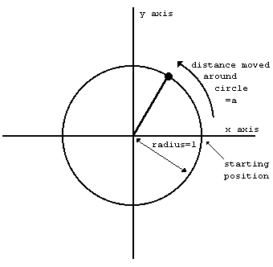

We have also drawn in two lines called *axes* through the centre of the circle.
The one through 9 o'clock and 3 o'clock is called the *x-axis*, and the one
through 6 o'clock and 12 o'clock is called the *y-axis*.

To specify where the point is, you say how far it has moved round the circle
from its 3 o'clock starting position: let us call this distance a. We know that
the circumference of the circle is 2pi  (because its radius is 1 and its diameter
is thus 2): so when it has moved a quarter of the way round the circle, a=pi/2;
when it has moved halfway round, a=pi; and when it has moved the whole way round,
a=2pi.

Given the curved distance round the edge, a, two other distances you might like
to know are how far the point is to the right of the y-axis, and how far it is
above the x-axis. These are called, respectively, the *cosine* and *sine* of
*a*. The functions **COS** and **SIN** on the computer will calculate these.

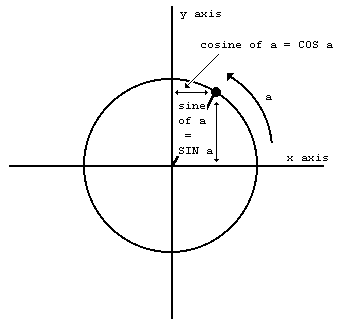

Note that if the point goes to the left of the y-axis, then the cosine becomes
negative; and if the point goes below the x-axis, the sine becomes negative.

Another property is that once *a* has got up to 2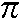, the point is back where it
started and the sine and cosine start taking the same values all over again:

**SIN (a+2*PI) = SIN a**

**COS (a+2*PI) = COS a**

The *tangent* of *a* is defined to be the sine divided by the cosine; the
corresponding function on the computer is called **TAN**.

Sometimes we need to work these functions out in reverse, finding the value of a
that has given sine, cosine or tangent. The furctions to do this are called
*arcsine* (**ASN** on the computer), *arccosine* (**ACS**) and *arctangent* (**ATN**).

In the diagram of the point moving round the circle, look at the radius joining
the centre to the point. You should be able to see that the distance we have
called *a*, the distance that the point has moved round the edge of the circle,
is a way of measuring the angle through which the radius has moved away from the
x-axis. When a=pi/2, the angle is 90 degrees; when a=pi the angle is 180 degrees;
and so round to when a=2pi, and the angle is 360 degrees. You might just as well
forget about degrees, and measure the angle in terms of *a* alone: we say then
that we are measuring the angle in *radians*. Thus pi/2 radians=90 degrees and so
on.

You must always remember that on the ZX Spectrum **SIN**, **COS** and so on use radians
and not degrees. To convert degrees to radians, divide by 180 and multiply by pi;
to convert back from radians to degrees, you divide by pi and multiply by 180.

 

 

 
[&uarr; Contents](#Contents) | [&larr; CHAPTER 10 (Mathematical functions) ](#Chapter10) |  [&rarr; Chapter 12 (Arrays) ](#Chapter12)

## <a name ="Chapter11"><a/>  CHAPTER 11 ##

### Random numbers ###

 

#### Summary ####


**RANDOMIZE**

**RND**

 

This chapter deals with the function **RND** and the keyword **RANDOMIZE**. They are
both used in connection with random numbers, so you must be careful not to get
them mixed up. They are both on the same key (T); **RANDOMIZE** has had to be
abbreviated to RAND.

In some ways **RND** is like a function: it does calculations and produces a result.
It is unusual in that it does not need an argument.

Each time you use it, its result is a new random number between 0 and 1.
(Sometimes it can take the value 0, but never 1.)

Try
 
```
10 PRINT RND
20 GO TO 10
```

to see how the answer varies. Can you detect any pattern7 You shouldn't be able
to; 'random' means that there is no pattern.

Actually, **RND** is not truly random, because it follows a fixed sequence of 65536
numbers. However, these are so thoroughly jumbled up that there are at least no
obvious patterns and we say that **RND** is *pseudo-random*.

**RND** gives a random number between 0 and 1, but you can easily get random numbers
in other ranges. For instance, 5***RND** is between 0 and 5, and 1.3+0.7* **RND** is
between 1.3 and 2. To get whole numbers, use **INT** (remembering that **INT** always
rounds down) as in 1 +**INT** (RND\*6), which we shall use in a program to simulate
dice. RND\*6 is in the range 0 to 6, but since it never actually reaches 6, **INT**
(**RND** *6) is 0,1,2,3,4 or 5.

Here is the program:

```
10 REM dice throwing program
20 CLS
30 FOR n=1 TO 2
40 PRINT 1+1NT (RND\*6);" ";
50 NEXT n
60 INPUT a$: GO TO 20**
```

Press ENTER each time you want to throw the dice.

The **RANDOMIZE** statement is used to make **RND** start off at a definite place in its
sequence of numbers, as you can see with this program:
 
```
10 RANDOMIZE 1
20 FOR n=1 TO 5: PRINT RND ,: NEXT n
30 PRINT: GO TO 10
```

After each execution of **RANDOMIZE 1**, the **RND** sequence starts off again with
0.0022735596. You can use other numbers between 1 and 65535 in the **RANDOMIZE**
statement to start the **RND** sequence off at different places.

If you had a program with **RND** in it and it also had some mistakes that you had
not found, then it would help to use **RANDOMIZE** like this so that the program
behaved the same way each time you ran it.

**RANDOMIZE** on its own (and **RANDOMIZE 0** has the same effect) is different, because
it really does randomize **RND** - you can see this in the next program.

```
10 RANDOMIZE
20 PRINT RND: GO TO 10
```

The sequence you get here is not very random, because **RANDOMIZE** uses the time
since the computer was switched on. Since this has gone up by the same amount
each time **RANDOMIZE** is executed, the next RND does more or less the same. You
would get better randomness by replacing **GO TO 10** by **GO TO 20**.

Note: Most dialects of BASIC use **RND** and **RANDOMIZE** to produce random numbers,
but not all use them in the same way.

Here is a program to toss coins and count the numbers of heads and tails.

```
10 LET heads=0: LET tails=0
20 LET coin=lNT (RND\*2)
30 IF coin=3 THEN LET heads=heads+1
40 IF coin=1 THEN LET tails=tails+1
50 PRINT heads;",";tails,
60 IF tails\<\>6 THEN PRINT heads/tails;
70 PRINT: GO TO 20
```

The ratio of heads to tails should become approximately 1 if you go on long
enough, because in the long run you expect approximately equal numbers of heads
and tails.
 
#### Exercises ####

1. Test this rule:

Suppose you choose a number between 1 and 872 and type

**RANDOMIZE** your number

Then the next value of **RND** will be

**(75\*(your number+1) -1) /65536**

2. (For mathematicians only.)

Let *p* be a (large) prime, and let *a* be a primitive root modulo *p*.

Then if *bi* is the residue of *ai* modulo *p* (l <=*bi* <=*p*-l ), the sequence

 
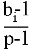

is a cyclical sequence of *p*-1 distinct numbers in the range 0 to 1 (excluding
1). By choosing *a* suitably, these can be made to look fairly random.

65537 is a Fermat prime, 2l6+1. Because the multiplicative group of non-zero
residues modulo 65537 has a power of 2 as its order, a residue is a primitive
root if and only if it is not a quadratic residue. Use Gauss' law of quadratic
reciprocity to show that 75 is a primitive root modulo 65537.


The ZX Spectrum uses *p*=65537 and *a*=75, and stores some *bi*-l in memory. **RND**
entails replacing *bi*-1 in memory by *bi+*1 -1, and yielding the result
(*bi+*1-l) (*p*-l). **RANDOMIZE** n (with 1<=n<=65535) makes *bi* equal to n+1.

**RND** is approximately uniformly distributed over the range 0 to 1.

 

 

 
[&uarr; Contents](#Contents) | [&larr; CHAPTER 11 (Random numbers) ](#Chapter11) |  [&rarr; Chapter 13 (Conditions) ](#Chapter13)

## <a name ="Chapter12"><a/>  CHAPTER 12 ##

### Arrays ###

 
#### Summary ####

**Arrays** (the way the ZX Spectrum handles string arrays is slightly
non-standard).

**DIM** . . .

Suppose you have a list of numbers, for instance the marks of ten people in a
class. To store them in the computer you could set up a single variable for each
person. but you would find them very awkward. You might decide to call the
variable Bloggs 1, Bloggs 2, and so on up to Bloggs 10, but the program to set
up these ten numbers would be rather long and boring to type in.

How much nicer it would be if you could type this:
 
```
5 REM this program will not work
10 FOR n=1 TO 10
20 READ Bloggs n
30 NEXT n
40 DATA 10,2,5,19,16,3,11,1,0,6
```

Well you can't.

However, there is a mechanism by which you can apply this idea, and it uses
*arrays*. An array is a set of variables, its elements, all with the same name,
and distinguished only by a number (the subscript) written in brackets after the
name. In our example the name could be *b* (like control variables of **FOR** - **NEXT**
loops, the name of an array must be a single letter), and the ten variables
would then be *b*(l), *b*(2), and so on up to *b*(l0).

The elements of an array are called *subscripted* variables, as opposed to the
simple variables that you are already familiar with.

Before you can use an array, you must reserve some space for it inside the
computer, and you do this using a **DIM** (for dimension) statement.

**DIM b(10)**

sets up an array called *b* with dimension 10 (i.e. there are 10 subscripted
variables *b*(1),...,*b*(10)) and initializes the 10 values to 0. It also
deletes any array called b that existed previously. (But not a simple variable.
An array and a simple numerical variable with the same name can coexist, and
there shouldn't be any confusion between them because the array variable always
has a subscript).

The subscript can be an arbitrary numerical expression, so now you can write
 
```
10 FOR n=1 TO 10
20 READ b(n)
30 NEXT n
40 DATA 10,2,5,19,16,3,11,1,0,6
```

You can also set up arrays with more than one dimension. In a two dimensional
array you need two numbers to specify one of the elements - rather like the line
and column numbers to specify a character position on the television screen - so
it has the form of a table. Alternatively, if you imagine the line and column
numbers (two dimensions) as referring to a printed page, you could have an extra
dimension for the page numbers. Of course, we are talking about numeric arrays;
so the elements would not be printed characters as in a book, but numbers. Think
of the elements of a three-dimensional array *v* as being specified by *v* (page
number, line number, column number).


For example, to set up a two-dimensional array c with dimensions 3 and 6, you
use a **DIM** statement

**DIM c(3,6)**

This then gives you 3\*6=18 subscripted variables

**c(1 ,1),c(1 ,2), . . .,c(1,6)**

**c(2, 1 ),c(2,2), . . .,c(2,6)**

**c(3, 1 ),c(3,2), . . .,c(3,6)**

The same principle works for any number of dimensions.

Although you can have a number and an array with the same name, you cannot have
two arrays with the same name, even if they have different numbers of
dimensions.

There are also string arrays. The strings in an array differ from simple strings
in that they are of fixed length and assignment to them is always Procrustean -
chopped off or padded with spaces. Another way of thinking of them is as arrays
(with one extra dimension) of single characters. The name of a string array is a
single letter followed by $, and a string array and a simple string variable
cannot have the same name (unlike the case for numbers).

Suppose then, that you want an array a$ of five strings. You must decide how
long these strings are to be - let us suppose that 10 characters each is long
enough. You then say

**DIM a$(5,10)** (type this in)

This sets up a 5\*10 array of characters, but you can also think of each row as
being a string:

**a$(1)=a$(1,1) a$(1,2) . . . a$(1,10)**

**a$(2)=a$(2,1) a$(2,2) . . . a$(2,10)**

**: : : :**

**a$(5)=a$(5,1) a$(5,2) . . . a$(5,10)**

If you give the same number of subscripts (two in this case) as there were
dimensions in the **DIM** statement, then you get a single character; but if you
miss the last one out, then you get a fixed length string. So, for instance,
A$(2,7) is the 7th character in the string A$(2); using the slicing notation,
we could also write this as A$(2)(7). Now type

**LET a$(2)="1234567890"**

and

**PRINT a$(2),a$(2,7)**

For the last subscript (the one you can miss out), you can also have a slicer,
so that for instance

**a$(2,4 TO 8)=a$(2)(4 TO 8)="45678"**


Remember:

In a string array, all the strings have the same, fixed length. The **DIM**
statement has an extra number (the last one) to specify this length. When you
write down a subscripted variable for a string array, you can put in an extra
number, or a slicer, to correspond with the extra number in the **DIM**

statement. You can have string arrays with no dimensions. Type

**DIM a$(10)**

and you will find that a$ behaves just like a string variable, except that it
always has length 10, and assignment to it is always procrustean.

#### Exercises ####


1. Use **READ** and **DATA** statements to set up an array m$ of twelve strings in
which m$(n) is the name of the nth month. (Hint: the **DIM** statement will be **DIM**
m$(12,9). Test it by printing out all the mS(n) (use a loop).

Type

**PRINT "now is the month of ";m$(5);"ing";" when merry lads are playing"**

What can you do about all those spaces?

 

 

 
[&uarr; Contents](#Contents) | [&larr; CHAPTER 12 (Arrays) ](#Chapter12) |  [&rarr; Chapter 14 (The character set) ](#Chapter14)

## <a name ="Chapter13"><a/>  CHAPTER 13 ##

### Conditions ###

#### Summary ####

**AND, OR**

**NOT**

We saw in Chapter 3 how an **IF** statement takes the form

**IF** condition **THEN** . . .

The conditions there were the relations (=, \<, \>, \<=, \>= and \<\>), which
compare two numbers or two strings. You can also combine several of these, using
the logical operations, **AND**, **OR** and **NOT**.

One relation **AND** another relation is true whenever both relations are true, so
you could have a line like:

**IF a$="yes" AND x>0 THEN PRINT x**

in which x only gets printed if a$=''yes" and x\>0. The BASIC here is so close
to English that it hardly seems worth spelling out the:details. As in English,
you can join lots of relations together with **AND**, and then the whole lot is true
if all the individual relations are.

One relation **OR** another is true whenever at least one of the two relations is
true. (Remember that it is still true if both the relations are true; this is
something that English doesn't always imply.)

The **NOT** relationship turns things upside down. The **NOT** relation is true whenever
the relation is false, and false whenever it is true!

Logical expressions can be made with relations and **AND**, **OR** and **NOT**, just as
numerical expressions can be made with numbers and +, - and so on; you can even
put them in brackets if necessary. They have priorities in the same way as the
usual operations +, -, *, / and ­, do: **OR** has the lowest priority, then **AND**,
then **NOT**, then the relations, and the usual operations.

**NOT** is really a function, with an argument and a result, but its priority is
much lower than that of other functions. Therefore its argument does not need
brackets unless it contains **AND** or **OR** (or both). **NOT** a=b means the same as **NOT**
(a=b) (and the same as a<>b, of course).

<> is the negation of = in the sense that it is true if, and only if, = is
false. In other words,

**a<>b** is the same as **NOT a=b**

and also

**NOT a<>b** is the same as **a=b**

Persuade yourself that >= and <= are the negations of < and > respectively:
thus you can always get rid of **NOT** from in front of a relation by changing the
relation.

Also,

**NOT** (a first logical expression **AND** a second)

is the same as

**NOT** (the first) **OR NOT** (the second)

and

**NOT** (a first logical expression **OR** a second)

is the same as

**NOT** (the first) **AND NOT** (the second).

Using this you can work **NOT**s through brackets until eventually they are all
applied to relations, and then you can get rid of them. Logically speaking, **NOT**
is unnecessary, although you might still find that using it

makes a program clearer.

The following section is quite complicated, and can be skipped by the
fainthearted!

Try

```
PRINT 1=2,1 < >2
```

which you might expect to give a syntax error. In fact, as far as the
computer is concerned, there is no such thing as a logical value: instead
it uses ordinary numbers, subject to a few rules.

* (i) =, <, >, <=, >= and <> all give numeric results: 1 for true, and 0 for
false. Thus the **PRINT** command above printed 0 for '1=2', which is false, and 1
for '1<>2', which is true.

* (ii) In

**IF** condition **THEN** . . .

the condition can be actually any numeric expression. If its value is 0, then it
counts as false, and any other value lincluding the value of 1 that a true
relation gives) counts as true. Thus the **IF** statement means exactly the same as

**IF** condition **<>0 THEN** . . .


* (iii) **AND**, **OR** and **NOT** are also number-valued operations.

*x* **AND** *y* has the value {*x* if *y* is true (non-zero) / {0 (false). if *y* is false (zero)

*x* **OR** *y* has the value {1 (true), if *y* is true (non zero) / {*x*, if *y* is false (zero)

**NOT** *x* has the value {0 (false), if *x* is true (non-zero) / {1 (true), if *x* is false (zero)

(Notice that 'true' means 'non-zero' when we're checking a given value, but it
means '1' when we're producing a new one.)

Read through the chapter again in the light of this revelation, making sure that
it all works.

In the expressions **x AND** y, **x OR** y and **NOT x**, **x** and **y** will usually take the
values 0 and 1 for false and true. Work out the ten different combinations (four
for **AND**, four for **OR** and two for **NOT**) and check that 
they do what the chapter leads you to expect them to do.

Try this program:

```
10 INPUT a
20 INPUT b
30 PRINT (a AND a\>=b)+(b AND a\<b)
40 GO TO 10
```

Each time it prints the larger of the two numbers a and b. Convince yourself
that you can think of

**x **AND** y**

as meaning

**x** if **y** (else the result is 0)

and of

**x OR y**

as meaning

**x** unless **y** (in which case the result is 1)

An expression using **AND** or **OR** like this is called a conditional expression. An
example using **OR** could be

**LET total price=price less tax\*(1.15 OR v$="zero rated")**

Notice how **AND** tends to go with addition (because its default value is 0), and
**OR** tends to go with multiplication (because its default value is 1).

You can also make string valued conditional expressions, but only using **AND**.

**x$ AND y** has the value {x$ if y is non-zero / {"" if y is zero

so it means x$ if y (else the empty string).

Try this program, which inputs two strings and puts them in alphabetical order.

 
```
10 INPUT "type in two strings"'a$,b$
20 IF a$\>b$ THEN LET c$=a$: LET a$=b$: LET b$=c$
30 PRINT a$;" ";("\<" AND a$\<b$)+("=" AND a$=b$);" ";b$
40 GO TO 10
```

#### Exercise ####

 

1. BASIC can sometimes work along different lines from English. Consider, for
instance, the English clause 'If *a* doesn't equal *b* or *c*'. How would you
write this in BASIC? The answer is not

**IF A<>B **OR** C**

nor is it

**IF A<>B OR A<>C**

 

 


 
[&uarr; Contents](#Contents) | [&larr; CHAPTER 13 (Conditions) ](#Chapter13) |  [&rarr; Chapter 15 (More about PRINT and INPUT) ](#Chapter15)

 

## <a name ="Chapter14"><a/> CHAPTER 14 ##

### The Character Set ###

#### Summary ####

**CODE**, **CHR$**

**POKE**, **PEEK**

**USR**

**BIN**

 

The letters, digits, punctuation marks and so on that can appear in strings are
called characters, and they make up the alphabet, or *character set*, that the
ZX Spectrum uses. Most of these characters are single *symbols*, but there are
some more, called *tokens*, that represent whole words, such as **PRINT**, **STOP**,
**<>** and so on.

There are 256 characters, and each one has a code between 0 and 255. There is a
complete list of them in Appendix A. To convert between codes and characters,
there are two functions, **CODE** and **CHR$**.

**CODE** is applied to a string, and gives the code of the first character in the
string (or 0 if the string is empty).

**CHR$** is applied to a number, and gives the single character string whosecode is
that number.

This program prints out the entire character set:

```
10 FOR a=32 TO 255: PRINT CHRS a;: NEXT a
```

At the top you can see a space, 15 symbols and punctuation marks, the ten
digits, seven more symbols, the capital letters, six more symbols, the lower
case letters and five more symbols. These are all (except £ and ©) taken from a
widely-used set of characters known as ASCII (standing for American Standard
Codes for Information Interchange); ASCII also assigns numeric codes to these
characters, and these are the codes that the ZX Spectrum uses.


The rest of the characters are not part of ASCII, and are peculiar to the ZX
Spectrum. First amongst them are a space and 15 patterns of black and white
blobs. These are called the *graphics* symbols and can be used for drawing
pictures. You can enter these from the keyboard, using what is called graphics
mode. If you press **GRAPHICS** (CAPS SHIFT with 9) then the cursor will change to
**G**. Now the keys for the digits 1 to 8 will give the graphics symbols: on
their own they give the symbols drawn on the keys; and with either shift pressed
they give the same symbol but inverted, i.e. black becomes white, and vice
versa.

Regardless of shifts, digit 9 takes you back to normal (**L**) mode and digit 0
is DELETE.

Here are the sixteen graphics symbols:


After the graphics symbols, you will see what appears to be another copy of the
alphabet from A to U. These are characters that you can redefine yourself.
although when the machine is first switched on they are set as letters - they
are called *user-defined* graphics. You can type these in from the keyboard by
going into graphics mode, and then using the letters keys from A to U.

To define a new character for yourself, follow this recipe - it defines a
character to show .

* (i) Work out what the character looks like. Each character has an 8x8 square of
dots, each of which can show either the paper colour or the ink colour (see the
introductory booklet). You'd draw a diagram something like this, with black
squares for the ink colour:


We've left a 1 square margin round the edge because the other letters all have
one (except for lower case letters with tails, where the tail goes right down to
the bottom).

 
* (ii) Work out which user-defined graphic is to show n- let's say the one
corresponding to P, so that if you press P in graphics mode you get .

* (iii) Store the new pattern. Each user-defined graphic has its pattern stored as
eight numbers, one for each row. You can write each of these numbers as **BIN**
followed by eight 0's or 1 's - 0 for paper, 1 for ink - so that the eight
numbers for our  character are

**BIN 00000000** <BR>
**BIN 00000000** <BR>
**BIN 00000010** <BR>
**BIN 00111100** <BR>
**BIN 01010100** <BR>
**BIN 00010100** <BR>
**BIN 00010100** <BR>
**BIN 00000000** <BR>

(If you know about binary numbers, then it should help you to know that BIN is
used to write a number in binary instead of the usual decimal.)

These eight numbers are stored in memory, in eight places, each of which has an
address. The address of the first byte, or group of eight digits, is **USR** "P" (P
because that is what we chose in (ii)), that of the second is **USR** "P"+1, and so
on up to the eighth, which has address **USR** "P"+7.

**USR** here is a function to convert a string argument into the address of the
first byte in memory for the corresponding user-defined graphic. The string
argument must be a single character which can be either the user-defined graphic
itself or the corresponding letter (in upper or lower case). There is another
use for **USR**, when its argument is a number, which will be dealt with.

Even if you don't understand this, the following program will do it for you:

```
10 FOR n=0 TO 7
20 INPUT row: POKE USR "P"+n,row
30 NEXT n
```

It will stop for **INPUT** data eight times to ailow you to type in the eight BIN
numbers above - type them in the right order, starting with the top row.

The **POKE** statement stores a number directly in memory location, bypassing the
mechanisms normally used by the BASIC. The opposite of **POKE** is **PEEK**, and this
allows us to look at the contents of a memory location although it does not
actually alter the contents of that location. They will be dealt with properly
in Chapter 24.

After the user-defined graphics come the tokens.

You will have noticed that we have not printed out the first 32 characters, with
codes 0 to 31. These are *control* characters. They don't produce anything
printable, but have some less tangible effect on the television, or they are
used for controlling something other than the television, and the television
prints ? to show that it doesn't understand them. They are described more fully
in Appendix A.

Three that the television uses are those with codes 6, 8 and 13; on the whole,
**CHR$** 8 is the only one you are likely to find useful.

**CHR$** 6 prints spaces in exactly the same way as a cornma does in a **PRINT**
statement for instance

```
PRINT 1; **CHR$** 6;2
```

does the same as

```PRINT 1,2```

Obviously this is not a very clear way of using it. A more subtle way is to say

```
LET a$="1"+CHR$ 6+"2"
PRINT a$
```
**CHR$** 8 is 'backspace': it moves the print position back one place - try

```PRINT "1234"; CHR$ 8;"5"```

which prints up 1235

**CHR$** 13 is 'newline': it moves the print position on to the beginning of the
next line.

The television also uses those with codes 16 to 23; these are explained in
Chapters 15 and 16. All the control characters are listed in Appendix A.

Using the codes for the characters we can extend the concept of 'alphabetical
ordering' to cover strings containing any characters, not just letters. If
instead of thinking in terms of the usual alphabet of 26 letters we use the
extended alphabet of 256 characters, in the same order as their codes, then the
principle is exactly the same. For instance, these strings are in their ZX
Spectrum alphabetical order. (Notice the rather odd feature that lower case
letters come after all the capitals: so "a" comes after "Z"; also, spaces
matter.)

**CHR$ 3+"ZOOLOGICAL GARDENS"**

**CHR$ 8+"AARDVARK HUNTING"**

**"AAAARGH!"**

**"(Parenthetical remark)"**

**"100"**

**"129.95 inc. VAT"**

**"AASVOGEL"**

**"Aardvark"**

**"PRINT"**

**"Zoo"**

**"[interpolationl"**

**"aardvark"**

**"aasvogel"**

**"zoo"**

**"zoology**

Here is the rule for finding out which order two strings come in. First, compare
the first characters. If they are different, then one of them has its code less
than the other, and the string it came from is the earlier (lesser) of the two
strings. If they are the same, then go on to compare the next characters. If in
this process one of the strings runs out before the other, then that string is
the earlier, otherwise they must be equal.

The relations =, <, >, <=, >= and <> are used for strings as well as for
numbers: < means 'comes before' and > means 'comes after', so that

**"AA man"<"AARDVARK"**

**"AARDVARK">"AA man"**

are both true.

<= and >= work the same way as they do for numbers, so that

**"The same string"<="The same string"**

is true, but

**"The same string"<"The same string"**

is false.

Experiment on all this using the program here, which inputs two strings and puts
them in order.

```
10 INPUT "Type in two strings:", a$, b$
20 IF a$>b$ THEN LET c$=a$: LET a$=b$: LET b$=c$
30 PRINT a$;" ";
40 IF a$\<b$ THEN PRINT "\<";: GO TO 60
50 PRINT "="
60 PRINT " ";b$
70 GO TO 10
```

Note how we have to introduce c$ in line 20 when we swap over a$ and b$,

**LET a$=b$: LET b$=a$**

would not have the desired effect.

This program sets up user-defined graphics to show chess pieces:

**P** for pawn

**R** for rook

**N** for knight

**B** for bishop

**K** for king

**Q** for queen


Chess pieces:

```
5 LET b=BIN 01111100: LET c=BIN 00111000: LET d=BIN 00010000
10 FOR n=1 TO 6: READ p$: REM 6 pieces
20 FOR f=0 TO 7: REM read piece into 8 bytes
30 READ a: POKE USR p$+f,a
40 NEXT f
50 NEXT n
100 REM bishop
110 DATA "b",0,d, BIN 00101000,BIN 01000100
120 DATA BIN 01101100,c,b,0
130 REM king
140 DATA "k",0,d,c,d
150 DATA c, BIN 01000100,c,0
160 REM rook
170 DATA "r",0, BIN 01010100,b,c
180 DATA c,b,b,0
190 REM queen
200 DATA "q",0, BIN 01010100, BIN 00101000,d
210 DATA BIN 01101100,b,b,0
220 REM pawn
230 DATA "p",0,0,d,c
240 DATA c,d,b,0
250 REM knight
260 DATA "n",0,d,c, BIN 01111000
270 DATA BIN 00011000,c,b,0
```
 
Note that 0 can be used instead of BIN 00000000.

When you have run the program, look at the pieces by going into graphics mode.

 

#### Exercises ####

1. Imagine the space for one symbol divided up into four quarters like a
Battenburg cake. Then if each quarter can be either black or white, there are
2x2x2x2=16 possibilities. Find them all in the character set.

2. Run this program:

```
10 INPUT a
20 PRINT CHR$ a;
30 GO TO 10
```
 
If you experiment with it, you'll find that CHR$ a is rounded to the nearest
whole number; and if a is not in the range 0 to 255 then the program stops with
error report **B integer out of range**.

3. Which of these two is the lesser?

**"EVIL"**

**"evil"**

4. Work out how to modify the program to set up user-defined graphics so that it
uses **READ** and **DATA** statements instead of the **INPUT** statement.

 

 

 
[&uarr; Contents](#Contents) | [&larr; CHAPTER 14 (The character set) ](#Chapter14) |  [&rarr; Chapter 16 (Colours) ](#Chapter16)

## <a name ="Chapter15"><a/>  CHAPTER 15 ##

### More about **PRINT** and **INPUT** ###

#### Summary ####

**CLS**

**PRINT** items: nothing at all

**Expressions** (numeric or string type): **TAB** numeric expression, **AT** numeric expression, numeric expression**

**PRINT** separators: , ; '

**INPUT items: variables (numeric or string type)**

**LINE** string variable

Any **PRINT** item not beginning with a letter. (Tokens are not considered as
beginning with a letter.)**

Scrolling

**SCREEN$**

 

You have already seen **PRINT** used quite a lot, so you will have a rough idea of
how it is used. Expressions whose values are printed are called **PRINT** *items*,
and they are separated by commas or semicolons, which are called **PRINT**
*separators*. A **PRINT** item can also be nothing at all, which is a way of
explaining what happens when you use two commas in a row.

There are two more kinds of **PRINT** items, which are used to tell the computer not
what, but where to print. For example **PRINT AT 11,16;"\*"** prints a star in the
middle of the screen.

**AT line, column**

moves the **PRINT** position (the place where the next item is to be printed) to the
line and column specified. Lines are numbered from 0 (at the top) to 21, and
columns from 0 (on the left) to 31.

SCREEN$ is the reverse function to **PRINT AT**, and will tell you (within limits)
what character is at a particular position on the screen. It uses line and
column numbers in the same way as **PRINT AT**, but enclosed in brackets: for
instance

**PRINT SCREEN$ (11,16)**

will retrieve the star you printed in the paragraph above.

Characters taken from tokens print normally, as single characters, and spaces
return as spaces. Lines drawn by **PLOT**, **DRAW** or **CIRCLE**, user-defined characters
and graphics characters return as a null (empty) string, however. The same
applies if **OVER** has been used to create a composite character.

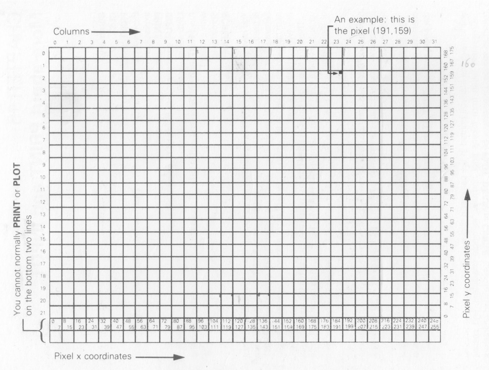

**TAB column**

prints enough spaces to move the **PRINT** position to the column specified. It
stays on the same line. or, if this would involve backspacing, moves on to the
next one. Note that the computer reduces the column number 'modulo 32' (it
divides by 32 and takes the remainder); so **TAB** 33 means the same as **TAB** 1.

As an example,

**PRINT TAB 30;1;TAB 12;"Contents"; AT 3,1;"CHAPTER";TAB 24;"page"**

is how you might print out the heading of a contents page on page 1 of a book.

Try running this:

```
10 FOR n=8 TO 23
20 PRINT TAB 8\*n;n;
30 NEXT n
```

This shows what is meant by the **TAB** numbers being reduced modulo 32.

For a more elegant example, change the 8 in line 20 to a 6.

Some small points:
 
(i) These new items are best terminated with semicolons, as we have done above.
You can use commas (or nothing, at the end of the statement), but this means
that after having carefully set up the **PRINT** position you immediately move it on
again not usually terribly useful.

(ii) You cannot print on the bottom two lines (22 and 23) on the screen because
they are reserved for commands, **INPUT** data, reports and so on. References to
'the bottom line' usually mean line 21.

(iii) You can use **AT** to put the **PRINT** position even where there is already
something printed; the old stuff will be obliterated when you print more.

Another statement connected with **PRINT** is **CLS**. This clears the whole screen,
something that is also done by **CLEAR** and **RUN**.

When the printing reaches the bottom of the screen, it starts to scroll upwards
rather like a typewriter. You can see this if you do

```
CLS: FOR n=1 TO 22: PRINT n: NEXT n
```
and then do

```
PRINT 99
```

a few times.

If the computer is printing out reams and reams of stuff, then it takes great
care to make sure that nothing is scrolled off the top of the screen until you
have had a chance to look at it properly. You can see this happening if you type

**CLS: FOR n=1 TO 100: PRINT n: NEXT n**

When it has printed a screen full, it will stop, writing **scroll?** at the
bottom of the screen. You can now inspect the first 22 numbers at your leisure.
When you have finished with them, press y (for 'yes') and the computer will give
you another screen full of numbers. Actually, any key will make the computer
carry on except n (for 'no'), STOP (**SYMBOL SHIFT** and a), or SPACE (the BREAK
key). These will make the computer stop running the program with a report **D
BREAK - CONT repeats**.

The **INPUT** statement can do much more than we have told you so far. You have
already seen **INPUT** statements like

**INPUT "How old are you?", age**

in which the computer prints the caption How old are you? at the bottom of the
screen, and then you have to type in your age.

In fact, an **INPUT** statement is made up of items and separators in exactly the
same way as a **PRINT** statement is, so How old are you? and age are both **INPUT**
items. **INPUT** items are generally the same as **PRINT** items, but there are some
very important differences.

First, an obvious extra **INPUT** item is the variable whose value you are to type
in age in our example above. The rule is that if an **INPUT** item begins with a
letter, it must be a variable whose value is to be input.

Second, this would seem to mean that you can't print out the values of variables
as part of a caption; however, you can get round this by putting brackets round
the variable. Any expression that starts with a letter must be enclosed in
brackets if it is to be printed as part of a caption.

Any kind of **PRINT** item that is not affected by these rules is also an **INPUT**
item. Here is an example to illustrate what's going on:

**LET my age = **INT** (RND \* 100): INPUT ("I am ";my age; ". ");"How old are
you?", your age**

*my age* is contained in brackets, so its value gets printed out. *your age* is
not contained in brackets, so you have to type its value in.

Everything that an **INPUT** statement writes goes to the bottom part of the screen,
which acts somewhat independently of the top half. In particular, its lines are
numbered relative to the top line of the bottom half, even if this has moved up
the actual television screen (which it does if you type lots and lots of **INPUT**
data).
 
To see how **AT** works in **INPUT** statements, try running this:

**10 INPUT "This is line 1.",a$; AT 0,0;"This is line 0.",a$; AT 2,0;**

**"This is line 2.",a$; AT 1,0; "This is still line 1.",a$**

(just press ENTER each time it stops.) When This is line 2. is printed, the
lower part of the screen moves up to make room for it; but the numbering moves
up as well, so that the lines of text keep their same numbers.

Now try this:
 
```
10 FOR n=0 TO 19: PRINT AT n,0;n;: NEXT n

20 **INPUT** AT 0,0;a$; AT 1,0;a$; AT 2,0;a$; AT 3,0;a$; AT 4,0;a$; AT
5,0;a$;
```

As the lower part of the screen goes up and up, the upper part is undisturbed
until the lower part threatens to write on the same line as the **PRINT** position.
Then the upper part starts scrolling up to avoid this.

Another refinement to the INPUT statement that we haven't seen yet is called
LINE input and is a different way of inputting string variables. If you write
LINE before the name of a string variable to be input, as in

**INPUT LINE a$**

then the computer will not give you the string quotes that it normally does for
a string variable, although it will pretend to itself that they are there. So if
you type in

**cat**

as the **INPUT** data, a$ will be given the value cat. Because the string quotes do
not appear on the string, you cannot delete them and type in a different sort of
string expression for the **INPUT** data. Remember that you cannot use LINE for
numeric variables.

The control characters **CHR$** Z and **CHR$** 23 have effects rather like **AT** and **TAB**.
They are rather odd as control characters, because whenever one is sent to the
television to be printed, it must be followed by two more characters that do not
have their usual effect: they are treated as numbers (their codes) to specify
the line and column (for **AT**) or the tab position (for **TAB**). You will almost
always find it easier to use **AT** and **TAB** in the usual way rather than the control
characters, but they might be useful in some circumstances. The **AT** control
character is **CHR$** 22. The first character after it specifies the line number
and the second the column number, so that

**PRINT CHR$ 22+CHR$ 1 +CHR$ c;**

has exactly the same effect as

**PRINT AT 1,c;**

This is so even if **CHR$** 1 or **CHR$** c would normally have a different meaning
(for instance if c=13); the **CHR$** 22 before them overrides that.

The **TAB** control character is **CHR$** 23 and the two characters after it are used
to give a number between 0 and 65535 specifying the number you would have in a
**TAB** item:

**PRINT CHRS 23+CHRS a+CHRS b;**

has the same effect as

**PRINT TAB a+256\*b;**

You can use **POKE** to stop the computer asking you **scroll?** by doing


**POKE 23692,255**

every so often. After this it will scroll up 255 times before stopping with
**scroll?**. As an example, try

```
10 FOR n=0 TO 10000
20 PRINT n: POKE 23692,255
30 NEXT n
```

and watch everything whizz off the screen!

 

#### Exercises ####

 

1. Try this program on some children, to test their multiplication tables.

```
10 LET m$=" "
20 LET a=INT (RND*12)+1: LET b=lNT (RND*12)+1
30 INPUT (m$) ' ' "what is ";(a) ";(b);"?";c
100 IF c=a-b THEN LET m$="Right.": GO TO 20
110 LET m$=''Wrong. Try again.": GO TO 30
```
 
If they are perceptive, they might manage to work out that they do not have to
do the calculation themselves. For instance, if the computer asks them to type
the answer to 2\*3, all they have to type in is 2\*3.

One way of getting round this is to make them input strings instead of numbers.
Replace c in line 30 by c$. and in line 100 by **VAL** c$, and insert a line

```
40 IF c$ <> STR$ **VAL** c$ THEN LET m$="Type it properly, as a number,":GO TO 30
```

That will fool them. After a few more days, however, one of them may discover
that they can get round this by rubbing out the string quotes and typing in
**STR$** (2\*3). To stop up this loophole, you can replace c$ in line 30 by LINE
c$.

 

 

 
[&uarr; Contents](#Contents) | [&larr; CHAPTER 15 (More about PRINT and INPUT) ](#Chapter15) |  [&rarr; Chapter 17 (Graphics) ](#Chapter17)

## <a name ="Chapter16"><a/>  CHAPTER 16 ##

### Colours ###

 
#### Summary ####

**INK**, **PAPER**, **FLASH**, **BRIGHT**, **INVERSE**, **OVER**
**BORDER**


Run this program:
 
```
10 FOR m=4 TO 1: BRIGHT m
20 FOR n=1 TO 14
30 FOR c=4 TO 7
40 PAPER c: PRINT " ";: REM 4 coloured spaces
50 NEXT c: NEXT n: NEXT m
60 FOR m=0 TO 1: BRIGHT m: PAPER 7
70 FOR c=0 TO 3
80 INK c: PRINT c;" ";
90 NEXT c: PAPER 0
100 FOR c=4 T0 7
110 INK c: PRINT c;" ";
120 NEXT c: NEXT m
130 PAPER 7: INK 0: BRIGHT 0
```
 
This shows the eight colours (including white and black) and the two levels of
brightness that the ZX Spectrum can produce on a colour television. (If your
television is black and white, then you will just see various shades of grey.)
Here is a list of them for reference; they are also written over the appropriate
number keys.

0 - black

1 - blue

2 - red

3 - purple, or magenta

4 - green

5 - pale blue, technically called cyan

6 - yellow

7 - white


On a black and white television, these numbers are in order of brightness.

To use these colours properly, you need to understand a bit about how the
picture is arranged.

The picture is divided up into 768 (24 lines of 32) positions where characters
can be printed, and each character is printed as an 8x8 square of dots like that
below for a. This should remind you of the user-defined graphics in Chapter 14,
where we had 0s for the white dots and 1s for the black dots.

 


The character position also has associated with it two colours: the ink, or
foreground colour, which is the colour for the black dots in our square, and the
paper, or background colour, which is used for the white dots. To start off
with, every position has black ink and white paper so writing appears as black
on white.

The character position also has a brightness (normal or extra bright) and
something to say whether it flashes or not - flashing is done by swapping the
ink and paper colours. This can all be coded into numbers, so a character
position then has
 

(i) an 8x8 square of 0s and 1 s to define the shape of the character, with 0 for
paper and 1 for ink,

(ii) ink and paper colours, each coded into a number between 0 and 7,

(iii) a brightness - 0 for normal, 1 for extra bright and

(iv) a flash number - 0 for steady, 1 for flashing.


Note that since the ink and paper colours cover a whole character position, you
cannot possibly have more than two colours in a given block of 64 dots. The same
goes for the brightness and flash number: they refer to the whole character
position, not individual dots. The colours, brightness and flash number at a
given position are called attributes.

When you print something on the screen, you change the dot pattern at that
position; it is less obvious, but still true, that you also change the
attributes at that position. To start off with you do not notice this because
everything is printed with black ink on white paper (and normal brightness and
no flashing), but you can vary this with the **INK**, **PAPER**, **BRIGHT** and **FLASH**
statements. Try

**PAPER 5**

and then print a few things: they will all appear on cyan paper, because as they
are printed the paper colours at the positions they occupy are set to cyan
(which has code 5).

The others work the same way, so after

**PAPER** number between 0 and 7

**INK** number between 0 and 7

**BRIGHT** 0 or 1 } Think of 0 as off or } and 1 as on

**FLASH** 0 or 1 }


any printing will set the corresponding attribute at all the character positions
it uses. Try some of these out. You should now be able to see how the program at
the beginning worked (remember that a space is a character that has **INK** and
**PAPER** the same colour).

There are some more numbers you can use in these statements that have less
direct effects.

8 can be used in all four statements, and means 'transparent' in the sense that
the old attribute shows through. Suppose, for instance, that you do

**PAPER 8**

No character position will ever have its paper colour set to 8 because there is
no such colour; what happens is that when a position is printed on, its paper
colour is left the same as it was before. **INK 8**, **BRIGHT 8** and **FLASH 8** work the
same way for the other attributes.

9 can be used only with **PAPER** and **INK**, and means 'contrast'. The colour (ink or
paper) that you use it with is made to contrast with the other by being made
white if the other is a dark colour (black, blue, red or magenta), and black if
the other is a light colour (green, cyan, yellow or white).

Try this by doing

```
INK 9: FOR c=0 TO 7: PAPER c: PRINT c: NEXT c
```

A more impressive display of its power is to run the program at the beginning to
make coloured stripes, and then doing

```
INK 9: PAPER 8: PRINT AT 0,8;: FOR n=l TO 1080: PRINT n;: NEXT n
```

The ink colour here is always made to contrast with the old paper colour at each
position.

Colour television relies on the rather curious fact that the human eye can only
really see three colours - the primary colours, blue, red and green. The other
colours are mixtures of these. For instance, magenta is made by mixing blue with
red - which is why its code, 3, is the sum of the codes for blue and red.

To see how all eight colours fit together, imagine three rectangular spotlights,
coloured blue, red and green, shining at not quite the same place on a piece of
white paper in the dark. Where they overlap you will see mixtures of colours, as
shown by this program (note that ink spaces are obtained by using either SHIFT
with 8 when in G mode):

```
10 BORDER 0: PAPER 0: INK 7: CLS
20 FOR a=1 TO 6
30 PRINT TAB 6; INK 1; "": REM 18 ink squares
40 NEXT a
50 LET dataline=20
60 GO SUB 1000
70 LET dataline=210
80 GO SUB 1000
90 STOP
200 DATA 2,3,7,5,4
210 DATA 2,2,6,4,4
1000 FOR a=1 TO 6
1010 RESTORE dataline
1020 FOR b=1 TO 5
1030 READ c: PRINT INK c;"";: REM 6 ink squares
1040 NEXT b: PRINT: NEXT a
1050 RETURN
```

There is a function called **ATTR** that finds out what the attributes are at a
given position on the screen. It is a fairly complicated function, so it has
been relegated to the end of this chapter.

There are two more statements, **INVERSE** and **OVER**, which control not the
attributes, but the dot pattern that is printed on the screen. They use the
numbers 0 for off and 1 for on in the same way as **FLASH** and **BRIGHT** do, but those
are the only possibilities. If you do **INVERSE** 1, then the dot patterns printed
will be the inverse of their usual form: paper dots will be replaced by ink dots
and vice versa. Thus a would be printed as


If (as at switch-on) we have black ink and white paper, then this a will appear
as white on black - but we still have black ink and white paper at that
character position. It is the dots that have changed.

The statement

**OVER 1**
 
sets into action a particular sort of overprinting. Normally when something is
written into a character position it completely obliterates what was there
before; but now the new character will simply be added in on top of the old one
(but see Exercise 1). This can be particularly useful for writing composite
characters, like letters with accents on them, as in this program to print out
German letters - an 'o' with an umlaut above it. (Do **NEW** first.)

```
10 OVER 1
20 FOR n=1 TO 32
30 PRINT "o"; CHRS 8;"""";
40 NEXT n
```

(notice the control character CHRS 8 which backs up one space.)

There is another way of using **INK**, **PAPER** and so on which you will probably find
more useful than having them as statements. You can put them as items in a **PRINT**
statement (followed by ;), and they then do exactly the same as they would have
done if they had been used as statements on their own, except that their effect
is only temporary: it lasts as far as the end of the PRINT statement that
contains them. Thus if you type

**PRINT PAPER 6;"x";: PRINT "y"**

then only the x will be on yellow.

**INK** and the rest when used as statements do not affect the colours of the lower
part of the screen, where commands and **INPUT** data are typed in. The lower part
of the screen uses the colour of the border for its paper colour and code 9 for
contrast for its **INK** colour, has flashing off, and everything at normal
brightness. You can change the border colour to any of the eight normal colours
(not 8 or 9) using statement

**BORDER** colour

When you type in **INPUT** data, it follows this rule of using contrasting ink on
border coloured paper; but you can change the colour of the captions written by
the computer by using **INK** and **PAPER** (and so on) items in the **INPUT** statement,
just as you would in a **PRINT** statement. Their effect lasts either to the end of
the statement, or until some **INPUT** data is typed in, whichever comes first. Try
 
**INPUT FLASH 1; INK 1;"What is your number?";n**
 
There is one more way of changing the colours by using control characters -
rather like the control characters for **AT** and **TAB** in Chapter 15.

**CHR$ 16** corresponds to **INK**

**CHR$ 17** corresponds to **PAPER**

**CHR$ 18** corresponds to **FLASH**

**CHR$ 19** corresponds to **BRIGHT**

**CHR$ 20** corresponds to **INVERSE**

**CHR$ 21** corresponds to **OVER**

These are each followed by one character that shows a colour by its code: so
(for instance)

**PRINT CHR$ 16+CHR$ 9; . . .**

has the same effect as

**PRINT INK 9; . . .**

On the whole, you would not bother to use these control characters because you
might just as well use the colour items. However, one very useful thing you can
do with them is put them in programs: this results in different parts being
listed in different colours, to set them apart from each other or even just to
look pretty. You must put them in after the line number, or they will just get
lost.

To get these into the program, you have to enter them from the keyboard, mostly
using extended mode with the digits.

The digits 0 to 7 set the corresponding colour- ink if **CAPS SHIFT** is also
pressed, paper if it is not. More precisely, if you are in E mode and you press
a digit (let us say 6 for yellow; at any rate it has to be between 0 and 7 - not
8 or 9) then two characters are inserted: first CHRS 17 for **PAPER**, and **CHR$** 6
meaning 'set it to yellow'. If you had been pressing **CAPS SHIFT** when you pressed
the digit, you would have got CHRS 16 meaning 'set ink colour' instead of CHRS
17.

Since these are two characters you can get some odd effects when you rub them
out - you must press DELETE twice, and after the first time you will often get a
question mark or even odder things appearing. Do not worry; just press DELETE
again.

**** and **** can also behave strangely while the cursor is moving past the
control characters.

Still in extended mode,

8 gives **CHR$** 19 and **CHR$** 0 for normal brightness

9 gives **CHR$** 19 and **CHR$** 1 for extra brightness

**CAPS SHIFT** with 8 gives **CHR$** 18 and **CHR$** 0 for no flashing

**CAPS SHIFT** with 9 gives **CHR$** 18 and **CHR$** 1 for flashing

There are a couple more in ordinary (L) mode:

**CAPS SHIFT** with 3 gives CHRS 20 and **CHR$** 0 for normal characters

**CAPS SHIFT** with 4 gives **CHR$** 20 and CHRS 1 for inverse characters
 
To summarize. here is a complete description of the top row on the keyboard:

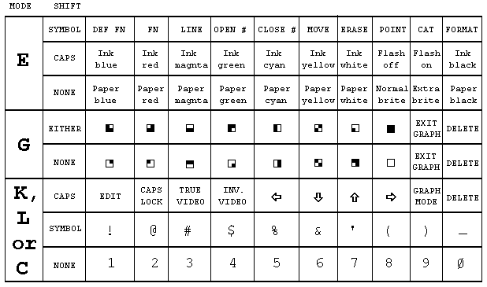


The **ATTR** function has the form

**ATTR** (line column)

Its two arguments are the line and column numbers that you would use in an **AT**
item, and its result is a number that shows the colours and so on at the
corresponding character position on the television screen You can use this as
freely in expressions as you can any other function.
 

The number that is the result is the sum of four other numbers as follows:

128 If the character position is flashing, 0 if it is steady

64 if the character position is bright, 0 if it is normal

8\* the code for the paper colour

the code for the ink colour


For instance, if the character position is flashing and normal with yellow paper
and blue ink then the four numbers that we have to add together are 128, 0,
8\*6=48 and 1, making 177 altogether. Test this with

```
PRINT AT 0,0; FLASH 1; PAPER 6; INK 1;" "; ATTR (0,0**
```
 

#### Exercises ####

1. Try

``` 
PRINT "B"; CHR$ 8; OVER 1;"/";
``` 
 
Where the / has cut through the B, it has left a white dot This is the way
overprinting works on the ZX Spectrum: two papers or two inks give a paper, one
of each gives an ink. This has the interesting property that if you overprint
with the same thing twice you get back what you started off with. If you now
type
 
``` 
PRINT CHR$ 8; OVER 1;"r'
``` 

why do vou recover an unblemished B?

 
``` 
PAPER 0: INK 0
``` 
 

\- isn't it just as well that these don't affect the lower part of the screen?
Now type
 
``` 
BORDER 0
``` 

and see how well the computer looks after you!

3. Run this program:
 
``` 
10 POKE 22527+RND\*704, RND\*127
20 GO TO 10
``` 
 
Never mind how this works; it is changing the colours of squares on the
television screen and the **RND**s should ensure that this happens randomly. The
diagonal stripes that you eventually see are a manifestation of the hidden
pattern in **RND** - the pattern that makes it pseudorandom instead of truly random.


4. Type or **LOAD** in the chess piece characters in Chapter 14, and then type in
this program which draws a diagram of a chess position using them.

 
``` 
5 REM draw blank board
10 LET bb=1: LET bw=2: REM red and blue for board
15 PAPER bw: INK bb: CLS
20 PLOT 79,128: REM border
30 DRAW 65,0: DRAW 0,-65
40 DRAW -65,0: DRAW 0,65
50 PAPER bb
60 REM board
70 FOR n=0 TO 3: FOR m=0 TO 3
80 PRINT AT 6+2\*n, 11+2\*m;" "
90 PRINT AT 7+2\*n, 10+2\*m;" "
100 NEXT m: NEXT n
110 PAPER 8
120 LET pw=6: LET pb=5: REM colours of white and black pieces
200 DIM b$ (8,8): REM positions of pieces
205 REM set up initial positions
210 LET b$(1)="rnbqkbnr"
220 LET bS(2)="pppppppp"
230 LET b$(7)= PPPPPPPP
240 LET b$(8)="RNBQKBNR"
300 REM display board
310 FOR n=1 TO 8: FOR m=1 TO 8
320 LET bc=CODE b$(n,m): INK pw
325 IF bc=CODE" " THEN GO TO 350: REM space
330 IF bc\>CODE "Z" THEN INK pb: LET bc=bc-32: REM lower case for black
340 LET bc=bc+79: REM convert to graphics
350 PRINT AT 5+n, 9+m; CHR$ bc
360 NEXT m: NEXT n
400 PAPER 7: INK 0
``` 

 

 


[&uarr; Contents](#Contents) | [&larr; CHAPTER 16 (Colours) ](#Chapter16) |  [&rarr; Chapter 18 (Motion) ](#Chapter18)

## <a name ="Chapter17"><a/>  CHAPTER 17 ##

### Graphics ###


#### Summary ####

**PLOT**, **DRAW**, **CIRCLE**

**POINT**

**pixels**


In this chapter we shall see how to draw pictures on the ZX Spectrum. The part
of the screen you can use has 22 lines and 32 columns, making 22\*32=704
character positions. As you may remember from Chapter 16, each of these
character positions is made of an 8 by 8 square of dots, and these are called
pixels (picture elements).
 
A pixel is specified by two numbers, its coordinates. The first, its *x*
coordinate, says how far it is across from the extreme left-hand column.
(Remember, *x* is a cross), the second, its *y* coordinate, says how far it is
up from the bottom (wise up). These coordinates are usually written as a pair in
brackets, so (0,0), (255,0), (0,175) and (255,175) are the bottom left-, bottom
right-, top left- and top right-corners.

The statement

**PLOT** *x* coordinate, *y* coordinate

inks in the pixel with these coordinates, so this measles program

```
10 PLOT INT (RND*256), INT(RND*176): INPUT a$: GO TO 10
```

plots a random point each time you press ENTER.

Here is a rather more interesting program. It plots a graph of the function **SIN**
(a sine wave) for values between 0 and 2.

```
10 FOR n=0 TO 255
20 PLOT n,88+80*SlN (n/128*PI)
30 NEXT n
```
 
This next program plots a graph of **SQR** (part of a parabola) between 0 and 4:
 
```
10 FOR n=0 TO 255
20 PLOT n,80*SQR (n/64)
30 NEXT n
```
 
Notice that pixel coordinates are rather different from the line and column in
an **AT** item. You may find the diagram in Chapter 15 useful when working out pixel
coordinates and line and column numbers.

To help you with your pictures, the computer will draw straight lines, circles
and parts of circles for you, using the **DRAW** and **CIRCLE** statements.

The statement **DRAW** to draw a straight line takes the form

**DRAW** *x*,*y*

The starting place of the line is the pixel where the last **PLOT**, **DRAW** or **CIRCLE**
statement left off (this is called the **PLOT** position; **RUN**, **CLEAR**, **CLS** and **NEW**
reset it to the bottom left hand corner, at (0,0)), and the finishing place is
*x* pixels to the right of that and *y* pixels up. The **DRAW** statement on its own
determines the length and direction of the line, but not its starting point.

Experiment with a few **PLOT** and **DRAW** commands, for instance

**PLOT 0,100: DRAW 80,-35**

**PLOT 90,150: DRAW 80,-35**

Notice that the numbers in a **DRAW** statement can be negative, although those in a
**PLOT** statement can't.

You can also plot and draw in colour, although you have to bear in mind that
colours always cover the whole of a character position and cannot be specified
for individual pixels. When a pixel is plotted, it is set to show the full ink
colour, and the whole of the character position containing it is given the
current ink colour. This program demonstrates this:

```
10 BORDER 0: PAPER 0: INK 7: CLS: REM black oue screen
20 LET x1=0: LET y1=0: REM start of line
30 LET c=1: REM for ink colour, starting blue
40 LET x2=lNT (RND\*256): LET y2=lNT (RND\*176):REM random finish of line
50 DRAW INK c;x2-x1,y2-y1
60 LET x1=x2: LET y1=y2: REM next line starts where last one finished
70 LET c=c+1: IF c=8 THEN LET c=1: REM new colour
80 GO TO 40
```

The lines seem to get broader as the program goes on, and this is because a line
changes the colours of all the inked in pixels of all the character positions
that it passes through. Note that you can embed **PAPER**, **INK**, **FLASH**, **BRIGHT**,
**INVERSE** and **OVER** items in a **PLOT** or **DRAW** statement just as you could with **PRINT**
and **INPUT**. They go between the key word and the coordinates, and are terminated
by either semicolons or commas.

An extra frill with **DRAW** is that you can use it to draw parts of circles instead
of straight lines, by using an extra number to specify an angle to be turned
through: the form is

**DRAW** x,y,a

*x* and *y* are used to specify the finishing point of the line just as before
and *a* is the number of radians that it must turn through as it goes - if *a*
is a positive it turns to the left, while if *a* is a negative it turns to the
right. Another way of seeing *a* is as showing the fraction of a complete circle
that will be drawn: a complete circle is 2n radians, so if a=  it will draw a
semicircle, if a=0 5\* a quarter of a circle, and so on.

For instance suppose a=. Then whatever values *x* and *y* take, a semicircle
will be drawn. Run

**10 PLOT 100,100: DRAW 50,50, Pl**

which will draw this:

finish at (150,150)


start at (100,100)

The drawing starts off in a south-easterly direction, but by the time it stops
it is going north-west: in between it has turned round through 180 degrees, or 
radians (the value of *a*).

Run the program several times, with Pl replaced by various other expressions
e.g. -PI, PI/2, 3\*PI/2, PI/4, 1,0.

The last statement in this chapter is the **CIRCLE** statement, which draws an
entire circle. You specify the coordinates of the centre and the radius of the
circle using

**CIRCLE** x coordinate, y coordinate, radius

Just as with **PLOT** and **DRAW**, you can put the various sorts of colour items in at
the beginning of a **CIRCLE** statement.


The POINT function tells you whether a pixel is ink or paper colour. It has two
arguments, the coordinates of the pixel (and they must be enclosed in brackets);
and its result is 0 if the pixel is paper colour, 1 if it is ink colour. Try

**CLS: PRINT POINT (0,0): PLOT 0,0: PRINT POINT (0,0)**

Type

**PAPER 7: INK 0**

and let us investigate how **INVERSE** and **OVER** work inside a **PLOT** statement. These
two affect just the relevant pixel, and not the rest of the character positions.
They are normally off (0) in a **PLOT** statement, so you only need to mention them
to turn them on (1).

Here is a list of the possibilities for reference:


**PLOT**; - this is the usual form. It plots an ink dot, i.e. sets the pixel to
show the ink colour.

**PLOT INVERSE 1**; - this plots a dot of ink eradicator, i.e. it sets the pixel
to show the paper colour.

**PLOT OVER 1**; - this changes the pixel over from whatever it was before: so
if it was ink colour it becomes paper colour, and vice versa.

**PLOT INVERSE 1; OVER 1**; - this leaves the pixel exactly as it was before;
but note that it also changes the **PLOT** position, so you might use it simply to
do that.

As another example of using the **OVER** statement fill the screen up with writing
using black on white, and then type

**PLOT 0,0: DRAW OVER 1;255,175**

This will draw a fairly decent line, even though it has gaps in it wherever it
hits some writing. Now do exactly the same command again. The line will vanish
without leaving any traces whatsoever. This is the great advantage of **OVER 1**. If
you had drawn the line using

**PLOT 0,0: DRAW 255,175**

and erased it using

**PLOT 0,0: DRAW INVERSE 1;255,175**

then you would also have erased some of the writing.


Now try

**PLOT 0,0: DRAW OVER 1;250,175**

and try to undraw it by


**DRAW OVER 1;-250,-175**

This doesn't quite work, because the pixels the line uses on the way back are
not quite the same as the ones that it used on the way down. You must undraw a
line in exactly the same direction as you drew it.

One way to get unusual colours is to speckle two normal ones together in a
single square, using a user-defined graphic. Run this program:
 
```
1000 FOR n=0 TO 6 STEP 2
1010 POKE USR "a"+n, BIN 01010101: POKE USR "a"+n+1, BIN 10101010
1020 NEXT n
```
which gives the user-defined graphic corresponding to a chessboard pattern. If
you print this character (graphics mode, then a) in red ink on yellow paper, you
will find it gives a reasonably acceptable orange.
 

#### Exercises ####

1. Play about with **PAPER**, **INK**, **FLASH** and **BRIGHT** items in a **PLOT** statement. These
are the parts that affect the whole of the character position containing the
pixel. Normally it is as though the **PLOT** statement had started off

**PLOT PAPER 8; FLASH 8; BRIGHT 8;** . . .

and only the ink colour of a character position is altered when something is
plotted there, but you can change this if you want.

Be especially careful when using colours with **INVERSE 1**. because this sets the
pixel to show the paper colour, but changes the ink colour and this might not be
what you expect.


2. Try to draw circles using **SIN** and **COS** (if you have read Chapter 10, try to
work out how). Run this:

```
10 FOR n=0 TO 2\*PI STEP Pl /180
20 PLOT 100+80\*COS n,87+80\*SlN n
30 NEXT n
40 CIRCLE 150,87,80
```

You can see that the **CIRCLE** statement is much quicker, even if less accurate.

3. Try

```
CIRCLE 100,87,80: DRAW 50,50
```

You can see from this that the **CIRCLE** statement leaves the **PLOT** position at a
rather indeterminate place - it is always somewhere about half way up the right
hand side of the circle. You will usually need to follow the **CIRCLE** statement
with a **PLOT** statement before you do any more drawing.

4. Here is a program to draw the graph of almost any function. It first asks you
for a number *n*; it will plot the values from *-n* to +*n*. It then asks you
for the function itself, input as a string. The string should be an expression
using *x* as the argument of the function.

```
10 PLOT 0,87: DRAW 255,0
20 PLOT 127,0: DRAW 0,175
30 INPUT s, e$
35 LET t=0
40 FOR f=0 TO 255
50 LET x=(f-128)\*s/128: LET y=VAL e$
60 IF ABS y\>87 THEN LET t=0: GO TO 100
70 IF NOT t THEN PLOT f,y+88: LET t=1: GO TO 100
80 DRAW 1,y-old y
100 LET old y=INT (y+.5)
110 NEXT f
```

Run it and, as an example, type in 10 for the number *n* and 10 * **TAN** *x* for the
function. It will plot a graph of tan *x* as *x* ranges from -10 to +10.

 

 

 
[&uarr; Contents](#Contents) | [&larr; CHAPTER 17 (Graphics) ](#Chapter17) |  [&rarr; Chapter 19 (BEEP) ](#Chapter19)

## <a name ="Chapter18"><a/>  CHAPTER 18 ##

### Motion ###


#### Summary ####

**PAUSE**, **INKEY$**, **PEEK**


 


Quite often you will want to make the program take a specified length of time,
and for this you will find the **PAUSE** statement useful.

**PAUSE** *n*

stops computing and displays the picture for *n* frames of the television (at 50
frames per second in Europe or 60 in America). *n* can be up to 65535, which
gives you just under 22 minutes; if *n*=0 then it means '**PAUSE** for ever'.

A pause can always be cut short by pressing a key (note that a CAPS SHlFTed
space will cause a break as well). You have to press the key down after the
pause has started.

This program works the second hand of a clock

```
10 REM First we draw the clock face
20 FOR n=1 TO 12
30 PRINT AT 10-10\*COS (n/6\*PI),16+10\*SIN (n/6\*PI);n
40 NEXT n
50 REM Now we start the clock
60 FOR t=0 TO 200000: REM t is the time in seconds
70 LET a=t/30\*PI: REM a is the angle of the second hand in radians
80 LET sx=80\*SIN a: LET sy=80\*COS a
200 PLOT 128,88: DRAW OVER 1;sx,sy: REM draw second hand
210 PAUSE 42
220 PLOT 128,88: DRAW OVER 1;sx,sy: REM erase second hand
400 NEXT t
```


This clock will run down after about 55.5 hours because of line 60, but you can
easily make it run longer. Note how the timing is controlled by line 210. You
might expect **PAUSE** 50 to make it tick one a second, but the computing takes a
bit of time as well and has to be allowed for. This is best done by trial and
error, timing the computer clock against a real one, and adjusting line 210
until they agree. (You can't do this very accurately; an adjustment of one frame
in one second is 2% or half an hour in a day.)

There is a much more accurate way of measuring time. This uses the contents of
certain memory locations. The data stored is retrieved by using **PEEK**. Chapter 25
explains what we're looking at in detail. The expression used is

**(65536\*PEEK 23674+256\*PEEK 23673+PEEK 23672)/50**

This gives the number of seconds since the computer was turned on (up to about 3
days and 21 hours, when it goes back to 0).

Here is a revised clock program to make use of this:

```
10 REM First we draw the clock face
20 FOR n=1 TO 12
30 PRINT AT 10-10\*COS (n/6\*PI),16+10\*SIN (n/6\*PI);n
40 NEXT n
50 DEF FN t()=lNT (65536\*PEEK 23674+256\*PEEK 23673+ PEEK 23672)/50):
REM number of seconds since start
100 REM Now we start the clock
110 LET t1=FN t()
120 LET a=t1/30\*PI: REM a is the angle of the second hand in radians
130 LET sx=72\*SIN a: LET sy=72\*COS a
140 PLOT 131,91: DRAW OVER 1;sx,sy: REM draw hand
200 LET t=FN t()
210 IF t\<=t1 THEN GO TO 200: REM wait until time for next hand
220 PLOT 131,91: DRAW OVER 1;sx,sy: REM rub out old hand
230 LET t1=t: GO TO 120
```

The internal clock that this methcd uses should be accurate to about .01% as
long as the computer is just running its program, or 10 seconds per day; but it
stops temporarily whenever you do **BEEP**, or a cassette tape operation, or use the
printer or any of the other extra pieces of equipment you can use with the
computer. All these will make it lose time.

The numbers **PEEK** 23674, **PEEK** 23673 and **PEEK** 23672 are held inside the computer
and used for counting in 50ths of a second Each is between 0 and 255, and they
gradually increase through all the numbers from 0 to 255; after 255 they drop
straight back to 0.

The one that increases most often is **PEEK** 23672. Every 1/50 second it increases
by 1. When it is at 255, the next increase takes it to 0, and at the same time
it nudges **PEEK** 23673 by up to 1. When (every 256/50 seconds) **PEEK** 23673 is
nudged from 255 to 0, it in turn nudges **PEEK** 23674 up by 1. This should be
enough to explain why the expression above works.

Now, consider carefully: suppose our three numbers are 0 (for **PEEK** 23674), 255
(for **PEEK** 23673) and 255 (for **PEEK** 23672). This means that it is about 21
minutes after switch-on - our expression ought to yield

**(65536\*0+256\*255+255)/50= 1 31 0.7**

But there is a hidden danger. The next time there is a 1/50 second count, the
three numbers will change to 1, 0 and 0. Every so often, this will happen when
you are half way through evaluating the expression: the computer would evaluate
**PEEK** 23674 as 0, but then change the other two to 0 before it can peek them. The
answer would then be

**(65536\*0+256\*0+0)l50=0**

which is hopelessly wrong.

A simple rule to avoid this problem is evaluate the expression twice in
succession and take the larger answer. If you look carefully at the program
above you can see that it does this implicitly.

Here is a trick to apply the rule. Define functions

```
10 DEF FN m(x,y)=(x+y+ABS (x-y))/2: REM the larger of x and y
20 DEF FN u()=(65536\*PEEK 23674+256\*PEEK 23673+PEEK 23672)/50: REM time, may be wrong
30 DEF FN t()=FN m(FN u(), FN u()): REM time, right
```

You can change the three counter numbers so that they give the real time instead
of the time since the computer was switched on. For instance, to set the time at
10.00am, you work out that this is 10\*60\*60\*50=1800000 fiftieths of a second,
and that

**1800000=65536\*27+256\*1 19+64**

To set the three numbers to 27, 119 and 64, you do

 **POKE 23674,27: POKE 23673,119: POKE 23672,64**

In countries with mains frequencies of 60 Hertz these programs must replace '50'
by '60' where appropriate.

The function INKEY$ (which has no argument) reads the keyboard. If you are
pressing exactly one key (or a SHIFT key and just one other key) then the result
is the character that that key gives in L mode; otherwise the result is the
empty string.

Try this program, which works like a typewriter.

```
10 IF INKEY$ \<\>"" THEN GO TO 10
20 IF INKEY$ ="" THEN GO TO 20
30 PRINT INKEY$;
40 GO TO 10
```

Here line 10 waits for you to lift your finger off the keyboard and line 20
waits for you to press a new key.

Remember that unlike **INPUT**, INKEY$ doesn't wait for you. So you don't type
ENTER, but on the other hand if you don't type anything at all then you've
missed your chance.
 

#### Exercises ####

1. What happens if you miss out line 10 in the typewriter program?

2. Another way of using **INKEY$** is in conjunction with **PAUSE**, as in this
alternative typewriter program.

```
10 PAUSE 0
20 PRINT INKEY$;
30 GO TO 10
```

To make this work, why is it essential that a pause should not finish if it
finds you already pressing a key when it starts?


3. Adapt the second hand program so that it also shows minute and hour hands,
drawing them every minute. If you're feeling ambitious, arrange so that every
quarter of an hour it puts on some kind of show - you could produce the Big Ben
chimes with **BEEP**. (See next chapter.)
 

4. (For sadists.) Try this:

```
10 IF INKEY$ ="" THEN GO TO 10
20 PRINT AT 11,14;"0UCH!"
30 IF INKEY$ \<\>"" THEN GO TO 30
40 PRINT AT 11,14;" "
50 GO TO 10
```
 

 

 
[&uarr; Contents](#Contents) | [&larr; CHAPTER 18 (Motion) ](#Chapter18) |  [&rarr; Chapter 20 (Tape Storage) ](#Chapter20)

## <a name ="Chapter19"><a/>  CHAPTER 19 ##

### BEEP ###

#### Summary ####
 
**BEEP**

 

If you haven't already discovered that the ZX Spectrum has a loudspeaker built
into it, read the Introductory booklet before carrying on.

 
The loudspeaker is sounded by using the **BEEP** statement,

**BEEP** *duration*, *pitch*

where, as usual, '*duration*' and '*pitch*' represent any numerical expressions.
The duration is given in seconds, and the pitch is given in semitones above
middle C using negative numbers for notes below middle C.

Here is a diagram to show the pitch values of all the notes in one octave on the
piano:
 
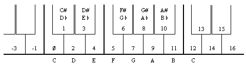

To get higher or lower notes, you have to add or subtract 12 for each octave
that you go up or down.


If you have a piano in front of you when you are programming a tune, this
diagram will probably be all that you need to work out the pitch values. If,
however, you are transcribing straight from some written music, then we suggest
that you draw a diagram of the stave with the pitch value written against each
line and space, taking the key into account.

For example, type:

```
10 PRINT "Frere Gustav"
20 BEEP 1,0: BEEP 1,2: BEEP .5,3: BEEP.5,2: BEEP 1,0
30 BEEP 1,0: BEEP 1,2: BEEP .5,3: BEEP.5,2: BEEP 1,0
40 BEEP 1,3: BEEP 1,5: BEEP 2,7
50 BEEP 1,3: BEEP 1,5: BEEP 2,7
60 BEEP .75,7: BEEP .25,8: BEEP .5,7: BEEP .5,5:BEEP .5,3: BEEP.5,2: BEEP 1,0
70 BEEP .75,7: BEEP .25,8: BEEP .5,7: BEEP .5,5: BEEP .5,3: BEEP .5,2: BEEP 1,0
80 BEEP 1,0: BEEP 1,-5: BEEP 2,0
90 BEEP l,0: BEEP 1,-5: BEEP 2,0
```

When you run this, you should get the funeral march from Mahler's first
symphony, the bit where the goblins bury the US Cavalry man.

Suppose for example that your tune is written in the key of C minor, like the
Mahler above. The beginning looks like this:

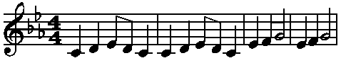 

and you can write in the pitch values of the notes like this:
 

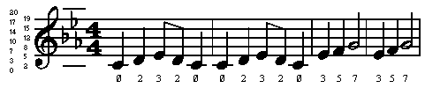

We have put in two ledger lines, just for good measure. Note how the E flat in
the key signature affects not only the E in the top space, flattening it from 16
to 15, but also the E on the bottom line, flattening it from 4 to 3. It should
now be quite easy to find the pitch value of any note on the stave.

If you want to change the key of the piece, the best thing is to set up a
variable key and insert key+ before each pitch value: thus the second line
becomes

```
20 BEEP 1,key+0: BEEP 1,key+2: BEEP s,key+3: BEEP.5,key+2: BEEP 1,key+0**
```
 
Before you run a program you must give key the appropriate value - 0 for C
minor, 2 for D minor, 12 for C minor an octave up, and so on. You can get the
computer in tune with another instrument by adjusting key, using fractional
values.

You also have to work out the durations of all the notes. Since this is a fairly
slow piece, we have allowed one second for a crotchet and based the rest on
that, half a second for a quaver and so on.

More flexible is to set up a variable crotchet to store the length of a crotchet
and specify the durations in terms of this. Then line 20 would become
 
```
20 BEEP crotchet,key+0: BEEP crotchet,key+2: BEEP crotchet/2,key+3: BEEP crotchet/2,key+2: BEEP crotchet,key+0
```

(You will probably want to give *crotchet* and *key* shorter names.)

By giving crotchet appropriate values, you can easily vary the speed of the
piece.

Remember that because there is only one loudspeaker in the computer you can only
play one note at a time, so you are restricted to unharmonized tunes. If you
want any more you must sing it yourself.

Try programming tunes in for yourself - start off with fairly simple ones like
'Three Blind Mice'. If you have neither piano nor written music, get hold of a
very simple instrument like a tin whistle or a recorder, and work the tunes out
on that. You could make a chart showing the pitch value for each note that you
can play on this instrument.

Type:
```
FOR n=0 TO 1000: BEEP .5,n: NEXT n
```

This will play notes as high as it can, and then stop with error report B
integer out of range. You can print out n to find out how high it did actually
get.

 
Try the same thing, but going down into the low notes. The very lowest notes
will just sound like clicks; in fact the higher notes are also made of clicks in
the same way, but faster, so that the ear cannot distinguish them.

Only the middle range of notes are really any good for music; the low notes
sound too much like clicks, and the high notes are thin and tend to warble a
bit.


Type in this program line:
 
```
10 BEEP .5,0: BEEP .5,2: BEEP .5,4: BEEP .5,5: BEEP .5,7: BEEP .5,9: BEEP .5,11: BEEP .5,12: STOP
```
 
This plays the scale of C major, which uses all the white notes on the piano
from middle C to the next C up. The way this scale is tuned is exactly the same
as on a piano, and is called even-tempered tuning because the pitch interval of
a semitone is the same all the way up the scale. A violinist, however, would
play the scale very slightly differently, adjusting all the notes to make them
sound more pleasing to the ear. He can do this just by moving his fingers very
slightly up or down the string in a way that a pianist can't.

The natural scale, which is what the violinist plays, comes out like this:

```
20 BEEP .5,0: BEEP .5,2.039: BEEP .5,3.86: BEEP .5,4.98: BEEP .5,7.02: BEEP .5,8.84: BEEP .5,10.88: BEEP .5,12: STOP**
```
 
You may or may not be able to detect any difference between these two; some
people can. The first noticeable difference is that the third note is slightly
flatter in the naturally tempered scale.lf you are a real perfectionist, you
might like to program your tunes to use this natural scale instead of the
even-tempered one. The disadvantage is that although it works perfectly in the
key of C, in other keys it works less well - they all have their own natural
scales - and in some keys it works very badly indeed. The even-tempered scale is
only slightly off, and works equally well in all keys.

This is less of a problem on the computer, of course, because you can use the
trick of adding on a variable key.

Some music - notably Indian music - uses intervals of pitch smaller than a
semitone. You can program these into the **BEEP** statement without any trouble; for
instance the quartertone above middle C has a pitch value of .5.

You can make the keyboard beep instead of clicking by

**POKE 23609,255**

The second number in this determines the length of the beep (try various values
between 0 and 255). When it is 0, the beep is so short that it sounds like a
soft click.


If you are interested in doing more with sound from the Spectrum, like hearing
the sound that **BEEP** makes on something other the internal speaker, you will find
that the signal is present on both the 'MIC' and the 'EAR' sockets. It will be
at a higher level on the 'EAR' socket, but otherwise they are the same. You may
use this to connect an earphone or a pair of headphones to your Spectrum. This
will not cut out the internal loudspeaker. If you are really keen to make a lot
of noise you could connect it up to an amplifier - the 'MIC' socket will
probably give about the right level - or you could record the sound onto tape
and get the Spectrum to play along with itself .


You will not damage the Spectrum even if you short-circuit the 'MIC' or 'EAR'
sockets, so experiment to find which gives the best output for what you want to
do.

 

#### Exercise ####

1. Rewrite the Mahler program so that it uses **FOR** loops to repeat the bars.

2. Program the computer so that it plays not only the funeral march, but also
the rest of Mahler's first symphony.

 

 


[&uarr; Contents](#Contents) | [&larr; CHAPTER 19 (BEEP) ](#Chapter19) |  [&rarr; Chapter 21 (The ZX Printer) ](#Chapter21)

## <a name ="Chapter20"><a/> CHAPTER 20 ##

### Tape storage ###

#### Summary ####

**LOAD**, **SAVE**, **VERIFY**, **MERGE**

The basic method for using the cassette recorder to **SAVE**, **LOAD** and **VERIFY** programs are given in the Introductory booklet. This section should be read, and the procedures tried out before reading any further. 

We have seen that **LOAD** deletes the old program and variables in the computer before loading in the new ones from tape; there is another, **MERGE**, that does not. MERGE only deletes an old program line or variable if it has to because there is a new one with the same line number or name. Type inthe 'dice' program in Chapter 11 and save it on tape, as "dice". Now enter and run the following: 
```
1 PRINT 1
2 PRINT 2
10 PRINT 10
20 LET x=20
```

and then proceed as for the verification, but replacing **VERIFY "dice"** with 
	****MERGE** "dice"**


If you list the program you can see that lines 1 and 2 have survived, but lines 10 and 20 have been replaced by those from the dice program. x has also survuved (try PRINT x). 

You have now seen simple forms of the four statements used with the cassette tape: 

**SAVE** records the program and variables on to cassette. 

**VERIFY** checks the program variables on cassette against those already in the computer. 

**LOAD** clears the computer of all its program and variables, and replaces them with new ones read in from cassette. 

**MERGE** is like **LOAD** except that it does not clear out an old program line or variable unless it has to because its line number or name is the same as that as that of a new one from cassette. 

In each of these, the keyword is followed by a string: for **SAVE** this provides a name for the program on tape, while for the other three it tells the computer which program to search for. While it is searching, it prints up the name of each program it comes across. There are a coupl of twists to all this. 

For **VERIFY**, **LOAD** and **MERGE** you can provide the empty string as the name to search for; then the computer does not care about the name, but takes the first program it comes across. 

A variant on **SAVE** takes the form
**SAVE** string LINE number

 
A program saved using this is recorded in such a way that when it is read back by **LOAD** (but not **MERGE**) it automatically jumps to the line with the given number, thus running itself. 

So far, the only kins of information we have stored on cassette have been programs together with their variables. There are two other kinds as well, called arrays and bytes. 

Arrays are dealt with slightly differently: 

You can save arrayson tape using **DATA** in a **SAVE** statement by 

**SAVE string DATA arrayname()**

String is the name that the information will have on tape and works in exactly the same way as when you save a program or plain bytes. 

The array name specifies the array you want to save, so it is just a letter or a letter followed by $. Remember the brackets afterwards; you might think they are logically unnecessary but you still have to put them in to make it easier for the computer. 

Be cleaar about the separate roles of string and array name. If you say (for instance) 
SAVE "Bloggs" **DATA b()**


then **SAVE** takes the array b from the computer ans stores it on tape under the name "Bloggs". When you type 
**VERIFY** "Bloggs" **DATA b()**


the computer will look for a number array stored on tape under the name "Bloggs" (when it finds it will write up 'Number array: Bloggs') and check it against the array b in the computer. 
**LOAD** "Bloggs" **DATA b()**


finds the array on tape, and then - if there is room for it in the computer - delete any array already existing called b and loads in the new arrat from tape, calling it b. 

You cannot use **MERGE** with saved arrays 

You can save character (string) arrays in exactly the same way. When the computer is searching the tape and finds one of these it writes up 'Character array:' followed by the name. When you load in a character array, it will delete not only any previous character array with the same name, but also any string with the same name. 

Byte storage is used for pieces of information without any reference to what the information is used for - it could be television pictures, or used-defined graphics, or something you have made up yourself. It is shown using the word **CODE**, as in 
**SAVE "picture" **CODE** 16384,6912**


The unit of storage in memory is the byte (a number between 0 and 255), and each byte has an address (which is a number between 0 and 65535). The first number after **CODE** is the address of the first byte to be stored on tape, and the second is the number of bytes to be stored. In our case, 16384 is the address of the first byte in the display file (which contains the television picture) and 6912 is the number of bytes in it, so we are saving a copy of the television screen - try it. The name "picture" works just like the names for programs. 

To load it back, use 
**LOAD** "picture" **CODE**

You can put numbers after **CODE** in the form 
**LOAD** name **CODE** start,length

Here length is just a safety measure; wjen the computer has found the bytes on taoe with the right name, it will still refuse to load them in if there are more than length of them - since there is obviously more data than you expected it could otherwise overwrite something you had not intended to be overwritten. It gives the error report **R Tape loading error**. You can miss out length, and then the computer will read in the bytes however many there are. 

Start shows the addreswhere the first byte is to be loaded back to - thuis can be different frmo the address it was saved from, although if they are the same you can miss out the start in the **LOAD** statement. 

**CODE** 16384,6912 is so useful for saving and loading the picture that you can replace it with SCREEN$ - for instance. 
**SAVE** "picture" SCREEN$
**LOAD** "picture" SCREEN$


This is a rare case for which **VERIFY** will not work - **VERIFY** writes up the names of what it finds on tape, so that by the time it gets round to the verification the display file has been changed and the verification fails. In all other cases you should use **VERIFY** whenever you use **SAVE**. 

Below, is a complete summary of the four statemnts used in this chapter. 

Name stands for any string expression, and refers to the name under which the information is stored on cassette. It should consistof ASCII printing chracters, of which only the first 10 are used. 

There are four sorts of information that can be stored on tape: program and variables (together), number arrays, character arrays and straight bytes. 

When **VERIFY**, **LOAD** and **MERGE** are searching the tape for information with a given name and of a given sort, they print up on the screen the sort and name of all the information they fnid. The sort is shown by 'Program:', 'Number array:', 'Character arrat:' or 'Bytes:'. If name was the empty stringm they take the first lot if information of the right sort, regardless of its name. 

**SAVE**

Saves information on tape under the given name. Error F occurs when name is empty or has 11 or more characters. 

**SAVE** always puts up a messaeg Start tape, then press any key, and waits for a key to be pressed before saving anything.

1. Program and variables: 
**SAVE** name LINE line number
 saves the program and variables in such a way that **LOAD** automatically follows with
GO TO line number 

2. Bytes: 
**SAVE** name **CODE** start, length
 saves length bytes starting at address start.
**SAVE** name SCREEN$
 is equivalent to
**SAVE** name **CODE** 16384,6912
 and saves the television picture. 

3. Arrays:<BR> 
**SAVE** name **DATA** letter()
 or
**SAVE** name **DATA** letter()$<BR>
saves the array whose name is letter or letter$ (this need bear no relation to name). 

**Verify** 
 
Checks the information against on tape against the information already in memory. Failure to verify gives error **R Tape loading error.** 

1. Program and variables: 
**VERIFY** name 

2. Bytes: 
**VERIFY** name **CODE** start,length
 If the bytes name on tape are more than length in number, then gives error R. Otherwise, checks them against those in memory starting at address start.
**VERIFY** name **CODE** start
 checks the bytes name on tape against those in memory starting at the address from which the first cassette byte was saved.
**VERIFY** name SCREEN$
 is equivalent to **VERIFY** name **CODE** 16384,6912
 but will almost certainly fail to verify. 

3. Arrays: 
**VERIFY** name **DATA** letter()
 or
**VERIFY** name **DATA** letter$()
 checks the array name on tape against the array letter or letter$ in memory. 


**LOAD**

Loads new information fron tape, deleting old information from memory. 
1. Program and variables. 
**LOAD** name
 deletes the old program and variables and loads in program and variables name from cassette; if the program was saved using **SAVE** name LINE it performs an automatic jump. 
<BR>
Error **4 Out of memory occurs** if there is no room for the new program and variables. In this case the old program and variables are not deleted. 

2. Bytes: 
**LOAD** name **CODE** start, length
 If the bytes name from tape are more than length in number then gives error R. Other wise, loads them into memory starting at address start and overwriting whatever was there previously. 
<BR>
**LOAD** name **CODE** start
 loads the bytes name from tape into memory, starting at address start and overwriting whatever was there previously. 
<BR>
**LOAD** name **CODE**
 loads the bytes name from tape into memory starting at the address from which the first tape byte was saved and overwriting the bytes that were there in memory before. 

3. Arrays: 
**LOAD** name **DATA** letter()
 or 
<BR>
**LOAD** name **DATA** letter$()
 deletes any array called letter or letter$ (as appropriate) and forms a new one from the array stored on cassette. 
<BR>
Error **4 out of memory** occurs if no room for new arrays. Old arrays are not deleted. 


**MERGE**

Loads new information from cassette without deleteing old information from memory. 

1. Program and variables: 
**MERGE** name
 merges the program name in with the one already in memory, overwriting any program lines or variables in the old program whose line numbers or names conflict with ones in the new program. 
Error 4 Out of memory occurs unless there is enough room in memory for all of the old program and variables and all of the new program and variables being loaded from tape. 

2. Bytes: 
Not possible 

3. Arrays: 
Not possible 

#### Exercises ####
1. Make a cassette on which the first program, when loaded, prints a menu ( alist of the other programs on the cassette), asks you to choose a program, and then loads it.
2. Get the chess piece graphics from Chapter 14, and then type **NEW**: they will survive this. However, they will not survive having the computer turned off; if you want to keep then, you mst save them on tape, using **SAVE** with **CODE**. The easiest way is to save all twenty-one user defined graphics by 
<BR>
**SAVE** "chess" **CODE** **USR** "a",21*8
<BR>
followed by 
<BR>
**VERIFY** "chess" **CODE**

This is the system of bytes saving that was used for saving the picture. The address of the first byte to be saved is **USR** "a", the address of the first of the eight bytes that determine the pattern of the first user-defined grpahics, and the number of bytes to be saves is 21*8 - eight bytes for each of 21 grpahics. 

To load back you would normally use **LOAD** "chess" **CODE** 

However, if you are loading back into a Spectrum with a different amount of memory, or if you have moved the user-defined graphics to a different address (you have to do this deliberately using more advanced techniques), you hav to be more careful and use 

**LOAD** "chess" **CODE** **USR** "a" 

**USR** allows for the fact that the graphics must be loaded back to a different address. 


 

 

 


 
[&uarr; Contents](#Contents) | [&larr; CHAPTER 20 (Tape Storage) ](#Chapter20) |  [&rarr; Chapter 22 (Other equipment) ](#Chapter22)

## <a name ="Chapter21"><a/>CHAPTER 21 ##

### The ZX printer ###

#### Summary ####

**LPRINT**, **LLIST**, **COPY**


Note: None of these statements is standard BASIC, although **LPRINT** is used by
some other computers.


If you have a ZX printer, you will have some operating instructions with it.
This chapter covers the BASIC statements needed to make it work.


The first two, **LPRINT** and **LLIST**, are just like **PRINT** and **LIST**, except that they
use the printer instead of the television. (The L is an historical accident.
When BASIC was invented it usually used an electric typewriter instead of a
television, so **PRINT** really did mean print. If you wanted masses of output you
would use a very fast line printer attached to the computer, and an **LPRINT**
statement meaning 'Line printer **PRINT**'.)


Try this program for example.

```
10 LPRINT "This program".'
20 LLIST
30 LPRINT '"prints out the character set."'
40 FOR n=32 TO 255
50 LPRINT CHR$ n;
60 NEXT n
```

The third statement, **COPY**, prints out a copy of the television screen. For
instance, type **LIST** to get a listing on the screen of the program above, and
type
 

**COPY**

Note that **COPY** doesn't work with one of the listings that the computer puts up
automatically, because that is cleared whenever a command is obeyed. You must
either use **LIST** first, or use **LLIST** and forget about **COPY**.

You can always stop the printer when it is running by pressing the **BREAK** key
(**CAPS SHIFT** and **SPACE**).

If you execute these statements without the printer attached, it should lose all
the output and carry on with the next statement.

Try this:

```
10 FOR n=31 TO 3 STEP-1
20 PRINT AT 31-n,n; CHRS (**CODE** "3"+n);
30 NEXT n
```

You will see a pattern of characters working down diagonally from the top
right-hand corner until it reaches the bottom of the screen, when the program
asks if you want to scroll.

Now change **AT** 31-n,n in line 20 to **TAB** n. The program will have exactly the same
effect as before.

 Now change **PRINT** in line 20 to **LPRINT**. This time there will be no scroll?, which
should not occur with the printer, and the pattern will carry straight on with
the letters F to O.

Now change **TAB** n to **AT** 31-n,n still using **LPRINT**. This time you will get just a
single line of symbols. The reason for the difference is that the output from
**PRINT** is not printed straight away, but arranges in a buffer store a picture one
line long of what the computer will send to the printer when it gets round to
it. The printing takes place

 

* (i) when the buffer is full,
* (ii) after an **LPRINT** statement that does not end in a comma or semicolon,
* (iii) when a comma, apostrophe or **TAB** item requires a new line, or
* (iv) at the end of a program, if there is anything left unprinted.

 
(iii) explains why our program with **TAB** works the way it does. As for **AT**, the
line number is ignored and the **LPRINT** position (like the **PRINT** position, but for
the printer instead of the television) is changed to the column number. An **AT**
item can never cause a line to be sent to the printer.


#### Exercise ####

1 . Make a printed graph of **SIN** by running the program in Chapter 17 and then
using **COPY**.

 


 

 
[&uarr; Contents](#Contents) | [&larr; CHAPTER 21 (The ZX Printer) ](#Chapter21) |  [&rarr; Chapter 23 (IN and OUT) ](#Chapter23)

#### <a name ="Chapter22"><a/>   CHAPTER 22 ##

### Other Equipment ###


There is other equipment that you will be able to attach to the Spectrum.

The **ZX Microdrive** is a high speed mass storage device, and is much more
flexible in the way it can be used than a cassette recorder. It will operate not
only with **SAVE**, **VERIFY**, **LOAD** and **MERGE**, but also with **PRINT**, **LIST**, **INPUT** and
**INKEY$**.

The **network** is used for connecting several Spectrums so that they can talk
to each other - one of the uses of this is that you then need only one
Microdrive to serve several computers.
 
The **RS232 interface** is a standard connection that allows you to link a
Spectrum with keyboards, printers, computers and various other machines even if
they were not designed specifically for the Spectrum.

These will use some extra keywords that are on the keyboard, but cannot be used
without the extra attachments: they are **OPEN #**, **CLOSE #**, **MOV**, **ERASE**, **CAT** and
**FORMAT**.

 

 


 
[&uarr; Contents](#Contents) | [&larr; CHAPTER 22 (Other equipment) ](#Chapter22) |  [&rarr; Chapter 24 (The memory) ](#Chapter24)

## <a name ="Chapter23"><a/>CHAPTER 23 ##

### IN and OUT ###

 
#### Summary ####

**OUT**

**IN**

 

The processor can read from and (at least with RAM) write to memory by using
**PEEK** and **POKE**. The processor itself does not really care whether memory is ROM,
RAM or even nothing at all; it just knows that there are 65536 memory addresses,
and it can read a byte from each one (even if it's nonsense), and write a byte
to each one (even if it gets lost). In a completely analogous way there are
65536 of what are called I/O ports (standing for Input/Output ports). These are
used by the processor for communicating with things like the keyboard or the
printer, and they can be controlled from the BASIC by using the **IN** function and
the **OUT** statement.

**IN** is a function like **PEEK**.

**IN** *address*

It has one argument, the port address, and its result is a byte read from that
port. **OUT** is a statement like **POKE**.

**OUT** *address, value*

writes the given value to the port with the given address. How the address is
interpreted depends very much on the rest of the computer; quite often, many
different addresses will mean the same. On the Spectrum it is most sensible to
imagine the address being written in binary, because the individual bits tend to
work independently. There are 16 bits, which we shall call (using A for address)

A15, A14, A13, A12, . . . . . . , A2, Al, A0

Here A0 is the 1 s bit, Al the 2s bit, A2 the 4s bit and so on. Bits A0, Al, A2,
A3 and A4 are the important ones. They are normally 1, but if any one of them is
0 this tells the computer to do something specific. The computer cannot cope
with more than one thing at a time, so no more than one of these five bits
should be 0. Bits A6 and A7 are ignored, so if you are a wizard with electronics
you can use them yourself. The best addresses to use are those that are 1 less
than a multiple of 32, so that A0,...A4 are all 1. Bits A8, A9 and so on are
sometimes used to give extra information.

The byte read or written has 8 bits, and these are often referred to (using D
for data) as D7, D6,...., Dl, D0. Here is a list of the port addresses used.

There is a set of input addresses that read the keyboard and also the EAR
socket.


The keyboard is dividecl up into 8 half rows of 5 keys each.


**IN 65278** reads the half row **CAPS SHIFT** to **V**

**IN 65022** reads the half row **A** to **G**

**IN 64510** reads the half row **Q** to **T**

**IN 63486** reads the half row **1** to **5**

**IN 61438** reads the half row **O** to **6**

**IN 57342** reads the half row **P** to **7**

**IN 49150** reads the half row **ENTER** to **H**

**IN 32766** reads the half row **SPACE** to **B**

(These addresses are 254+256\*(255-21 n) as n goes from 0 to 7.)

In the byte read in, bits D0 to D4 stand for the five keys in the given half row - D0 
for the outside key, D4 for the one nearest the middle. The bit is 0 if the
key is pressed, 1 if it is not. D6 is the value at the EAR socket.

Port address 254 in output drives the loudspeaker (C4) and the MIC socket (D3),
and also sets the border colour (D2, D1 and D0).

Port address 251 runs the printer, both in reading and writing: reading finds
out whether the printer is ready for more, and writing sends out dots to be
printed.

Port addresses 254, 247 and 239 are used for the extra devices mentioned in
Chapter 22.

Run this program

```
10 FOR n=0 TO 7: REM half-row number
20 LET a=254+256\*(255-2 n)
30 PRINT AT 0,0; IN a: GO TO 30
```

and play around by pressing keys. When you get bored with each half-row, press
BREAK and then type

**NEXT n**

The control, data and address busses are all exposed at the back of the
Spectrum, so you can do almost anything with a Spectrum that you can with a Z80.
Sometimes, though, the Spectrum hardware might get in the way. Here is a diagram
of the exposed connections at the back:

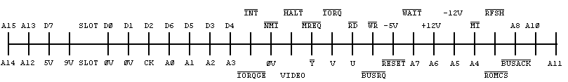 


 

 


 
[&uarr; Contents](#Contents) | [&larr; CHAPTER 23 (IN and OUT) ](#Chapter23) |  [&rarr; Chapter 25 (The system variables) ](#Chapter25)

## <a name ="Chapter24"><a/>CHAPTER 24 ##

### The memory ###

#### Summary ####

**CLEAR**

Deep inside the computer, everything is stored as bytes, i.e. numbers between 0
and 255. You may think you have stored away the price of wool or the address of
your fertilizer suppliers, but it has all been converted into collections of
bytes and bytes are what the computer sees.

Each place where a byte can be stored has an address, which is a number between
0 and FFFFh (so an address can be stored as two bytes), so you might think of
the memory as a long row of numbered boxes, each of which can contain a byte.
Not all the boxes are the same, however. In tile standard 16K RAM machine, the
boxes from 8000h to FFFFh are simply missing altogether. The boxes from 4000h to
7FFFh are RAM boxes, which means you can open the lid and alter the contents,
and those from 0 to 3FFFh are ROM boxes, which have glass tops but cannot be
opened. You just have to read whatever was put in them when the computer was
made.

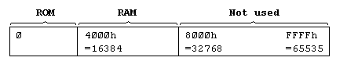 


To inspect the contents of a box, we use the **PEEK** function: its argument is the
address of the box, and its result is the contents. For instance, this program
prints out the first 21 bytes in ROM (and their addresses):

```
10 PRINT "Address"; TAB 8; "Byte"
20 FOR a =0 TO 20
30 PRINT a; TAB 8; PEEK a
40 NEXT a
```

All these bytes will probably be quite meaningless to you, but the processor
chip understands them to be instuctions telling it what to do.

To change the contents of a box (if it is RAM), we use the **POKE** statement. It
has the form

**POKE** *address, new contents*

where 'address' and 'new contents' stand for numeric expressions. For instance,
if you say

**POKE 31000,57**

the byte at address 31000 is given the new value 57 - type

**PRINT PEEK 31000**

to prove this. (Try poking in other values, to show that there is no cheating.)
The new value must be between -255 and +255, and if it is negative then 256 is
added to it

The ability to poke gives you immense power over the computer if you know how to
wield it; and immense destructive possibilities if you don't. It is very easy,
by poking the wrong value in the wrong address, to lose vast programs that took
you hours to type in. Fortunately, you won't do the computer any permanent
damage.

We shall now take a more detailed look at how the RAM is used but don't bother
to read this unless you're interested.

The memory is divided into different areas (shown on the big diagram) for
storing different kinds of information. The areas are only large enough for the
information that they actually contain, and if you insert some more at a given
point (for instance by adding a program line or variable) space is made by
shifting up everything above that point. Conversely, if you delete information
then everything is shifted down.

The display file stores the television picture. It is rather curiously laid out,
so you probably won't want to **PEEK** or **POKE** in it. Each character position on the
screen has an 8x8 square of dots, and each dot can be either 0 (paper) or 1
(ink) and by using binary notation we can store the pattern as 8 bytes, one for
each row. However, these 8 bytes are not stored together. The corresponding rows
in the 32 characters of a single line are stored together as a scan of 32 bytes,
because this is what the electron beam in the television needs as it scans from
the left hand side of the screen to the other. Since the complete picture has 24
lines of 8 scans each, you might expect the total of 172 scans to be stored in
order, one after the other; you'd be wrong. First come the top scans of lines 0
to 7, then the next scans of lines 0 to 7, and so on to the bottom scans of
lines 0 to 7; then the same for lines 8 to 15; and then the same for lines 16 to
23. The upshot of all this is that if you're used to a computer that uses **PEEK**
and **POKE** on the screen, you'll have to start using SCREEN$ and **PRINT** **AT**
instead, or **PLOT** and POINT.

The attributes are the colours and so on for each character position, using the
format of **ATTR**. These are stored line by line in the order you'd expect.
 
The printer buffer stores the characters destined for the printer.

The system variables contain various pieces of information that tell the
computer what sort of state the computer is in. They are listed fully in the
next chapter, but for the moment note that there are some (called CHANS, PROG,
VARS, E LINE and so on) that contain the addresses of the boundaries between the
various areas in memory. These are not BASIC variables, and their names will not
be recognized by the computer.

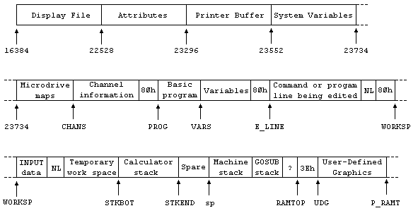 

The Microdrive maps are only used with the Microdrive. Normally there is nothing
there.

The channel information contains information about the input and output devices,
namely the keyboard (with the lower half of the screen), the upper half of the
screen, and the printer.

Each line of BASIC program has the form:

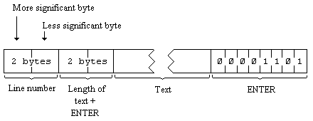 

Note that, in contrast with all other cases of two byte numbers in the Z80, the
line number here is stored with its more significant byte first: that is to say,
in the order that you write them down in.

A numerical constant in the program is followed by its binary form, using the
character **CHR$** 14 followed by five bytes for the number itself.

The variables have different formats according to their different features. The
letters in the names should be imagined as starting off in lower case.


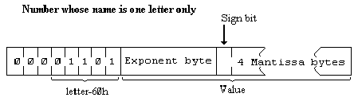

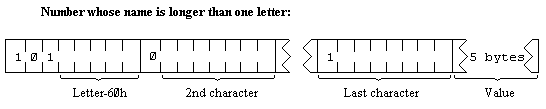

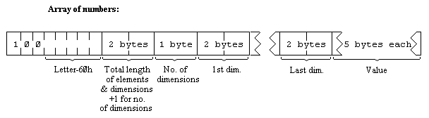


The order of the elements is:

* first, the elements for which the first subscript is 1;
* next, the elements for which the first subscript is 2;
* next, the elements for which the first subscript is 3;
* and so on for all possible values of the first subscript.
* The elements with a given first subscript are ordered in the same way using the
* second subscript, and so on down to the last.
* As an example, the elements of the 3\*6 array b in Chapter 12 are stored in the 
order b(1,1) b(1,2) b(1,3) b(1,4) b(1,5) b(1,6) b(2,1) b(2,2) .... b(2,6) b(3,1) 
b(3,2) ... b(3,6).


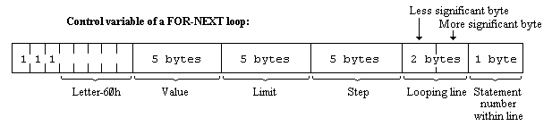

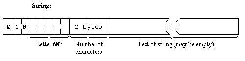

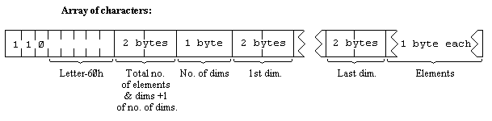


The calculator is the part of the BASIC system that deals with arithmetic, and
the numbers on which it is operating are held mostly in the calculator stack.

The spare part contains the space so far unused.

The machine stack is the stack used by the Z80 processor to hold return
addresses and so on.

The GOSUB stack was mentioned in Chapter 5.

The byte pointed to by RAMTOP has the highest address used by the BASIC system.
Even **NEW**, which clears the RAM out, only does so as far as this so it doesn't
change the user defined graphics. You can change the address RAMTOP by putting a
number in a clear statement:

**CLEAR** new RAMTOP

This

* (i) clears out all the variables
* (ii) clears the display file (like **CLS**)
* (iii) resets the **PLOT** position to the bottom left hand corner
* (iv) does **RESTORE** (v) clears the GOSUB stack and puts it at the new RAMTOP
assuming that this lies between the calculator stack and the physical end of
RAM; otherwise it leaves RAMTOP as it was.

**RUN** also does **CLEAR**, although it never changes RAMTOP.

Using **CLEAR** in this way, you can either move RAMTOP up to make more room for the
BASIC by overwriting the user defined graphics, or you can move it down to make
more RAM that is preserved from **NEW**.

Type **NEW**, then **CLEAR 23800** to get some idea of what happens to the machine when
it fills up.

One of the first things you will notice if you start typing in a program is that
after a while the computer stops accepting any more and buzzes at you. It means
the computer is chock a block and you will have to empty it slightly. There are
also two error messages with roughly the same meaning, 4 Memory full and G No
room for line.

The buzz also occurs when you type in a line longer than 23 lines then your
typing is not being ignored, though you cannot see it; but the buzz sounds to
discourage you from doing any more.

You can adjust the length of the buzz by poking a number into address 23608. The
usual length has number 64.

Any number (except 0) can be written uniquely as + *m* x 2*e* where 
\+ is the sign,

*m* is the mantissa, and lies between ½ and 1 (it cannot be 1), 
and *e* is the exponent, a whole number (possibly negative).

Suppose you write *m* in the binary scale. Because it is a fraction, it will
have a binary point (like the decimal point in the scale of ten) and then a
binary fraction (like a decimal fraction); so in binary:

* a half is written .1
* a quarter is written .01
* three quarters is written .11
* a tenth is written .000110011001100110011 ... and so on.

With our number *m*, because it is less than 1, there are no bits before the
binary point, and because it is at least ½, the bit immediately after the binary
point is a 1.

To store the number in the computer, we use five bytes, as follows:

* (i) write the first eight bits of the mantissa in the second byte (we know that
the first bit is 1), the second eight bits in the third byte, the third eight
bits in the fourth byte and the fourth eight bits in the fifth byte;
* (ii) replace the first bit in the second byte which we know is 1 by the sign: 0
for plus, 1 for minus;
* (iii) write the exponent +128 in the first byte. For instance, suppose our
number is 1/10

1/10 =4/5x2-3

Thus the mantissa *m* is .11001100110011001100110011001100 in binary (since the
33rd bit is 1, we shall round the 32nd up from 0 to 1), and the exponent *e* is 3.

Applying our three rules gives the five bytes

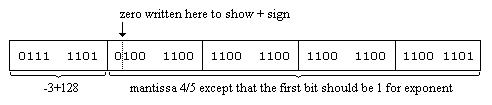 


There is an alternative way of storing whole numbers between 65535 and +65535:

* (i) the first byte is 0.
* (ii) the second byte is 0 for a positive number, FFh for a negative one,
* (iii) the third and fourth bytes are the less and more significant bytes of the
number (or the number +131072 if it is negative),
* (iv) the fifth byte is 0.

 

 

 

 


 
[&uarr; Contents](#Contents) | [&larr; CHAPTER 24 (The memory) ](#Chapter24) |  [&rarr; Chapter 26 (Using machine code) ](#Chapter26)

## <a name ="Chapter25"><a/>CHAPTER 25 ##

### The system variables ###

 

The bytes in memory from 23552 to 23733 are set aside for specific uses by the
system. You can peek them to find out various things about the system, and some
of them can be usefully poked. They are listed here with their uses.

These are called system variables, and have names, but do not confuse them with
the variables used by the BASIC. The computer will not recognize the names as
referring to system variables, and they are given solely as mnemonics for we
humans . The abbreviations in column 1 have the following meanings:

**X** The variables should not be poked because the system might crash.

**N** Poking the variable will have no lasting effect

The number in column 1 is the number of bytes in the variable. For two bytes,
the first one is the less significant byte the reverse of what you might expect.
So to poke a value **v** to a two byte variable at address **n**, use 

**POKE n,v-256\*1NT (v/256)**

**POKE n+1,lNT (v/256)**

and to peek its value, use the expression

**PEEK n+256\*PEEK (n+1)**


|Notes|Address|Name|Contents|
|---|----|---|---|
|N8|23552|KSTATE|Used in reading the keyboard.|
|Nl|23560|LAST K|Stores newly pressed key.|
|1|23561|REPDEL|Time (in 50ths of a second in 60ths of a second in N. America) that a key must be held down before it repeats. This starts off at 35, but you can POKE in other values.|
|1|23562|REPPER|Delay (in 50ths of a second in 60ths of a second in N. America) between successive repeats of a key held down: initially 5.|
|N2|23563|DEFADD|Address of arguments of user defined function if one is being evaluated; otherwise 0.|
|Nl|23565|K DATA|Stores 2nd byte of colour controls entered from keyboard .|
|N2|23566|TVDATA|Stores bytes of coiour, AT and TAB controls going to television.|
|X38|23568|STRMS|Addresses of channels attached to streams.|
|2|23606|CHARS|256 less than address of character set (which starts with space and carries on to the copyright symbol). Normally in ROM, but you can set up your own in RAM and make CHARS point to it.|
|1|23608|RASP|Length of warning buzz.|
|1|23609|PIP|Length of keyboard click.|
|1|23610|ERR NR|1 less than the report code. Starts off at 255 (for 1) so PEEK 23610 gives 255.|
|X1|23611|FLAGS|Various flags to control the BASIC system.|
|X1|23612|TV FLAG|Flags associated with the television.|
|X2|23613|ERR SP|Address of item on machine stack to be used as error return.|
|N2|23615|LIST SP|Address of return address from automatic listing.|
|N1|23617|MODE|Specifies K, L, C. E or G cursor.|
|2|23618|NEWPPC|Line to be jumped to.|
|1|23620|NSPPC|Statement number in line to be jumped to. Poking first NEWPPC and then NSPPC forces a jump to a specified statement in a line.|
|2|23621|PPC|Line number of statement currently being executed.|
|1|23623|SUBPPC|Number within line of statement being executed.|
|1|23624|BORDCR|Border colour * 8; also contains the attributes normally used for the lower half of the screen.|
|2|23625|E PPC|Number of current line (with program cursor).|
|X2|23627|VARS|Address of variables.|
|N2|23629|DEST|Address of variable in assignment.|
|X2|23631|CHANS|Address of channel data.|
|X2|23633|CURCHL|Address of information currently being used for input and output.|
|X2|23635|PROG|Address of BASIC program.|
|X2|23637|NXTLIN|Address of next line in program.|
|X2|23639|DATADD|Address of terminator of last DATA item.|
|X2|23641|E LINE|Address of command being typed in.|
|2|23643|K CUR|Address of cursor.|
|X2|23645|CH ADD|Address of the next character to be interpreted: the character after the argument of PEEK, or the NEWLINE at the end of a POKE statement.|
|2|23647|X PTR|Address of the character after the ? marker.|
|X2|23649|WORKSP|Address of temporary work space.|
|X2|23651|STKBOT|Address of bottom of calculator stack.|
|X2|23653|STKEND|Address of start of spare space.|
|N1|23655|BREG|Calculator's b register.|
|N2|23656|MEM|Address of area used for calculator's memory. (Usually MEMBOT, but not always.)|
|1|23658|FLAGS2|More flags.|
|X1|23659|DF SZ|The number of lines (including one blank line) in the lower part of the screen.|
|2|23660|S TOP|The number of the top program line in automatic listings.|
|2|23662|OLDPPC|Line number to which CONTINUE jumps.|
|1|23664|OSPCC|Number within line of statement to which CONTINUE jumps.|
|N1|23665|FLAGX|Various flags.|
|N2|23666|STRLEN|Length of string type destination in assignment.|
|N2|23668|T ADDR|Address of next item in syntax table (very unlikely to be useful).|
|2|23670|SEED|The seed for RND. This is the variable that is set by RANDOMIZE.|
|3|23672|FRAMES|3 byte (least significant first), frame counter. Incremented every 20ms. See Chapter 18.|
|2|23675|UDG|Address of 1st user defined graphic You can change this for instance to save space by having fewer user defined graphics.|
|1|23677|COORDS|x-coordinate of last point plotted.|
|1|23678||y-coordinate of last point plotted.|
|1|23679|P POSN|33 column number of printer position|
|X2|23680|PR CC|Full address of next position for LPRINT to print at (in ZX printer buffer). Legal values 5B00 - 5B1F. [Not used in 128K mode or when certain peripherals are attached]|
|2|23682|ECHO E|33 column number and 24 line number (in lower half) of end of input buffer.|
|2|23684|DF CC|Address in display file of PRINT position.|
|2|23686|DFCCL|Like DF CC for lower part of screen.|
|X1|23688|S POSN|33 column number for PRINT position|
|X1|23689||24 line number for PRINT position.|
|X2|23690|SPOSNL|Like S POSN for lower part|
|1|23692|SCR CT|Counts scrolls: it is always 1 more than the number of scrolls that will be done before stopping with scroll? If you keep poking this with a number bigger than 1 (say 255), the screen will scroll on and on without asking you.|
|1|23693|ATTR P|Permanent current colours, etc (as set up by colour statements).|
|1|23694|MASK P|Used for transparent colours, etc. Any bit that is 1 shows that the corresponding attribute bit is taken not from ATTR P, but from what is already on the screen.|
|N1|23695|ATTR T|Temporary current colours, etc (as set up by colour items).|
|N1|23696|MASK T|Like MASK P, but temporary.|
|1|23697|P FLAG|More flags.|
|N30|23698|MEMBOT|Calculator's memory area; used to store numbers that cannot conveniently be put on the calculator stack.|
|2|23728|NMIADD|This is the address of a user supplied NMI address which is read by the standard ROM when a peripheral activates the NMI.Probably intentionally disabled so that the effect is to perform a reset if both locations hold zero, but do nothing if the locations hold a non-zero value. Interface 1's with serial number greater than 87315 will initialize these locations to 0 and 80 to allow the RS232 "T" channel to use a variable line width. 23728 is the current print position and 23729 the width - default 80.|
|2|23730|RAMTOP|Address of last byte of BASIC system area.|
|2|23732|P RAMT|Address of last byte of physical RAM.|

This program tells you the first 22 bytes of the variables area:
 
```
10 FOR n=0 TO 21
20 PRINT PEEK (PEEK 23627+256\*PEEK 23628+n)
30 NEXT n
```
Try to match up the control variable n with the descriptions above. Now change
line 20 to
 
```
20 PRINT PEEK (23755+n)
```

This tells you the first 22 bytes of the program area. Match these up with the
program itself.

 

 


 

 

  
[&uarr; Contents](#Contents) | [&larr; CHAPTER 25 (The system variables) ](#Chapter25) |  [&rarr; Appendix A (The character set) ](#AppendixA)

## <a name ="Chapter26"><a/>CHAPTER 26 ##

### Using machine code ###

#### Summary ####

**USR with numeric argument**

 

This chapter is written for those who understand Z80 machine code, the set of
instructions that the Z80 processor chip uses. If you do not, but would like to,
there are plenty of books about it. You want to get one called something along
the lines of "*Z80 Machine code* [or assembly language] *for the absolute
beginner*", and if it mentions the Spectrum, so much the better.

These programs are normally written in assembly language, which, although
cryptic, are not too difficult to understand with practice. (You can see the
assembly language instructions in Appendix A.) However, to run them on the
computer you need to code the program into a sequence of bytes in this form it
is called machine code. This translation is usually done by the computer itself,
using a program called an assembler. There is no assembler built in to the
Spectrum, but you may well be able to buy one on cassette. Failing that, you
will have to do the translation yourself, provided that the program is not too
long.

Let's take as an example the program

```
ld bc, 99
ret
```

which loads the bc register pair with 99. This translates into the four machine
code bytes 1, 99, 0 (for ld bc, 99) and 201 (for ret). (If you look up 1 and 201
in Appendix A, you will find ld bc, NN - where NN stands for any two byte number
\- and ret.)

When you have got your machine code program, the next step is to get it into the
computer. (An assembler would probably do this automatically.) You need to
decide whereabouts in memory to put it, and the best thing is to make extra
space for it between the BASIC area and the user defined graphics.

Suppose, for instance, that you have a 16K Spectrum. To start off with, the top
end of RAM has

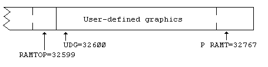

If you type
 
```
CLEAR 32499
```

this will give you a space of 100 (for good measure) bytes starting at address
32500.

 
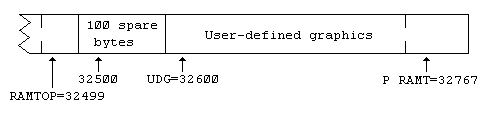


To put in the machine code program, you would run a BASIC program something like

```
10 LET a=32500
20 READ n: POKE a,n
30 LETa=a+1:GOTO20
40 DATA 1,99,0,201
```

(This will stop with report **E Out of DATA** when it has filled in the four
bytes you specified.)

To run the machine code, you use the function **USR** but this time with a numeric
argument, the starting address. Its result is the value of the bc register on
return from the machine code program, so if you do

**PRINT USR 32500**

you get the answer 99.

The return address to the BASIC is stacked in the usual way, so return is by a
Z80 ret instruction. You should not use the iy and i registers in a machine code
routine.

You can save your machine code program easily enough with

**SAVE** "some name" **CODE 32500,4**

On the face of it, there is no way of saving it so that when loaded it
automatically runs itself, but you can get round this by using a BASIC program.

```
10 LOAD "" CODE 32500,4
20 PRINT USR 32500
```

Do first

**SAVE** "some name" **LINE**

and then

**SAVE "xxxx" **CODE** 32500,4**

**LOAD** "some name"

will then load and automatically run the BASIC program, and the BASIC program
will load and run the machine code.


 

[&uarr; Contents](#Contents) | [&larr; CHAPTER 26 (Using machine code) ](#Chapter26) |  [&rarr; Appendix B (Reports) ](#AppendixB)

## <a name ="AppendixA"><a/>  APPENDIX A ##

### The character set ###

This is the complete Spectrum character set, with codes in decimal and hex. If
one imagines the codes as being Z80 machine code instructions, then the right
hand columns give the corresponding assembly language mnemonics. As you are
probably aware if you understand these things, certain Z80 instructions are
compounds starting with CBh or EDh; the two right hand columns give these.

|Code|Character|Hex|Z80 Assembler|after CB|after ED|
|---|---|---|---|---|---|
|0|not used|00|nop|rlc b||
|1|not used|01|ld bc,NN|rlc c||
|2|not used|02|ld (bc),a|rlc d||
|3|not used|03|inc bc|rlc e||
|4|not used|04|inc b|rlc h||
|5|not used|05|dec b|rlc l||
|6|PRINT comma|06|ld b,N|rlc (hl)||
|7|EDIT|07|rlca|rlc a||
|8|Cursor left|08|ex af,af'|rrc b|
|9|Cursor right|09|add hl,bc|rrc c|
|10|Cursor Down|0A|ld a,(bc)|rrc d||
|11|Cursor Up|0B|dec bc|rrc e||
|12|DELETE|0C|incc|rrch||
|13|ENTER|0D|dec c|rrc||
|14|number|0E|ld c,N|rrc (hl)||
|15|not used|0F|rrca|rrc a||
|16|INK control|10|djnz DIS|rl b||
|17|PAPER control|11|ld de,NN|rlc||
|18|FLASH control|12|ld (de),a|rl d||
|19|BRIGHT control|13|inc de|rl e||
|20|INVERSE control|14|inc d|rl h||
|21|OVER control|15|dec d|rl l||
|22|AT control|16|ld d,N|rl (hl)||
|23|TAB control|17|rla|rl a||
|24|not used|18|jr DIS|rr b||
|25|not used|19|add hl,de|rr c||
|26|not used|1A|ld a,(de)|rr d||
|27|not used|1B|dec de|rr e||
|28|not used|1C|inc e|rr h||
|29|not used|1D|dec e|rr l||
|30|not used|1E|ld e,N|rr (hl)||
|31|not used|1F|rra|rr a||
|32|space|20|jr nz, DlS|sla b||
|33|!|21|ld hl,NN|sla c||
|34|"|22|ld (NN),hl|sla d||
|35|#|23|inc hl|sla e||
|36|$|24|inc h|sla h||
|37|%|25|dec h|sla l|
|38|&|26|ld h,N|sla (hl)||
|39|,|27|daa|sla a||
|40|(|28|jr z,DlS|sra b||
|41|)|29|add hl,hl|sra c||
|42|*|2A|ld hl,(NN)|sra d|
|43|+|2B|dec hl|sra e|
|44|,|2C|inc ll|sra h|
|45|-|2D|dec l|sra l|
|46|.|2F|ld l,N|sra (hl)|
|47|/|2F|cpl|sra a|
|48|0|30|jr nc,DlS||
|49|1|31|ld sp,NN||
|50|2|32|ld (NN),a||
|51|3|33|inc sp||
|52|4|34|inc (hl)||
|53|5|35|dec (hl)||
|54|6|36|ld (hl),N||
|55|7|37|scf||
|56|8|38|lr c,DlS|srl b|
|57|9|39|add hl,sp|srl c|
|58|:|3A|ld a,(NN)|srl d|
|59|;|3B|dec sp|srl e|
|60|<|3C|inc a|srl h|
|61|=|3D|dec a|srl l|
|62|>|3E|ld a,N|srl (hl)|
|63|?|3F|ccf|srl a|
|64|@|40|ld b,b|bit 0,b|in b,(c)|
|65|A|41|ld b,c|bit 0,c|out (c),b|
|66|B|42|ld b,d|bit 0,d|sbc hl,bc|
|67|C|43|ld b,e|bit 0,e|ld (NN),bc|
|68|D|44|ld b,h|bit 0,h|neg|
|69|E|45|ld b,l|bit 0,1|retn|
|70|F|46|ld b,(hl)|bit 0,(hl)|im 0|
|71|G|47|ld b,a|bit 0,a|ld i,a|
|72|H|48|ld c,b|bit 1,b|in c,(c)|
|73|I|49|ld cc|bit 1,c|out (c),c|
|74|J|4A|ld c,d|bit i,d|adc hl,bc|
|75|K|4B|ld c,e|bit 1,e|ld bc,(NN)|
|76|L|4C|ld c,h|bit 1,h|
|77|M|4D|ld c,l|bit 1,l|reti|
|78|N|4E|ld c,(hl)|bit 1,(hl)|
|79|O|4F|ld c,a|bit 1,a|ld r,a|
|80|P|50|ld d,b|bit 2,b|in d,(c)|
|81|Q|51|ld d,c|bit 2,c|out (c),d|
|82|R|52|ld d,d|bit 2,d|sbc hl,de|
|83|S|53|ld d,e|bit 2,e|ld (NN),de|
|84|T|54|ld d,h|bit 2,h|
|85|U|55|ld d,l|bit 2,l|
|86|V|56|ld d,(hl)|bit 2,(hl)|im 1|
|87|W|57|ld d,a|bit 2,a|ld a,i|
|88|X|58|ld e,b|bit 3,b|in e,(c)|
|89|Y|59|ld e,c|bit 3,c|out (c),e|
|90|Z|5A|ld e,d|bit 3,d|adc hl,de|
|91|[|5B|ld e,e|bit 3,e|ld de,(NN)|
|92|/|5C|ld e,h|bit 3,h|
|93|]|5D|ld e,l|bit 3,l|
|94|^|5E|ld e,(hl)|bit 3,(hl)|im 2|
|95|_|5F|ld e,a|bit 3,a|ld a,r|
|96|ukp|60|ld h,b|bit 4,b|in h,(c)|
|97|a|61|ld h,c|bit 4,c|out (c),h|
|98|b|62|ld h,d|bit 4,d|sbc hl,hl|
|99|c|63|ld h,e|bit 4,e|ld (NN),hl|
|100|d|64|ld h,h|bit 4,h|
|101|e|65|ld h,l|bit 4,1|
|102|f|66|ld h,(hl)|bit 4,(hl)|
|103|g|67|ld h,a|bit 4,a|rrd|
|104|h|68|ld l,b|bit 5,b|in l,(c)|
|105|i|69|ld l,c|bit 5,c|out (c),l|
|106|j|6A|ld l,d|bit 5,d|adc hl,hl|
|107|k|6B|ld l,e|bit 5,e|ld hl,(NN),sp|
|108|l|6C|ld l,h|bit 5,h|
|109|m|6D|ld l,l|bit 5,l|
|110|n|6E|ld l,(hl)|bit 5,(hl)|
|111|o|6F|ld l,a|bit 5,a|rld|
|112|p|70|ld (hl),b|bit 6,b|in f,(c)|
|113|q|71|ld (hl),c|bit 6,c|
|114|r|72|ld (hl),d|bit 6,d|sbc hl,sp|
|115|s|73|ld (hl),e|bit 6,e|ld (NN),sp|
|116|t|74|ld (hl),h|bit 6,h|
|117|u|75|ld (hl),l|bit 6,l|
|118|v|76|halt|bit 6,(hl)|
|119|w|77|ld (hl),a|bit 6,a|
|120|x|78|ld a,b|bit 7,b|in a,(c)|
|121|y|79|ld a,c|bit 7,c|out (c),a|
|122|z|7A|ld a,d|bit 7,d|adc hl,sp|
|123|{|7B|ld a,e|bit 7,e|ld sp,(NN)|
|124|||7C|lda,h|bit 7,h|
|125|}|7D|ld al|bit 7,l|
|126|-|7E|ld a,(hl)|bit 7,(hl)|
|127|©|7F|ld a,a|bit 7,a|
|128||80|add a,b|res 0,b|
|129||81|add a,c|res 0,c|
|130||82|add a,d|res 0,d|
|131||83|add a,e|res 0,e|
|132||84|add a,h|res 0,h|
|133||85|add a,l|res 0,l|
|134||86|add a,(hl)|res 0,(hl)|
|135||87|add a,a|res 0,a|
|136||88|adc a,b|res 1,b|
|137||89|adc a,c|res 1,c|
|138||8A|adc a,d|res 1,d|
|139||8B|adc a,e|res 1,e|
|140||8C|adc a,h|res 1,h|
|141||8D|adc a,l|res 1,i|
|142||8E|adc a,(hl)|res 1,(hl)|
|143||8F|adc a,a|res 1,a|
|144|(a)|90|sub b|res 2,b|
|145|(b)|91|sub c|res 2,c|
|146|(c)|92|sub d|res 2,d|
|147|(d)|93|sub e|res 2,e|
|148|(e)|94|sub h|res 2,h|
|149|(f)|95|sub l|res 2,l|
|150|(g)|96|sub (hl)|res 2,(hl)|
|151|(h)|97|sub a|res 2,a|
|152|(i)|98|sbc a,b|res 3,b|
|153|(j)|99|sbc a,c|res 3,c|
|154|(k)|9A|sbc a,d|res 3,d|
|155|(l)|9B|sbc a,e|res 3,e|
|156|(m)|9C|sbc a,h|res 3,h|
|157|(n)|9D|sbc a,l|res 3,l|
|158|(o)|9E|sbc a,(hl)|res 3,(hl)|
|159|(p)|9F|sbc a,a|res 3,a|
|160|(q)|A0|and b|res 4,b|ldi|
|161|(r)|A1|and c|res 4,c|cpi|
|162|(s)|A2|and d|res 4,d|ini|
|163|(t)|A3|and e|res 4,e|outi|
|164|(u)|A4|and h|res 4,h|
|165|**RND**|A5|and l|res 4,l|
|166|**INKEY$**|A6|and (hl)|res 4,(hl)|
|167|**PI**|A7|and a|res 4,a|
|168|**FN**|A8|xor b|res 5,b|ldd|
|169|**POINT**|A9|xor c|res 5,c|cpd|
|170|**SCREEN$**|AA|xor d|res 5,d|ind|
|171|**ATTR**|AB|xor e|res 5,e|outd|
|172|**AT**|AC|xor h|res 5,h|
|173|**TAB**|AD|xor l|res 5,i|
|174|**VAL$**|AE|xor (hl)|res 5,(hl)|
|175|**CODE**|AF|xor a|res 5,a|
|176|**VAL**|B0|or b|res 6,b|ldir|
|177|**LEN**|B1|or c|res 6,c|cpir|
|178|**SIN**|B2|or d|res 6,d|inir|
|179|**COS**|B3|or e|res 6,e|otir|
|180|**TAN**|B4|or h|res 6,h|
|181|**ASN**|B5|or l|res 6,l|
|182|**ACS**|B6|or (hl)|res 6,(hl)|
|183|**ATN**|B7|or a|res 6,a|
|184|**LN**|B8|cp b|res 7,b|lddr|
|185|**EXP**|B9|cp c|res 7,c|cpdr|
|186|**INT**|BA|cp d|res 7,d|indr|
|187|**SOR**|BB|cp e|res 7,e|otdr|
|188|**SGN**|BC|cp h|res 7,h|
|189|**ABS**|BD|cp l|res 7,l|
|190|**PEEK**|BE|cp (hl)|res 7,(hl)|
|191|**IN**|BF|cp a|res 7,a|
|192|**USR**|C0|ret nz|set 0,b|
|193|**STR$**|C1|pop bc|set 0,c|
|194|**CHR$**|C2|jp nz,NN|set 0,d|
|195|**NOT**|C3|jp NN|set 0,e|
|196|**BIN**|C4|call nz,NN|set 0,h|
|197|**OR**|C5|push bc|set 0,l|
|198|**AND**|C6|add a,N|set 0,(hl)|
|199|**<=**|C7|rst 0|set 0,a|
|200|**>=**|C8|ret z|set 1,b|
|201|**<>**|C9|ret|set l,c|
|202|**LINE**|CA|jp z,NN|set l,d|
|203|**THEN**|CB|set l,e|
|204|**TO**|CC|call z,NN|set l,h|
|205|**STEP**|CD|call NN|set 1,l|
|206|**DEF FN**|CE|adc a,N|set 1,(hl)|
|207|**CAT**|CF|rst B|set 1,a|
|208|**FORMA**T|D0|ret nc|set 2,b|
|209|**MOVE**|D1|pop de|set 2,c|
|210|**ERASE**|D2|jpnc,NN|set 2,d|
|211|**OPEN #**|D3|out (N),a|set 2,e|
|212|**CLOSE #**|D4|call nc,NN|set 2,h|
|213|**MERGE**|D5|push de|set 2,l|
|214|**VERIFY**|D6|sub N|set 2,(hl)|
|215|**BEEP**|D7|rst 16|set 2,a|
|216|**CIRCLE**|D8|ret c|set 3,b|
|217|**INK**|D9|exx|set 3,c|
|218|**PAPER**|DA|jpc,NN|set 3,d|
|219|**FLASH**|DB|in a,(N)|set 3,e|
|220|**BRIGHT**|DC|call c,NN|set 3,h|
|221|**INVERSE**|DD|[prefixes instructions using ix]|set 3,l|
|222|**OVER**|DE|sbc a,N|set 3,(hl)|
|223|**OUT**|DF|rst 24|set 3,a|
|224|**LPRINT**|E0|ret po|set 4,b|
|225|**LLIST**|E1|pop hl|set 4,c|
|226|**STOP**|E2|jp po,NN|set 4,d|
|227|**READ**|E3|ex (sp),hl|set 4,e|
|228|**DATA**|E4|call po,NN|set 4,h|
|229|**RESTORE**|E5|push hl|set 4,l|
|230|**NEW**|E6|and N|set 4,(hl)|
|231|**BORDER**|E7|rst 32|set 4,a|
|232|**CONTINUE**|E8|ret pe|set 5,b|
|233|**DIM**|E9|jp (hl)|set 5,c|
|234|**REM**|EA|jp pe,NN|set 5,d|
|235|**FOR**|EB|ex de,hl|set 5,e|
|236|**GO TO**|EC|call pe,NN|set 5,h|
|237|**GO SUB**|ED||set 5,l|
|238|**INPUT**|EE|xor N|set 5,(hl)|
|239|**LOAD**|EF|rst 40|set 5,a|
|240|**LIST**|F0|ret p|set 6,b|
|241|**LET**|Fl|pop af|set 6,c|
|242|**PAUSE**|F2|jp p,NN|set 6,d|
|243|**NEXT**|F3|di|set 6,e|
|244|**POKE**|F4|call p,NN|set 6,h|
|245|**PRINT**|F5|push af|set 6,l|
|246|**PLOT**|F6|or N|set 6,(hl)|
|247|**RUN**|F7|rst 48|set 6,a|
|248|**SAVE**|F8|ret m|set 7,b|
|249|**RANDOMIZE**|F9|ld sp,hl|set 7,c|
|250|**IF**|FA|jp m,NN|set 7,d|
|251|**CLS**|FB|ei|set 7,e|
|252|**DRAW**|FC|call m,NN|set 7,h|
|253|**CLEAR**|FD|[prefixes instructions using iy]|set 7,l|
|254|**RETUR**N|FE|cp N|set 7,(hl)|
|255|**COPY**|FF|rst 56|set 7,a||


 
[&uarr; Contents](#Contents) | [&larr; APPENDIX A (The character set) ](#AppendixA) |  [&rarr; Appendix C1 (A description of the ZX Spectrum for reference) ](#AppendixC1)

## <a name ="AppendixB"><a/>  APPENDIX B ##

### Reports ###

 These appear at the bottom of the screen whenever the computer stops executing
some BASIC, and explain why it stopped, whether for a natural reason, or because
an error occurred.

The report has a code number or letter so that you can refer to the table here,
a brief message explaining what happened and the line number and statement
number within that line where it stopped. (A command is shown as line 0. Within
a line, statement 1 is at the beginning, statement 2 comes after the first colon
or **THEN**, and so on.)

The behaviour of **CONTINUE** depends very much on the reports. Normally, **CONTINUE**
goes to the line and statement specified in the last report, but there are
exceptions with reports 0, 9 and D (also see Appendix C).

Here is a table showing all the reports. It also tells you in what circumstances
the report can occur, and this refers you to Appendix C. For instance error A
Invalid argument can occur with **SQR**, **IN**, **ACS** and **ASN** and the entries for these
in Appendix C tell you exactly what arguments are invalid.


|Code | Meaning | Situations|
|---|---|---|
|0 |0K <BR> Successful completion, or jump to a line number bigger than any existing. This report does not change the line and statement jumped to by **CONTINUE**.|Any |
|1| NEXT without FOR NEXT <BR>The control variable does not exist (it has not been set up by a **FOR** statement), but there is an ordinary variable with the same name.|**NEXT**|
|2| Variable not found <BR>  For a simple variable this will happen if the variable is used before it has been assigned to in a **LET**, **READ** or **INPUT** statement or loaded from tape or set up in a **FOR** statement. For a subscripted variable it will happen if the variable is used before it has been dimensioned in a **DIM** statement or loaded from tape.|Any|
|3|Subscript wrong<BR> A subscript is beyond the dimension of the array, or there are the wrong number of subscripts. If the subscript is negative or bigger than 65535, then error B will result. |Subscripted variables, Substrings|
|4|Out of memory <BR>There is not enough room in the computer for what you are trying to do. If the computer really seems to be stuck in this state, you may have to clear out the command line using **DELETE** and then delete a program line or two (with the intention of putting them back afterwards) to give yourself room to manoeuvre with - say - **CLEAR**.|**LET**, **INPUT**, **FOR**, **DIM**, **GO SUB**, **LOAD**, **MERGE**.Sometimes during expression evaluation. |
|5|lines in the lower half of the screen. Also occurs with **PRINT AT 22**, . . . |**INPUT**, **PRINT AT**
|6|Number too big <BR>Calculations have led to a number greater than about 10^38.|Any arithmetic|
|7|RETURN without GO SUB <BR>There has been one more **RETURN** than there were **GO SUB**s.|RETURN
|8|End of file |Microdrive, etc, operations|
|9|STOP statement <BR> After this, **CONTINUE** will not repeat the STOP, but carries on with the statement after.|**STOP**
|A|Invalid argument <BR> The argument for a function is no good for some reason.|** SQR, LN, ASN, ACS, USR (with string argument)|
|B|Integer out of range<BR>When an integer is required, the floating point argument is rounded to the nearest integer.* If this is outside a suitable range then error B results. For array access, see also Error 3.*|**RUN**, **RANDOMIZE**, **POKE**, **DIM**, **GO TO**, **GO SUB**, **LIST**, **LLIST**, **PAUSE**, **PLOT**, **CHR$**, **PEEK**, **USR** (with numeric argument), Array access|
|C|Nonsense in BASIC <BR> The text of the (string) argument does not form a valid expression.|**VAL**, **VAL$**|
|D|BREAK - CONT repeats  <BR> Also when the computer asks scroll? and you type N, SPACE or STOP. BREAK was pressed during some peripheral operation. The behaviour of **CONTINUE*** after this report is normal in that it repeats the statement. Compare with report L.|**LOAD**, **SAVE**, **VERIFY**, **MERGE**, **LPRINT**, LLIST, **COPY**.|
|E|Out of DATA <BR>You have tried to READ past the end of the DATA list.|**READ**|
|F|Invalid file name <BR> **SAVE** with name empty or longer than 10 characters.|**SAVE**|
|G| No room for line <BR> There is not enough room left in memory to accommodate the new program line.|Entering a line into the program|
|H|STOP in INPUT <BR> Some **INPUT** data started with STOP, or - for **INPUT** LINE - was pressed. Unlike the case with report 9, after report H **CONTINUE** will behave normally, by repeating the **INPUT** statement.|**INPUT**|
|I|FOR without NEXT <BR> There was a **FOR** loop to be executed no times (e.g. **FOR** n= 1 **TO** 0) and the corresponding **NEXT** statement could not be found.* |**FOR**|
|J|Invalid I/O device <BR>[undocumented] |Microdrive, etc, operations|
|K|Invalid colour <BR>The number specified is not an appropriate value.| **INK**, **PAPER**, **BORDER**, **FLASH**, **BRIGHT**, **INVERSE**, **OVER**; also after one of the corresponding control characters. |
|L|BREAK into program <BR> BREAK pressed, this is detected between two statements. The line and statement number in the report refer to the statement before BREAK was pressed, but **CONTINUE** goes to the* statement after (allowing for any jumps to be done), so it does not repeat any statements.|Any|
|M|RAMTOP no good <BR>The number specified for RAMTOP is either too big or too small.|**CLEAR**; possibly in **RUN**|
|N|Statement lost <BR> Jump to a statement that no longer exists.| **RETURN**, **NEXT**, **CONTINUE**|
|O|Invalid stream <BR>[undocumented] |Microdrive,etc, operations|
|P|FN without DEF <BR> *User-defined function* |FN|
|Q|Parameter error <BR>Wrong number of arguments, or one of them is the wrong type (string instead of number or vice versa).|FN|
|R|Tape loading error <BR> A file on tape was found but for some reason could not be read in, or would not verify.|**VERIFY** **LOAD** or **MERGE**|


 

 

 
[&uarr; Contents](#Contents) | [&larr; APPENDIX B (Reports) ](#AppendixB) |  [&rarr; Appendix C2 (The BASIC) ](#AppendixC2)

## <a name ="AppendixC1"><a/>APPENDIX C (Part 1) ##

### A description of the ZX Spectrum for reference ###

 

The first section of this appendix is a repeat of that part of the Introduction
concerning the keyboard and screen.

 

#### The keyboard ####

ZX Spectrum characters comprise not only the single symbols (letters, digits,
etc), but also the compound tokens (keywords, function names, etc) and all these
are entered trom the keyboard rather than being spelled out. To obtain all these
functions and commands some keys have five or more distinct meanings, given
partly by shifting the keys (i.e. pressing either the **CAPS SHIFT** key or the
**SYMBOL SHIFT** key at the same time as the required one) and partly by having the
machine in different modes.

The mode is indicated by the cursor, a flashing letter that shows where the next
character from the keyboard will be inserted.

**K** (for keywords) mode automatically replaces L mode when the machine is
expecting a command or program line (rather than INPUT data), and from its
position on the line it knows it should expect a line number or a keyword. This
is at the beginning of the line, or just after **THEN**, or just after: (except in a
string). If unshifted, the next key will be interpreted as either a keyword
(written on the keys), or a digit.

**L** (for letters) mode normally occurs at all other times. If unshifted, the
next key will be interpreted as the main symbol on that key, in lower case for
letters.

In both **K** and **L** modes, **SYMBOL SHIFT** and a key will be interpreted as the
subsidiary red character on the key and **CAPS SHIFT** with a digit key will be
interpreted as the control function written in white above the key. **CAPS SHIFT**
with other keys does not affect the keywords in **K** mode, and in **L** mode it
converts lower case to capitals.

**C** (for capitals) mode is a variant of **L** mode in which all letters appear
as capitals. CAPS LOCK causes a change from **L** mode to **C** mode or back
again.

**E** (for extended) mode is used for obtaining further characters, mostly
tokens. It occurs after both shift keys are pressed together, and lasts for one
key depression only. In this mode, a letter gives one character or token (shown
in green above it) if unshifted, and another (shown in red below it) if pressed
with either shift. A digit key gives a token if pressed with **SYMBOL SHIFT**;
otherwise it gives a colour control sequence.

**G** (for graphics) mode occurs after **GRAPHICS** (**CAPS SHIFT** and 9) is pressed,
and lasts until it is pressed again. A digit key will give a mosaic graphic,
quit **GRAPHICS** or DELETE, and each of the letter keys apart from V, W, X, Y and
Z, will give a user-defined graphic.

If any key is held down for more than about 2 or 3 seconds, it will start
repeating.

Keyboard input appears in the bottom half of the screen as it is typed, each
character (single symbol or compound token) being inserted just before the
cursor. The cursor can be moved left with **CAPS SHIFT** and 5, or right with CAPS
SHIFT and 8. The character before the cursor can be deleted with DELETE (CAPS
SHIFT and 0). (Note: the whole line can be deleted by typing **EDIT** (**CAPS SHIFT**
and 1) followed by ENTER.)

When ENTER is pressed, the line is executed, entered into the program, or used
as **INPUT** data as appropriate, unless it contains a syntax error. In this case a
flashing **?** appears next to the error.

As program lines are entered, a listing is displayed in the top half of the
screen. The manner in which the listing is produced is rather complicated, and
explained more fully in Chapter 2. The last line entered is called the current
line and is indicated by the symbol ****, but this can be changed by using the
keys  (**CAPS SHIFT** and 6) and  (**CAPS SHIFT** and 7). If EDIT (**CAPS SHIFT** and **1**)
is pressed, the current line is brought down to the bottom part of the screen
and can be edited.

When a command is executed or a program run, output is displayed in the top half
of the screen and remains until a program line is entered, or **ENTER** is pressed
with an empty line, or  or  
is pressed. In the bottom part appears a report
giving a code (digit or letter) referring you to Appendix B, a brief verbal
summary of what Appendix B says, the number of the line containing the last
statement executed (or 0 for a command) and the position of the statement within
the line. The report remains on the screen until a key is pressed (and indicates
**K** mode).

In certain circumstances, **CAPS SHIFT** with the **SPACE** key acts as a **BREAK**,
stopping the computer with report **D** or **L**. This is recognised

(i) at the end of a statement while a program is running, or

(ii) while the computer is using the cassette recorder or printer.

#### The television screen ####


This has 24 lines, each 32 characters long, and is divided into two parts. The
top part is at most 22 lines and displays either a listing or program output.
When printing in the top part has reached the bottom, it all scrolls up one
line; if this would involve losing a line that you have not had a chance to see
yet, then the computer stops with the message scroll?. Pressing the keys **N**,
**SPACE** or **STOP** will make the program stop with report **D BREAK- CONT** repeats; any
other key will let the scrolling continue. The bottom part is used for inputting
commands, program lines, and **INPUT** data, and also for displaying reports. The
bottom part starts of as two lines (the upper one blank), but it expands to
accommodate whatever is typed in. When it reaches the current print position in
the top half, further expansions will make the top half scroll up.

Each character position has attributes specifying its paper (background) and ink
(foreground) colours, a two-level brightness, and whether it flashes or not. The
available colours are black, blue, red, magenta, green, yellow and white.

The edge of the screen can be set to any of the colours using the border
statement.

A character position is divided into 8x8 pixels and high resolution graphics are
obtained by setting the pixels individually to show either the ink or paper
colour for that character position.

The attributes at a character position are adjusted whenever a character is
written there or a pixel is plotted The exact manner of the adjustment is
determined by the pnnting parameters. of which there are two sets (called
permanent and temporary) of six: the **PAPER**, **INK**, **FLASH**, **BRIGHT**, **INVERSE** and **OVER**
parameters. Permanent parameters for the top part are set up by **PAPER**, **INK**, etc,
statements, and last until further notice. (Initially they are black ink on
white paper. With normal brightness, no flashing, normal video and no
overprinting). Permanent parameters for the bottom part use the border colour as
the paper colour, with a black or white contrasting ink colour, normal
brightness, no flashing, normal video and no overprinting.

Temporary parameters are set up by **PAPER**, **INK**, etc, items, which are embedded in
**PRINT**, **LPRINT**, **INPUT**, **PLOT**, **DRAW** and **CIRCLE** statements, and also by **PAPER**, **INK**,
etc control characters when they are printed to the television - they are
followed by a further byte to specify the parameter value. Temporary parameters
last only to the end of the **PRINT** (or whatever) statement, or, in **INPUT**
statements, until some INPUT data is needed from the keyboard, when they are
replaced by the permanent parameters.

**PAPER** and **INK** parameters are in the range 0 to 9. Parameters 0 to 7 are the
colours used when a character is printed:


0 black

1 blue

2 red

3 magenta

4 green

5 cyan

6 yellow

7 white

Parameter 8 ('transparent') specifies that the colour on the screen is to be
left unchanged when a character is printed.

Parameter 9 ('contrast') specifies that the colour in question (paper or ink) is
to be made either white or black to show up against the other colour.

**FLASH** and **BRIGHT** parameters are 0,1 or 8: 1 means that flashing or brightness is
turned on, 0 that it is turned off, and 8 ('transparent') that it is left
unchanged at any character position.

**OVER** and **INVERSE** parameters are 0 or 1:

**OVER 0** new characters obliterate old ones

**OVER 1** the bit patterns of the old and new characters are combined using an
'exclusive or' operation (overprinting)

**INVERSE 0** new characters are printed as ink colour on paper colour (normal
video)

**INVERSE 1** new characters are printed as paper colour on ink colour (inverse
video)

When a **TAB** control character is received by the television, two more bytes are
expected to specify a tab stop *n* (less significant byte first). This is
reduced modulo 32 to *n0* (say), and then sufficient spaces are printed to move
the printing position into column *n0*. When a comma control character is
received, then sufficient spaces (at least one) are printed to move the printing
position into column 0 or column 16. When an ENTER control character is
received, the printing position is moved on to the next line.

 

#### The printer ####

Output to the ZX printer is via a buffer one line (32 characters) long, and a
line is sent to the printer
 
* (i) when printing spills over from one line to the next,
* (ii) when an ENTER character is received,
* (iii) at the end of the program, if there is anything left unprinted,
* (iv) when a **TAB** control or comma control moves the printing position on to a new
line.

**TAB** controls and comma controls output spaces in the same way as on the
television.

The **AT** control changes the printing position using the column number, and
ignores the line number.

The printer is affected by **INVERSE** and **OVER** controls (and also statements) in
the same way as the screen is, but not by **PAPER**, **INK**, **FLASH** or **BRIGHT**.

The printer will stop with error **B if BREAK** is pressed. If the printer is absent
the output will simply be lost.

 

 

 

 
[&uarr; Contents](#Contents) | [&larr; APPENDIX C 1 (A description of the ZX Spectrum for reference) ](#AppendixC1) |  [&rarr; Appendix D (Example programs) ](#AppendixD)

## <a name ="AppendixC2"><a/>APPENDIX C (Part 2) ##

### The BASIC ###

 
 

Numbers are stored to an accuracy of 9 or 10 digits. The largest number you can
get is about 10<sup>38</sup> 
, and the smallest (positive) number is about 4*10<sup>-39</sup>.

A number is stored in the ZX Spectrum in floating point binary with one exponent
byte e (l<=e<=255), and four mantissa bytes m (½<=m<l). This represents
the number m*2e<sup>-128</sup>

Since ½<=m<l, the most significant bit of the mantissa m is always 1.
Therefore in actual fact we can replace it with a bit to show the sign - 0 for
positive numbers, 1 for negative.

Small integers have a special representation in which the first byte is 0, the
second is a sign byte (0 or FFh) and the third and fourth are the integer in
twos complement form, the less significant byte first.

Numeric variables have names of arbitrary length, starting with a letter and
continuing with letters and digits. Spaces and colour controls are ignored and
all letters are converted to lower-case letters.

Control variables of **FOR**-**NEXT** loops have names a single letter long.

Numeric arrays have names a single letter long, which may be the same as the
name of a simple variable. They may have arbitrarily many dimensions of
arbitrary size. Subscripts start at 1.

Strings are completely flexible in length. The name of a string consists of a
single letter followed by $.

String arrays can have arbitrarily many dimensions of arbitrary size. The name
is a single letter followed by $ and may not be the same as the name of a
string. All the strings in a given array have the same fixed length, which is
specified as an extra, final dimension in the **DIM** statement. Subscripts start at 1.

Slicing: Substrings of strings may be specified using slicers. A slicer can be


* (i) empty or
* (ii) numerical expression or
* (iii) optional numerical expression **TO** optional numerical expression
and is used in expressing a substring either by

* (a) string expression (slicer)
* (b) string array variable (subscript,..., subscript, slicer) which means the same as
string array variable (subscript . . . , subscript) (slicer)**

 
In (a), suppose the string expression has the value s$.

If the slicer is empty, the result is s$ considered as a substring of itself.

If the slicer is a numerical expression with value *m*, then the result is the
*m*th character of s$ (a substring of length 1).

If the slicer has the form (iii), then suppose the first numerical expression
has the value *m* (the default value is 1), and the second, n (the default value
is the length of s$).

If 1\<=m\<=n\<=the length of s$ then the result is the substring of s$
starting with the *m*th character and ending with the *n*th. If 0\<=n\<m then
the result is the empty string. Otherwise, error 3 results.

Slicing is performed before functions or operations are evaluated, unless
brackets dictate otherwise.

Substrings can be assigned to (see **LET**).

If a string quote is to be written in a string literal, then it must be doubled.


#### Functions ####


The argument of a function does not need brackets if it is a constant or a
(possibly subscripted or sliced) variable.


|Function|Type of argument (x)|Result|
|---|---|---| 
|**ABS**|number|Absolute magnitude|
|**ACS**|number|Arccosine in radians. Error A if x not in the range -1 to +1|
|**AND**|binary operation, always a number.|<TABLE BORDER="0"><TR><TD ROWSPAN="2">Numeric left operand: A <B>AND</B> B = </TD><TD>A if B&lt;&gt;0</TD></TR><TR><TD>0 if B=0</TD></TR><TR><TD ROWSPAN="2">String left operand:A$ <B>AND</B> B = </TD><TD>A$ if B&lt;&gt;0</TD></TR><TR><TD>A$ if B=0 </TD></TR></TABLE>|
|**ASN**|number|Arcsine in radians. Error A if x not in the range -1 to +1|
|**ATN**|number|Arctangent in radians|
|**ATTR**|two arguments, x and y, both numbers;enclosed in brackets|A number whose binary form codes the attributes of line x, column y on the television. Bit 7 (most significant) is 1 for flashing, 0 for not flashing. Bit 6 is 1 for bright, 0 for normal. Bits 5 to 3 are the paper colour. Bits 2 to 0 are the ink colour. Error B unless 0<=x<=23 and 0<=y<=31|
**|BIN**| |This is not really a function, but an alternative notation for numbers: **BIN** followed by a sequence of 0s and 1s is the number with such a representation in binary.|
|**CHR$**|number|The character whose code is x, rounded to the nearest integer|
|**CODE**|string|The code of the first character in x (or 0 if x is the empty string)|
|**COS**|number (in radians)|Cosine x|
|**EXP**|number|e<sup>x</sup>|
|**FN**||**FN** followed by a letter calls up a user-defined function (see DEF). The arguments must be enclosed in brackets; even if there are no arguments the brackets must still be present.|
|**IN**|number|The result of inputting at processor level from port x (0<=x<=FFFFh) (loads the bc register pair with x and does the assembly language instruction in a(c))|
|**INKEY$**|none|Reads the keyboard. The result is the character representing (in **L** or **C** mode) the key pressed if there is exactly one, else the empty string.|
|**INT**|number|Integer part (always rounds down)|
|**LEN**|string|Length|
|**LN**|number|Natural logarithm (to base e). Error A if x<=0|
|**NOT**|number|0 if x<>0, 1 if x=0. **NOT** has priority 4|
|**OR**|binary operation, both operands numbers|<TABLE BORDER="0"><TR><TD ROWSPAN="2">a<B> OR</B> b =</TD><TD>1 if b&lt;&gt;0</TD></TR><TR><TD>a if b=0</TD></TR></TABLE>| 
|**PEEK**|number|The value of the byte in memory whose address is x (rounded to the nearest integer). Error B if x is not in the range 0 to 65535|
|**PI**|none|  (3.14159265 . . . )|
|**POINT**|Two arguments, x and y, both numbers; enclosed in brackets|1 if the pixel at (x,y) is ink colour. 0 if it is paper colour. Error B unless 0<=x<=255 and 0<=y<= 175|
|**RND**|none|The next pseudorandom number in a sequence generated by taking the powers of 75 modulo 65537, subtracting 1 and dividing by 65536. 0<=y< 1|
|**SCREEN$**|Two arguments, x and y, both numbers; enclosed in brackets|The character that appears, either normally or inverted, on the television at line x, column y. Gives the empty string, if the character is not recognised. Error B unless 0<=x<=23 and 0<=y<=31|
|**SGN**|number|Signum: the sign (-1 for negative, 0 for zero or +1 for positive) of x|
|**SIN**|number(in radians)|Sine x|
|**SQR**|number|Square root. Error A if x<0|
|**STR$**|number|The string of characters that would be displayed if x were printed|
|**TAN**|number(in radians)|Tangent|
|**USR**|number|Calls the machine code subroutine whose starting address is x. On return, the result is the contents of the bc register pair|
|**USR**|string|The address of the bit pattern for user-defined graphic corresponding to x. Error A if x is not a single letter between a and u, or a user-defined graphic|
|**VAL**|string|Evaluates x (without its boundingquotes) as a numerical expression. Error C if x contains a syntax error, or gives a string value. Other errors possible, depending on the expression|
|**VAL$**|string|Evaluates x (without its bounding quotes) as a string expression. Error C if x contains a syntax error or gives a numeric value. Other errors possible, as for VAL|
|**-**|number|Negation|


The following are binary operations

|Operator| Explantion | Additional info|
|---|---|---|
|+|Addition (on numbers), or concatenation (on strings)|
|-|Subtraction|
|*|Multiplication| 
|/|Division|
|^|Raising to a power. Error B if the left operand is negative|
|=|Equals|Both operands must be of the same type. The result is a number 1, if the mparison holds and 0 if it does not|
|>|Greater than|  ''             ''|
|<|Less than|  ''             ''|
|<=|Less than or equal to|  ''             ''|
|>=|Greater than or equal to|  ''             ''|
|<>|Not equal to|  ''             ''|


Functions and opertions have the following priorities

|Operation|Priority|
|---|---|
|Subscripting and slicing|12|
|All functions except **NOT** and unary minus|11|
|^|10|
|Unary minus (i.e. minus just used to negate something)|0|
|*,/ |8|
|+, - (minus used to subtract one number from another)|6|
|=, >, <, <=, >=, <>|5|
|NOT|4|
|AND|3|
|OR|2|

#### Statements ####

In this list

|Symbol| Representation|
|---|---|
|######################|represents a single letter|
|v|represents a variable|
|x, y, z|represent numerical expressions|
|m, n|represent numerical expressions that are rounded to the nearest integer|
|e|represents an expression|
|f|represents a string valued expression|
|s|represents a sequence of statements separated by colons|
|c|represents a sequence of colour items, each terminated by commas, or semi-colons; a colour item has the form of a **PAPER**, **INK**, **FLASH**, **BRIGHT**, **INVERSE** or **OVER** statement.|

Note that arbitrary expressions are allowed everywhere (except for the line
number at the beginning of a statement).

All statements except **INPUT**, DEF and **DATA** can be used either as commands or in
programs (although they can be more sensible in one than the other). A command
or program line can have several statements, separated by colons (:). There is
no restriction on whereabouts in a line any particular statement can occur -
although see **IF** and **REM**.


|Statement|Explanation|
|---|---|
|**BEEP** |x, y Sounds a note through the loudspeaker for x seconds ata pitch y semitones above middle C (or below if y is negative).
|**BORDER** m |Sets the colour of the border of the screen and also the paper colour for the lower part of the screen. Error K is m not in the range 0 to 7.
|**BRIGHT** |Sets brightness of characters subsequently printed. n=0 for normal, 1 for bright. 8 for transparent. Error K if n not 0, 1 or 8
|**CAT** |Does not work without Microdrive, etc
|**CIRCLE** x, y, z |Draws an arc of a circle, centre (x,y), radius z
|**CLEAR** |Deletes all variables, freeing the space they occupied. Does **RESTORE** and **CLS**, resets the **PLOT** position to the bottom left-hand corner and clears the **GO SUB** stack
|**CLEAR n** |Like **CLEAR**. but if possible changes the system variable RAMTOP to n and puts the new **GO SUB** stack there
|**CLOSE \#** |Does not work without Microdrive, etc
|**CLS** |(Clear Screen). Clears the display file
|**CONTINUE** |Continues the program, starting where it left off last time it stopped with report other than 0. If the report was 9 or L, then continues with the following statement (taking jumps into account); otherwise repeats the one where the error occurred. If the last report was in a command line then **CONTINUE** will attempt to continue the command line and will either go into a loop if the error was in 0:1, give report 0 if it was in 0: 2, or give error N if it was 0: 3 or greater. **CONTINUE** appears as CONT on the keyboard
|**COPY** |Sends a copy of the top 22 lines of display to the printer, if attached; otherwise does nothing. Note that **COPY** can not be used to print the automatic listings that appear on the screen. Report D if BREAK pressed
|**DATA** e1 , e2 , e3 , ... Part of the **DATA** list. Must be in a program
|**DEF FN** 1 . . . k )=e |User-defined function definition; must be in a program. Each of  and 1 to k is either a single letter or a single letter followed by '$' for string argument or result. Takes the form **DEF FN** ()=e if no arguments
|**DELETE** |f Does not work without Microdrive, etc
|**DIM** ( n1 , . . . ,nk ) |Deletes any array with the name , and sets up an array  of numbers with k dimensions n1 , ... ,nk. Initialises all the values to 0
|**DIM** $( n1 , . . . ,nk ) |Deletes any array or string with the name $, and sets up an array of characters with k dimensions nl ,...,nk. Initialises all the values to " ". This can be considered as an array of strings of fixed length nk , with k-l dimensions nl,...,nk-l . Error 4 occurs if there is no room to fit the array in. An array is undefined until it is dimensioned in a **DIM** statement
|**DRAW** |x,y **DRAW** x,y,0|
|**DRAW** x,y,z |Draws a line from the current plot position moving x horizontally and y vertically relative to it while turning through an angle z. Error B if it runs off the screen|
|**ERASE** |Does not work without Microdrive, etc.|
|**FLASH** |Defines whether characters will be flashing or steady. n=0 for steady, n=l for flash, n=8 for no change. |
|**FOR =x TO y |FOR =x TO y STEP 1** |
|**FOR** =x **TO** y **STEP** z |Deletes any simple variable  and sets up a control variable with value x, limit y, step z, and looping address referring to the statement after the **FOR** statement. Checks if the initial value is greater (if step\>=0) or less (if step\<0) than the limit, and if so then skips to statement **NEXT** , giving error 1 if there is none. See **NEXT**. Error 4 occurs if there is no room for the control variable.
|**FORMAT** |f Does not work without the Microdrive, etc|
|**GOSUB** |n Pushes the line number of the GOSUB statement onto a stack; then as **GO TO** n. Error 4 can occur if there are not enough RETURNs|
|**GO TO** n Jumps to line n (or, if there is none, the first line after that)|
|**IF** x **THEN** s If x true (non-zero) then s is executed. Note that s comprises all the statements to the end of the line. The form '**IF** x **THEN** line number' is not allowed.|
|**INK** n |Sets the ink (foreground) colour of characters subsequently printed. n is in the range 0 to 7 for a colour, n=8 for transparent or 9 for contrast. See *The television screen* - Appendix B. Error K if n not in the range 0 to 9.|
|**INPUT** |The ' . . . ' is a sequence of INPUT items, separated as in a **PRINT** statement by commas, semicolons or apostrophes. An **INPUT** item can be <BR>(i) Any **PRINT** item not beginning with a letter <BR>(ii) A variable name, or <BR>(iii) LINE, then a string type variable name. The **PRINT** items and separators in (i) are treated exactly as in **PRINT**, except that everything is printed in the lower part of the screen. For (ii) the computer stops and waits for input of an expression from the keyboard; the value of this is assigned to the variable. The input is echoed in the usual way and syntax errors give the flashing **?**. For string type expressions, the input buffer is initialised to contain two string quotes (which can be erased if necessary). If the first character in the input is **STOP**, the program stops with error H. (iii) is like (ii) except that the input is treated as a string literal without quotes, and the STOP mechanism doesn't work; to stop it you must type  instead.|
|**INVERSE** n |Controls inversion of characters subsequently printed. If n=0, characters are printed in normal video, as ink colour on paper colour. If n=1, characters are printed in inverse video, i.e. paper colour on ink colour. See *The television screen* - Appendix B. Error K if n is not 0 or 1|
|**LET** v=e |Assigns the value of e to the variable v. **LET** cannot be omitted. A simple variable is undefined until it is assigned to in a **LET**, **READ** or **INPUT** statement. If v is a subscripted string variable, or a sliced string variable (substring), then the assignment is Procrustean (fixed length): the string value of e is either truncated or filled out with spaces on the right, to make it the same length as the variable v|
|**LIST** |**LIST 0**|
|**LIST** n |Lists the program to the upper part of the screen, starting at the first line whose number is at least n, and makes n the current line|
|**LLIST** |**LLIST 0**|
|**LLIST** n |Like **LIST**, but using the printer|
|**LOAD** f |Loads program and variables|
|**LOAD** f **DATA** () |Loads a numeric array|
|**LOAD** f **DATA** $() |Loads character array $|
|**LOAD** f **CODE** m,n |Loads at most n bytes, starting at address m|
|**LOAD** f **CODE** m |Loads bytes starting at address m|
|**LOAD** f **CODE** |Loads bytes back to the address they were saved from.|
|**LOAD** f **SCREEN$** |**LOAD** f **CODE** 16384,6912. Searches for file of the right sort on cassette tape and loads it, deleting previous versions in memory. See Chapter 20|
|**LPRINT** |Like **PRINT** but using the printer|
|**MERGE** f |Like LOAD f. but does not delete old program lines and variables except to make way for new ones with the same line number or name.|
|**MOVE** |f1,f2 |Does not work without the Microdrive, etc||
|**NEW** |Starts the BASIC system off anew, deleting program and variables, and using the memory up to and including the byte whose address is in the system variable RAMBOT and preserves the system variables UDG, P RAMT, RASP and PIP|
|**NEXT**  |(i) Finds the control variable <BR> (ii) Adds its step to its value <BR> (iii) If the step\>=0 and the value\>the limit; or if the step\<0 and the value\<the limit, then jumps to the looping statement.| <BR> Error 2 if there is no variable  |<BR> Error 1 if there is one, but it's not  control variable|
|**OPEN \#** |Does not work without the Microdrive, etc|
|**OUT** m,n |Outputs byte n at port m at the processor level. (Loads the bc register pair with m, the a register with n, and does the assembly language instruction: out (c),a.) 0\<=m\<=65535, -255\<=n\<=255, else error B|
|**OVER** n |Controls overprinting for characters subsequently printed . If n=0, characters obliterate previous characters at that position. If n=l, then new characters are mixed in with old characters to give ink colour wherever either (but not both) had ink colour, and paper colour if they were both|paper or both ink colour. See *The television screen* - Appendix B. Error K if n not 0 or 1|
|**PAPER** n |Like INK, but controlling the paper (background) colour| 
|**PAUSE** n |Stops computing and displays the display file for n frames (at 50 frames per second or 60 frames per second in North America) or until a key is pressed. 0\<=nc=65535, else error B. If n=0 then the pause is not timed, but lasts until a key is pressed. |
|**PLOT** c;m,n |Prints an ink spot (subject to **OVER** and **INVERSE**) at the pixel (\|m\|, \|n\|); moves the **PLOT** position. Unless the colour items c specify otherwise, the ink colour at the character position containing the pixel is changed to the current permanent ink colour, and the other (paper colour, flashing and brightness) are left unchanged. 0\<=\|m\|\<=255, 0\<=\|n\|\<=175, else error B |
|**POKE** m,n |Writes the value n to the byte in store with address m. 0\<=m\<=65535, -255\<=n\<=255, else error B|
|**PRINT** |The ' . . . ' is a sequence of **PRINT** items, separated by commas **,** , semicolons **;** or apostrophes **'** and they are written to the display file for output to the television A semicolon **;** between two items has no effect: it is used purely to separate the items. A comma **,** outputs the comma control character, and an apostrophe **'** outputs the ENTER character. At the end of the **PRINT** statement, if it does not end in a semicolon, or comma, or apostrophe, an ENTER character is output. A **PRINT** item can be <BR> (i) empty, i.e. nothing. <br. (ii) a numerical expression First a minus sign is printed if the value is negative. Now let x be the modulus of value. If x\<=10-5 or x\>=1013, then it is printed using scientific notation. The mantissa part has up to eight digits (with no trailing zeros), and the decimal point (absent if only one digit) is after the first. The exponent part is E, followed by + or -, followed by one or two digits. Otherwise x is printed in ordinary decimal notation with up to eight significant digits, and no trailing zeros after the decimal point. A decimal point right at the beginning is always followed by a zero, so for instance .03 and 0.3 are printed as such. 0 is printed as a single digit 0. <BR>(iii) a string expression The tokens in the string are expanded, possibly with a space before or after. Control characters have their control effect. Unrecognized characters print as ?. <BR>(iv) **AT** m,n Outputs an **AT** control character followed by a byte for m (the line number) and a byte for n (the column number). <BR>(v) **TAB** n  Outputs a **TAB** control character followed by two bytes for n (less significant byte first), the **TAB** stop. (vi) A colour item, which takes the form of a **PAPER**, **INK**, **FLASH**, **BRIGHT**, **INVERSE** or **OVER** statement **RANDOMIZE** **RANDOMIZE** 0|
|**RANDOMIZE** n |Sets the system variable (called SEED) used to generate the next value of **RND**. If n\<\>0, SEED is given the value n; if n=0 then it is given the value of another system variable (called FRAMES) that counts the frames so far displayed on the television, and so should be fairly random.
|**RANDOMIZE** |appears as RAND on the keyboard. Error B occurs if n is not in the range 0 to 65535|
|**READ** vl , v2 , . . . vk |Assigns to the variables using successive expressions in the **DATA** list. Error C if an expression is the wrong type. Error E if there are variables left to be read when the **DATA** list is exhausted| 
|**REM** . . . |No effect. ' . . . ' can be any sequence of characters except ENTER. This can include : , so no statements are possible after the **REM** statement on the same line |
|**RESTORE** |**RESTORE** 0 **RESTORE** n Restores the **DATA** pointer to the first **DATA**  statement in a line with number at least n: the next|
|**READ** |statement will start reading there| 
|**RETURN** |Takes a reference to a statement off the **GO SUB** stack, and jumps to the line after it. Error 7 occurs when there is no statement reference on the stack. There is some mistake in your program **GO SUB**s are not properly balanced by RETURNs
|**RUN** |**RUN 0**|
|**RUN** n |**CLEAR**, and then **GO TO** n|
|**SAVE** f |Saves the program and variables|
|**SAVE** f **LINE** m |Saves the program and variables so that if they are loaded there is an automatic jump to line m|
|**SAVE** f **DATA** () |Saves the numeric array|
|**SAVE** f **DATA** $() |Saves the character array $|
|**SAVE** f **CODE** m,n |Saves n bytes starting at address m|
|**SAVE** f **SCREEN$**<BR>**SAVE** f **CODE** 16384,6912. |Saves information on cassette, giving it the name f Error F if f is empty or has length eleven or more. See Chapter 20|
|**STOP** |Stops the program with report 9. **CONTINUE** will resume with the following statement|
|**VERIFY** |The same as **LOAD** except that the data is not loaded into RAM, but compared against what is already there. Error R if one of the comparisons shows different bytes.

 

 

 
[&uarr; Contents](#Contents) | [&larr; APPENDIX C 2 (The BASIC) ](#AppendixC2) |  [&rarr; Appendix E (Binary and hexadecimal) ](#AppendixE)

## <a name ="AppendixD"><a/>APPENDIX D ##

#### Example programs ####

 
This appendix contains some example programs to demonstrate the abilities of the
ZX Spectrum.

 
The first of these programs requires a date to be input and gives the day of the
week which corresponds to this date.

```
10 REM convert date to day
20 DIM d$(7,6): REM days of week
30 FOR n=1 TO 7: READ d$(n): NEXT n
40 DIM m(12): REM lengths of months
50 FOR n=1 TO 12: READ m(n): NEXT n
100 REM input date
110 INPUT "day?";day
120 INPUT "month?";month
130 INPUT "year (20th century only)?";year
140 IF year\<1901 THEN PRINT "20th century starts at 1901": GO TO 100
150 IF year\>2000 THEN PRINT "20th century ends at 2000": GO TO 100
160 IF month\<1 THEN GO TO 210
170 IF month\>12 THEN GO TO 210
180 IF year/4-INT(year/4)=0 THEN LET m(2)=29: REM leap year
190 IF day\>m(month) THEN PRINT "This month has only "; m(month);" days.": GO TO 500
200 IF day\>0 THEN GO TO 300
210 PRINT "Stuff and nonsense. Give me a real date."
220 GO TO 500
300 REM convert date to number of days since start of century
310 LET y=year-1901
320 LET b=365\*y+INT (y/4): REM number of days to start of year
330 FOR n=1 TO month 1: REM add on previous months
340 LET b=b+m(n): NEXT n
350 LET b=b+day
400 REM convert to day of week
410 LET b=b-7\*INT (b/7)+1
420 PRINT day;"/";month;"/";year
430 FOR n=6 TO 3 STEP -1: REM remove trailing spaces
440 IF d$(b,n) \<\> " " THEN GO TO 460
450 NEXT n
460 LET e$=d$(b, TO n)
470 PRINT" is a "; e$; "day"
500 LET m(2)=28: REM restore February
510 INPUT "again?", a$
520 IF a$="n" THEN GO TO 540
530 IF a$ \<\> "N" THEN GO TO 100
1000 REM days of week
1010 DATA "Mon", "Tues", "Wednes"
1020 DATA "Thurs", "Fri", "Satur", "Sun"
1100 REM lengths of months
1110 DATA 31, 28, 31, 30, 31, 30
1120 DATA 31, 31, 30, 31, 30, 31
```
 

This program handles yards, feet and inches.
```
10 INPUT "yards?",yd,"feet?",ft, "inches?",in
40 GO SUB 2000: REM print the values
50 PRINT '" = ";
70 GO SUB 1000: REM the adjustment
80 GO SUB 2000: REM print the adjusted values
90 PRINT
100 GOTO 10
1000 REM subroutine to adjust yd, ft, in to the normal form for yards,feet and inches
1010 LET in=36\*yd+12\*ft+in: REM now everything is in inches
1030 LET s=SGN in: LET in=ABS in: REM we work with in positive, holding its sign in s
1060 LET ft=INT (in/12): LET in=(in-12\*ft)\*s: REM now in is ok
1080 LET yd=INT (ft/3)\*s: LET ft=ft\*s-3\*yd: RETURN
2000 REM subroutine to print yd, ft and in
2010 PRINT yd;"yd";ft;"ft";in;"in";: RETURN
```

 

Here is a program to throw coins for the I Ching. (Unfortunately it produces the
patterns upside down. but you might not worry about this.)

```
5 RANDOMIZE
10 FOR m=1 TO 6: REM for 6 throws
20 LET c=0: REM initialize coin total to 0
30 FOR n=1 TO 3: REM for 3 coins
40 LET c=c+2+INT (2\*RND)
50 NEXT n 60: PRINT " ";
70 FOR n=1 TO 2: REM 1st for the thrown hexagram, 2nd for the changes
80 PRINT "___";
90 IF c=7 THEN PRINT " ";
100 IF c=8 THEN PRINT " ";
110 IF c=6 THEN PRINT "X";: LET c=7
120 IF c=9 THEN PRINT "0";: LET c=8
130 PRINT "__\_ ";
140 NEXT n
150 PRINT
160 INPUT a$
170 NEXT m: NEW
```

To use this, type it in and run it, and then press ENTER five times to get the
two hexagrams. Look these up in a copy of the Chinese Book of Changes. The text
will describe a situation and the courses of action appropriate to it, and you
must ponder deeply to discover the parallels between that and your own life.
Press ENTER a sixth time, and the program will erase itself this is to
discourage you from using it frivolously.

Many people find the texts are always more apt than they would expect on grounds
of chance; this may or may not be the case with your ZX Spectrum In general,
computers are pretty godless creatures.

Here is a program to play 'Pangolins'. You think up an animal, and the computer
tries to guess what it is, by asking you questions that can be answered 'yes' or
'no'. If it's never heard of your animal before, it asks you to give it some
question that it can use next time to find out whether someone's given it your
new animal.

``` 
5 REM Pangolins
10 LET nq=100: REM number of questions and animals
15 DIM q$(nq,50): DIM a(nq,2): DIM r$(1)
20 LET qf=8
30 FOR n=1 TO qf/2 1
40 READ q$(n): READ a(n,1): READ a(n,2)
50 NEXT n
60 FOR n=n TO qf-1
70 READ q$(n): NEXT n
100 REM start playing
110 PRINT "Think of an animal.","Press any key to continue."
120 PAUSE 0
130 LET c=1: REM start with 1st question
140 IF a(c,1)=0 THEN GO TO 300
150 LET p$=q$(c): GO SUB 910
160 PRINT "?": GO SUB 1000
170 LET in=1: IF r$="y" THEN GO TO 210
180 IF r$="Y" THEN GO TO 210
190 LET in=2: IF r$="n" THEN GO TO 210
200 IF r$\<\>"N" THEN GO TO 150
210 LET c=a(c,in): GO TO 140
300 REM animal
310 PRINT "Are you thinking of"
320 LET P$=q$(c): GO SUB 900: PRINT "?"
330 GO SUB 1000
340 IF r$="y" THEN GO TO 400
350 IF r$="Y" THEN GO TO 400
360 IF r$="n" THEN GO TO 500
370 IF r$="N" THEN GO TO 500
380 PRINT "Answer me properly when I'm","talking to you.": GO TO 300
400 REM guessed it
410 PRINT "I thought as much.": GO TO 800
500 REM new animal
510 IF qf\>nq-1 THEN PRINT "I'm sure your animal is very", "interesting,but I don't have","room for it just now.": GO TO 800
520 LET q$(qf)=q$(c): REM move old animal
530 PRINT "What is it, then?": INPUT q$(qf+1)
540 PRINT "Tell me a question which dist ","inguishes between "
550 LET p$=q$(qf): GO SUB 900: PRINT " and"
560 LET p$=q$(qf+1): GO SUB 900: PRINT " "
570 INPUT s$: LET b=LEN s$
580 IF s$(b)="?" THEN LET b=b-1
590 LET q$(c)=s$(TO b): REM insert question
600 PRINT "What is the answer for"
610 LET p$=q$(qf+1): GO SUB 900: PRINT "?"
620 GO SUB 1000
630 LET in=1: LET io=2: REM answers for new and old animals
640 IF r$="y" THEN GO T0 700
650 IF r$="Y" THEN GO TO 700
660 LET in=2: LET io=1
670 IF r$="n" THEN GO TO 700
680 IF r$="N" THEN GO TO 700
690 PRINT "That's no good. ": GO TO 600
700 REM update answers
710 LET a(c,in)=qf+1: LET a(c,io)=qf
720 LET qf=qf+2: REM next free animal space
730 PRINT "That fooled me."
800 REM again?
810 PRINT "Do you want another go?": GO SUB 1000
820 IF r$="y" THEN GO TO 100
830 IF r$="Y" THEN GO TO 100
840 STOP
900 REM print without trailing spaces
905 PRINT " ";
910 FOR n=50 TO 1 STEP -1
920 IF p$(n)\<\>" " THEN GO TO 940
930 NEXT n
940 PRINT p$(TO n);: RETURN
1000 REM get reply
1010 INPUT r$: IF r$="" THEN RETURN
1020 LET r$=r$(1): RETURN
2000 REM initial animals
2010 DATA "Does it live in the sea",4,2
2020 DATA "Is it scaly",3,5
2030 DATA "Does it eat ants",6,7
2040 DATA "a whale", "a blancmange", "a pangolin", "an ant"
``` 

Here is a program to draw a Union Flag.

``` 
5 REM union flag
10 LET r=2: LET w=7: LET b=1
20 BORDER 0: PAPER b: INK w: CLS
30 REM black in bottom of screen
40 INVERSE 1
50 FOR n=40 TO 0 STEP -8
60 PLOT PAPER 0;7,n: DRAW PAPER 0;241,0
70 NEXT n: INVERSE 0
100 REM draw in white parts
105 REM St. George
110 FOR n=0 TO 7
120 PLOT 104+n,175: DRAW 0,-35
130 PLOT 151-n,175: DRAW 0,-35
140 PLOT 151-n,48: DRAW 0,35
150 PLOT 104+n,48: DRAW 0,35
160 NEXT n
200 FOR n=0 TO 11
210 PLOT 0,139-n: DRAW 111,0
220 PLOT 255,139-n: DRAW 111,0
230 PLOT 255,84+n: DRAW -111,0
240 PLOT 0,84+n: DRAW 111,0
250 NEXT n
300 REM St. Andrew
310 FOR n=0 TO 35
320 PLOT 1+2\*n,175-n: DRAW 32,0
330 PLOT 224-2\*n,175-n: DRAW 16,0
340 PLOT 254-2\*n,48+n: DRAW-32,0
350 PLOT 17+2\*n,48+n: DRAW 16,0
360 NEXT n
370 FOR n=0 TO 19
380 PLOT 185+2\*n,140+n: DRAW 32,0
390 PLOT 200+2\*n,83-n: DRAW 16,0
400 PLOT 39-2\*n,83-n: DRAW 32,0
410 PLOT 54-2\*n,140+n: DRAW -16,0
420 NEXT n
425 REM fill in extra bits
430 FOR n=0 TO 15
440 PLOT 255,160+n: DRAW 2\*n-30,0
450 PLOT 0,63-n DRAW 31-2\*n,0
460 NEXT n
470 FOR n=0 TO 7
480 PLOT 0,160+n: DRAW 14 2\*n,0
485 PLOT 255,63-n: DRAW 2\*n-15,0
490 NEXT n
500 REM red stripes
510 INVERSE 1
520 REM St George
530 FOR n=96 TO 120 STEP 8
540 PLOT PAPER r;7,n: DRAW PAPER r;241,0
550 NEXT n
560 FOR n=112 TO 136 STEP 8
570 PLOT PAPER r;n,168: DRAW PAPER r;0,-113
580 NEXT n
600 REM St Patrick
610 PLOT PAPER r;170,140: DRAW PAPER r;70,35
620 PLOT PAPER r;179,140: DRAW PAPER r;70,35
630 PLOT PAPER r;199,83: DRAW PAPER r;56,-28
640 PLOT PAPER r;184,83: DRAW PAPER r;70,-35
650 PLOT PAPER r;86,83: DRAW PAPER r;-70,-35
660 PLOT PAPER r;72,83: DRAW PAPER r;-70,-35
670 PLOT PAPER r;56,140: DRAW PAPER r;-56,28
680 PLOT PAPER r;71,140: DRAW PAPER r;-70,35
690 INVERSE 0: PAPER 0: INK 7
``` 
 
If you're not British, have a go at drawing your own flag. Tricolours are fairly
easy, although some of the colours - for instance the orange in the Irish flag -
might present difficulties. If you're an American, you might be able to fit the
character \* in.

Here is a program to play hangman. One player enters a word, and the other
guesses
 
```
5 REM hangman
10 REM set up screen
20 INK 0: PAPER 7: CLS
30 LET x=240: GO SUB 1000: REM draw man
40 PLOT 238,128: DRAW 4,0: REM mouth
100 REM set up word
110 INPUT w$: REM word to guess
120 LET b=LEN w$: LET v$=" "
130 FOR n=2 TO b: LET v$=v$+" "
140 NEXT n: REM v$=word guessed so far
150 LET c=0: LET d=0: REM guess & mistake counts
160 FOR n=0 TO b-1
170 PRINT AT 20,n;" ";
180 NEXT n: REM write 's instead of letters
200 INPUT "Guess a letter ";g$
210 IF g$="" THEN GO TO 200
220 LET g$=g$(1): REM 1st letter only
230 PRINT AT 0,c;g$
240 LET c=c+1: LET u$=v$
250 FOR n=1 TO bL REM update guessed word
260 IF w$(n)=g$ THEN LET v$(n)=g$
270 NEXT n
280 PRINT AT l9,0;v$
290 IF v$=w$ THEN GO TO 500: REM word guessed
300 IF v$\<\>u$ THEN GO TO 200: REM guess was right
400 REM draw next part of gallows
410 IF d=8 THEN GO TO 600: REM hanged
420 LET d=d+1
430 READ x0,y0,x,y
440 PLOT x0,y0: DRAW x,y
450 GO TO 200
500 REM free man
510 OVER 1: REM rub out man
520 LET x=240: GO SUB 1000
530 PLOT 238,128: DRAW 4,0: REM mouth
540 OVER 0: REM redraw man
550 LET x=146: GO SUB 1000
560 PLOT 143,129: DRAW 6,0, PI/2: REM smile
570 GO TO 800
600 REM hang man
610 OVER 1: REM rub out floor
620 PLOT 255,65: DRAW -48,0
630 DRAW 0,-48: REM open trapdoor
640 PLOT 238,128: DRAW 4,0: REM rub out mouth
650 REM move limbs
655 REM arms
660 PLOT 255,117: DRAW -15,-15: DRAW -15,15
670 OVER 0
680 PLOT 236,81: DRAW 4,21: DRAW 4, 21
690 OVER 1: REM legs
700 PLOT 255,66: DRAW -15,15: DRAW -15,-15
710 OVER 0
720 PLOT 236,60: DRAW 4,21: DRAW 4,-21
730 PLOT 237,127: DRAW 6,0,-PI/2: REM frown
740 PRINT AT 19,0;w$
800 INPUT "again? ";a$
810 IF a$="" THEN GO TO 850
820 LET a$=a$(1)
830 IF a$="n" THEN STOP
840 IF a$(1)="N" THEN STOP
850 RESTORE: GO TO 5
1000 REM draw man at column x
1010 REM head
1020 CIRCLE x,132,8
1030 PLOT x+4,134: PLOT x-4,134: PLOT x,131
1040 REM body
1050 PLOT x,123: DRAW 0,-20
1055 PLOT x,101: DRAW 0,-19
1060 REM legs
1070 PLOT x-15,66: DRAW 15,15: DRAW 15,-15
1080 REM arms
1090 PLOT x-15,117: DRAW 15,-15: DRAW 15,15
1100 RETURN
2000 DATA 120,65,135,0,184,65,0,91
2010 DATA 168,65,16,16,184,81,16,-16
2020 DATA 184,156,68,0,184,140,16,16
2030 DATA 204,156,-20,-20,240,156,0,-16
```

 

 

 
[&uarr; Contents](#Contents) | [&larr; APPENDIX D (Example programs) ](#AppendixD)

## <a name ="AppendixE"><a/>  APPENDIX E ##

### Binary and hexadecimal ###

This appendix describes how computers count, using the binary system.

 

Most European languages count using a more or less regular pattern of tens - in
English, for example, although it starts off a bit erratically, it soon settles
down into regular groups:

**twenty, twenty one, twenty two, . . . twenty nine**

**thirty, thirty one, thirty two, . . . thirty nine**

**forty, forty one, forty two, . . . forty nine**

and so on, and this is made even more systematic with the Arabic numerals that
we use. However, the only reason for using ten is that we happen to have ten
fingers and thumbs.

Instead of using the decimal system, with ten as its base, computers use a form
of binary called hexadecimal (or hex, for short), based on sixteen. As there are
only ten digits available in our number system we need six extra digits to do
the counting. So we use A, B, C, D, E and F. And what comes after F? Just as we,
with ten fingers, write 10 for ten, so computers write 10 for sixteen. Their
number system starts off:


|Hex | English|
|___|_____|
0  | nought
|1 | one|
|2   |two|
|  : |  :   |
|  : |  :   |
|9 |nine|


just as ours does, but then it carries on

|Hex | English|
|___|_____|
|A |ten|
|B |eleven|
|C |twelve|
|D |thirteen|
|E |fourteen|
|F |fifteen|
|10 |sixteen|
|11 |seventeen
|: |:|
|: |:|
|19 |twenty five|
|1A |twenty six|
|1B |twenty seven|
|: |:|
|: |:|
|1F |thirty one|
|20 |thirty two|
|21 |thirty three|
|: |:|
|: |:|
|9E |one hundred and fifty eight|
|9F |one hundred and fifty nine|
|A0 |one hundred and sixty|
|A1 |one hundred and sixty one|
|: |:|
|B4 |one hundred and eighty|
|: |:|
|FE |two hundred and fifty four|
|FF |two hundred and fifty five|
|100 |two hundred and fifty six|

If you are using hex notation and you want to make the fact quite plain, then
write 'h' at the end of the number, and say 'hex'. For instance, for one hundred
and fifty eight, write '9Eh' and say 'nine E hex'.

You will be wondering what all this has to do with computers. In fact, computers
behave as though they had only two digits, represented by a low voltage, or off
(0), and a high voltage, or on (1). This is called the binary system, and the
two binary digits are called bits: so a bit is either 0 or 1.

In the various systems, counting starts off

|English |Decimal |Hexadecimal |Binary|
|___|____|_____|____|
|nought |0 |0 |0 or 0000|
|one |1 |1 |1 or 0001|
|two |2 |2 |10 or 0010|
|three |3 |3 |11 or 0011|
|four |4 |4 |100 or 0100|
|five |5 |5 |101 or 0101|
|six |6 |6 |110 or 0110|
|seven |7 |7 |111 or 0111|
|eight |8 |8 |1000|
|nine |9 |9 |1001|
|ten |10 |A |1010|
|eleven |11 |B |1011|
|twelve |12 |C |1100|
|thirteen |13 |D |1101|
|fourteen |14 |E |1110|
|fifteen |15 |F |1111|
|sixteen |16 |10 |10000|

The important point is that sixteen is equal to two raised to the fourth power,
and this makes converting between hex and binary very easy.

To convert hex to binary, change each hex digit into four bits, using the table
above.

To convert binary to hex, divide the binary number into groups of four bits,
starting on the right, and then change each group into the corresponding hex
digit.

For this reason, although strictly speaking computers use a pure binary system,
humans often write the numbers stored inside a computer using hex notation.

The bits inside the computer are mostly grouped into sets of eight, or bytes. A
single byte can represent any number from nought to two hundred and fifty five
(11111111 binary or FF hex), or alternatively any character in the ZX Spectrum
character set. Its value can be written with two hex digits.

Two bytes can be grouped together to make what is technically called a word. A
word can be written using sixteen bits or four hex digits, and represents a
number from 0 to (in decimal) 2l6-l=65535.

A byte is always eight bits, but words vary in length from computer to computer.

The **BIN** notation in Chapter 14 provides a means of writing numbers in binary on
the ZX Spectrum: '**BIN** 0' represents nought, '**BIN** 1' represents one, '**BIN** 10'
represents two, and so on.

You can only use 0's and 1 's for this, so the number must be a non negative
whole number; for instance you can't write '**BIN** -11' for minus three - you must
write '-**BIN** 11' instead. The number must also be no greater than decimal 65535 -
i.e. it can't have more than sixteen bits.

**ATTR** really was binary. If you convert the result from **ATTR** into binary, you can
write it in eight bits.

The first is 1 for flashing, 0 for steady.

The second is 1 for bright, 0 for normal.

The next three are the code for the paper colour, written in binary.

The last three are the code for the ink colour, written in binary.

The colour codes also use binary: each code written in binary can be written in
three bits, the first for green, the second for red and the third for blue.

Black has no light at all, so all the bits are 0 (off). Therefore the code for
black is 000 in binary, or nought.

The pure colours, green, red and blue have just one bit 1 (on) out of the three.
Their codes are 100, 010 and 001 in binary, or four, two and one.

The other colours are mixtures of these, so their codes in binary have two or
more bits 1.
