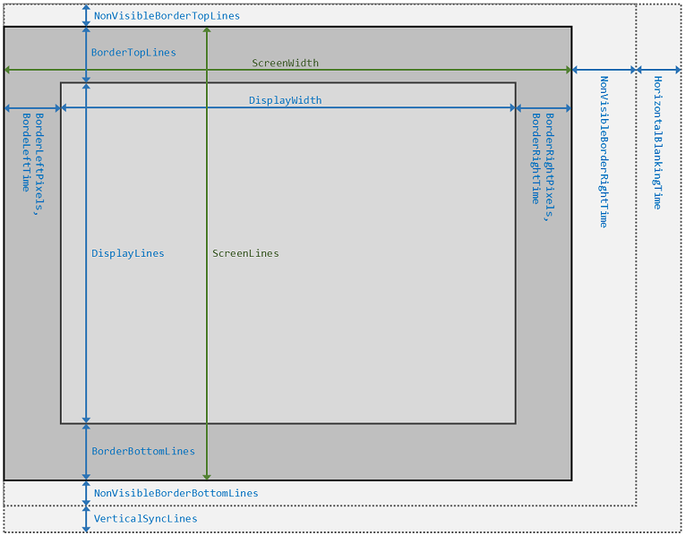

# ScreenConfiguration class

This class represents the configuration of the virtual machine's screen.

__Namespace__: `Spect.Net.SpectrumEmu.Devices.Screen`  
__Assembly__: `Spect.Net.SpectrumEmu`

```CSharp
public class ScreenConfiguration : IScreenConfiguration
```

The screen rendering mechanism uses a large number of configuration options that provides
the timing so that the CPU and the rendering hardware can work in tandem. The software 
emulation implements the same mechanism.

As the following figure shows, the screen has visible and non-visible areas, just as in the
case of the real hardware. Originally, the non-visible area was required by the cathode-ray tube
so that the electron beam could sync the screen rendering properly.



## Contents at a glance

* [Screen dimension properties]
  * [ScreenWidth]
  * [ScreenLines]
  * [DisplayWidth]
  * [DisplayLines]
  * [NonVisibleBorderTopLines]
  * [BorderTopLines]
  * [BorderBottomLines]
  * [NonVisibleBorderBottomLines]
  * [VerticalSyncLines]
  * [BorderLeftTime]
  * [BorderLeftPixels]
  * [BorderRightTime]
  * [BorderRightPixels]
  * [NonVisibleBorderRightTime]
  * [HorizontalBlankingTime]
* [Other properties]
  * [InterruptTact]
  * [FirstDisplayLine]
  * [LastDisplayLine]
  * [DisplayLineTime]
  * [ScreenLineTime]
  * [RasterLines]
  * [FirstDisplayPixelTact]
  * [FirstScreenPixelTact]
  * [ScreenRenderingFrameTactCount]
* [Methods]
  * [IsTactVisible(int, int)]
  * [IsTactInDisplayArea(int, int)]

## Screen dimension properties

### ScreenWidth

```CSharp
public int ScreenWidth { get; }
```

The width of the visible screen area in pixels.

### ScreenLines

```CSharp
public int ScreenLines { get; }
```

The height of the visible screen area in pixels.

### DisplayWidth

```CSharp
public int DisplayWidth { get; }
```

The width of the display area in pixels (256).

### DisplayLines

```CSharp
public int DisplayLines { get; }
```

The height of the display area in pixels.

### NonVisibleBorderTopLines

```CSharp
public int NonVisibleBorderTopLines { get; }
```

The number of top border lines that are not visible when rendering the screen.

### BorderTopLines

```CSharp
public int BorderTopLines { get; }
```

The number of border lines above the display area.

### BorderBottomLines

```CSharp
public int BorderBottomLines { get; }
```

The number of border lines below the display area.

### NonVisibleBorderBottomLines

```CSharp
public int NonVisibleBorderBottomLines { get; }
```

The number of bottom border lines that are not visible when rendering the screen.

### VerticalSyncLines

```CSharp
public int VerticalSyncLines { get; }
```

Number of lines used for vertical synch.

### BorderLeftTime

```CSharp
public int BorderLeftTime { get; }
```

The number of CPY T-cycles of displaying the left part of the border.

### BorderLeftPixels

```CSharp
public int BorderLeftPixels { get; }
```

The number of border pixels to the left of the display (`2 * BorderLeftTime`).

### BorderRightTime

```CSharp
public int BorderRightTime { get; }
```

The number of CPY T-cycles of displaying the right part of the border.


### BorderRightPixels

```CSharp
public int BorderRightPixels { get; }
```

The number of border pixels to the right of the display (`2 * BorderRightTime`).

### NonVisibleBorderRightTime

```CSharp
public int NonVisibleBorderRightTime { get; }
```

The time given in CPY T-cycles to render the nonvisible right part of the border.

### HorizontalBlankingTime

```CSharp
public int HorizontalBlankingTime { get; }
```

Horizontal blanking time (HSync + blanking) given in CPU T-cycles.

## Other properties

The `ScreenConfiguration` class provides other properties that are related to screen rendering.

### InterruptTact

```CSharp
public int InterruptTact { get; }
```

The tact index of the interrupt signal relative to the top-left screen pixel

### FirstDisplayLine

```CSharp
public int FirstDisplayLine { get; }
```

The screen line number of the first display line (`VerticalSyncLines 
+ NonVisibleBorderTopLines + BorderTopLines`).

### LastDisplayLine

```CSharp
public int LastDisplayLine { get; }
```

The screen line number of the last display line (`FirstDisplayLine + DisplayLines - 1`).

### DisplayLineTime

```CSharp
public int DisplayLineTime { get; }
```

The time of rendering a display pixel row, given in CPU T-cycles.

### ScreenLineTime

```CSharp
public int ScreenLineTime { get; }
```

The time of rendering an entire raster line, given in CPU T-cycles (`BorderLeftTime + 
DisplayLineTime + BorderRightTime + NonVisibleBorderRightTime + HorizontalBlankingTime`).

### RasterLines

```CSharp
public int RasterLines { get; }
```

The number of raster lines in the screen (`FirstDisplayLine + DisplayLines + BorderBottomLines + NonVisibleBorderBottomLines`).

### FirstDisplayPixelTact

```CSharp
public int FirstDisplayPixelTact { get; }
```

The tact in which the top left display pixel should be rendered, given in CPU T-cycles
(`FirstDisplayLine * ScreenLineTime + BorderLeftTime`).

### FirstScreenPixelTact

```CSharp
public int FirstScreenPixelTact { get; }
```

The tact in which the top left screen pixel (border) should be displayed
(`[VerticalSyncLines + NonVisibleBorderTopLines] * ScreenLineTime`).

### ScreenRenderingFrameTactCount

```CSharp
public int ScreenRenderingFrameTactCount { get; }
```

The number of CPU T-cycles used for the full rendering of the screen
(`RasterLines * ScreenLineTime`).

## Methods

The class provides a few helper methods.

### IsTactVisible(int, int)

```CSharp
public bool IsTactVisible(int line, int tactInLine)
```

Tests whether the specified tact is in the visible area of the screen. Returns true, if
the tact renders the visible part of the screen; otherwise, false.

#### Arguments

`line`: Raster line index  
`tactInLine`: Tact index within the line

### IsTactInDisplayArea(int, int)

```CSharp
public bool IsTactInDisplayArea(int line, int tactInLine)
```

Tests whether the specified tact is in the display area of the screen. Returns true, if
the tact renders the display part of the screen; otherwise, false.

#### Arguments

`line`: Raster line index  
`tactInLine`: Tact index within the line

