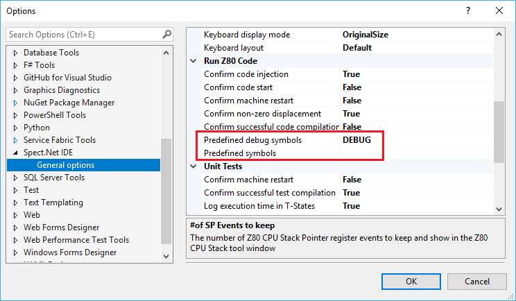

# Z80 Assembler Reference

This article is a complete reference of the __SpectNetIde__'s Z80 Assembler implementation. 
The assembler was designed with high performance in mind. Internally it uses the 
[__Antlr__](http://www.antlr.org/) tool for parsing the code.

I was inspired by the ideas of [__Simon Brattel__](http://www.desdes.com/index.htm). Many features 
I've implemented in the __SpectNetIde__ assembler were suggested by the community according to 
Simon's outstanding [Zeus Z80 Assembler](http://www.desdes.com/products/oldfiles/zeus.htm).
I honor his ideas and work.

## Main Features

The original goal of the __SpectNetIde__ assembler was to have a simple tool that allows you to compile
Z80 assembly code and inject it into the ZX Spectrum virtual machine. As the community has started
using it, I've been receiving feature requests to add some useful capability to the Assembler.

Here is a list of important features the __SpectNetIde__ suports:

* __Full Z80 instruction set__, including the initially undocumented Z80 registers and instructions
(such as the 8-bit halves of `ix` and `iy`, namely `ixl`, `ixh`, `iyl`, `iyh`).
* __ZX Spectrum Next extended Z80 instruction set__
* __Alternate syntax versions__. All directives, pragmas, and statements have multiple versions so that 
you can use your preferred notation. For example, you can use `.loop`, `loop`, `.LOOP` or `LOOP` to 
declare a loop. All of the `.defb`, `DEFB`, `.db`, `DB` (and a few other) tokens can be used for defining
byte data. The `.endw` and `WEND` tokens can close a WHILE-loop.
* __Z80 Preprocessor__. With preprocessor directives, you can carry out conditional compilation and include
other source files. You can inject symbols for debug time and run time compilations separately. *In __SpectNetIde__
you can use powerful macros, too, notheless, they are not preprocessor constructs (see below)*.
* __Fast compilation__. Of course, it depends on the code, but the compiler can emit code for about 8.000 
source code lines per second.
* __Rich expressions__. The compiler can handle most arithmetic and logic operators we have in C, C++, C#
Java, and JavaScript. You can use integer, float, and string expressions. The language support more than 40
functions that you can use in the expressions (e.g: `Amp * sin($cnt * Pi() / 16))`)
* __Rich literal formats__. Decimal, float, hexadecimal, binary, and string literals are at your displosal.
You can use multiple variants for hexadecimal numbers (`$12ae`, #12AE, 0x12AE, 12AEh), and binary numbers
(0b00111100, %00111100, %0011_1100). In strings, you can use ZX Spectrum specific escape codes, for example,
`\i` for INK, `\P` for the pound sign, and many others.
* __Assembler control flow statements__. You can use loops (`loop`, `repeat`..`until`, `while`..`wend`,
`for`..`next`) and conditional statements (`if`) to create an assembler control flow. These constructs 
can be nested and provide local scope for labels, symbols, and variables.
* __Powerful dynamic Macros__. You can create macros with arguments. In the macro bodies, the current values 
of arguments can replace entire instructions, operands, or parts of expressions. Moreover, through arguments,
you can inject multiline instructions and statements into macro declarations.

## How the Assembler Works

The assembler compiles the code in three phases:

1. It takes the source code and runs a preprocessor that parses the entire code, and applies the
*directives* in the code. You can easily recognize directives, as they start with `#`, such as
`#ifdef`, `#endif`, `#define`, `#include` and others. During the preprocessing phase,
the assembler detects the syntax errors, loads and processes the included files. The result is 
a *digested syntax tree* that does not contain directives anymore, only *instructions*, *pragmas*,
and *statements*.

1. The assembler goes through the digested syntax tree and emits code. During this operation, it needs
to evaluate expressions, resolve symbols and identifiers to their actual values. Because the assembler 
progresses from the first line to the last, it may happen that it cannot get the value of an identifier
which is defined somewhere later in the code. When the assembler detects such a situation, it makes 
a note of it &mdash; it creates a *fixup* entry.

1. The assembler goes through all fixup entries and resolves symbols that were not defined in
the previous phase. Of course, it might find unknows symbols. If this happens, the assembler reports
an error.

> Several pragmas and statements intend to evaluate an expression in phase #2. If they find an
> unresolved symbol during that phase, they do not create a fixup entry but immediately report an error.

### Language Structure

Each line of the source code is a declaration unit and is parsed in its own context. Such a 
source code line can be one of these constructs:
* A Z80 *instruction*, which can be directly compiled to binary code (such as ```ld bc,#12AC```)
* A *directive* that is used by the preprocessor of the compiler (e.g. ```#include```, ```#if```, etc.)
* A *pragma* that emits binary output or instructs the compiler for about code emission (```.org```, ```.defb```, etc.)
* A *compiler statement* (or shortly, a *statement*) that implements control flow operations for the compiler
(e.g. `.loop`, `.repeat`..`.until`, `.if`..`.elif`..`.else`..`.endif`)
* A *comment* that helps the understanding of the code.

### The Two Set of Symbols

The compiler works with two set of symbols. It uses the first set during the preprocessing phase in the
only in the directives. For example, with the `#define` directive, you define a symbol, with `#undef`
you remove it. Within the expressions you use in directives (such as `#if`), you can refer only to these symbols.

The __SpectNetIde__ option pages provide two options to declare your predefined symbols. When you compile
the code in the IDE, it will use these symbols as if you'd declare them with `#define`.



> You can declare multiple symbols and separate them with the `;` character.

The other set of symbols are the one you declare as *labels*, or with the `.equ` or `.var` pragmas
You can use this set everywhere except directives.

This duality is related to the way the compiler works: in the first, preprocessing phase it only
analyses directives. In the second, code emission phase, the compiler does not have any information
about directives, and thus it does not accesses the symbols used in the preprocessor.

### Assembly Language Flavors

I've designed the assembler with supporting multiple syntax flavors in mind. You do not have 
to explicitly declare the type of the syntax you intend to use, just use the flavor you prefer
&mdash; or mix muliple flavors, as you wish.

For example, you can use several mnemonics for defining a series of bytes, such as `.db`, `.defb`,
`db`, `defb`, and both lowecase or uppercase versions are welcome.

## Syntax Basics

The assembler language uses a special way of case-sensitivity. You can write the reserved
words (such as assembly instructions, pragmas, or directives) either with lowercase or
uppercase letters, but you cannot mix these cases. For example, this instructions use
proper syntax:

```
    LD c,A
    JP #12ac
    ldir
    djnz MyLabel
```

However, in these samples, character cases are mixed, and do the compiler will refuse them:

```
    Ld c,A
    Jp #12ac
    ldIR
    djNZ MyLabel
```

In symbolic names (labels, identifiers, etc.), you can mix lowercase and uppercase letters. Nonetheless, the compiler applies
case-insensitive comparison when mathcing symbolic names. So, these statement pairs are totally equivalent with
each other:
```
    jp MainEx
    jp MAINEX

    djnz mylabel
    djnz MyLabel

    ld hl,ErrNo
    ld hl,errNo
```

> In the future, I might implement a compiler option that allows turning off case-insensitivity.

### Comments

Comments start with a semicolon (```;```). The compiler takes the rest of the line into account as the body
of the comment. This sample illustrates this concept:

```
; This line is comment-only line
Wait:   ld b,8
Wait1:  djnz Wait1 ; wait while the counter reaches zero
```

> If you need multi-line comments, you can add single-line comments after each other. 
> The Z80 assembly in __spectnetide__ does not have separate multi-line comment syntax.

### Literals

The language syntax provides these types of literals:
* __Boolean values.__ The following tokens represent Booleans: `.false`, `false`, `.true`, `true`.
* __Decimal numbers.__ You can use up to 5 digits (0..9) to declare a decimal number. Examples:
16, 32768, 2354.
* __Floating point numbers.__ You can use the same notation for floating point numbers as in C/C++/Java/C#.
Here are a few samples:

```
.25
123.456
12.45E34
12.45e-12
3e+4
```

* __Hexadecimal numbers.__ You can use up to 4 hexadecimal digits (0..9, a..f or A..F) to declare
a hexadecimal literal. The compiler looks for one of the `#` `0x` or `$` prefix, or one of 
the `h` or `H` suffixes to recognize them as hexadecimal. If you use the `h` or `H`
suffixes, the hexadecimal number should start with a decimal digit `0`...`9`; otherwise the 
assembler interprets it as an identifier (label).
Here are a few samples:

```
    #12AC
    0x12ac
    $12Ac
    12ACh
    12acH
    0AC34H
```

* __Binary numbers.__ Literal starting with the one of the `%` or `0b` prefix are taken into 
account as binary literals. You can follow the prefix with up to 16 `0` or `1` digits. To make
them more readable, you can separate adjacent digits with the underscore (`_`) character. These 
are all valid binary literals:

```
    %01011111
    0b01011111
    0b_0101_1111
```

> You can use negative number with the minus sign in front of them. Actually, the sign is not
> the part of the numeric literal, it is an operator. 

* __Characters__. You can put a character between single quotes (for example: `'Q'`). 
* __Strings__. You can put a series of character between double quotes (for example: `"Sinclair"`).

> You can use escape sequences to define non-visible or control characters, as you will learn soon.

* __The `$` or `.` tokens__. These literals are equivalent; both represent the current assembly address.

### Identifiers

You can use identifiers to refer to labels and other constants. Identifiers must start with 
a letter (a..z or A..Z) or the underscore character (`_`). The subsequent characters 
letters, digits, or underscores. Here are a few samples:

```
MyCycle
ERR_NO
Cycle_4_Wait  
```
> There are strings that can be both identifiers or hexadecimal literals with the `H` or `h` suffix, like
`AC0Fh` or `FADH`. The assembler considers such strings as identifiers. To use hexadecimal literal, use a `0`
prefix: `0FADH` is a hexadecimal literal, while `FADH` is an identifier.

> Theoretically, you can use as long identifiers as you want. I suggest you to make them no longer than
32 characters so that readers may read your code easily.

### Characters and Strings

You have already learned that you can utilize character and string literals (wrapped into single, or double quotes, 
respectively), such as in these samples:

```
"This is a string. The next sample is a single character:"
'c'
```

ZX Spectrum has a character set with special control characters such as AT, INK, PAPER, and so on.

The __SpectNetIde__ assembler allows you to define them with special escape sequences:

Escape | Code | Character
-------|------|----------
`\i` | 0x10 | INK 
`\p` | 0x11 | PAPER
`\f` | 0x12 | FLASH
`\b` | 0x13 | BRIGHT
`\I` | 0x14 | INVERSE
`\o` | 0x15 | OVER
`\a` | 0x16 | AT
`\t` | 0x17 | TAB
`\P` | 0x60 | pound sign
`\C` | 0x7F | copyright sign
`\\` | 0x5C | backslash
`\'` | 0x27 | single quote
`\"` | 0x22 | double quote
`\0` | 0x00 | binary zero

> Observe, some of these sequences have different values than their corresponding
> pairs in other languages, such as C, C++, C#, or Java.

To declare a character by its binary code, you can use the `\xH` or  
`\xHH` sequences (`H` is a hexadecimal digit). For example, these
escape sequence pairs are equivalent:

```
"\i"
"\x10"

"\C by me"
"\x7f \x62y me"
```

## Expressions

The __SpectNetIde__ assembler has a rich syntax for evaluating expressions. You can use the very
same syntax with the `#if` directives, the Z80 instructions, and the compiler statements.

You can use operands and operators just like in most programming languages. Nevertheless, 
the __SpectNetIde__ implementation has its particular way of evaluating expressions:

* Expressions can be one of these types: 
  * *Booleans* (`true` or `false`)
  * *integers* (64-bit) 
  * *floating point numbers* (64-bit precision)
  * *strings* (with 8-bit characters)

* The assembler applies implicit conversion whenever it's possible.
  * Floating point numbers are truncated to integer values.
  * The `true` Boolean literal is represented with the integer value `1`; `false` with `0`.
  * When the assembler needs a Boolean value, `0` is taken into account as `false`, any other values as `true`.
  * There is no implicit conversion between strings and any numeric values.
* When the compiler needs a 16-bit value (for example, `ld hl,NNNN`), it uses the rightmost 
16 bits of an expression's value.
* When a Z80 operation (for example, `ld a,NN`) needs an 8-bit value, it utilizes the 
rightmost 8 bits.

> In the future, these compiler features may change by issuing a warning in case of
> arithmetic overflow.

* Besides the parentheses &mdash; `(` and `)` &mdash; you can use square brackets 
&mdash; `[` and `]` &mdash; to group operations and change operator precedence.

```
; This is valid
ld hl,(Offset+#20)*2+BaseAddr

; Just like this
ld hl,[Offset+#20]*2+BaseAddr
```

### Instant and Late Expression Evaluation

Depending on the context in which an expression is used, the compiler evaluates it instantly or
decides to postpone the evaluation. For example, when you use the `.org` pragma, the compiler applies
immediate evaluation. Let's assume, this is your code:

```
Start: .org #8000 + Later
; code body (omitted)
Later: .db #ff
```

The value of `Later` depends on the address in `.org`, and the `.org` address depends on `Later`, 
so this declaration could not be resolved properly, it's like a deadlock. To avoid such situations, 
the `.org` pragma would raise an error, as the moment of its evaluation the `Later` symbol's value is 
unknown.

For most Z80 instructions the compiler uses late evaluation:

```
Start: .org #6000
    ld hl,(MyVar)
    ; code body omitted
    ret
MyVar: .defs 2
```

When the compiler reaches the `ld hl,(MyVar)` instruction, it does not know the value of `MyVar`. Nonetheless,
it does not stop with an error, but generates the machine code for `ld hl,(0)`, namely #21, #00, and #00; 
takes a note (it is called a *fixup*) when `MyVal` gets a value, the two #00 bytes generated at address #6001 
should be updated accordingly.

### Operands
You can use the following operands in epressions:
* Boolean, Decimal and hexadecimal literals
* Character literals
* Identifiers
* The `$` token

> String literals cannot be used as operands.

### Operators

You can use about a dozen operators, including unary, binary and ternary ones. In this section
you will learn about them. I will introduce them in descending order of their precendence.

#### Conditional Operator

The assembler supports using only one ternary operator, the conditional operator:

_conditional-expression_ __`?`__ _true-value_ __`:`__ _false-value_

This operation results in -1:

`2 > 3 ? 2 : -1`

When the _conditional-expression_ evaluates to true, the operation results 
in _true-value_; otherwise in _false-value_.

> Conditional expressions are evaluated from right to left, in contrast to binary operators,
> which use left-to-right evaluation.

#### Binary Bitwise Operators

Operator token | Precedence | Description
---------------|------------|------------
`|` | 1 | Bitwise OR
`^` | 2 | Bitwise XOR
`&` | 3 | Bitwise AND &mdash; string concatenation with new line

> The `&` operator can be applied on two strings. If you do so, the compiler concatenates the two 
> strings and puts a `\r\n` (next line) character pair between them. 
#### Relational Operators

Operator token | Precedence | Description
---------------|------------|------------
`==` | 4 | Equality
`!=` | 4 | Non-equality
`<`  | 5 | Less than
`<=` | 5 | Less than or equal
`>`  | 5 | Greater than
`>=` | 5 | Greater than or equal

#### Shift Operators

The bits of the left operand are shifted by the number of bits given by the right operand.

Operator token | Precedence | Description
---------------|------------|------------
`<<` | 6 | Shift left
`>>` | 6 | Shift right

#### Basic Arithmetic Operators

Operator token | Precedence | Description
---------------|------------|------------
`+` | 7 | Addition &mdash; string concatenation
`-` | 7 | Subtraction
`*` | 8 | Multiplication
`/` | 8 | Division
`%` | 8 | Modulo calculation

#### Unary operators

Operator token | Precedence | Description
---------------|------------|------------
`+` | 9 | Unary plus
`-` | 9 | Unary minus
`~` | 9 | Unary bitwise NOT
`!` | 9 | Unary logical NOT

> Do not forget, you can change the defult precendence with `(` and `)`, or with `[` and `]`.

### Functions

The Z80 assembler provides a number of functions that can have zero, one, or more arguments. 
Several functions (for example as `rnd()`) have overloads with different signatures. Each 
function has a name and a parameter list wrapped into parentheses, the parameters are separated
by a comma. Of course, parameters can be expressions, and they may invoke other functions, too.
Here are a few samples:

```
lenght("Hello" + " world")
max(value1, value2)
sin(pi()/2)
sqrt(pear + 3.0)
```

The __SpectNetIde__ support these function signatures:

Signature | Value | Description 
----------|-------|------------
`abs(integer)` | `integer` |The absolute value of an *integer* number.
`abs(float)` | `float` | The absolute value of a *float* number.
`acos(float)` | `float` | The angle whose cosine is the specified number.
`asin(float)` | `float` | The angle whose sine is the specified number.
`atan(float)` | `float` | The angle whose tangent is the specified number.
`atan2(float, float)` | `float` | The angle whose tangent is the quotient of two specified numbers.
`ceiling(float)` | `float` | The smallest integral value that is greater than or equal to the specified number.
`cos(float)` | `float` | The cosine of the specified angle.
`cosh(float)` | `float` | The hyperbolic cosine of the specified angle.
`exp(float)` | `float` | __e__ raised to the specified power.
`fill(string, integer)` | `string` | Creates a new string by concatenating the specified one with the given times.
`floor(float)` | `float` | The largest integer less than or equal to the specified number.
`frac(float)` | `float` | The fractional part of the specified number.
`high(integer)` | `integer` | The leftmost 8 bits (MSB) of a 16-bit integer number.
`int(float)` | `integer` | The integer part of the specified number.
`left(string, integer)` | `string` | Takes the leftmost characters of the string with the length specified.
`len(string)` | `integer` | The length of the specified string.
`length(string)` | `integer` | The length of the specified string.
`log(float)` | `float` | The natural (base __e__) logarithm of a specified number.
`log(float, float)` | `float` | The logarithm of a specified number in a specified base.
`log10(float)` | `float` | The base 10 logarithm of a specified number.
`low(integer)` | `integer` | The rightmost 8 bits (LSB) of an integer number.
`max(integer, integer)` | `integer` |  The larger of two *integer* numbers.
`max(float, float)` | `float` | The larger of two *float* numbers.
`min(integer, integer)` | `integer` |  The smaller of two *integer* numbers.
`min(float, float)` | `float` | The smaller of two *float* numbers.
`nat()` | `float` | Represents the natural logarithmic base, specified by the constant, __e__.
`pi()` | `float` | Represents the ratio of the circumference of a circle to its diameter, specified by the constant, __&pi;__.
`pow(float, float)` | `float` | The specified number raised to the specified power.
`right(string, integer)` | `string` | Takes the rightmost characters of the string with the length specified.
`round(float)` | `float` | Rounds a *float* value to the nearest integral value.
`round(float, int)` | `float` | Rounds a *float* value to a specified number of fractional digits.
`rnd()` | `integer` | Returns a random 32-bit number.
`rnd(integer, integer)` | `integer` | Returns a random 32-bit integer between the first and second number.
`sign(integer)` | `integer` | Returns an integer that indicates the sign of an *integer* number.
`sign(float)` | `integer` | Returns an integer that indicates the sign of a *float* number.
`sin(float)` | `float` | The sine of the specified angle.
`sinh(float)` | `float` | The hyperbolic sine of the specified angle.
`sqrt(float)` | `float` | The square root of a specified number.
`substr(string, integer, integer)` | `string` | Takes a substring of the specified string from the given position (zero-based) and length.
`tan(float)` | `float` | The tangent of the specified angle.
`tanh(float)` | `float` | The hyperbolic tangent of the specified angle.
`truncate(float)` | `integer` | Calculates the integral part of a specified number.
`word(integer)` | `integer` | The rightmost 16 bits of an integer number.

Functions have the same precedence as the unary operators (such as the unary `+` and `-`).

## Z80 Instructions

__SpectNetIde__ implements Every officially documented Z80 instruction as well as the 
non-official ones. During the implementation I used [ClrHome.org](http://clrhome.org/table/)
as a reference.

Z80 instructions may start with a label. Labels are identifiers that can be terminated by an
optional colon (`:`). Both labels in these samples are accepted by the compiler:

```
Start: ld b,#f0
Wait   djnz Wait
```

### Z80 Mnemonics

The compiler accepts these mnemonics:

`ADC`, `ADD`, `AND`, `BIT`, `CALL`, `CCF`, `CP`, `CPD`,
`CPDR`, `CPI`, `CPIR`, `CPL`, `DAA`, `DEC`, `DI`, `DJNZ`,
`EI`, `EX`, `EXX`, `HALT`, `IM`, `IN`, `INC`, `IND`,
`INDR`, `INI`, `INIR`, `JP`, `JR`, `LD`, `LDD`, `LDDR`, `LDDRX`&ast;, `LDDX`&ast;, 
`LDI`, `LDIR`, `LDIRSCALE`&ast;, `LDIRX`&ast;, `LDIX`&ast;, `LDPIRX`&ast;, `MIRROR`&ast;, `MUL`&ast;, `NEG`, 
`NEXTREG`&ast;, `NOP`, `OR`, `OTDR`, `OTIR`, `OUT`, `OUTINB`&ast;,
`OUTD`, `OUTI`, `PIXELAD`&ast;, `PIXELDN`&ast;, `POP`, `PUSH`, `RES`, `RET`, `RETI`, `RETN`,
`RL`, `RLA`, `RLC`, `RLCA`, `RLD`, `RR`, `RRA`, `RRC`,
`RRCA`, `RRD`, `RST`, `SBC`, `SCF`, `SET`, `SETAE`&ast;, `SLA`, `SLL`
`SRA`, `SRL`, `SUB`, `SWAPNIB`&ast;, `TEST`&ast;, `XOR`.

> The instructions marked with &ast; can be used only with the ZX Spectrum Next model.

### Z80 Registers

The compiler uses the standard 8-bit and 16-bit register names, as specified in the official 
Zilog Z80 documentation:

* 8-bit registers: `A`, `B`, `C`, `D`, `E`, `H`, `L`, `I`, `R`
* 16-bit registers: `AF`, `BC`, `DE`, `HL`, `SP`, `IX`, `IY`
* For the 8-bit halves of the `IX` and `IY` index registers, the compiler uses these names:
`XL`, `XH`, `YL`, `YH`. Alternatively, the compiler accepts these names, too: 
`IXL`, `IXH`, `IYL`, `IYH`. As a kind of exception to general naming conventions, 
these mixed-case names are also accepted: `IXl`, `IXh`, `IYl`, `IYh`.

### JP Syntax

Z80 assemblers use two different syntax for the indirect `JP` statements:

```
; Notation #1
jp hl
jp ix
jp iy

; Notation #2
jp (hl)
jp (ix)
jp (iy)
```
The __SpectNetIde__ compiler accepts both notation.

### ALU operations syntax

Three standard ALU operations between `A` and other operands (`ADD`, `ADC`, and `SBC`) sign `A`
as their first operand:

```
add a,b
adc a,(hl)
sbc a,e
```

Hovewer, the five other standard ALU operations between `A` and other operands (`SUB`, `AND`, `XOR`, 
`OR`, and `CP`) omit `A` from their notation:

```
sub e
and (hl)
xor e
or c
cp b
```

The __SpectNetIde__ compiler accepts the second group of ALU operations with using the explicit 
`A` operand, too:

```
sub a,e
and a,(hl)
xor a,e
or a,c
cp a,b
```

### Expression Evaluation

The compiler evaluates expressions in two trips. First, when the lines of the assembly codes are
successfully parsed, and the compiler emits the output. This time might be expressions that cannot
be promptly evaluated. So, after the code is emitted, the compiler start fixup trip to resolve
the values of symbols that remained unresolved in the first trip.
This a sample demonstrates this situation:

```
        ld hl,Table
        ld a,#20
        ; ...
Table:  ld bc,#4000
```

When the compiler emits the code for the `ld hl,Table` instruction, it does not know the
value of `Table`, as this symbol will receive its value only later. In the first trip, the
compiler records the fact that later it should use the value of `Table` to complete the 
`ld hl,NNNN` instruction.
While emitting the code, the compiler reaches the `ld bc,#4000` instruction and at that point 
it has a value for `Table`.
After the code is emitted, in the second &mdash; fixup &mdash; trip, the compiler is able to replace
`Table` with its value.

There might be situations when the compiler cannot resolve symbolic values. In this case it signs an error.
For example, in this example there is a circular reference between `Addr1` and `Addr2`:

```
Addr1: .equ Addr2+#20
       ; ...
Addr2  .equ Addr1-#10
```

## Pragmas

The compiler understands several pragmas that &mdash; thought they are not Z80 
instructions &mdash; they influence the emitted code. Each pragma has two alternative syntax,
one with a dot prefix and another without it. 

For example, you can write ```ORG``` or ```.ORG``` to use the __ORG__ pragma.

> I prefer using the dot-prefixed versions of pragmas.

### The ORG pragma

With the __ORG__ pragma, you define where to place the compiled Z80 code when you run it.
For example, the following line sets this location to the 0x6000 address:

```
.org #6000
```

If you do not use __ORG__, the default address is 0x8000.

You can apply multiple __ORG__ pragmas in your source code. Each usage creates a new segment in the
assembler output. Take a look at this code:

```
    ld h,a
    .org #8100
    ld d,a
    .org #8200
    ld b,a
```

This code generates three output segment, each with one emitted byte that represents the 
corresponding `LD` operation. The first segment will start at 0x8000 (default), 
the second at 0x8100, whilst the third at 0x8200.

### The ENT pragma

The __ENT__ pragma defines the entry code of the program when you run it from Visual Studio.
If you do not apply __ENT__ in your code, the entry point will be the first address of the 
very first output code segment. Here's a sample:

```
    .org #6200
    ld hl,#4000
    .ent $
    jp #6100

    .org #6100
    call MyCode
    ...
```

The `.ent $` pragma will sign the address of the `jp #6100` isntruction as the entry
address of the code. Should you omit the __ENT__ pragma from this code, the entry point would be
0x6200, for this is the start of the very first output segment, even though there is another
segment starting at 0x6100.

### The XENT pragma

The IDE provides a command, __Export Z80 Program__, which allows you to create a LOAD block
that automatically starts the code. The __Run Z80 Program__ and __Debug Z80 Program__ command
simply jump to the address you specify with the __ENT__ pragma. However, the auto LOAD block uses
the __`RANDOMIZE USR address`__ pattern where you need to define a different entry address that
can be closed with a __`RET`__ statement. The __XENT__ pragma sets this address.
 Here's a sample:

```
start: 
	.org #8000
	.ent #8000
	call SetBorder
	jp #12ac
SetBorder:
	.xent $
	ld a,4
	out (#fe),a
	ret
```

The IDE will use #8000 &mdash; according to the `.ent #8000` pragma &mdash; when starting
the code with the __Run Z80 Program__. Nonetheless, the __Export Z80 Program__ will offer #8006
&mdash; according to the `.xent $` pragma &mdash; as the startup code address.

### The DISP pragma

The __DISP__ pragma allows you to define a displacement for the code. The value affects the
`$` token that represents the current assembly address. Your code is placed according 
to the __ORG__ of the particular output segment, but the assembly address is always displaced
with the value according to __DISP__. Take a look at this sample:

```
    .org #6000
    .disp #1000
    ld hl,$
```

The `ld hl,$` instruction will be placed to the 0x6000 address, but it will be equivalent
with the `ld hl,#7000` statement due to the `.disp #1000` displacement.

> Of course, you can use negative displacement, too.

### The EQU pragma

The __EQU__ pragma allows you assign a value to an identifier. The label before __EQU__ is the
name of the identifier (or symbol), the exression used in __EQU__ is the value of the variable.
This is a short sample:

```
        .org #6200
        ld hl,Sym1
Sym1:   .equ #4000
        ld bc,Sym2
Sym2:   .equ $+4
```

This sample is equivalent with this one:

```
        .org #6200
        ld hl,#4000 ; Sym1 <-- #4000
        ld bc,#620a ; Sym2 <-- #620a as an ld bc,NNNN operation and
                               an ld hl,NNNN each takes 3 bytes
```

### The VAR pragma

The __VAR__ pragma works similarly to __EQU__. However, while __EQU__ does not allow using the same symbol
with mulitple value assignments, __VAR__ assigns a new value to the symbol every time it is used.

> The VAR pragma accepts extra syntax alternatives: `=`, `:=`

### The DEFB pragma

The __DEFB__ pragma emits 8-bit expressions (bytes) from the current assembly position.
here is a sample:

```
    .org #6000
    .defb #01, #02, $, #04
```

The __DEFB__ pragma will emit these four bytes starting at 0x6000: 0x01, 0x02, 0x03, 0x04.
The `$` expression will emit 0x03, because at the emission point the current assembly
address is 0x6003. The __DEFB__ program takes into account only the rightmost 8 bits of any
expression: this is how `$` results in 0x03.

> __DEFB__ has extra syntax variants: `db`, `.db`, `DB`, and `.DB` are accepted, too.

### The DEFW pragma

The __DEFW__ pragma is similar to __DEFB__, but it emits 16-bit values with LSB, MSB order.

```
    .defw #1234, #abcd
```

This simple code above will emit these four bytes: 0x34, 0x12, 0xcd, 0xab.

> __DEFW__ has extra syntax variants: `dw`, `.dw`, `DW`, and `.DW` are accepted, too.

### The DEFM pragma

The __DEFM__ pragma emits the byte-array representation of a string. Each character
in the string is replaced with the correcponding byte. Tak a look at this code:

```
    .defm "\C by me"
```

Here, the __DEFM__ pragma emits 7 bytes for the seven characters (the first escape 
sequence represents the copyrigh sign) : 0x7f, 0x20, 0x62, 0x69, 0x20, 0x6d, 0x65.

> __DEFM__ has extra syntax variants: `dm`, `.dm`, `DM`, and `.DM` are accepted, too.

### The DEFS pragma

You can emit zero (`0x00`) bytes with this pragma. It accepts a single argument,
the number of zeros to emit. This code sends 16 zeros to the generated output:

```
    .defs 16
```

### The FILLB pragma

With __FILLB__, you can emit a particular count of a specific byte. The first argument
of the pragma sets the count, the second specifies the byte to emit. This code emits 24
bytes of `#A5` values:
```
    .fillb 24,#a5
```

### The FILLW pragma

With __FILLW__, you can emit a particular count of a specific 16-bit word. The first argument
of the pragma sets the count, the second specifies the word to emit. This code emits 8
words (16 bytes) of `#12A5` values:
```
    .fillw 8,#12a5
```

Of course, the bytes of a word are emitted in LSB/MSB order.


### The SKIP pragma

The __SKIP__ pragma &mdash; as its name suggests &mdash; skips the number of bytes
as specified in its argument. It fills up the skipped bytes with 0xFF.

### The EXTERN pragma

The __EXTERN__ pragma is kept for future extension. The current compiler accepts it, but
does not do any action when observing this pragma.

### The MODEL pragma

This pragma is used when you run or debug your Z80 code within the emulator. With Spectrum 128K, Spectrum +3, 
and Spectrum Next models, you can run the Z80 code in differend contexts. The __MODEL__ pragma lets you
specify on which model you want to run the code. You can use the `SPECTRUM48`, `SPECTRUM128`, 
`SPECTRUMP3`, or `NEXT` identifiers to choose the model (identifiers are case-insensitive):

```
.model Spectrum48
.model Spectrum128
.model SpectrumP3
.model Next
```

For example, when you create code for Spectrum 128K, and add the `.model Spectrum48` pragma to the code,
the __Run Z80 Code__ command will start the virtual machine, turns the machine into Spectrum 48K mode, and ignites
the code just after that.

_Note_: With the `#ifmod` and `#ifnmod` directives, you can check the model type. For example, the following
Z80 code results green background on Spectrum 48K, cyan an Spectrum 128K:

```
    .model Spectrum48

#ifmod Spectrum128
    BorderColor: .equ 5
    RetAddr: .equ #2604
#else
    BorderColor: .equ 4
    RetAddr: .equ #12a2
#endif


Start:
    .org #8000
    ld a,BorderColor
    out (#fe),a
    jp RetAddr
```

### The ALIGN pragma

This pragma allows you to align the current assembly counter to the specified byte boundary. 
You can use this pragma with an optional expression. Look at these samples:

```
.org #8000
    nop
.align 4
    nop
.align
```

The first pragma aligns the assembly counter to #8004, as this one is the next 4-byte boundary.
With no value specified, `.align` uses #100, and thus the second `.align` in the sample sets
the current assembly counter to the next page boundary, #8100.

### The TRACE and TRACEHEX pragmas

These pragmas send trace information to the assembler output. In the Visual Studio IDE, these
messages are displayed in the Z80 Build Output window pane. You can list one or more expressions 
separated by a comma after the `.trace` token. TRACEHEX works just like TRACE, but id displays 
integer numbers and strings in hexadecimal format.

Let'assume, you add these lines to the source code:

```
.trace "Hello, this is: ", 42
.tracehex "Hello, this is: ", 42
```

When you compile the source, the lines above display these messages:

```
TRACE: Hello, this is: 42
TRACE: 48656C6C6F2C20746869732069733A20002A
```

### The RNDSEED pragma

With the `rnd()` function, you can generate random numbers. The RNDSEED pragma sets the seed
value to use for random number generation. If you use this pragma with an integer expression,
the seed is set to tha value of that expression. If you do not provide the expression, the compiler
uses the system clock to set up the seed.

```
.rndseed ; sets the seed according to the system clock
.rndseed 123 ; sets the seed to 123
```

### The DEFG pragma

This pragma helps you define bitmaps in the code. This pragma excepts a string expression 
and utilizes that string as a pattern to generate bytes for the bitmap.

> __DEFG__ has extra syntax variants: `dg`, `.dg`, `DG`, and `.DG` are accepted, too.

If the very first character of the string pattern is `<`, the pattern is left aligned, 
and starts with the second character. Should the first character be `>`, the pattern is 
right aligned and starts with the second character. By default, (if no `<` or `>` is used)
the pattern is left-aligned.

Any space within the pattern are ignored, taken into account as helpers. Other characters
are converted into bits one-by-one.

Before the conversion, the pragma checks if the pattern constitutes multiples of 8 bits.
If not, it uses zero bit prefixes (right-aligned), or zero-bit suffixes (left-aligned)
so that the pattern would be adjusted to contain entire bytes.

The `.` (dot), `-` (dash), and `_` (underscore) sign 0, any other characters stand for 1. 
Every 8 bits in the pattern emit a byte.

Here are a few samples:

```
.dg "....OOOO"         ; #0F
.dg ">....OOOO"        ; #0F
.dg "<----OOOO"        ; #0F
.dg "___OOOO"          ; #1E
.dg "....OOOO ..OO"    ; #0F, #30
.dg ">....OO OO..OOOO" ; #03, #CF
```

## Statements

Statements are __SpectNetIde__ specific control flow constructs &mdash; thanks again for the inspiration by
[Simon Brattel](http://www.desdes.com/index.htm) &mdash; that instruct the compiler about loop-like and
conditional compilation.

> While *directives* help you to organize your code and include code files optionally according to the
> compilation context, *statements* provide you more useful tools to shorten the way you can declare Z80
> assembly code.

Each statement can be written with a leading dot, or without it, and the compiler accepts both lowercase 
and uppercase versions. For example all of these version are valid: `.if`, `if`, `.IF`, and `IF`.

### The LOOP Block

With LOOP block, you can organize a cycle to emit code. Here is a sample that tells the gist:

```
.loop 6
  add hl,hl 
.endl
```

This is a shorter way to multiply __HL__ with 64. It is equivalent with the following code:

```
  add hl,hl
  add hl,hl
  add hl,hl
  add hl,hl
  add hl,hl
  add hl,hl
```

The `.loop` statement accepts an expression. The compiler repeats the instructions within the 
loop's body according to the value of the expression. The `.endl` statement marks the end of the loop.

> You can use many flavors for the `.endl` block closing statement. `.endl`, `endl`, `.lend`, `lend`
> are all accepted &mdash; with fully uppercase letters, too.

Look at this code:

```
counter .equ 2
; do something (code omitted)
.loop counter + 1
  .db #80, #00
.endl
```

This is as if you wrote this:

```
  .db #80, #00
  .db #80, #00
  .db #80, #00
```

### The LOOP Scope

The `.loop` statement declares a scope for all labels, symbols, and variables declared in the loop's
body. Every iteration has its separate local scope. When the assembler resolves symbols, it starts 
from the scope of the loop, and tries to resolve the value of a symbol. If it fails, steps out to 
the outer scope, and goes on with the resolution.

Check this code:

```
value .equ 2
; do something (code omitted)
.loop 2
    value .equ 5
    ld a,value
.endl
```

The compiler takes it into account as if you wrote this:

```
    ld a,5
    ld a,5
```

The `value` symbol declared within the loop, overrides `value` in the outer scope, and
thus 5 is used instead of 5.

Nonetheless, you when you utilize a different construct, it seems a bit strange at first:

```
value .equ 2
; do something (code omitted)
.loop 2
    ld a,value
    value .equ 5
    ld b,value
.endl
```

The strangeness is that the compiler creates this:

```
    ld a,2
    ld b,5
    ld a,2
    ld b,5
```

When the assembler resolves `value` in the `ld a,value` instruction, if finds `value` 
in the outer scope only, as it is not declared yet within the loop's scope. In the `ld b,value`
instruction `value` gets resolved from the inner scope, so it takes 5.

### Variables and Scopes

Unlike symbols that work as constant values, variables (declared with the `.var` pragma, or its syntactical 
equivalents, the `=` or `:=` tokens) can change their values.

Take a look at this code:

```
counter = 4
.loop 3
    innercounter = 4
    ld a,counter + innercounter
    counter = counter + 1
.endl
```

Here, the `counter` variable is defined in the global scope (out of the loop's scope), while `innercounter` in
the local scope of the loop. When evaluating the `counter = counter + 1` statement, the compiler finds `counter` in
the outer scope, so it uses that variable to increment its value. This code emits machine code for this source:

```
ld a,#08
ld a,#09
ld a,#0A
```

Now, add a single line to the loop's code:

```
counter = 4
.loop 3
    innercounter = 4
    ld a,counter + innercounter
    counter = counter + 1
.endl
ld b,innercounter
```

The compiler will not compile this code, as it cannot find the value for `innercounter` in the `ld b,innercount` 
instruction. Because `innercounter` is defined in the local scope of the loop, this scope is immediately disposed as
the loop is completed. When the compiler processes the `ld b,innercounter` instruction, the local scope is not 
available.

### Labels and Scopes

Labels behave like symbols, and they work similarly. When you create a label within a loop, that label is created in
the local scope of the loop. The following code helps you understand which labels are the part of the global scope, and
which are created in the loop's scope:

```
.org #8000
MyLoop: .loop 2
    ld bc,MyLoop
Inner: 
    ld de,MyEnd
    ld hl,Inner
    ld ix,Outer
MyEnd: .endl
Outer: nop
```

The label of the `.loop` statement is part of the outer (global) scope, just like the label that *follows* the 
`.endl` statement. However, all labels declared within the loop's body, including the label of the `.endl`
statement belongs to the local scope of the loop.

Thus, the compiler translates the code above into this one:

```
         (#8000): ld bc,#8000 (MyLoop)
Inner_1  (#8003): ld de,#800D (MyEnd_1)
         (#8006): ld hl,#8003 (Inner_1)
         (#8009): ld ix,#801A (Outer)
MyEnd_1  (#800D): ld bc,#8000 (MyLoop)
Inner_2  (#8010): ld de,#801A (MyEnd_2)
         (#8013): ld hl,#8010 (Inner_2)
         (#8016): ld ix,#801A (Outer)
MyEnd_2
Outer    (#801A): nop
```

Here, `Inner_1`, `Inner_2`, `MyEnd_1`, and `MyEnd_2` represents the labels created in the local scope of the
loop. The `_1` and `_2` suffixes indicate that each loop iteration has a separate local scope. As you can see,
the last iteration of `MyLabel` points to the first outer address (`Outer` label).

### Nesting LOOPs

Of course, you can nest loops, such as in this code:

```
.loop 3
  nop
  .loop 2
    ld a,b
  .endl
  inc b
.endl
```

This code snippet translates to this:

```
nop
ld a,b
ld a,b
inc b
nop
ld a,b
ld a,b
inc b
nop
ld a,b
ld a,b
inc b
```

When you nest loops, each loop has its separate scope.

### The $CNT value

It is very useful to use the `$cnt` value that represents the current loop counter. It starts from 
1 and increments to the maximum number of loops. This sample demonstrates how you can use it:

```
.loop 2
  outerCount = $cnt
  .loop 3
     .db #10 * outerCount + $cnt
  .endl
.endl
```

This code translates to this:

```
.db #11
.db #12
.db #13
.db #21
.db #22
.db #23
```

You can observe that each loop has its spearate `$cnt` value.

> The `$ctn` value has several syntax versions that the compiler accepts: `$CNT`, 
> `.cnt`, and `.CNT`.

### The REPEAT..UNTIL Block

While the `.loop` statement works with an expression that specified the loop counter,
the `.repeat`..`.until` block uses an exit condition to create more flexible loops.
Here is a sample:

```
counter = 0
.repeat 
    .db counter
    counter = counter + 3
.until counter % 7 == 0
```

Observe, the `counter % 7 == 0` condition specifies when *to exit* the loop. Because the
exit condition is examined only at the end of the loop, the `.repeat` blocks executes 
at least once.

The sample above translates to this:

```
.db 0
.db 3
.db 6
.db 9
.db 12
.db 15
.db 18
```

The `.repeat` block uses the same approach to handle its local scope, symbols, labels, and
variables as the `.loop` block. The block also provides the `$cnt` loop counter that starts 
from 1 and increments in every loop cycle. 

This sample demontrates the `.repeat` block in action:

```
.org #8000
counter = 0
.repeat 
    .db low(EndLabel), high(Endlabel), $cnt
    counter = counter + 3
EndLabel: .until counter % 7 == 0
```

The compiler translates the code to this:

```
.db #03, #80, #01
.db #06, #80, #02
.db #09, #80, #03
.db #0C, #80, #04
.db #0F, #80, #05
.db #12, #80, #06
.db #15, #80, #07
```

### The WHILE..ENDW Block

With `.while` loop, you can create another kind of block, which uses entry condition. For example,
the following code snippet generates instructions to create the sum of numbers from 1 to 9:

```
counter = 1
    ld a,0
.while counter < 10
    add a,counter
    counter = counter + 1
.endw
```

The `.while`..`.endw` block uses an entry condition declared in the `.while` statement. Provided, this
condition is true, the compiler enters into the body of the loop, and compiles all instructions and statements
until it reaches the `.endw` statement. Observe, it may happen that the body of the loop is never reached.

The compiler translates the code snippet above to the following:

```
ld a,0
add a,1
add a,2
add a,3
add a,4
add a,5
add a,6
add a,7
add a,8
add a,9
```

Just like the `.loop` and the `.repeat` blocks, `.while` uses the same approach to handle its local scope, 
symbols, labels, and variables. This block also provides the `$cnt` loop counter that starts  from 1 and increments 
in every loop cycle.

This code demonstrates the `.while` block with labels and using `$cnt` value:

```
counter = 0
.while counter < 21 
    .db low(EndLabel), high(Endlabel), $cnt
    counter = counter + 3
EndLabel: .endw
```

The compiler translates the code to this:

```
.db #03, #80, #01
.db #06, #80, #02
.db #09, #80, #03
.db #0C, #80, #04
.db #0F, #80, #05
.db #12, #80, #06
.db #15, #80, #07
```

> You can use many flavors for the `.endw` block closing statement. `.endw`, `endw`, `.wend`, `wend`
> are all accepted &mdash; with fully uppercase letters, too.

### The FOR..NEXT Loop

Tou can use the traditional `.for`..`.next` loop to create a loop:

```
.for myVar = 2 .to 5
  .db 1 << int(myVar)
.next
```

This loop uses the `myVar` variable as its *iteration variable*, which iterates from 1 to 4. As you expect, 
the compiler translates the for-loop into this:

```
.db #04
.db #08
.db #10
.db #20
```

You can specify a `.step` close to change the loop increment value:

```
.for myVar = 1 .to 7 .step 2
  .db 1 << int(myVar)
.next
```

Now, the code translates to this:

```
.db #02
.db #08
.db #20
.db #80
```

You can create a loop with decrementing iteration variable value:

```
.for myVar = 7 .to 1 .step -2
  .db 1 << int(myVar)
.next
```

As you expect, now you get this translation:

```
.db #80
.db #20
.db #08
.db #02
```

> Just as with the other statements, you can use the `.for`, `.to`, and `.step` keywords without the `.`
> prefix, so `for`, `to`, and `step` are also valid.

The for-loop can do the same stunts as the other kind of loops; it handles labels, symbols, and variables exactly 
the same way. There's only one exception, the loop iteration variable. If this variable is found in an outer scope,
instead of using that value, the compiler raises an error. You can us the for-loop only with a freshly created
variable.

So both cases in this code raise an error:

```
myVar = 0
.for myVar = 1 .to 4 ; ERROR: Variable myVar is already declared
  ; ...
.next

.for _i = 1 .to 3
  .for _i = 3 .to 8 ; ; ERROR: Variable _i is already declared
    ; ...
  .next
.next
```

> As `i` is a reserved token (it represents the `I` register), you cannot use `i` as a variable name. Nonetheless,
> `_i` is a valid variable name.

The for-loop works with both integer and float variables. If any of the initial value, the last value (the one after `.to`), 
or the increment value (the one after `.step`) is a float value, the for-loop uses float operations; otherwise it uses
integer operations.

This code snippet demonstrates the difference:

```
.for myVar = 1 .to 4 .step 1
  .db 1 << myVar
.next

.for myVar = 1 .to 4 .step 1.4
  .db 1 << myVar ; ERROR: Right operand of the shift left operator must be integral
.next
```

Nonetheless, you can solve this issue with applying the `int()` function:

```
.for myVar = 1 .to 4 .step 1.4
  .db 1 << int(myVar) ; Now, it's OK.
.next
```

> You can still use the `$cnt` value in for loops. Just like with other loop, it indicates the count of
> cycles strating from one and incremented by one in each iteration.

### Maximum Loop Count

It's pretty easy to create an infinite (or at least a very long) loop. For example, these loops are
obviously infinite ones:

```
.repeat
.until false

.while true
.wend 
```

The assembler checks the loop counter during compilation. Whenever it exceeds #FFFF (65535), it raises an error.

### The IF..ELIF..ELSE..ENDIF Statement

You can use the `.if` statement to create branches with conditions. For example, this code emits `inc b`
or `inc c` statement depending on whether the value of `branch` is even or odd:

```
.if branch % 2 == 0
  inc b
.else
  inc c
.endif
```

You do not have to specify an `.else` branch, so this statement is entirely valid:

```
.if branch % 2 == 0
  inc b
.endif
```

You can nest if statements like this to manage four different code branches according to the value of `branch`:

```
.if branch == 1
  inc b
.else
  .if branch == 2
    inc c
  .else 
    .if branch == 3
      inc d
    .else
      inc e
    .endif
  .endif
.endif
```

Nonetheless, you can use the `.elif` statement to create the code snippet above in clearer way:

```
.if branch == 1
  inc b
.elif branch == 2
  inc c
.elif branch == 3
  inc d
.else
  inc e
.endif
```

### IF and Scopes

Unlike the loop statements, `.if` does not provide its local scope. Whenever you create a symbol, a label or
a variable, those get into the current scope. This code defines a label with the same name in each branches. Because
the compiler evaluates the `.if` branches from top to down, it either compiles one of the `.elif` branches &mdash;
the first with a matching condition &mdash; or the else branch. Thus, this code does not define `MyLabel` twice:

```
branch = 4 ; Try to set up a different value
; Do something (omitted from code)
    ld hl,MyLabel
.if branch == 1
  inc b
  MyLabel ld a,20
.elif branch > 2
  MyLabel ld a,30
  inc c
.elif branch < 6
  inc d
  MyLabel ld a,40
.else
  MyLabel ld a,50
  inc e
.endif
```

Generally, you can decorate any statement with labels. The `.elif` and `.else` statements are exception. If you
do so, the compiler raises an error:

```
.if branch == 1
  inc b
  MyLabel ld a,20
.elif branch > 2
  MyLabel ld a,30
  inc c
Other .elif branch < 6 ; ERROR: ELIF section cannot have a label
  inc d
  MyLabel ld a,40
Another .else          ; ERROR: ELSE section cannot have a label
  MyLabel ld a,50
  inc e
.endif
```

### IF Nesting

When you nest `.if` statements, take care that each of them has a corresponding `.endif`. Whenever
the compiler finds an `.endif`, is associates it with the closest `.if` statement before `.endif`.
I suggest you use indentation to make the structure more straightforward, as the following code snippet shows:

```
row = 2
col = 2
; Change row and col (omitted from code)
.if row == 0
  .if col == 0
    .db #00
  .elif col == 1
    .db #01
  .else
    .db #02
  .endif
.elif row == 1
  .if col == 0
    .db #03
  .elif col == 1
    .db #04
  .else
    .db #05
  .endif
.elif row == 2
  .if col == 0
    .db #06
  .elif col == 1
    .db #07
  .else
    .db #08
  .endif
.else
  .if col == 0
    .db #09
  .elif col == 1
    .db #0A
  .else
    .db #0B
  .endif
.endif
```

### Block Statements without a Closing Statement

The compiler automatically recognizes if a block does not have a closing statement, and provides an
error message accordingly.

### Orphan Closing Statements

When the compiler finds a closing statement (such as `.endw`, `.endl`, `.until`, `.endif`, etc.) it will
issue an error.

### The BREAK statement

You can exit the loop &mdash; independently of the loop's exit condition &mdash; with the `.break` statement:

```
; LOOP sample
.loop 5
  .if $cnt == 4
    .break
  .endif
  .db $cnt
.endl

; REPEAT sample
.repeat
  .if $cnt == 4
    .break
  .endif
  .db $cnt
.until $cnt == 5

; WHILE sample
.while $cnt < 5
  .if $cnt == 4
    .break
  .endif
  .db $cnt
.endw

; FOR-loop sample
.for value = 1 to 5
  .if value == 4
    .break
  .endif
  .db value
.next
```

Because all these loops are exited at the beginning of the 4th iteration, they produce this output:

```
.db #01
.db #02
.db #03
```

> You cannot use the `.break` statement outside of a loop construct. If you do so, the compiler 
> raises an error.

### The CONTINUE Statement

You can interrupt the current iteration of the loop and carry on the next iteration with the `.continue` statement:

```
; LOOP sample
.loop 5
  .if $cnt == 4
    .continue
  .endif
  .db $cnt
.endl

; REPEAT sample
.repeat
  .if $cnt == 4
    .continue
  .endif
  .db $cnt
.until $cnt == 5

; WHILE sample
.while $cnt <= 5 
  .if $cnt == 4
    .continue
  .endif
  .db $cnt
.endw

; FOR-loop sample
.for value = 1 to 5
  .if value == 4
    .continue
  .endif
  .db value
.next
```

Because all these loops skip the 4th iteration, they produce this output:

```
.db #01
.db #02
.db #03
; #04 is skipped
.db #05
```

> You cannot use the `.continue` statement outside of a loop construct. If you do so, the compiler 
> raises an error.

## Macros

The __SpectNetIde__ assembler provides you a powerful way to declare macros, and apply them in the code.
While in most programming languages and assemblers the macros are preprocessor constructs and use simple
text replacement, the __SpectNetIde__ implementation is different.

### Getting Started with Macros

The best way to show you what macros can do is real code. Let's start with a simple parameterless macro:

```
Delay: 
    .macro()    
    DelayLoop:
        djnz DelayLoop
    .endm
```

You can easily use this macro in your code:

```
ld b,#24
Delay()
; ...and later
ld b,#44
Delay()
```

The assembler will emit the code like this:

```
ld b,#24
DelayLoop_1: djnz DelayLoop_1
; ...and later
ld b,#44
DelayLoop_2: djnz DelayLoop_2
```

As you expect, it takes care that the `DelayLoop` label remains local within the scope of the macro; otherwise
it would lead to a duplicated label name.

This macro is named `Delay`, and it uses the value of the __B__ register to create a `djnz` loop. 
You can easily apply this macro 

Now, let's enhance this macro with an argument:

```
Delay: 
    .macro(wait)    
        ld b,{{wait}}
    DelayLoop:
        djnz DelayLoop
    .endm
```

As the body of the macro suggests, `{{wait}}` is a placeholder for the `wait` argument. While other assemblers do not
use a separate markup for a placeholder &mdash; they'd just use `wait` &mdash; __SpectNetIde__ applies this markup for 
two reasons: first, it is visually better and more eye-catching; second, it allows the compiler to provide better
performance. 

You can use this macro passing an argument value for `wait`:

```
Delay(#24)
Delay(d)
```

As you expect, the compiler now emits this code:

```
ld b,#24
DelayLoop_1: djnz DelayLoop_1
; ...and later
ld b,d
DelayLoop_2: djnz DelayLoop_2
```

Macros allow you to pass anything that could be an operand in a Z80 instruction, so this is entirelly valid:

```
Delay((ix+23))
```

As you can imagine, this macro invocation results as if you wrote this:

```
ld b,(ix+23)
DelayLoop: djnz DelayLoop
```

__SpectNetIde__ macros do not stop here. You can define macros that recveive an entire Z80 instruction
as an argument:

```
RepeatLight: 
    .macro(count, body)    
        ld b,{{count}}
    DelayLoop:
        {{body}}
        djnz DelayLoop
    .endm
```

This macro is to repeat the `body` in `count` number of times. This is how you can invoke it:

```
RepeatLight(4, "add a,c")
```

Observe, the second argument of the macro is a string that names the `add a,c` operation. The result of this
macro is this set of instructions:

```
ld b,4
DelayLoop_1: 
  add a,c
djnz DelayLoop_1
```

Instead of a run time loop, you can apply a compile time loop within the macro:

```
RepeatLight: 
    .macro(count, body)
      .loop {{count}}
          {{body}}
      .endl
    .endm
```

The `RepeatLight(3, "add a,c")` line invokes the macro and the macro's body translates to this:

```
.loop 3
    add a,c
.endl
```

As you already learned, the compiler handles this as if you wrote:

```
add a,c
add a,c
add a,c
```

__SpectNetIde__ allows you to pass a set of lines as a macro argument. You can invoke `RepeatLight` like this:

```
RepeatLigth(3, "add a,c" & "add a,10")
```

Or, you can make it with variables:

```
FirstOp = "add a,c"
SecondOp = "add a,10"
RepeatLight(3, FirstOp & SecondOp)
```

> The `&` operator between the two string value concatenates them with a next line character set (#0A and #0D). If
> you'd apply the `+` operator, the above code would fail: the assembler accepts only a single instruction in a
> text line, and would reject multiple instructions.

In the context of macros, you can use several special functions, such as `lreg()` and `hreg()`. These work during
parse time, and retrieve the lower register, and higher register of an 16-bit register pair:

```
LdHl: 
    .macro(reg16)
        ld h,hreg({{reg16}})
        ld l,lreg({{reg16}})
    .endm
```

Here, you can apply the `LdHl` macro like this:

```
LdHl(de)
LdHl(bc)
```

The compiler translates these macro invocations into these Z80 instructions:

```
ld h,d
ld l,e
ld h,b
ld l,c
```

When you invoke a macro, you can pass less parameters than the macro declares. Within the macro body,
you can use the `def()` function to check whether the specified parameter has been passed:

```
Push:
    .macro(r1, r2, r3, r4)
      .if def({{r1}})
        push {{r1}}
      .endif
      .if def({{r2}})
        push {{r2}}
      .endif
      .if def({{r3}})
        push {{r3}}
      .endif
      .if def({{r4}})
        push {{r4}}
      .endif
    .endm
```

The `Push` macro in this code snippet allows you to create a `push` instruction for up to 4 register pairs.
Look at these usages:

```
Push(af)
; ... and later
Push(bc, de, ix)
```

This is what the compiler generates:

```
push af
; ... and later
push bc
push de
push ix
```

You can opt to not pass a macro parameter for a specific argument. Look at this macro declaration:

```
LdBcDeHl:
    .macro(bcVal, deVal, hlVal)
      .if def({{bcVal}})
        ld bc,{{bcVal}}
      .endif
      .if def({{deVal}})
        ld de,{{deVal}}
      .endif
      .if def({{hlVal}})
        ld hl,{{hlVal}}
      .endif
    .endm
```

You can invoke this macro in these ways, leaving a parameter empty to sign that you do not intend to use it:

```
LdBcDeHl(,#1000,#2000)
; ... and later
LdBcDeHl(#3000,,#4000)
```

The compiler understands your intention and generates this output:

```
ld de,#1000
ld hl,#2000
; ... and later
ld bc,#3000
ld hl,#4000
```

It's time to deep into the nitty-gritty details of creating and using macros in __SpectNetIde__.

### Macro Declaration

Macros must have a name. Each macro is named according to the label preceding its declaration either in the same
line as the `.macro` token, or before it as a hanging label. Macros can have zero, one, or more named arguments
separated with a comma. The macro declaration is closed with the `.endm` token:

```
MacroWithHangingLabel:
    .macro(myParam, otherParam)
    ; Macro body
    .endm

MyMacro: macro()
    ; Macro body
    .endm
```

Even if a macro does not have arguments, its declaration must contain the parentheses.

The macro body can contain Z80 instructions, pragmas, or statements. The only exception are the __ENT__ and __XENT__
pragmas.

As you already experienced, the assembler supports syntax variants for the macro-related keywords. The compiler
accepts these tokens: `.macro`, `macro`, `.MACRO`, `MACRO`, `.endm`, `endm`, `.ENDM`, `ENDM`, `.mend`, 
`mend`, `.MEND`, and `MEND`.

Within the macro's body, you can refer to the arguments of the macros wrapping them into double curly braces:

```
Mul10:
    .macro(reg8)
    push af
    ld a,{{reg8}}
    add a,a
    push bc
    ld b,a
    add a,a
    add a,a
    add a,b
    pop bc
    ld {{reg8}},a
    .endm
```

Arguments are identifiers, thus the corresponding naming rules are applied to them. You cannot use a reserved word
(for example a mnemonic like `ldir` or a register name like `hl`) as a macro argument.

### Macro Parameters

You can invoke a macro with as many parameters as many argument its declaration has, or even with less parameters.
If the macro invocation has more parameters than arguments, the compiler raises an error.

Let's assume, you've created this macro declaration:

```
MyMacro: .macro(arg1, arg2, arg2)
; Macro body
.endm
```

All of these usages are valid:

```
MyMacro()
MyMacro(a)
MyMacro(a, b)
MyMacro(a, b, c)
```

Nonetheless, these usage is invalid since it passes more than three parameters:

```
MyMacro(a, b, c, d) ; ERROR: To many parameters
```

Sometimes it is convenient to omit not the last parameters but one in the beginning or the middle of the
parameter list. You can do that: an empy comma separator signs that the preceeding parameter is empty. Using this
notation, all these invocations of `MyMacro` is valid:

```
MyMacro(,b)
MyMacro(a,,c)
MyMacro(,,)
```

Within the macro declaration, you can use the `def()` function to check if a particular argument has a value.

```
LdBcDeHl:
    .macro(bcVal, deVal, hlVal)
      .if def({{bcVal}})
        ld bc,{{bcVal}}
      .endif
      .if def({{deVal}})
        ld de,{{deVal}}
      .endif
      .if def({{hlVal}})
        ld hl,{{hlVal}}
      .endif
    .endm
```

The `def()` function accepts only a macro argument reference (the name of the argument wrapped in double curlay braces).
This function evaluates to true only when the macro argument is not empty. 

You can use the logical NOT operator (`!`) combined to `def()` to check if an argument is empty.

```
MyMacro: .macro(arg)
  .if !def({{arg}})
    ; generate something for empty arg
  .endif
.endm
```
### Passing Parameters to Macros

You can pass _anything_ as a macro parameter that is a _valid operand_ of a Z80 instruction. This means the
following options:
* Names of 8-bit registers and 16-bit register pairs (e.g. `a`, `b`, `ixl`, `hl` `sp`, `af`, etc.)
* Names of conditions (e.g. `z`, `nz`, `pe`, `m`, etc.)
* Memory address indirection (e.g. `(#4000)`, `(#4000+#20)`)
* Register pair indirection (e.g. `(bc)`, `(de)`, `(hl)`, etc.)
* Indexed indirection (e.g. `(ix+#20)`, `(iy-12)`, etc.)
* C-port (`(c)`)
* Expression (e.g. `(MyId << 1) + 23`, `#4000`, `12*sin(pi()/4)`, `"ld " + "a,b"`, etc.)

You should be careful when you use parentheses in expressions. Let's assume, you declare this macro:

```
SetHlValue:
    .macro(value)
        ld hl,{{value}}
    .endm
```

When you use it, the first invocation uses an expression, the second has a memory address indirection:

```
SetHlValue(#4000+#20)
SetHlValue((#4000+#20))
```

The compiler translates them to these instructions:

```
ld hl,#4020
ld hl,(#4020)
```

To avoid such issues, you can use the square brackets to group parts of expressions. When you invoke the
`SetHlValue` macro with this way, both usage with generate a `ld hl,#4020` statement:

```
SetHlValue(#4000+#20)
SetHlValue([#4000+#20])
```

When you pass parameters to macros, any expression in the parameters is evaluated instantly, so you cannot
use unknown symbols or variables &mdash; ones that will get their values only somewhere later in the code.

The compiler replaces the macro argument references to their current values passed in parameters. 
Whenever you use an expression, its value is converted into a string and put into the place of the 
macro argument.

### Passing Instructions in a Macro Parameter

Within a macro declaration, you can use macro argument reference in stead of an entire Z80 instruction.
Take a look at this macro:

```
ShortDi:
    .macro(body)
        di
        {{body}}
        ei
    .endm
```

Here, the `body` argument is expected to get something that the compiler can understand as an entire
instruction. When you invoke the macro, you need to pass a string expression so that the compiler can
replace the `{{body}}` reference. Here is an example:

```
ShortDi("in a,(#fe)")
```

As you expect, the compiler generates this output:

```
di
in a,(#fe)
ei
```

You are not obliged to use Z80 instructions, the compiler accepts pragmas, too:

```
ShortDi(".db #00")
```

Well, the output is not pretty useful, nonetheless, the compiler generates this:

```
di
.db #00
ei
```

### Passing Multiple Lines in a Macro Parameter

If you can pass multiple lines in a macro parameter where the corresponding 
argument reference is used in stead of an entire instruction line, the compiler
will apply all those lines. To do that, the individual lines should be separated
by new line characters (`\r\n`). The `&` operator, when applied for two strings,
does this step for you, as it concatenates the two strings with `\r\n` between 
them. Let's assume, you invoke the `ShortDi` macro with this code:

```
ShortDi("ld a,#7f" & "in a,(#fe)")
```
 
Now, the compiler will generate this output:

```
di
ld a,#7f
in a,(#fe)
ei
```

Because you can pass expressions as macro parameters, you can invoke the macro
in this way, too:

```
FirstOp = "ld a,#7f"
SecondOp = "in a,(#fe)"
ShortDi(FirstOp & SecondOp)
```

You can pass not only instructions and pragmas to macros, but also statements:

```
LoopOp = ".loop 3" & "nop" & ".endl"
ShortDi(LoopOp)
```

The compiler will emit this code:

```
di
nop
nop
nop
ei
```

### Labels in Macros

_TBD_

* Macro names serve as the start label for the macro, too.

### Invoking Macros from Macros

_TBD_

## Directives

The directives of the __SpectNetIde__ Z80 Assembler representation are used for preprocessing
&mdash; similarly as in the C and C++ programming languages &mdash; though their semantics are
different.

> Although you can add comments to the end of directives, they may not have labels.

### The #IF Directive

You can use this directive for conditional compilation. The argument of the directive is a
conditional expression, and it determines on which branch the compilation goes on. __#IF__
works in concert with __#ELSE__ and __#ENDIF__:

```
; Block #1
#if 2 > 3
    ld a,b
#endif

; Block #2;
#if 2 < 3
    nop
#else
    ld b,c
#endif

; Block #3
#if $ > $+2
    nop
#else
    ld b,c
#endif
```

Here, __Block #1__ does not generate output, since the condition is false. __Block #2__ emits
a `nop`, as the condition is true. The fals condition value in __Block #3__ moves code
parsing to the `#else` branch, so it emits a `ld b,c` instruction.

### The #IFDEF and #IFNDEF Directives

These directives works similarly to #IF. However, these check if a particular symbol has 
(__#IFDEF__) or has not (__#IFNDEF__) defined. So their single argument is an identifier name.

### The #IFMOD and #IFNMOD Directives

These directives works similarly to #IF. However, these check if the code's current model is the one 
specified with the identifier following the __#IFMOD__ or __#IFNMOD__ pragma. Here is a short sample of
using this directive:

```
    .model Spectrum48

#ifmod Spectrum128
    BorderColor: .equ 5
    RetAddr: .equ #2604
#else
    BorderColor: .equ 4
    RetAddr: .equ #12a2
#endif


Start:
	.org #8000
    ld a,BorderColor
    out (#fe),a
    jp RetAddr
```

You can use only these identifiers with this pragma (case-insensitively): `SPECTRUM48`, 
`SPECTRUM128`, `SPECTRUMP3`, `NEXT`.

### The #DEFINE and #UNDEF Directives

With the __#DEFINE__ directive, you can explicitly define a symbol. Such a symbol has no concrete value, 
just its existence. With __#UNDEF__ you may declare a symbol undefined.

```
#define SYMB

; Block #1
#ifdef SYMB
    ld a,b
#endif

#undef SYMB

; Block #2;
#ifdef SYMB
    nop
#else
    ld b,c
#endif
```

According to this definition, the first block emits a `ld, a,b` instruction, the second one a
`ld b,c` instruction.

### The #INCLUDE Directive

You can use this directive to load and process a source file from within another source file.

__#INCLUDE__ accepts a string that names a file with its extension. The file name may contain either
an absolute or a relative path. When a relative path is provided, its strating point is always
the source file that holds the __#INCLUDE__ directive.

Assume that this code is in the `C:\Work` folder:

```
#include "Symbol.z80Asm"
#include "./MyRules.z80Asm"
#include "/Common/scroll.z80Asm"
```

The compiler will check the ```C:\Work``` folder for the first two include filem and
```C:\Work\Commmon``` for the third one.

 