# Introduction

This project implements a ZX Spectrum integrated development 
environment (IDE) that is integrated into Visual Studio 2017. 
Originally, I intended this project to be just a demo project 
so that I can use it in my agile software design and testing 
courses. However, it became a fun project.

At the moment it is entirely written in C#, but I plan to implement certain parts in C++ (somewhen in the future, for 
the sake of performance), and maybe in JavaScript, too.

Right now, the project implements a ZX Spectrum 48K Emulator (other Spectrum emulators will be added in the future) 
and probably is less mature than most of the ZX Spectrum emulators with longer past.

Nonetheless, this project has some unique features:

1. It is very well commented and harnessed with unit tests. I plan to add a lot of documentation that helps you
understand how to design and develop such an emulator.
2. Although the project is only in alpha phase, it adds many useful features integrated into the VS 2017 IDE that 
you can develop for understanding ZX Spectrum applications and games, discover their code, and develop new ZX Spectrum apps. 
Let me list you a few of them:
    * __ZX Spectrum Emulator tool window__ in the IDE
    * __ZX Spectrum Code Discovery project type__ to keep together the ZX Spectrum ROM, your annotations, _.TZX_ and _.TAP_ files that
    you use to analyze apps and games.
    * __Disassembly view__
    * __Register and Memory views__
    * __BASIC List view__ to display the BASIC program list loaded into the memory
    * __TZX Explorer__ to examine TZX files, even peek into the BASIC programs they contain, or disassembly their code.
    * __Debugging the code__ with *breakpoints, Run/Pause/Step-Into/Step/Over* commands
3. You can add __annotations to the ROM and the code in the RAM__ you're analyzing. The disassembler is aware of Spectrum-specific features 
such as __RST 08__ and __RST 28__ calls and understands their special byte code.
4. You can define detailed memory map for an app to designate parts that should be displayed as Z80 disassembly, __.defb__ or __defw__
directives. 

# Screenshots

Here are a few screenshots with brief explanations to let you get a bit more rundown about this project.

## Creating a new ZX Spectrum Code Discovery Project

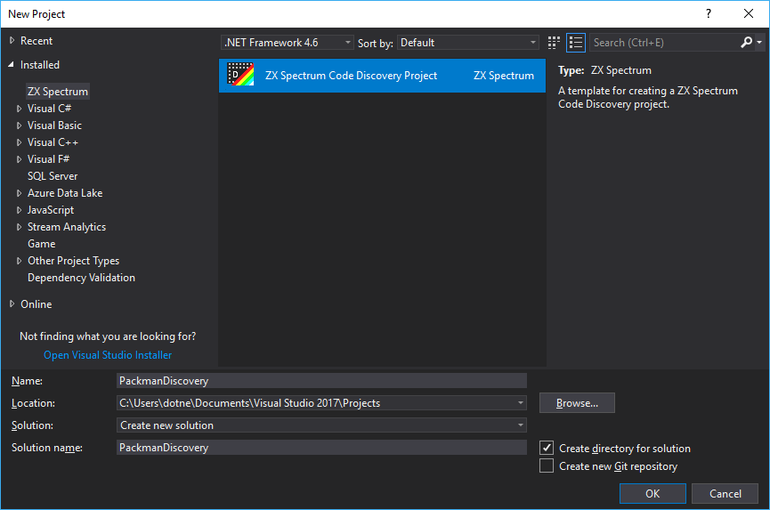

With the _New Project_ command of the IDE, you can create a project to keep your code discovery files together.

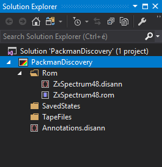

The projects prepares the __```Rom```__ folder that keeps the ZX Spectrum ROM file together with ROM annotations. 
It creates an empty annotation file (__```Annotations.disann```__) to add your own
code annotations to the project, too.

## Exploring .TZX files

You can add _.TZX_ files to the project so that you can discover them.

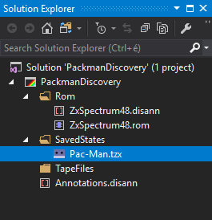

When you open the file, the IDE displays its contents in the __TZX Explorer__ view.
You can see the blocks of the _.TZX_ file, moreover, you can see the data they contain.

Here is the tape header of the Pac-Man game:

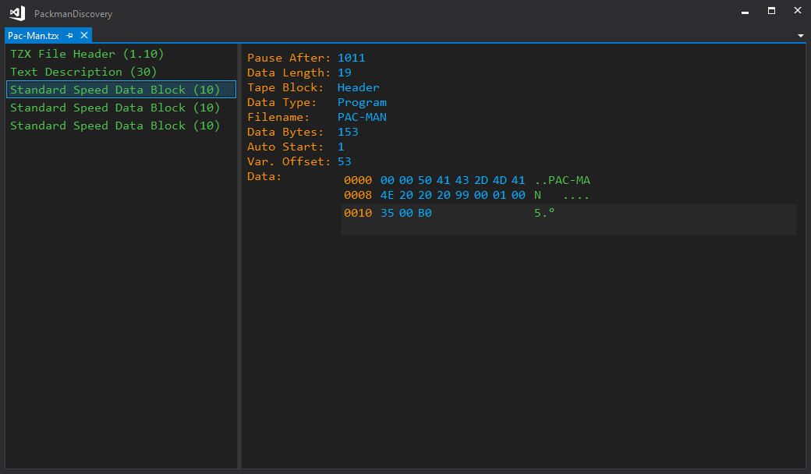

You can check the BASIC program that starts the game:

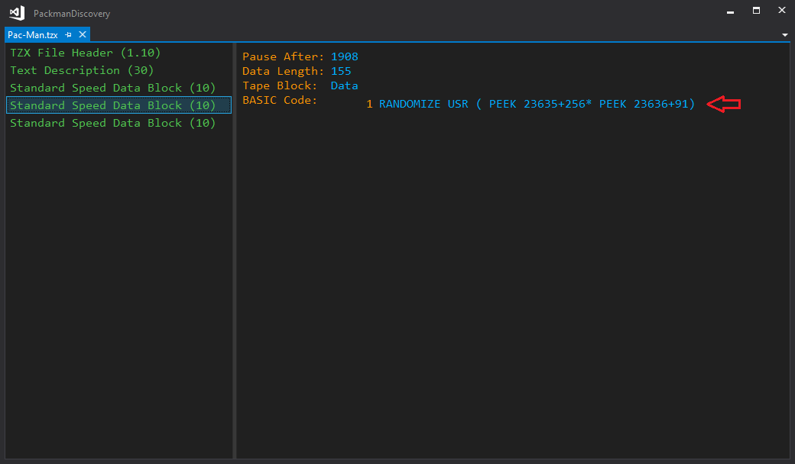

Right in the TZX Explorer view, you can see the disassembly of the startup code:

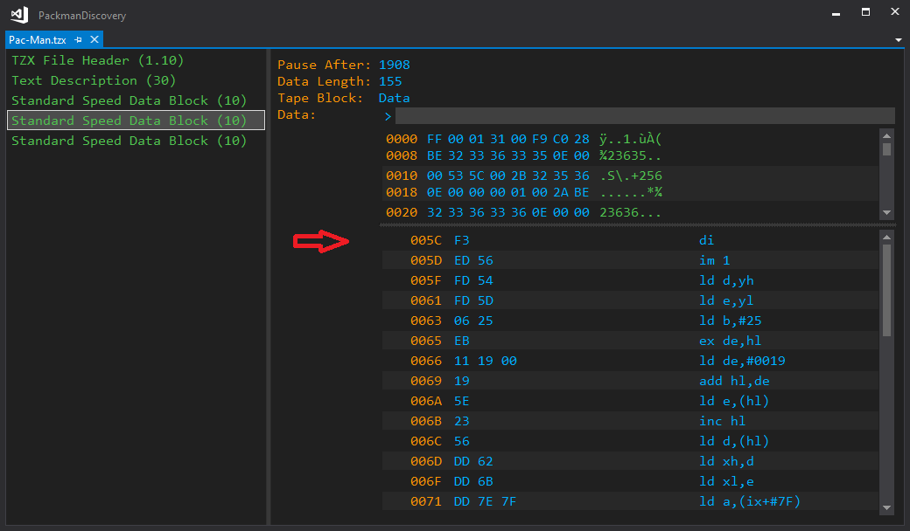

## Debugging and annotating the code

Assume you want to discover the code of the working Pac-Man game. When you start the
app in the built-in ZX Spectrum emulator, you can pause it anytime.

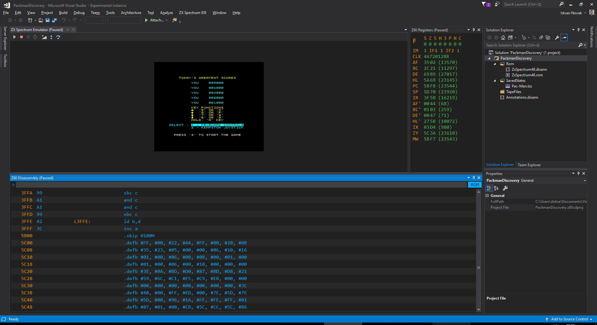

While you are examining the code, you can use the __Register view__, the __Memory view__, and
the __Disassembly view__, among the others. In this scenario, youcan see that the
code being executed is within the Printer buffer area (5b00-5c00) of the memory:

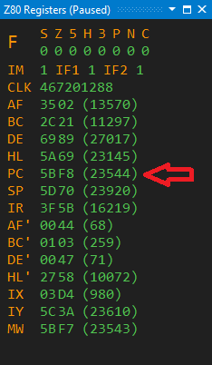

When you create a new __Code Discovery Project__, by default, the ROM's memory map annotation
signs the printer buffer memory section with a __```.skip```__ pragma:

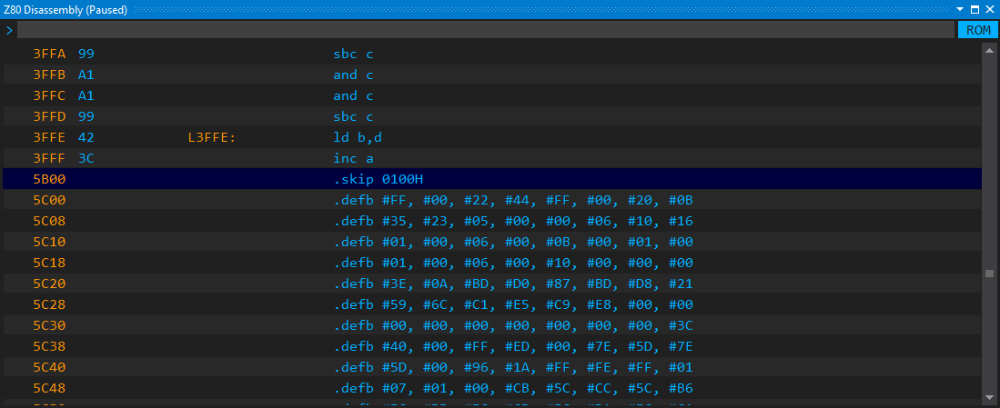

However, in this case, the __```.skip```__ setting prevents you from examining the code. With the 
__```md 5b00 5c00```__ command you can remap the view to show the Z80 disassembly for the
designated memory section:

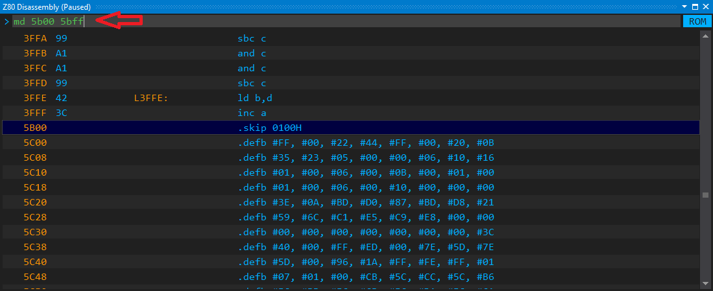

The view immediately changes:

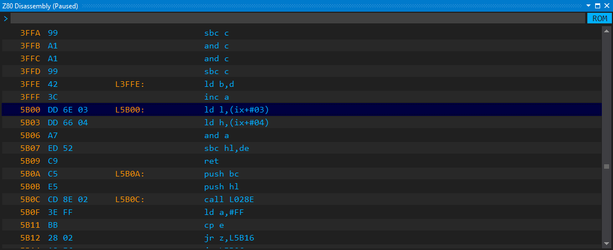

Now, you can navigate to the execution point where the code is paused, and check
what that code does:

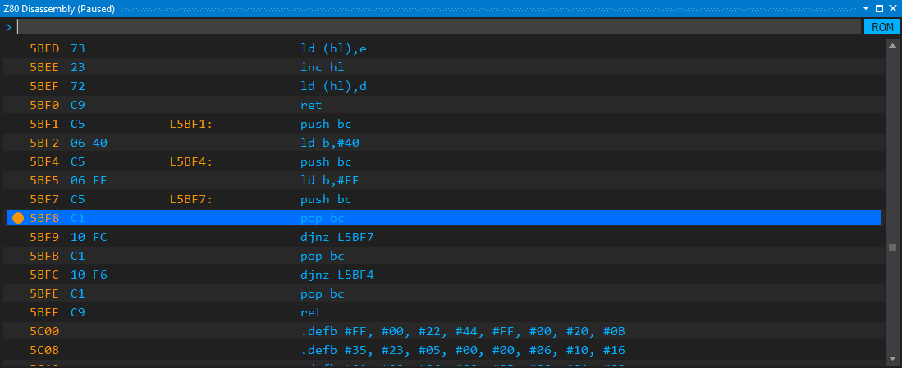

You can see that the code at __```L5BF1```__ is a subroutine that waits for
a certain time. To record your observations, with a few commands, you can 
add annotations to the code:

* __```l 5bf1 PAUSE_SHORT```__
* __```l 5bf4 outer_pause```__
* __```l 5bf7 inner_pause```__
* __```p 5bf1 This method waits for a short time```__
* __```c 5bf1 Save BC```__
* __```c 5bfe Restore BC```__

These annotations are saved into the project, so anytime you will open it,
they are still there:

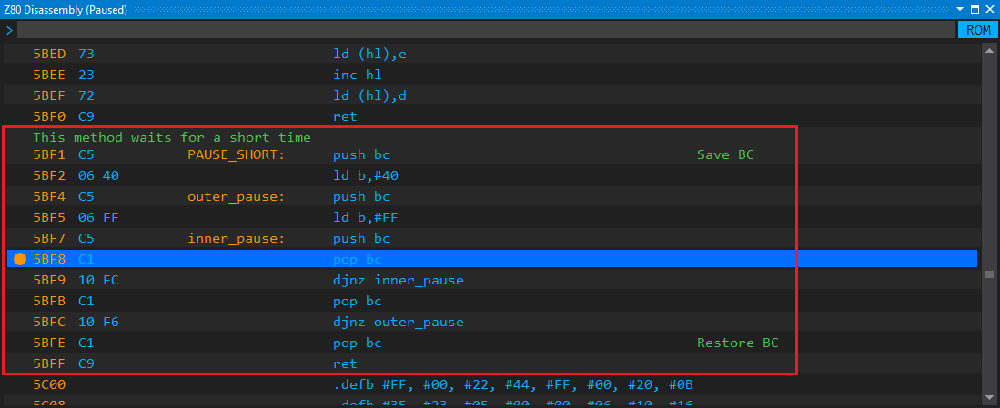

## ROM annotations

With the IDE, you can annotate the ROM, too. The disassembler of the
IDE knows many Spectrum-ROM-specific features. The ROM comes with prepared annotations
(thanks to __The Complete Spectrum ROM Disassembly__ by _Dr. Ian Logan & Dr. Frank O'Hara_).

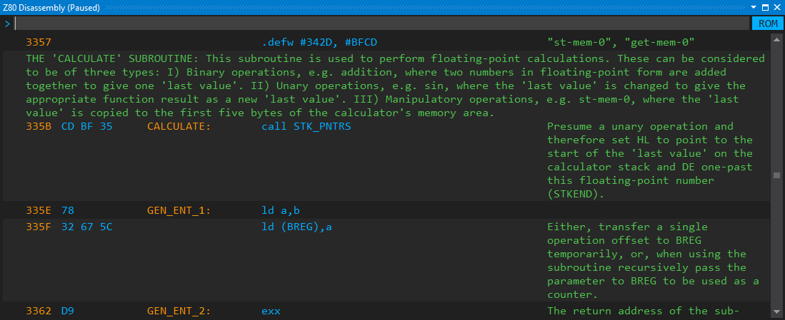

The disassembler knows the byte code used by __RST 28__ and provides automatic annotations
in the disassembly. Here, all comments in parentheses were generated on the fly:

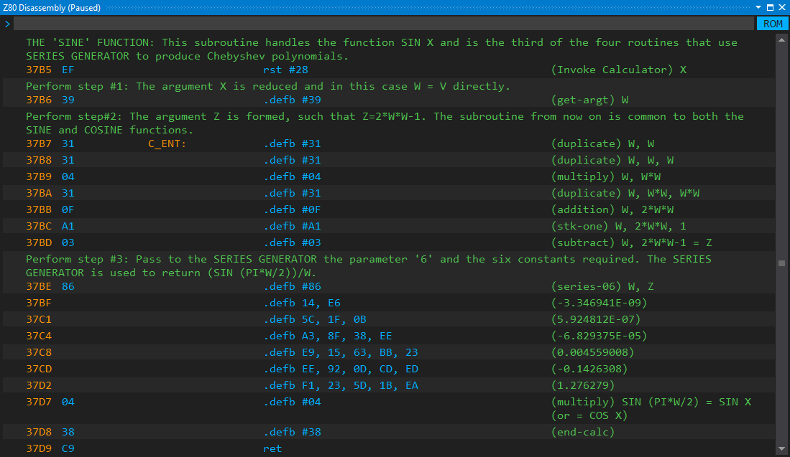

## Normal Load/Fast Load

The built-in emulator can instantly load the _.TZX_ file you added to the project.

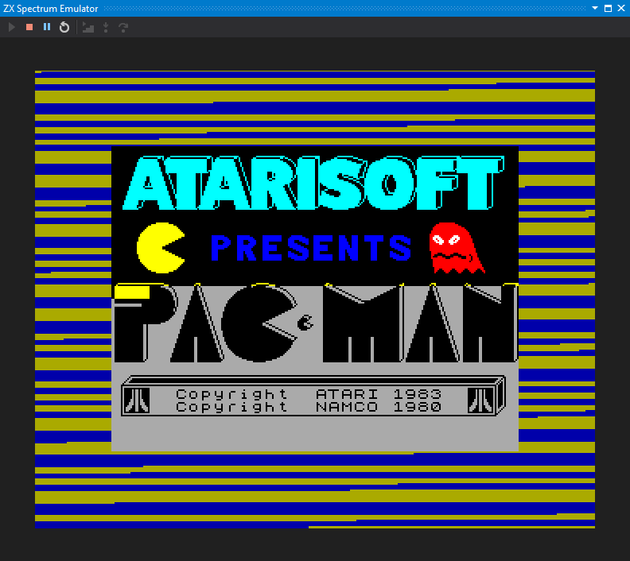

Nonetheless, if you do not intend to wait minutes for a game, you can apply the
__Fast Load__ mode that loads a TZX file (right now it supports only standard 
speed data blocks) instantly when you issue the __LOAD ""__ statement. 
The emulator just hooks in the original Spectrum ROM's cassette handler methods
to accelerate loading, and then immediately gives back the control.

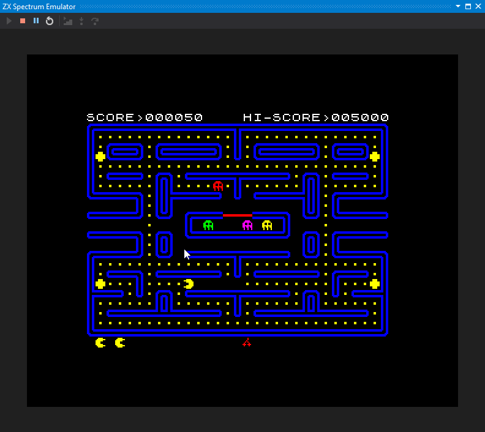


# Future plans

I do not want to stop here, and plan a number of exciting features:

* More ZX Spectrum emulators: ZX Spectrum 128, ZX Spectrum Next
* ZX Spectrum Application project type to develop ZX Spectrum apps in Z80 assembly
* Compiler for a higher level language
* Integrated development tools for Zx Spectrum Next features (for example sprites with editors, etc).

# Contribution

You can contribute to the project. Please contact me by email: dotneteer@hotmail.com


