# Using the Z80 Disassembly Tool Window

The __Disassembly__ tool window (__ZX Spectrum IDE|Z80 Disassembly__) is one of the most 
versatile windows in the development environment. You can use it for many purposes:
* Examine the ZX Spectrum ROM
* Analyze the memory map and the code of an app written in Z80 assembly
* Add your annotations to the ROM
* Add your annotations to the application code
* Follow the code as you debug an app

## The Layout of the Disassembly Tool Window

The Disassembly tool, as its name suggests, displays the disassembly of the ZX Spectrum memory.
Besides the list of Z80 instruction, it has a __command prompt__ and a __ROM annotation switch__.

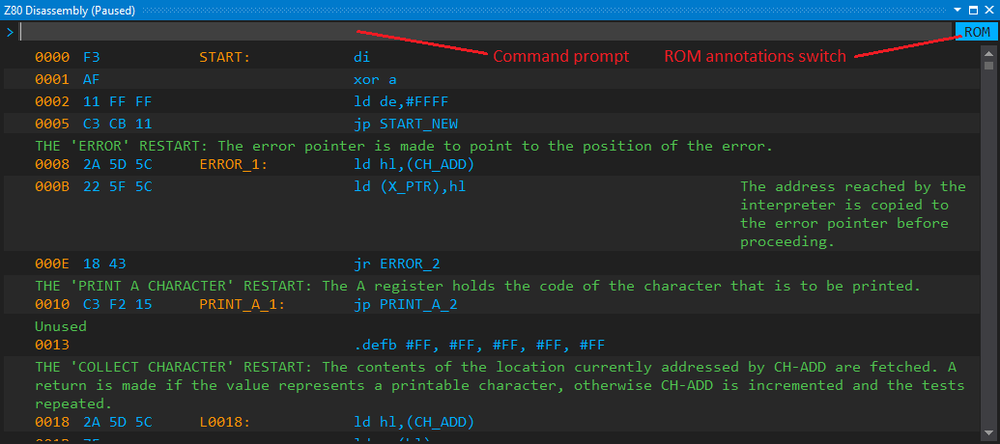

As the screenshot indicates, the disassembly window displays annotations (prefix comments,
suffix comments, labels, and literals). A ZX Spectrum Code Discovery project adds a
ROM file with predefined custom annotations. Nonetheless, you can add your custom annotations
to the ROM, and those are automatically saved with the project.

## Annotation Files

Annotations can be saved either to the ROM annotation file (`ZxSpectrum48.disann` in the figure beneath)
or the custom annotation file (`Annotations.disann`). The __ROM annotations switch__ influences where
the annotations that belong to the ROM address space are saved. In ROM mode turned on 
(the blue background indicates this mode), the ROM annotation file stores them; otherwise, 
the custom annotations file keeps them.

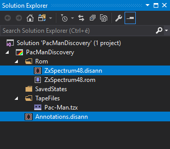

You can click on the __ROM annotation switch__ to turn it on or off.

*__Note__: Any annotation that is out of the ROM address space (#0000-#3FFF) goes into the custom annotation file.
Though right now the project handles only a single custom annotation files, in the future you will be able
to use multiple annotation files.*

## The Disassembly Memory Map

Besides comments, labels, and literals, the annotations store the memory map. The Disassembly view utilizes
this map to decide how certain parts of the memory should be displayed to the user working on a
particular project. The great thing is that you can dynamically change the memory map, and the current settings
are stored with your project.

The memory map is a list of memory segments, each of them with a 16-bit start and end memory address, and one of the 
following display types:
* __Disassembly__: The segment is displayed as a series of Z80 assembly operations
* __Bytes__: A series of bytes as the arguments of the `.defb` pragma
* __Words__: A series of 16-bit words (`.defw` pragma)
* __"Skip" section__: A `.skip` pragma that marks a segment out of interest.
* __Calculator section__: A series of Spectrum 48K `RST #28` floating point calculator bytecodes.  

The following figures demonstrate these segment types. Here, the section starting at __0013__
is a Bytes (`.defb`) section, while the preceding one (__0000-0012__) is a disassembly section:


Take a look at the ROM's calculator tables that use word (`.defw`) and byte (`.defb`) sections:

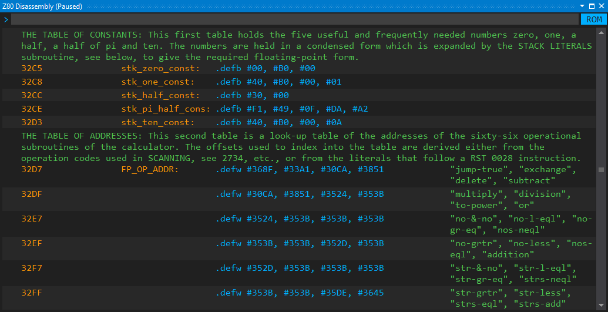

This sample shows how the content of the Printer buffer area (__5B00-5BFF__)
is marked as a `.skip` section:

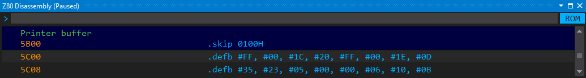

*__Note__: I plan to add other section types to the memory map in the future, 
for example, __BASIC__ section, __VARIABLES__ section, and __STACK__ section.*

## Using the Command Prompt

You can type simple commands in the command prompt, and execute them by pressing 
the __Enter__ key. The commands are case insensitive. Whenever you type something 
that the disassembly view does not understand, you will recognize it from the 
dark-red-shaded command prompt background:

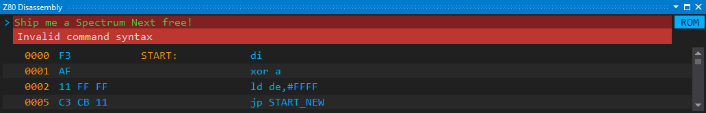

## Navigation in the Disassembly View

You can jump to a particular address with the __`G`__ (*Go to*) command that accepts a 
hexadecimal address, like __`G 375B`__:

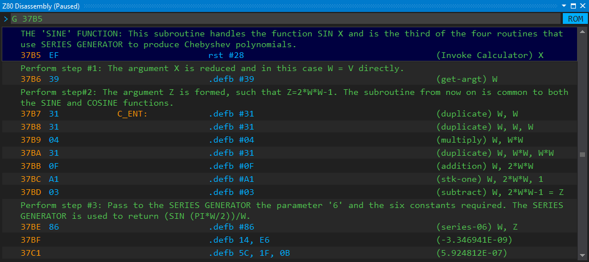

*__Note__: When you specify an address in the middle of a Z80 instruction, or in another
section, the view shows the subsequent line.*

Besides the *Go to* command, you can use these keys for the navigation, too: 
__Up__, __Down__, __Page Up__, __Page Down__, __Ctrl+Page Up__,
__Ctrl+Page Down__, __Home__, __End__. They behave as you expect them.

## Memory Section Commands

You can dynamically change the current memory map with the following commands:

* __`MD`__: Disassembly section
* __`MB`__: Byte section
* __`MW`__: Word section
* __`MS`__: Skip section
* __`MC`__: Calculator section

The commands accept two mandatory hexadecimal addresses; these are used as the
start and end address of the section. Both addresses are inclusive.

When you add a new section, the memory is mapped again; the IDE automatically
resolves collisions with the previously defined sections: the newly created
sections always overwrite the older ones.

The __3D00-3FFF__ section of the ROM holds the character set. Let's assume it is 
assigned to a disassembly section:

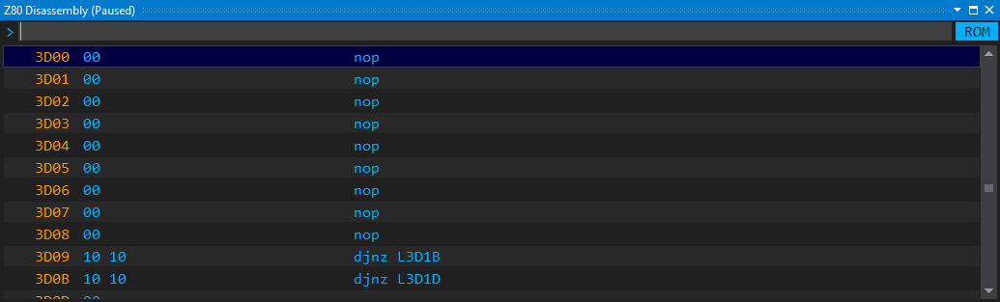

Let's represent them as a series of bytes with this command:

```MB 3D00 3FFF```

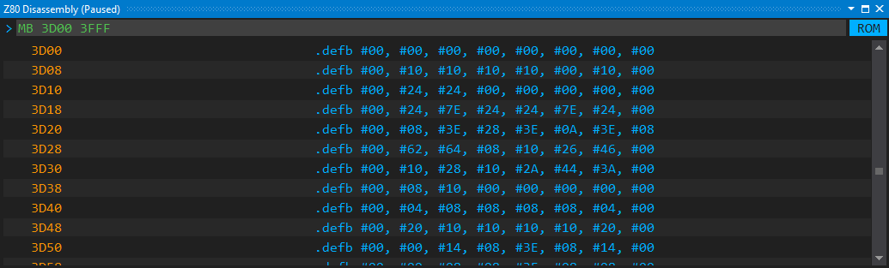

Well, you could use this command to represent the character set as a `.skip`
section:

```MS 3D00 3FFF```

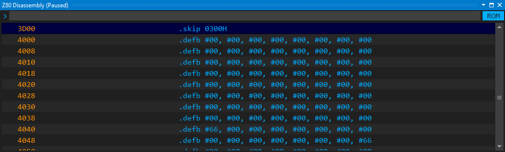

Sometimes, you need to display a series of bytes as a set of Z80 instructions.
For example, the Pac-Man game puts some loader code into the printer buffer
area (__5B00-5BFF__). Let's display the code hiding here!

```MD 5B00 5BFF```

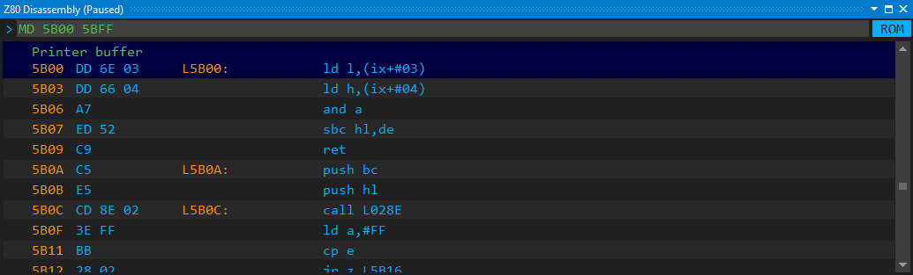

*__Note__: The IDE automatically merges multiple adjacent disassembly sections
into a single one, but it does not do the same with other sections.*

## Label Commands

Using self-explaining label names instead of automatic ones (such as __`L12AF`__) would help
you understand the code better. The Disassembly view supports a few comments that allow
naming and renaming labels. The __`L`__ command accepts a hexadecimal address (label address)
and an optional name. When you specify the name, that will be assigned to the address as its label.
If you specify only the address, the IDE removes the label name from the address.

Let's see an example! Use the __`G 04C2`__ command to navigate to the __4C2__ address of the ROM.
This is the entry point of the cassette handling routines, namely the __SA_BYTES__ subroutine.
As you can observe, the __4CB__ address is a jump instruction to the __4D0__ address.

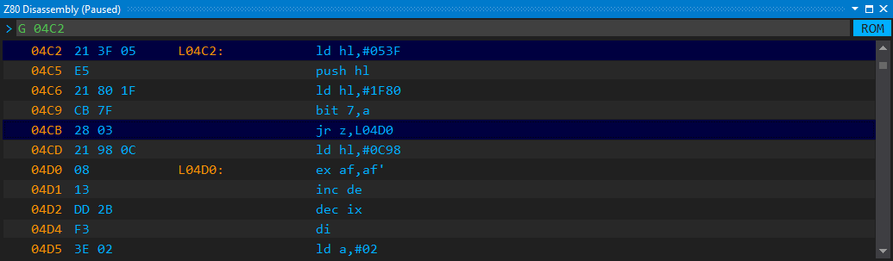

Execute these commands after each other to give names to the labels:

```
L 04C2 SA_BYTES
L 04D0 SA_BYTES_2
```

The disassembly view immediately shows the labels, and as you can see in the __4CB__ 
jump instruction, the reference to the label is also updated with the custom name.

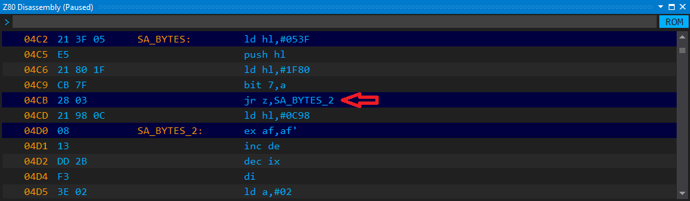

I guess, the `SA_BYTES_2` is not a good name. *The Complete Spectrum ROM
Disassembly* Guide names it `SA_FLAG`. You can easily change the name with the
`L 04D0 SA_FLAG` command. 

There is another way. You can use the `RL 04D0` (*Retrieve Label*) command that 
not only reads the label's name but prepares the `L 04D0 SA_BYTES_2` command line 
so that you can modify and re-enter it:

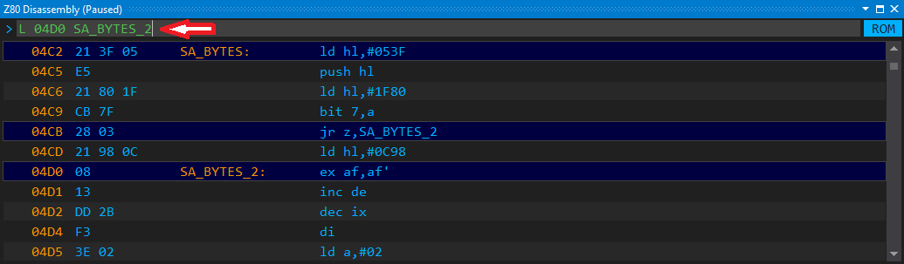

Fix the name (change it to __SA_FLAG__) and press Enter. The disassembly view
gets immediately updated.

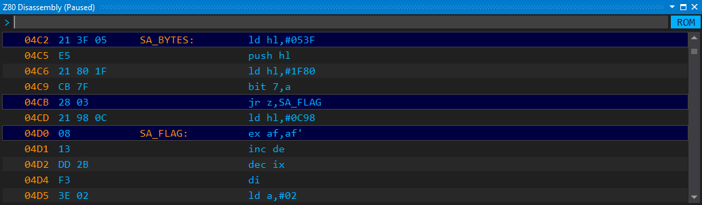

*__Note__: Labels must start with a letter or underscore (_), and may contain
only letters and numbers, or the underscore character. Their maximum length
is 16 characters.*

## Managing Comments

If something adds extra value to a disassembly list, a comment does.
The IDE allows you to add both prefix comments (displayed above the Z80 
instruction line) and suffix comments (shown to the right of a disassembly line).

They follow the very same logic as labels. With the `P` command, 
you can assign a prefix comment to a line. Pass its hexadecimal address and the 
comment text. The `C` command works similarly, nonetheless, it creates a suffix
comment.

You can use the `RP` and `RC` commands to retrieve suffix and prefix comments
for editing, respectively. Just as the `RL` command does, they prepare a
command line for modification and re-entry.

Take a look at the line __0095__ in this screenshot:

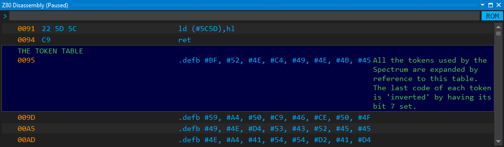

I added the adornments of this line with these commands:

```
P 0095 THE TOKEN TABLE
C 0095 All the tokens used by the Spectrum are ...
```

(Of course, I deliberately removed the long tail of the suffix comment.)

## Literals
 
You can assign literals to values in the disassembly, similarly as you can 
associate labels with addresses. However, literals are a bit different.
While a label is a one-to-one association between a name and an address, 
one or more literals can be associated with the very same value. Of course,
a literal may have a single value.

To be clear, here are a few Z80 disassembly instructions with values that can
be associated with literals:

```
ld hl,#0205   ; --> #0205 
add a,#AC     ; --> #AC
ld (#4000),bc ; --> #4000
```

These instructions can be displayed in the disassembly this way, provided
we set up the `KEY_TABLE_L`, `AC_VAL`, and `SMEM_START` literals with
their proper value:

```
ld hl,KEY_TABLE_L 
add a,AC_VAL
ld (SMEM_START),bc
```

The disassembly view provides the __`D`__ command to let you add literals
to other annotations. You can use these forms of the command:

```
D [address] [literal name]
D [address]
D [address] #
```

These commands use the disassembly line with a Z80 instruction that 
starts at the specified _[address]_. If that very instruction has a 
value, that value is associated with a _[literal name]_. The `#` 
argument says that the value of the instruction should be associated
with a literal that the same value as the one held by the instruction.

Let's see these commands in action! Use the `G 0074` command to scroll
to the `CH_ADD_P1` subroutine, as this figure shows:

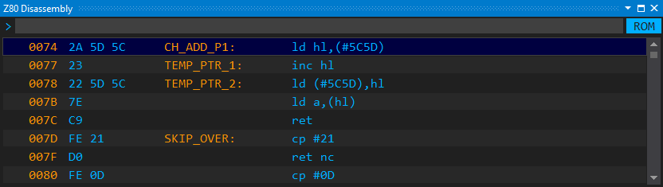

The instruction at __0074__, namely `ld hl,(#5C5D)` utilizes the __CH_ADD__
system variable. To show this name instead of the hexadecimal value,
type the __`D 0074 CH_ADD`__ command! It defines the literal __CH_ADD__ for 
the value __5C5D__, and immediately replaces the value in the disassembly output:


Now take a look at the instruction at __0078__! That one uses the 
__5C5D__ value, too. The disassembler did not associate that value automatically 
with __CH_ADD__. It cannot be entirely sure that the hexadecimal value 
at the second instruction has the same semantic meaning, and thus can use the 
same literal, as the first instruction at __0074__.

You have to manually resolve this reference. You do not have to remember the
name of the symbol that covers __5C5D__. Enter the __`D 0078 #`__ command,
and the disassembler will automatically infer that association:

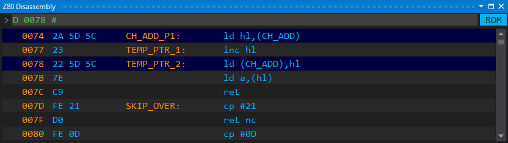

## Setting Up Breakpoints

With the command prompt in the disassembly view, you can manage breakpoints, too.
These are the commands you can use:
* `SB [address]`: Set a breakpoint at the specified address
* `TB [address]`: Toggle a breakpoint
* `RB [address]`: Remove a breakpoint
* `EB`: Erase all breakpoints

You can find more information about breakpoints in the [Debugging](Debugging) section.


