

  

    

      

        <h2 class="feature">Version 2.0 is coming soon!</h2>
        

          I have been actively working on version 2 since June 2019. The first public preview will 
          be available in November 2019. The main themes of version 2:
        

        <ul>
          <li><strong>Totally rewitten Visual Studio integration</strong>. I removed many annoying issues related to solution loading</li>
          <li><strong>Multiple ZX Spectrum projects</strong>. You can put more than one ZX Spectrum project into a single solution. 
          While working, you can change the active project anytime.</li>
          <li><strong>Boriel's BASIC (ZX BASIC) integration</strong>. Besides Z80 assembly, now, you can use ZX BASIC as your programming
          language to create spectacular games and applications.</li>
          <li><strong>New debugging tools</strong>. The ZX Spectrum emulator provides two extra options: ULA render point indication, and shadow screen rendering.</li>
          <li><strong>New, more modern project item icons</strong></li>
        </ul>
        

          Preview 1 will have these limitations:
        

        <ul>
          <li>ZX BASIC source code debugging is not supported yet</li>
          <li>Z80 Assembler Output and Z80 Unit Test Explorer is not supported yet</li>
          <li>SpectNetIDE is available only on VS 2019 (all editions supported)</li>
          <li>Spectrum Scripting Console App project type removed</li>
        </ul>
      

    

  

  

    

      

        <h2 class="feature">Essential Tools</h2>
        

          SpectNet IDE encapsulates the tools you need to develop Z80 Programs
          for the ZX Spectrum 48K, 128+, and +3E. It integrates with Visual
          Studio 2017 and 2019 IDE, including the free Community editions.
        

        
<a class="button-like" target="_blank" href='https://marketplace.visualstudio.com/items?itemName=Dotneteer.SpectNetIde'>Download SpectNet IDE</a>

        
<a class="button-like" target="_blank" href='https://visualstudio.microsoft.com/free-developer-offers/'>Get VS 2017 or 2019 Community</a>

        
<a class="button-like" target="_blank" href='https://github.com/Dotneteer/spectnetide/tree/master/vsix-archive'>SpectNet IDE Archive</a>

      

      

        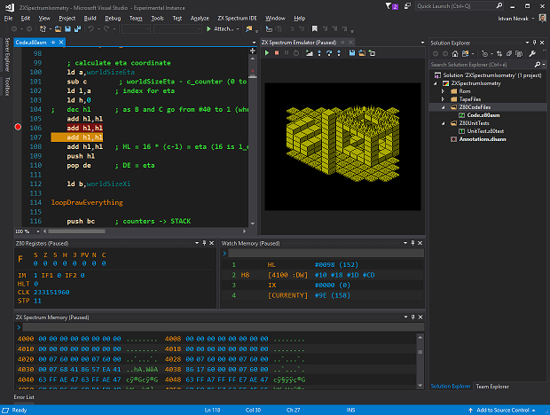
      

    

  

  

    

      

        <h2 class="feature">ZX Spectrum Project Types</h2>
        

          In Visual Studio, you can create ZX Spectrum projects. SpectNetIde provides two
          project types out of the box.
        

        

          You can use the ZX Spectrum Code Discovery Project to analyze, examine, and debug
          the Z80 code of the ROM, games, and other applications. Also, you can create your
          own Z80 assembly programs with the built-in assembler.
        

        

          The ZX Scripting Console App allows you to write C# applications to create scripts
          that control the ZX Spectrum virtual machine. This project type can be used to
          understand how games run (e.g. equip them with "eternal life"), and automate tasks
          that help you peep into the code that could not be solved otherwise.
        

      

      

        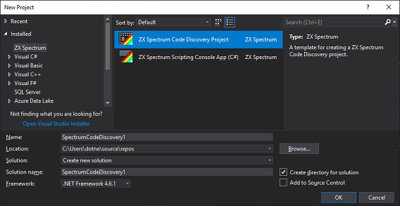
        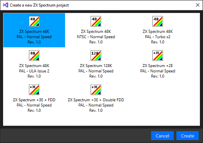
      

    

  

  

    

      

        <h2 class="feature">ZX Spectrum Emulator</h2>
        

          The built-in ZX Spectrum Emulator allows you to run a virtual machine
          just like the original hardware. It not only ensures high-fidelity
          operation of the selected ZX Spectrum model; you can pause the machine
          any time to start debugging.
        

        

          The emulator allows you to save and restore the paused state of the
          virtual machine, moreover, you can store these files as a part of your project.
        

      

      

        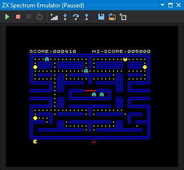
      

    

  

  

    

      

        <h2 class="feature">Z80 Disassembly</h2>
        

          The built-in Z80 Disassembler has many unique features that only SpectNetIDE provides.
          It not only turns binary code into Z80 disassembly, but it allows you to annotate the code.
        

        

          You can define labels and symbols as well as tail or prefix comments. To separate code and data,
          you can mark segments of the binary as a byte or a word array or a memory area to ignore.
        

        

          The SpectNetIDE disassembler understands ZX Spectrum specific code, such as the byte code
          following the RST $08 and RST $28 instructions, and generates the output accordingly.
        

        

          The disassembler understands the extended Z80 instruction set of ZX Spectrum Next, and &mdash; of
          course &mdash; handles all undocumented Z80 operations. The IDE comes with annotated ROMs for each
          model, including ZX Spectrum 48K, +128, and +3E.
        

      

      

        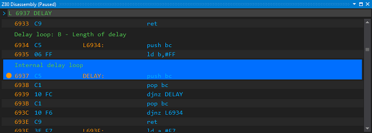
        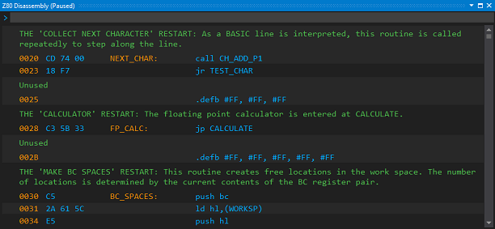
      

    

  

  

    

      

        <h2 class="feature">Debugging tools</h2>
        

          Creating and analyzing code is in the heart of SpectNetIDE. The environment provides many
          tools to examine the running code, the state of the CPU, the ULA, and the memory.
        

        

          When stepping through code, you can immediately get information about the number of T-cycles
          spent between to stops, as well as the clock cycles wasted for contended memory access.
        

        

          With the help of the Disassembly tool window, you can set up simple breakpoints, and
          even define conditions to pause the execution flow.
        

        

          The Memory tool window allows you to have a real-time view of the memory, highlighting
          the addresses pointed by one of the 16-bit Z80 register pairs.
        

        

          To examine the running code, you can define and show watch expressions that combine the
          state of registers, flags, and memory locations into display values that tell you what
          the program does.
        

      

      

        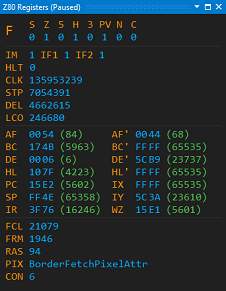
        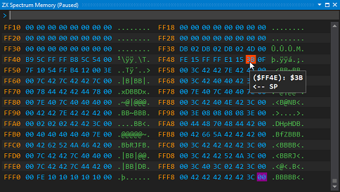
        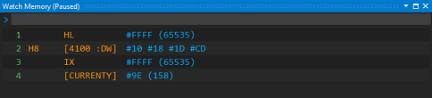
      

    

  

  

    

      

        <h2 class="feature">Full-blown Z80 assembly programming</h2>
        

          SpectNetIde provides you a robust Z80 assembler with many useful features.
        

        <ul>
          <li>Syntax-highlighted editor</li>
          <li>Flexible syntax</li>
          <li>String escape sequences for ZX Spectrum-specific characters</li>
          <li>Loops and conditional statements</li>
          <li>Powerful dynamic macros</li>
        </ul>
        

            You can set up breakpoint in the source code. When the execution flow
            reaches one of them, the corresponding source code is displayed. The Debug,
            Pause, Step-Into, Step-Over, and Step-Out commands are available with source
            code, too.
        

        

            You can export the Z80 assembly code into .TZX and .TAP code files that can
            be immediately LOADed into ZX Spectrum — with optional auto start support.
        

      

      

        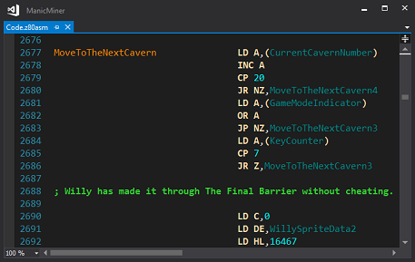
        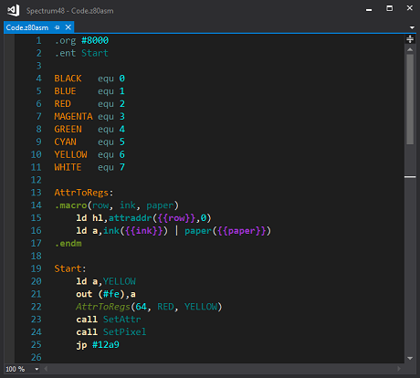
      

    

  

  

    

      

        <h2 class="feature">... And many others</h2>
        <ul>
          <li>Two types of ZX Spectrum keyboards</li>
          <li>Tape File Explorer</li>
          <li>Call Stack Tool Window</li>
          <li>Unit Tests for Z80 Code</li>
          <li>ZX Spectrum BASIC List</li>
          <li>Virtual floppy devices and disks for ZX Spectrum +3E</li>
        </ul>
      

    

  

